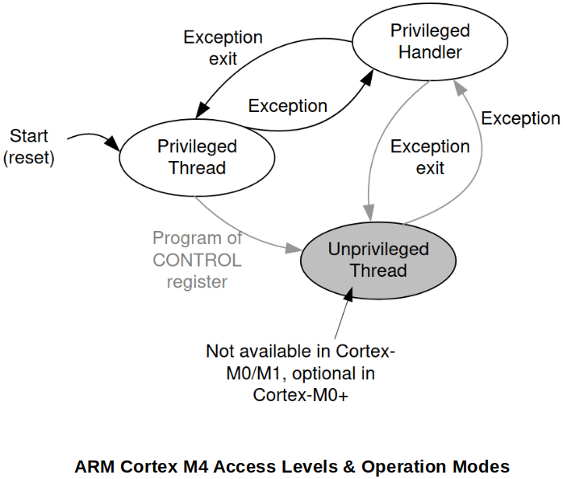

[Home](../../) | [Projects](../../projects) | [Notes](../) > <a href="./">ARM Cortex-M3/M4 Processor</a> > Access Levels & Operation Modes of the Processor

# Access Levels & Operation Modes of the Processor

This section applies to **ARM Cortex M0/M3/M4 Processors**. If you are using any other processors, please consult the corresponding document.


## Operational Modes

* The processor provides 2 operation modes:

  1. **Thread mode (User mode)**

     All program code will execute under "Thread mode" of the processor by default. It can be privileged (full access to CPU resources) or unprivileged (limited access to CPU resources) software execution.

  2. **Handler mode**

     All the exception handlers (or interrupt handlers) will run under the "Handler mode" or the processor. It is ALWAYS privileged software execution.

* The processor always starts with "Thread mode".

  When there occurs a **system exception** or any **interrupt (HW, SW)** then the core will transition to "Handler mode" in order to service the Interrupt Service Routine (ISR) associated with the system exception or the external interrupt. (Only by triggering a system exception or an interrupt, the processor can transition into "Handler mode").


## Access Levels

* The processor provides 2 access levels:

  1. **Privileged Access Level (PAL)**

     Code running with PAL has a FULL access to all the processor specific resources and the restricted registers. Program will run with PAL by default.

  2. **Non-Privileged Access Levels (NPAL)**

     Code running with NPAL has a LIMITED access to the processor specific resources and the restricted registers.

* When the processor is in "Thread mode" with PAL, it is possible to change its access level to NPAL. Once the processor's access level changes from PAL to NPAL, then it is NOT possible for the processor to come back to PAL unless the processor operation mode transitions into "Handler mode" first.

* When a program runs in "Handler mode", its access level will always be PAL.

* Use the **CONTROL register** of the processor to switch back and forth between the access levels.

  Every program will start running with PAL, and the Control Register must be modified to change the program's access level to NAPL.





## Secured & Robust System Design

* An RTOS project has two components; the **kernel** and the **user tasks**. It is important that user tasks do not modify the system level setting of the processor. So, before running a user task, the kernel should change the access level to unprivileged, and then launch the user task.

  This is why, the real-time operating system or secured systems always launch user task in unprivileged access level. If the code running with unprivileged access level wants any services, then it can trigger system call, which will be serviced by the kernel.

  This is a secured and robust system design. ARM Cortex Mx processors give these features in the processor itself.


## Operation Modes - Demonstration

* The program to demonstrate switching between "Thread mode" and "Handler mode".

  ```c
  #include <stdint.h>
  #include <stdio.h>
  
  #if !defined(__SOFT_FP__) && defined(__ARM_FP)
    #warning "FPU is not initialized, but the project is compiling for an FPU. Please initialize the FPU before use."
  #endif
  
  /*
   * THREAD MODE	: Privileged/Unprivileged access level
   * HANDLER MODE	: Privileged access level only!
   */
  
  /*
   * This function executes in THREAD MODE of the processor.
   * Within this function, we are triggering software interrupt by accessing the
   * system level registers of the ARM Cortex Mx processor.
   */
  void generate_interrupt()
  {
  	uint32_t *pSTIR = (uint32_t *)0xE000EF00;
  	uint32_t *pISER0 = (uint32_t *)0xE000E100;
  
  	// enable IRQ3 interrupt
  	*pISER0 |= (1 << 3);
  
  	// generate an interrupt from software for IRQ3
  	// (interrupt handler "RTC_WKUP_IRQHandler" will be invoked)
  	*pSTIR = (3 & 0x1FF);
  }
  
  /*
   * This function executes in THREAD MODE of the processor.
   * (Remember, after reset, the processor always starts in THREAD MODE.)
   * In reality, "Reset_Handler:" is the first function to be called on reset,
   * but at this point we will assume that the "main" is the first to be called.
   */
  int main(void)
  {
  	printf("Thread mode: before interrupt\n");
  	generate_interrupt();
  	printf("Thread mode: after interrupt\n");
  
      /* Loop forever */
  	for(;;);
  }
  
  /*
   * This function (ISR) executes in HANDLER MODE of the processor.
   * In HANDLER MODE, you have the full control over the processor. You have the
   * privilege to access any resources you want.
   */
  void RTC_WKUP_IRQHandler(void)
  {
  	printf("Handler mode: ISR\n");
  }
  ```

  > How do you know whether the the program is running in "Thread mode" or "Handler mode"? $\to$ Inspect the `ISR_NUMBER` field of Interrupt Program Status Register (IPSR).
  >
  > - Thread mode if `ISR_NUMBER` = 0
  >
  > - Handler mode if `ISR_NUMBER` = non-zero (only when **system exception** or **interrupt (HW, SW)** occurs)
  >
  >   Set a break point at L56, and you will see that the `ISR_NUMBER` field is set to 19 (10011(2)) when the execution reaches there.
  >
  > Consult the *Cortex-M4 Devices Generic User Guide* for more information.


## Access Modes - Demonstration

* The program to demonstrate switching between "Privileged mode" and "Non-privileged mode".

  ```c
  #include <stdint.h>
  #include <stdio.h>
  
  #if !defined(__SOFT_FP__) && defined(__ARM_FP)
    #warning "FPU is not initialized, but the project is compiling for an FPU. Please initialize the FPU before use."
  #endif
  
  /*
   * THREAD MODE	: Privileged/Unprivileged access level
   * HANDLER MODE	: Privileged access level only!
   */
  
  /*
   * This function executes in THREAD MODE of the processor.
   * Within this function, we are triggering software interrupt by accessing the
   * system level registers of the ARM Cortex Mx processor.
   */
  void generate_interrupt()
  {
  	/*
  	 * These are ARM Cortex M4 processor's system control register addresses which
  	 * can only be accessed in PRIVILEGED ACCESS LEVEL.
  	 * Any attempt to change the contents of these registers from being in UNPRIVILEGED
  	 * ACCESS LEVEL will cause a processor fault exception.
  	 */
  	uint32_t *pSTIR = (uint32_t *)0xE000EF00;
  	uint32_t *pISER0 = (uint32_t *)0xE000E100;
  
  	// enable IRQ3 interrupt
  	*pISER0 |= (1 << 3);
  
  	// generate an interrupt from software for IRQ3
  	// (interrupt handler "RTC_WKUP_IRQHandler" will be invoked)
  	*pSTIR = (3 & 0x1FF);
  }
  
  void change_access_level_unpriv(void)
  {
  	/*
  	 * To make the processor transition into UNPRIVILEGED ACCESS LEVEL,
  	 * bit 0 of the CONTROL register must be set to 1.
  	 * CONTROL register is NOT a memory mapped register which means that
  	 * it is impossible for a programmer to access this register using C
  	 * code only. Inline assembly technique is necessary.
  	 */
  	__asm volatile("mrs r0, CONTROL");	// read
  	__asm volatile("orr r0, r0, 0x01");	// modify
  	__asm volatile("msr CONTROL, r0");	// write (this is where access level changes to
  										// UNPRIVILEGED
  }
  
  /*
   * This function executes in THREAD MODE + PRIVILEGED ACCESS LEVEL of the processor.
   * (Remember, after reset, the processor always starts in THREAD MODE.)
   * In reality, "Reset_Handler:" is the first function to be called on reset,
   * but at this point we will assume that the "main" is the first to be called.
   */
  int main(void)
  {
  	printf("Thread mode: before interrupt\n");
  
  	change_access_level_unpriv();	// PRIVILEGED -> UNPRIVILEGED
  	generate_interrupt();
  
  	printf("Thread mode: after interrupt\n");
  
      /* Loop forever */
  	for(;;);
  }
  
  /*
   * This function (ISR) executes in HANDLER MODE of the processor.
   * In HANDLER MODE, you have the full control over the processor. You have the
   * privilege to access any resources you want.
   */
  void RTC_WKUP_IRQHandler(void)
  {
  	printf("Handler mode: ISR\n");
  }
  
  /* 
   * This function will be called when a system level register is accessed in a
   * program with UNPRIVILEGED ACCESS LEVEL. (Processor fault exception)
   */
  void HardFault_Handler(void)
  {
  	printf("Hard fault detected\n");
  	while(1);
  }
  ```

  > Summary:
  >
  > 1. The program first runs in THREAD MODE with PRIVILEGED ACCESS LEVEL.
  > 2. We set the bit 0 of the CONTROL register to 1 to change the access level to UNPRIVILEGED.
  > 3. The program tries to access the system control register which is not allowed with UNPRIVILEGED ACCESS LEVEL.
  > 4. Hard fault occurs and the corresponding handler gets called.
  >
  > Now, how do you go back to PRIVILEGED ACCESS LEVEL? When in UNPRIVILEGED ACCESS LEVEL, you are not allowed to access and modify the CONTROL register, which means you cannot go back to PRIVILEGED ACCESS LEVEL. To make it possible, the processor must first transition into the HANDLER MODE which always runs with PRIVILEGED ACCESS LEVEL. There are two, and only two ways to push the processor to HANDLER MODE:
  >
  > 1. External interrupt
  > 2. Exception
  >
  > When an ISR is invoked, then there the CONTROL register can be modified (bit 0 back to 0). Upon returning back to the THREAD MODE, the access level will have been set back to PRIVILEGED.


## References

Nayak, K. (2022). *Embedded Systems Programming on ARM Cortex-M3/M4 Processor* [Video file]. Retrieved from  https://www.udemy.com/course/embedded-system-programming-on-arm-cortex-m3m4/
