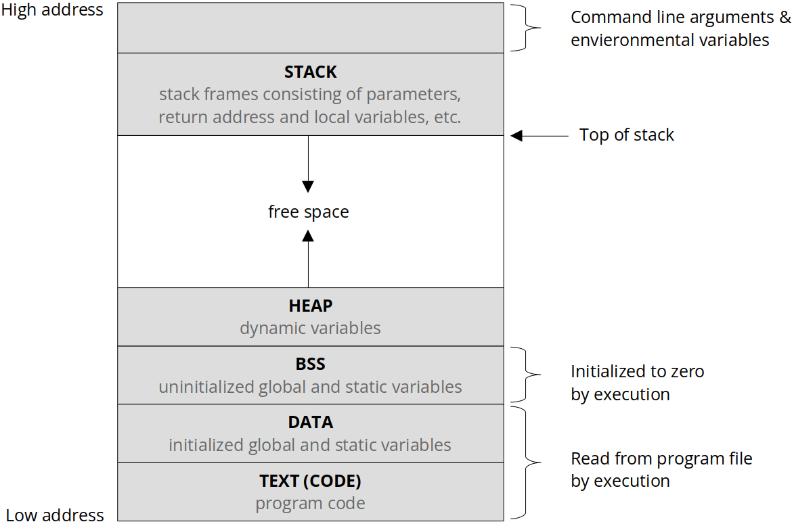

[Home](../../) | [Projects](../../projects) | [Notes](../) > <a href="./">ARM Cortex-M3/M4 Processor</a> > Analyzing Relocatable Object Files (.o)

# Analyzing Relocatable Object Files (.o)


## Relocatable Object Files

* main.o is in ELF format (Executable and Linkable Format)

* ELF is a standard file format for object files and executable files when you use GCC

* A file format standard describes a way of organizaing various elements (data, read-only data, code, uninitialized data, etc.) of a program in different sections.

* Other file formats:

  * The Common Object File Format (COFF): Introduced by UNIX System V
  * ARM Image Format (AIF): Introduced by ARM
  * SRECORD: Introduced by Motorola

* .o file mainly contains machine specific code and the data from the program. It does NOT contain any absolute addresses for data and code from the program. This is why it is called "relocatable".

  ```plain
  main.o:     file format elf32-littlearm
  
  
  Disassembly of section .text:
  
  00000000 <main>:
     0:   b580        push    {r7, lr} 
     2:   af00        add r7, sp, #0
     4:   f7ff fffe   bl  32e <enable_processor_faults>
     8:   4807        ldr r0, [pc, #28]   ; (28 <main+0x28>)
     a:   f7ff fffe   bl  120 <init_scheduler_stack>
     e:   f7ff fffe   bl  12a <init_tasks_stack>
    12:   f7ff fffe   bl  0 <led_init_all>
    16:   f44f 707a   mov.w   r0, #1000   ; 0x3e8
    1a:   f7ff fffe   bl  b2 <init_systick_timer>
    1e:   f7ff fffe   bl  314 <switch_sp_to_psp>
    22:   f7ff fffe   bl  32 <task1_handler>
    26:   e7fe        b.n 26 <main+0x26>
    28:   2001ec00    .word   0x2001ec00
  
  0000002c <idle_task>:
    2c:   b480        push    {r7}
    2e:   af00        add r7, sp, #0
    30:   e7fe        b.n 30 <idle_task+0x4>
  ```

  > As you can see above, every instruction is marked with "offset" to the relocatable section base address which will be determined by the linker. The relocatable section base address must be determined based on the hardware-specific information such as spec of your microcontroller, memory-map, etc.
  >
  > In, every object file, every section's the base address is set to 00000000. This will be resolved to the absolute address by the linker (script).


## Analyzing Relocatable Obejct Files

* Viewing a .o file using **objdump** tool

  ```plain
  $ arm-none-eabi-objdump -h main.o
  
  main.o:     file format elf32-littlearm
  
  Sections:
  Idx Name          Size      VMA       LMA       File off  Algn
    0 .text         000004ec  00000000  00000000  00000034  2**2
                    CONTENTS, ALLOC, LOAD, RELOC, READONLY, CODE
    1 .data         00000001  00000000  00000000  00000520  2**0
                    CONTENTS, ALLOC, LOAD, DATA
    2 .bss          00000054  00000000  00000000  00000524  2**2
                    ALLOC
    3 .rodata       00000044  00000000  00000000  00000524  2**2
                    CONTENTS, ALLOC, LOAD, READONLY, DATA
    4 .comment      00000034  00000000  00000000  00000568  2**0
                    CONTENTS, READONLY
    5 .ARM.attributes 0000002e  00000000  00000000  0000059c  2**0
                    CONTENTS, READONLY
  ```

  > `littlearm` means "little-endian", "arm"
  >
  > Important sections to remember:
  >
  > * `.text` section holds the program **code**
  >
  >   Size is 0x4ec (1260) which is slightly over 1 KB
  >
  > * `.data` section holds the data, especially the **initialized data**
  >
  > * `.bss` section holds all **uninitialized data**
  >
  > * `. rodata` section holds **read-only data** (constant data)
  >
  > `.comment` section contains some comments of metadata added by the compiler. Not very important at this point.
  >
  > Apart from these sections, you can add user-defined sections based on your needs.
  >
  > 
  >
  > 

  

* Displaying assembler contents of executable sections:

  ```plain
  $ arm-none-eabi-objdump -d main.o > main_log
  ```

  > This command helps us to understand a various assembly level instructions generated for all the functions of our program. (Disassembly)

  ```plain
  // main_log
  
  main.o:     file format elf32-littlearm
  
  
  Disassembly of section .text:
  
  00000000 <main>:
     0:   b580        push    {r7, lr} 
     2:   af00        add r7, sp, #0
     4:   f7ff fffe   bl  32e <enable_processor_faults>
     8:   4807        ldr r0, [pc, #28]   ; (28 <main+0x28>)
     a:   f7ff fffe   bl  120 <init_scheduler_stack>
     e:   f7ff fffe   bl  12a <init_tasks_stack>
    12:   f7ff fffe   bl  0 <led_init_all>
    16:   f44f 707a   mov.w   r0, #1000   ; 0x3e8
    1a:   f7ff fffe   bl  b2 <init_systick_timer>
    1e:   f7ff fffe   bl  314 <switch_sp_to_psp>
    22:   f7ff fffe   bl  32 <task1_handler>
    26:   e7fe        b.n 26 <main+0x26>
    28:   2001ec00    .word   0x2001ec00
  
  0000002c <idle_task>:
    2c:   b480        push    {r7}
    2e:   af00        add r7, sp, #0
    30:   e7fe        b.n 30 <idle_task+0x4>
  
  00000032 <task1_handler>:
    32:   b580        push    {r7, lr} 
    34:   af00        add r7, sp, #0
    36:   200c        movs    r0, #12 
    38:   f7ff fffe   bl  0 <led_on>
    3c:   f44f 707a   mov.w   r0, #1000   ; 0x3e8
    40:   f7ff fffe   bl  390 <task_delay>
    44:   200c        movs    r0, #12 
    46:   f7ff fffe   bl  0 <led_off>
    4a:   f44f 707a   mov.w   r0, #1000   ; 0x3e8
    4e:   f7ff fffe   bl  390 <task_delay>
    52:   e7f0        b.n 36 <task1_handler+0x4>
  ```

* Displaying assembler contents of ALL sections:

  ```plain
  $ arm-none-eabi-objdump -D main.o
  
  main.o:     file format elf32-littlearm
  
  
  Disassembly of section .text:
  
  00000000 <main>:
     0:	b580      	push	{r7, lr}
     2:	af00      	add	r7, sp, #0
     4:	f7ff fffe 	bl	32e <enable_processor_faults>
     8:	4807      	ldr	r0, [pc, #28]	; (28 <main+0x28>)
     a:	f7ff fffe 	bl	120 <init_scheduler_stack>
     e:	f7ff fffe 	bl	12a <init_tasks_stack>
    12:	f7ff fffe 	bl	0 <led_init_all>
    16:	f44f 707a 	mov.w	r0, #1000	; 0x3e8
    1a:	f7ff fffe 	bl	b2 <init_systick_timer>
    1e:	f7ff fffe 	bl	314 <switch_sp_to_psp>
    22:	f7ff fffe 	bl	32 <task1_handler>
    26:	e7fe      	b.n	26 <main+0x26>
    28:	2001ec00 	andcs	lr, r1, r0, lsl #24
  
  0000002c <idle_task>:
    2c:	b480      	push	{r7}
    2e:	af00      	add	r7, sp, #0
    30:	e7fe      	b.n	30 <idle_task+0x4>
  
  ...
  
  Disassembly of section .data:
  
  00000000 <current_task>:
     0:	Address 0x0000000000000000 is out of bounds.
  
  
  Disassembly of section .bss:
  
  00000000 <g_tick_count>:
     0:	00000000 	andeq	r0, r0, r0
  
  00000004 <user_tasks>:
  	...
  
  Disassembly of section .rodata:
  
  00000000 <.rodata>:
     0:	65637845 	strbvs	r7, [r3, #-2117]!	; 0xfffff7bb
     4:	6f697470 	svcvs	0x00697470
     8:	48203a6e 	stmdami	r0!, {r1, r2, r3, r5, r6, r9, fp, ip, sp}
     c:	46647261 	strbtmi	r7, [r4], -r1, ror #4
    10:	746c7561 	strbtvc	r7, [ip], #-1377	; 0xfffffa9f
    14:	00000000 	andeq	r0, r0, r0
    18:	65637845 	strbvs	r7, [r3, #-2117]!	; 0xfffff7bb
  ```

  > Even includes `.data`, `.bss`, `.rodata`, etc.
  >
  > Do not dive deep into the assembly instructions appear at these data sections. They are just the results of disassembler trying to convert the machine code into the assembly instructions they can map, but they are not essentially instructions.

* Displaying full contents of ALL sections requested:

  ```plain
  $ arm-none-eabi-objdump -s main.o
  
  main.o:     file format elf32-littlearm
  
  Contents of section .text:
   0000 80b500af fff7feff 0748fff7 fefffff7  .........H......
   0010 fefffff7 feff4ff4 7a70fff7 fefffff7  ......O.zp......
   0020 fefffff7 fefffee7 00ec0120 80b400af  ........... ....
   0030 fee780b5 00af0c20 fff7feff 4ff47a70  ....... ....O.zp
   0040 fff7feff 0c20fff7 feff4ff4 7a70fff7  ..... ....O.zp..
   0050 fefff0e7 80b500af 0d20fff7 feff4ff4  ......... ....O.
   0060 fa70fff7 feff0d20 fff7feff 4ff4fa70  .p..... ....O..p
   ...
   0490 80b582b0 00af084b 7b60fff7 fefffff7  .......K{`......
   04a0 feff7b68 1b6843f0 80527b68 1a6000bf  ..{h.hC..R{h.`..
   04b0 0837bd46 80bd00bf 04ed00e0 80b500af  .7.F............
   04c0 0148fff7 fefffee7 00000000 80b500af  .H..............
   04d0 0148fff7 fefffee7 18000000 80b500af  .H..............
   04e0 0148fff7 fefffee7 30000000           .H......0...    
  Contents of section .data:
   0000 01                                   .               
  Contents of section .rodata:
   0000 45786365 7074696f 6e3a2048 61726446  Exception: HardF
   0010 61756c74 00000000 45786365 7074696f  ault....Exceptio
   0020 6e3a204d 656d4d61 6e616765 00000000  n: MemManage....
   0030 45786365 7074696f 6e3a2042 75734661  Exception: BusFa
   0040 756c7400                             ult.            
  Contents of section .comment:
   0000 00474343 3a202831 353a3130 2e332d32  .GCC: (15:10.3-2
   0010 3032312e 30372d34 29203130 2e332e31  021.07-4) 10.3.1
   0020 20323032 31303632 31202872 656c6561   20210621 (relea
   0030 73652900                             se).            
  Contents of section .ARM.attributes:
   0000 412d0000 00616561 62690001 23000000  A-...aeabi..#...
   0010 0537452d 4d00060d 074d0902 12041401  .7E-M....M......
   0020 15011703 18011901 1a011e06 2201      ............".  
  ```

  


## References

Nayak, K. (2022). *Embedded Systems Programming on ARM Cortex-M3/M4 Processor* [Video file]. Retrieved from  https://www.udemy.com/course/embedded-system-programming-on-arm-cortex-m3m4/
