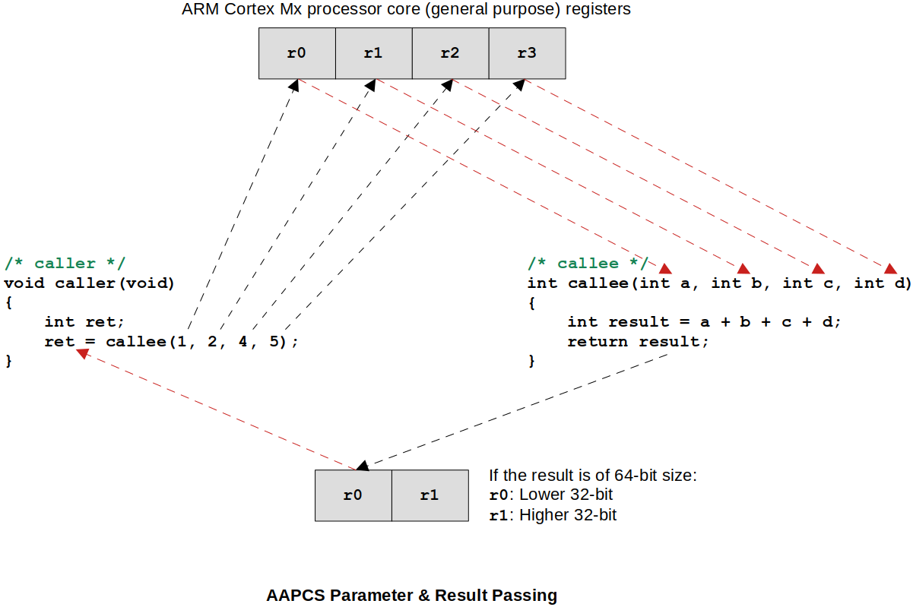
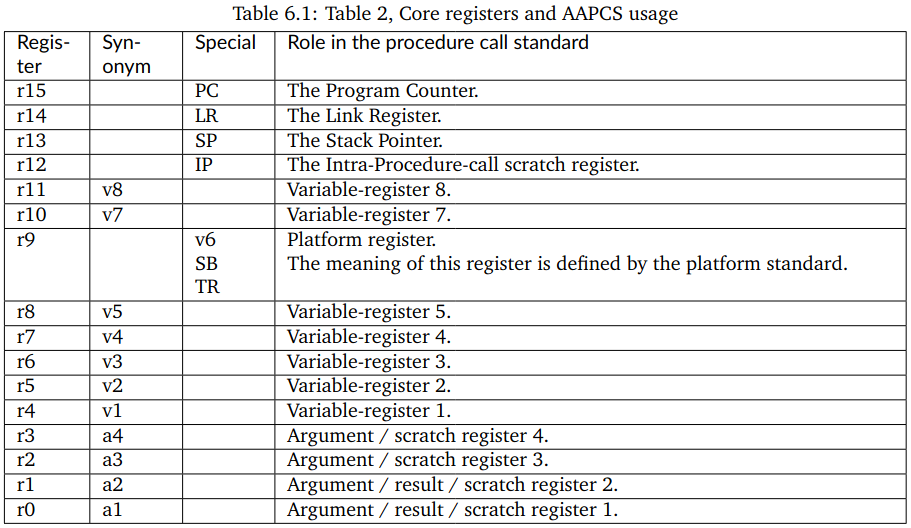
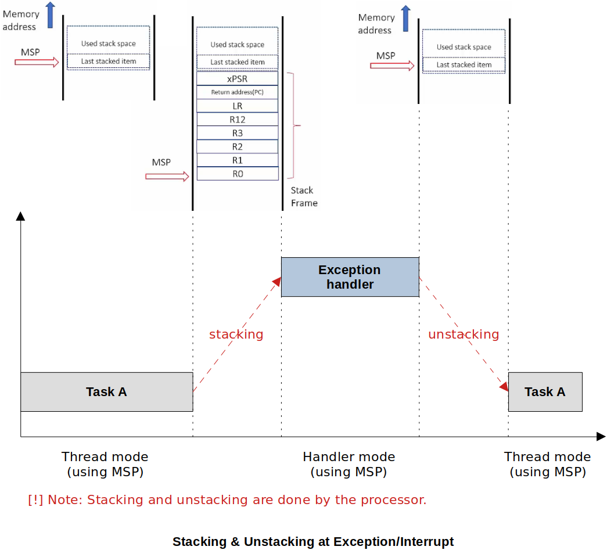

[Home](../../) | [Projects](../../projects) | [Notes](../) > <a href="./">ARM Cortex-M3/M4 Processor</a> > ARM Architecture Procedure Call Standard (AAPCS)

# ARM Architecture Procedure Call Standard (AAPCS)


## Procedure Call Standard for the ARM Architecture (AAPCS)

* The AAPCS standard describes procedure call standard used by the application binary interface (ABI) for ARM architecture.

* The AAPCS defines how subroutines can be separately written, separately compiled, and separately assembled to work together. It describes a **contract between a calling routine and a called routine** that defines:

  * Obligations on the caller to create a program state in which the called routine may start to execute.
  * Obligations on the called routine to preserve the program state of the caller across the call
  * The rights of the called routine to alter the program state of its caller

* When a C compiler compiles code for the ARM architecture, the generated assembly code must be AAPCS compliant. 

  If you are writing a pure assembly program, make sure that it follows AAPCS. 

  If your are writing a C program, you need not worry about AAPCS because it is your C compiler's responsibility to generate an AAPCS compliant assembly program.

### Caller-Saved vs. Callee-Saved Registers

* **R0, R1, R2, R3, R12, R14(LR)** registers are called "**caller-saved registers**". It's the responsibility of the caller to save these registers on stack before calling the function if those values will still be needed after the function call and retrieve it back once the called function returns. Register values that are not required after the function call don't have to be saved.

  ```assembly
  Caller:
      @ use r0, r1, r3, r12, r14
      @ push {r0-r3, r12, r14} : caller's responsibility
      bl Callee
      @ pop {r0-r3, r12, r14} : caller's responsibility*/
      @ use r0, r1, r3, r12, r14 */
  ...
  Callee:
      @ use r0-r3, r12, r14 
      mov pc, lr	@ return to the caller
  }
  ```

* **R4 to R11** are called "**callee-saved registers**". The function or subroutine being called needs to make sure that, contents of these registers will be unaltered before exiting the function.

  ```assembly
  Caller:
      @ use r4-r11
      bl Callee
      @ use r4-r11
  ...
  Callee:
      @ push {r4-r11} : callee's responsibility 
      @ use r4-R11 
      @ pop {r4-r11} : callee's responsibility*/
      mov pc, lr	@ return to the caller
  }
  ```

### Parameters and Result Passing

* According to this standard, caller function uses R0, R1, R2, R3 registers to send input arguments to the callee function.

  The callee function uses registers R0 and R1 (only if the result size is 64-bit) to send the result back to the caller function. 





* If there are more than 4 arguments to be passed,

  * First 4 will be passed via registers
  * The rest will be passed via stack (using r4-r8, r10, r11 registers that are named "Variable-register $n$" and these are the registers used for the local variables of the function)

  For more information, see [Procedure Call Standard for the Arm Architecture](http://www.macs.hw.ac.uk/~hwloidl/Courses/F28HS/Docu/aapcs32.pdf),

  




## Exercise

* See how the compiler generated assembly code is AAPCS compliant.

  To view the assembly code generated from your project: `<Project>/Debug/<Project>.list`

  ```plain
  /* main */
  
  int main(void)
  {
   80002e0:	b580      	push	{r7, lr}
   80002e2:	b082      	sub	sp, #8
   80002e4:	af00      	add	r7, sp, #0
  	change_sp_to_psp();
   80002e6:	f7ff ffe7 	bl	80002b8 <change_sp_to_psp>
  
  	int ret;
  	ret = fun_add(1, 4, 5, 6);
   80002ea:	2306      	movs	r3, #6
   80002ec:	2205      	movs	r2, #5
   80002ee:	2104      	movs	r1, #4
   80002f0:	2001      	movs	r0, #1
   80002f2:	f7ff ffcd 	bl	8000290 <fun_add>
   80002f6:	6078      	str	r0, [r7, #4]
  
  	printf("result = %d\n", ret);
   80002f8:	6879      	ldr	r1, [r7, #4]
   80002fa:	4803      	ldr	r0, [pc, #12]	; (8000308 <main+0x28>)
   80002fc:	f000 f932 	bl	8000564 <iprintf>
  
  	generate_exception();
   8000300:	f7ff ffe6 	bl	80002d0 <generate_exception>
  
      /* Loop forever */
  	for(;;);
   8000304:	e7fe      	b.n	8000304 <main+0x24>
   8000306:	bf00      	nop
   8000308:	08001574 	.word	0x08001574
  
  0800030c <SVC_Handler>:
  }
  ```

  > L13-L16: Notice that r0-r3 registers are used to pass 4 arguments!

  ```plain
  /* fun_add */
  
  08000290 <fun_add>:
  #if !defined(__SOFT_FP__) && defined(__ARM_FP)
    #warning "FPU is not initialized, but the project is compiling for an FPU. Please initialize the FPU before use."
  #endif
  
  int fun_add(int a, int b, int c, int d)
  {
   8000290:	b480      	push	{r7}
   8000292:	b085      	sub	sp, #20
   8000294:	af00      	add	r7, sp, #0
   8000296:	60f8      	str	r0, [r7, #12]
   8000298:	60b9      	str	r1, [r7, #8]
   800029a:	607a      	str	r2, [r7, #4]
   800029c:	603b      	str	r3, [r7, #0]
  	return a+b+c+d;
   800029e:	68fa      	ldr	r2, [r7, #12]
   80002a0:	68bb      	ldr	r3, [r7, #8]
   80002a2:	441a      	add	r2, r3
   80002a4:	687b      	ldr	r3, [r7, #4]
   80002a6:	441a      	add	r2, r3
   80002a8:	683b      	ldr	r3, [r7, #0]
   80002aa:	4413      	add	r3, r2
  }
   80002ac:	4618      	mov	r0, r3
   80002ae:	3714      	adds	r7, #20
   80002b0:	46bd      	mov	sp, r7
   80002b2:	bc80      	pop	{r7}
   80002b4:	4770      	bx	lr
  	...
  ```

  > L10: Callee is pushing the current status of r7 (callee-saved register) onto the stack so it can use r7 in its body.
  >
  > L11-L14: Notice that the local variables a, b, c, d retrieve their values from the registers r0-r3.
  >
  > L26: The result stored in r3 is moved to r0 as per AAPCS.


## Interrupts/Exceptions and AAPCS

* To allow a C function to be used as an exception/interrupt handler, the exception mechanism needs to save **r0-r3, r12, R14(LR), and XPSR** automatically at the entrance of exception and restore them at the termination of the exception under the control of the processor hardware. 

  In this case, the processor will save the **caller-saved registers** (since there is no caller for an exception/interrupt handler) and restore them when the exception/interrupt handler returns.

  Simply put, the hardware generates exceptions/interrupts, and the hardware needs to take care of it!

* You, as a programmer, do not need to worry about AAPCS rules when writing exception/interrupt handlers as regular C functions. Even the compiler won't have to worry about it because the processor will take care of this situation.





## References

Nayak, K. (2022). *Embedded Systems Programming on ARM Cortex-M3/M4 Processor* [Video file]. Retrieved from  https://www.udemy.com/course/embedded-system-programming-on-arm-cortex-m3m4/
