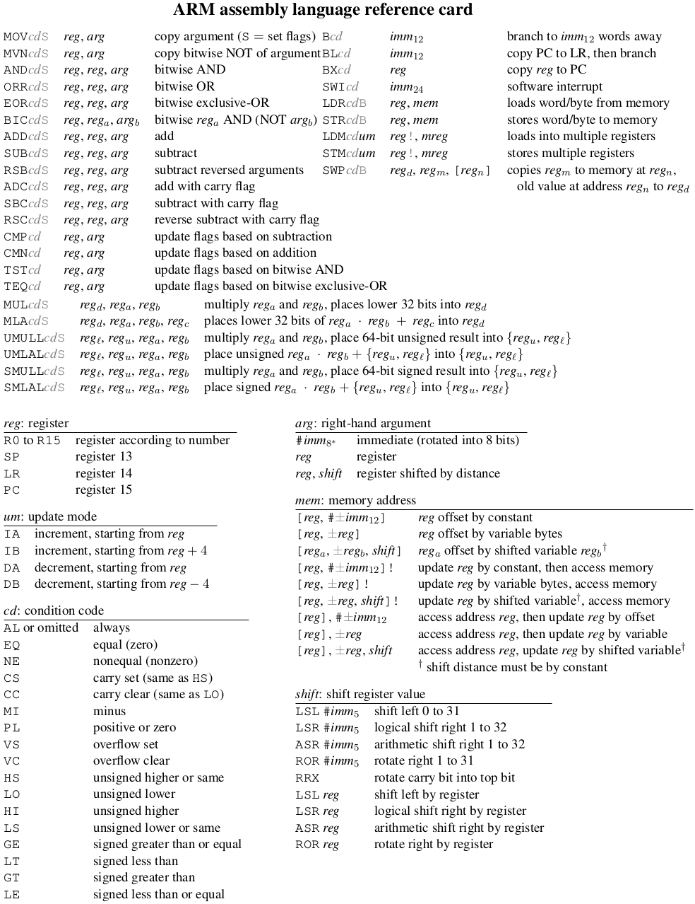

[Home](../../) | [Projects](../../projects) | [Notes](../) > <a href="./">ARM Cortex-M3/M4 Processor</a> > ARM Assembly Language Reference Card

# ARM Assembly Language Reference Card





* Notes about the ARM assembly language reference card:

  - `cd` is used for `B` and other instructions

  - `S` forces the `CCR` to be set based on the instruction being executed.

  - `um` (Skip because we will be using `PUSH` and `POP` instructions.)

  - `reg` refers to registers `r0` to `r15` or `SP`, `LR`, or `PC`.

  - `arg` refers to `#imm``8` or `reg` or `reg, shift`.

  - `mem` (Will get to this when we get to the addressing modes.)

  - `shift` referes to `method: logical, arithmetic, rotate` and `direction: right, left`.

  Do NOT use `STM` and `LDM` since these might not work properly (?). Instead, use `push` and `pop`  respectively.

* Byte addressing, half-word addressing, word addressing    

  - `LDRB`, `LDRH`, `LDR`, respectively

  - You cannot directly read half-byte.        
    - To do that, first read the full byte and mask off the other half-bytes.

* Bit banding    

  - ARM supports special way to directly access a **bit**.

    ```plain
    LDRB R0, [AD]
              --
              bit band alias address (each bit in a byte has its own alias)
    ```

  - This bit banding feature is only available for SRAM(only the first 1 MB) and Peripheral(only the first 1 MB) region of the (virtual) memory.

  - Bit banding provides atomic operations to bit data.        

    - Those operations will not be interrupted by the system exceptions or interrupts of the processor.
