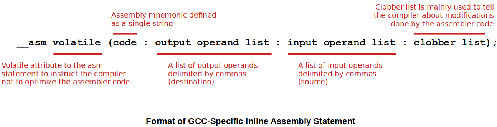

[Home](../../) | [Projects](../../projects) | [Notes](../) > <a href="./">ARM Cortex-M3/M4 Processor</a> > ARM GCC Inline Assembly

# ARM GCC Inline Assembly


## ARM GCC Inline Assembly Code Usage

* Inline assembly code is used to write pure assembly code inside a C program. It is used in order to access the processor core registers such as general purpose register, stack pointer, link register, program counter, or special registers.

* Inline assembly statement syntax is compiler-specific. 

  GCC-specific syntax is as follows:

  ```plain
  __asm volatile("<assembly code>");
  	  --------
  	  optional keyword
  ```

  For example,

  ```c
  /* assembly instruction */
  mov r0, r1
      
  /* inline assembly statement inside C program (GCC specific) */    
  __asm volatile("mov r0, r1");	
  asm volatile("mov r0, r1");		/* omitting the leading '__' also works */
  ```

* Combining multiple assembly instructions in one inline assembly statement:

  ```c
  void func_add(void)
  {
      /*
      __asm volatile("ldr r0, [r1]");
      __asm volatile("ldr r1, [r2]");
      __asm volatile("add r1, r0");
      __asm volatile("str r1, [r3]");
      */
      
      __asm volatile(
          "ldr r0, [r1]\n\t"	// every line has to be wrapped by "" and terminated with \n\t 
      	"ldr r1, [r2]\n\t"	// no comma separation */
     		"add r1, r0\n\t"
      	"str r1, [r3]\n\t"
      );    
  }
  ```

* Why is inline assembly syntax necessary?

  There may be some cases where you cannot accomplish things without using inline assembly code:

  e.g., To move the content of C variable `data` to ARM register `r0`,  to move the content of the `CONTROL resgister` to the C variable `control_reg`.


## Format of GCC-Specific Inline Assembly Statement

### Format





* Remember! This only applies to GCC. Other compilers like ARM CC or IAR uses different format.

* Example:

  ```c
  __asm volatile("mov r0, r1");		// specifying 'code' only (you can omit the ':' only when
  									// omitting does not cause confusion)
  __asm volatile("mov r0, r1":::);	// specifying empty sections along with the code 
  ```

### Input/Output Operands & Constraint String

* Each input and output operand is described by a constraint string followed by a C expression in parentheses.

  **Input/output operand format:**

  ```plain
  "<constraint string>" (<C expression>) 
  ```

  Constraint string = Constraint modifier + Constraint character

  - "Constraint character" 

    Controls whether a register should be used or whether an immediate value should be used with the instruction

  - "Constraint modifier":

    - `=` - Write-only operand, usually used for all output operands
    - `+` - Read-write operand, must be listed as an output operand
    - `&` - A register that should be used for output only

### Examples

* Example 1: Move the content of C variable `val` to ARM register `r0`. (Data copy)

  ```c
  // instruction	: mov
  // source		: a C variable 'val' (INPUT operand)
  // destination	: r0 (ARM core register)
  
  __asm volatile("mov r0, %0": : "r"(val));
  ```

  > Code
  >
  > - Operand indexing using % sign followed by a digit
  >
  >   - %0 refers to the first operand
  >
  >   - %1 refers to the second and so forth
  >
  >   The compiler will replace `%0` by the first operand that appears in the following output/input operand list. In this case the first operand will be `val`.
  >
  > Input operand list
  >
  > - constraint string: `"r"` 
  >
  >   Here, `r` is the constraint character which tells the compiler that a register operand is allowed provided that it is in a general register. See [Simple Constraints](https://devdocs.io/gcc~10/simple-constraints).
  >
  > - C expression: `val` (C variable)
  >
  > - Input operands are always read-only.

* Example 2: Move the content of CONTROL register to C variable `control_reg`. (Reading the contents of a special purpose register)

  ```c
  // CONTROL register is a special register of the ARM core.
  // To read CONTROL register you have to use MRS instruction.
  
  // instruction	: mrs
  // source		: CONTROL register
  // destination	: A C variable 'control_reg' (OUTPUT operand)
  
  uint23_t control_reg;
  __asm volatile("mrs %0, CONTROL": "=r"(control_reg)::);
  ```

  > Code
  >
  > - `mrs` - Move from special register to (general purpose) register
  > - `msr` - Move from (general purpose) register to special register
  >
  > Output operand list
  >
  > - constraint string: `"=r"` 
  >
  >   Here, `r` is the constraint character which tells the compiler that a register operand is allowed provided that it is in a general register. See [Simple Constraints](https://devdocs.io/gcc~10/simple-constraints).
  >
  > - C expression: `val` (C variable)

* Example 3: Copy the content of C variable `var1` to `var1`

  ```c
  // instruction	: mov
  // source		: A C variable 'var1' (INTPUT operand)
  // destination	: A C variable 'var2' (OUTPUT operand)
  
  int var1 = 10, var2;
  __asm("mov %0, %1": "=r"(var2): "r"(var1));	
  ```

  > Code
  >
  > - `volatile` keyword can be omitted if not necessary
  >
  > Output operand list
  >
  > - Destination has to be the output operand `var2` (write-only)
  > - `%0` refers to `"=r"(var2)`
  >
  > Input operand list
  >
  > - Source has to be the input operand `var1` (read-only)
  > - `%1` refers to `"r"(var1)`

* Example 4: Copy the contents of a pointer into another variable

  ```c
  int p1, *p2;
  
  p2 = (int *)0x20000008;
  __asm volatile("ldr %0, [%1]": "=r"(p1): "r"(p2)); 	// p1 = *p2;
  ```


## References

Nayak, K. (2022). *Embedded Systems Programming on ARM Cortex-M3/M4 Processor* [Video file]. Retrieved from  https://www.udemy.com/course/embedded-system-programming-on-arm-cortex-m3m4/
