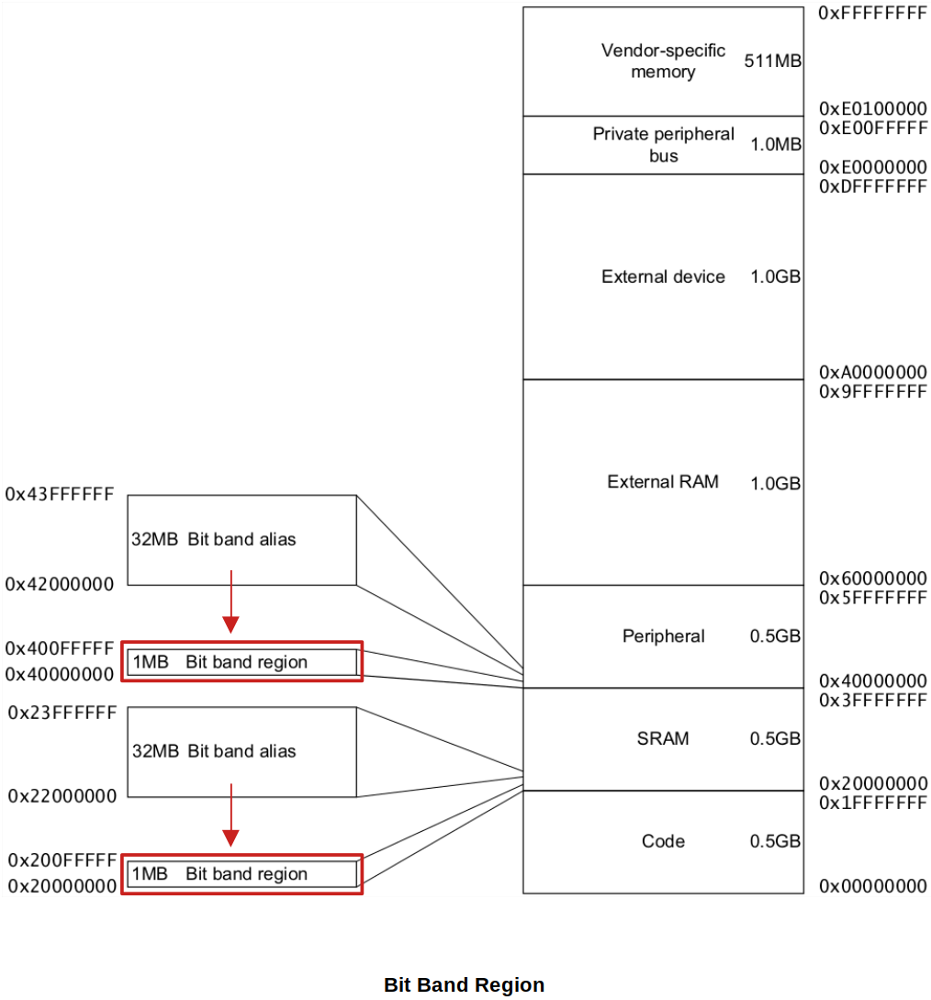

[Home](../../) | [Projects](../../projects) | [Notes](../) > <a href="./">ARM Cortex-M3/M4 Processor</a> > Bit Banding

# Bit Banding


## Bit Banding

* Bit banding is the capability to address a single bit of a memory address.

* This feature is optional. i.e., MCU manufacturer may or may not support it. Consult the reference manual!

* Bit banding provides atomic operations (i.e. will not be interrupted) to bit data.

* To access a word (4 byte), use `ldr`, `str`.

  To access a half-word (2 byte), use `ldrh`, `strh`.

  To access a byte, use `ldrb`, `strb`.

  To access a bit, use **bit banding**.

  ```assembly
  @ To set the bit-0 of the byte r1 points to (without bit banding):
  ldrb r0, [r1]		@ load a byte
  orr  r0, r0, #0x01	@ set bit-0
  strb r0, [r1]		@ store the result back 
  ```

  ```assembly
  @ To set the bit-0 of the byte r1 points to using bit banding:
  ldrb r0, [<alias_address>]
  ```

* These bit-addressable region is called the "**Bit band region**", and each bit in the bit band region can be addressed by using the "**Bit band alias**" address. See the following diagram. Here, the bit band feature is supported only within the Peripheral region and SRAM region.

  (Think about the relationship between 1MB and 32 MB.)





* Example of "Bit" to "Bit band alias" mapping:

  ```plain
  Bit-band Region							Alias address
  ------------------						-----------------
  0x20000000 bit[0] <-------------------	0x22000000 bit[0]
  0x20000000 bit[1] <-------------------	0x22000004 bit[0]
  0x20000000 bit[2] <-------------------	0x22000008 bit[0]
  ...										...
  0x20000000 bit[31] <------------------	0x2200007C bit[0]
  0x20000004 bit[0] <-------------------	0x22000080 bit[0]
  0x20000004 bit[1] <-------------------	0x22000084 bit[0]
  ```


## Calculation of Bit Band Alias Address

* Generic formula:

  Alias address = alias_base + (32 * (bit_band_memory_addr - bit_band_base)) + bit * 4

* What is the alias address of the 7th bit position of the memory location 0x20000200?

  $\to$ Alias address = 0x22000000 + (32 * (0x20000200 - 0x20000000)) + 7 * 4


## Bit Banding - Demonstration

* Program to modify the 7th bit position of the memory location 0x20000200 with/without using bit banding.

  ```c
  #include <stdint.h>
  
  #if !defined(__SOFT_FP__) && defined(__ARM_FP)
    #warning "FPU is not initialized, but the project is compiling for an FPU. Please initialize the FPU before use."
  #endif
  
  #define ALIAS_BASE 0x22000000U
  #define BITBAND_BASE 0x20000000U
  
  int main(void)
  {
  	uint8_t *ptr = (uint8_t *)0x20000200;
  
  	*ptr = 0xff;
  
  	// 1. without using bit banding
  	*ptr &= ~(1 << 7);	// clearing 7th bit position of a byte in 0x20000200
  
  	// reset the value
  	*ptr = 0xff;
  
  	// 2. using bit banding
  	uint8_t *alias_addr = (uint8_t *)(ALIAS_BASE + (32 * (0x20000200 - BITBAND_BASE)) + 7 * 4);
  	*alias_addr = 0;	// clearing 7th bit position of a byte in 0x20000200
  
      /* Loop forever */
  	for(;;);
  }
  ```

  > Without using bit banding generates this many assembly instructions:
  >
  > ```assembly
  > 17                    	*ptr &= ~(1 << 7);	// clearing 7th bit position of a byte in 0x20000200
  > 080001f8: 7b 68         ldr     r3, [r7, #4]
  > 080001fa: 1b 78         ldrb    r3, [r3, #0]
  > 080001fc: 03 f0 7f 03   and.w   r3, r3, #127    ; 0x7f
  > 08000200: da b2         uxtb    r2, r3
  > 08000202: 7b 68         ldr     r3, [r7, #4]
  > 08000204: 1a 70         strb    r2, [r3, #0]
  > ```
  >
  > Using bit banding generates much less instructions:
  >
  > ```assembly
  > 24                    	*alias_addr = 0;	// clearing 7th bit position of a byte in 0x20000200
  > 08000210: 3b 68         ldr     r3, [r7, #0]
  > 08000212: 00 22         movs    r2, #0
  > 08000214: 1a 70         strb    r2, [r3, #0]
  > ```


## References

Nayak, K. (2022). *Embedded Systems Programming on ARM Cortex-M3/M4 Processor* [Video file]. Retrieved from  https://www.udemy.com/course/embedded-system-programming-on-arm-cortex-m3m4/
