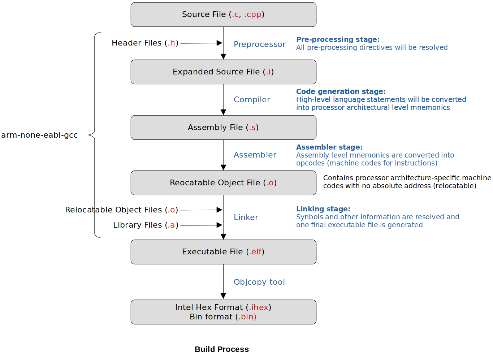

[Home](../../) | [Projects](../../projects) | [Notes](../) > <a href="./">ARM Cortex-M3/M4 Processor</a> > Build Process & Makefile

# Build Process & Makefile


## Build Process





​	[!] Note: The compiler does not save `.i` and `.s` file by default. You can make the compiler save them by using the compiler flags


* Note that you need to specify some target-specific information when cross-compiling. These include the processor name or processor architecture, Thumb/ARM state, etc. Otherwise, the assembler may not understand some architecture-specific inline assembly code. (Check the "Machine-Dependent Options" section in the online GCC documentation.)

  * `-c`: Compile or assemble the source files, but do not link
  * `-S`: Stop after the stage of compilation proper; do not assemble.

  * `-o`: Designate output file name 

  * `-mcpu=`: Specifies the name of the target ARM processor for which GCC should tune the performance of the code

  * `-march=`: Specifies the name of the target ARM architecture. GCC uses this name to determine what kind of instructions it can emit when generating assembly code.  This option can be used in conjunction with or instead of the `-mcpu=` option. (For the ARM Cortex M4 processor, `-march=armv7ve`)

  * `-mthum`: Thumb state ISA

  * `-marm`: ARM state ISA (default)

  For more information about compiler flags, consult GCC documentation.

  ```plain
  arm-none-eabi-gcc -c -mcpu=cortex-m4 -mthumb main.c -o main.o
  ```

  > Generates `main.o`

  ```plain
  arm-none-eabi-gcc -S -mcpu=cortex-m4 -mthumb main.c -o main.s
  ```

  > Generates `main.s`
  
* See [GCC online documentation](https://gcc.gnu.org/onlinedocs/).


## Makefile

### Make vs. Makefile

* **Make** is a tool. 

  ```plain
  $ which make
  /usr/bin/make
  ```

  ```
  $ make      # correct; make is an executable
  $ makefile  # incorrect; makefile is NOT an executable
  ```

* **Makefile** is a file written in such a way that Make tool can understand.
* Make tool needs Makefile as the input and process as per the instructions written in it.
* "Makefile" or "makefile" both are valid notations.

### Why Makefile?

- Makefile is used for automating the build process.
- Make tool is very powerful in that it can detect the **modified source file(s)** and process/build file them **only** by running make. Compiling only the modified source files and linking them into the project can save huge amount of time when only a small number of source files has been modified in a big project.
  - **Time stamp** is used to detect the modified source files.
- In general, compilation is much slower process than linking. Make tool takes the advantage of this fact.


### Example of a Makefile

* Makefile for "Task Scheduler" project:

  ```makefile
  # Makefile (or makefile)
  
  # Variables
  CC=arm-none-eabi-gcc
  MACH=cortex-m4
  CFLAGS= -c -mcpu=$(MACH) -mthumb -mfloat-abi=soft -std=gnu11 -Wall -o0 
  LDFLAGS= -mcpu=$(MACH) -mthumb -mfloat-abi=soft --specs=nano.specs -T stm32_ls.ld -Wl,-Map=final.map
  # LDFLAGS for semihosting
  LDFLAGS_SH= -mcpu=$(MACH) -mthumb -mfloat-abi=soft --specs=rdimon.specs -T stm32_ls.ld -Wl,-Map=final.map
  
  all: main.o led.o stm32_startup.o syscalls.o final.elf
  
  # semihosting
  sh: main.o led.o stm32_startup.o final_sh.elf
  
  # Target (dependencies / recipie)
  main.o: main.c  # target is 'main.o', and 'main.c'(dependency) is necessary to create target
      $(CC) $(CFLAGS) -o $@ $^    # recipie: command to generate the target
      # $(CC) $(CFLAGS) $^ -o $@
      # $(CC) $(CFLAGS) main.c -o main.o
      # '$^' represents dependency, '$@' represents target (@ does look like a target :))
      
  led.o: led.c
      $(CC) $(CFLAGS) -o $@ $^ 
  
  stm32_startup.o: stm32_startup.c
      $(CC) $(CFLAGS) -o $@ $^ 
  
  syscalls.o: syscalls.c
      $(CC) $(CFLAGS) -o $@ $^ 
  
  final.elf: main.o led.o stm32_startup.o syscalls.o
      $(CC) $(LDFLAGS) -o $@ $^ 
  
  final_sh.elf: main.o led.o stm32_startup.o # exclude 'syscalls.o'
      $(CC) $(LDFLAGS_SH) -o $@ $^ 
  
  clean:
      rm -rf *.o *.elf    # in Windows rm -> del
  
  connect: # connect board with OpenOCD
      openocd -f /board/stm32f4discovery.cfg
      # /usr/share/openocd/scripts/board/stm32f4discovery.cfg
  ```
  
  > `-std=`: Specifies the language standard. (Check "Options Controlling C Dialect" section of the GCC documentation) 
  >
  > `-On`: Specifies the optimization level to n (by default 0)


​	

## References

Nayak, K. (2022). *Embedded Systems Programming on ARM Cortex-M3/M4 Processor* [Video file]. Retrieved from  https://www.udemy.com/course/embedded-system-programming-on-arm-cortex-m3m4/
