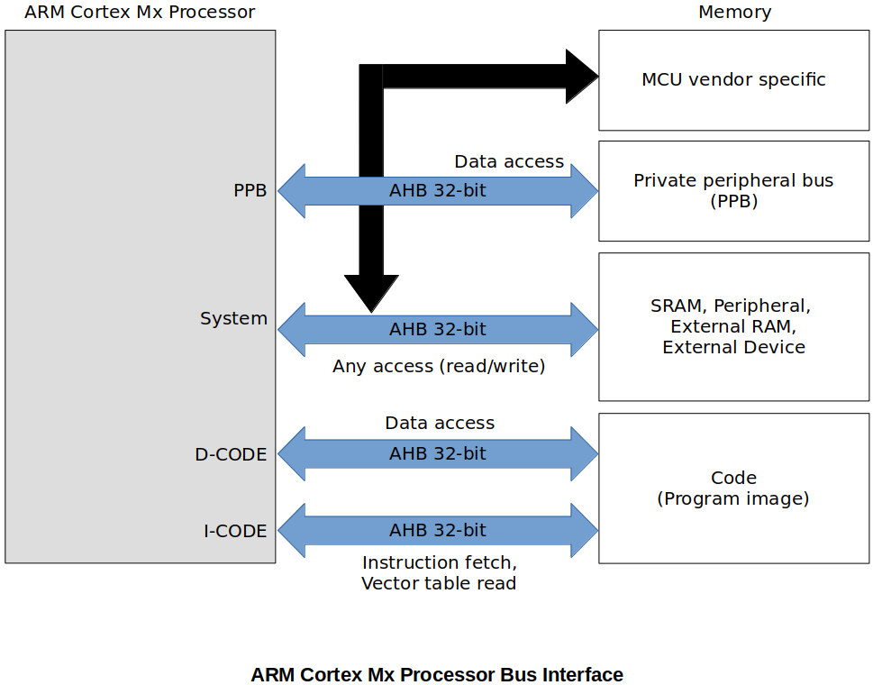
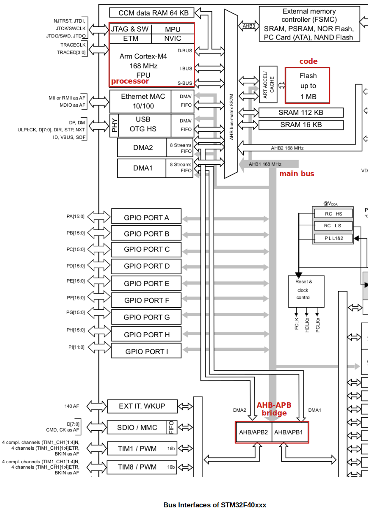

[Home](../../) | [Projects](../../projects) | [Notes](../) > <a href="./">ARM Cortex-M3/M4 Processor</a> > Bus Interfaces

# Bus Interfaces

## Bus Interfaces

* ARM Cortex Mx Processors' bus interfaces are based on advanced microcontroller bus architecture (AMBA) specification.

* AMBA is a specification designed by ARM which governs the standard for on-chip communication inside the system-on-chip (SoC).

* AMBA specification supports several bus protocols:

  * **AHB Lite (AMBA High-performance Bus)**

    Mainly used for the main bus interfaces on the microcontroller.

    High-speed communication with peripherals that demand high operation speed.

  * **APB (AMBA Peripheral Bus)**

    Used for Private Peripheral Bus (PPB) access and some on-chip peripheral access using an AHB-APB bridge.

    Low-speed communication compared to AHB. 

    Most of the peripherals which don't require high operation speed are connected to this bus.
  
* ARM Cortex Mx processor bus interface visualized

  * Note that there are two separate buses for data and instruction. (Solves "Von Neumann Bottleneck")

## Bus Interfaces of STM32F40xxx

* Block diagram of STM32F40xxx (from datasheet)

  

* **Bus matrix** is given by the MCU vendor to synchronize multiple bus access from the different bus masters. Here, the Processor, Ethernet MAC, USB OTG HS, DMA1, DMA2, etc. are bus masters. The engine called **Arbiter**, which is a part of the AHB bus matrix, controls the bus access from these multiple bus masters.
* Main bus is connected to the system bus of the processor via the AHB bus matrix.
* All the GPIO ports are connected to the AHB1 main bus. (Meaning that the GPIO ports are communicating with the processor using the AHB1 bus).
* Peripherals that do not require high-speed communication are connected to the APB bus.
* The APB and AHB buses are connected via **AHB-APB bridge** (protocol conversion via the bridge).

## References

Nayak, K. (2022). *Embedded Systems Programming on ARM Cortex-M3/M4 Processor* [Video file]. Retrieved from  https://www.udemy.com/course/embedded-system-programming-on-arm-cortex-m3m4/
