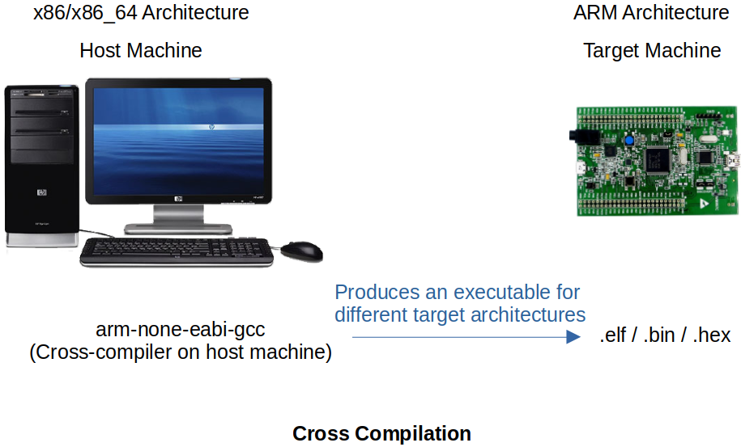

[Home](../../) | [Projects](../../projects) | [Notes](../) > <a href="./">ARM Cortex-M3/M4 Processor</a> > Cross Compilation & Toolchains

# Cross Compilation & Toolchains

## Native Compilation

* Native compilation is that the compiler runs on a host machine produces executable which also runs on the same machine.
* Native compiler examples:
  * MinGW, gcc, g++, etc.

## Cross Compilation

* A process in which the cross-toolchain runs on the host machine (e.g., PC) and creates executables that run on different machine (e.g., ARM)

* Cross-compilation is the act of compiling code for one computer system (often known as the target) on a different system, called the host.

* Cross compiler runs on one computer architecture, and produces the code that runs on a different computer architecture.

* Produced executable types:

  * `.elf` - Stands for **Executable and Linkable Format** and is **used for debugging**.
  * `.bin`, `.hex` - Pure binary executables which are **used for productions**.

  When delivering the project, make sure that it is in `.bin` or `.hex` format. It must not be `.elf` format because it has all the debug information and anyone can use ELF analyzers to read the contents of the ELF or disassemble the ELF to obtain the implementation of the project.

## Toolchain / Cross-compilation Toolchain

* A collection of binaries which allows you to compile, assemble, link your applications

* It also contains binaries to debug the application on the target.

* A toolchain also comes with other binaries which help you to analyze the executables

  * Dissect different sections of the executable
  * Disassemble
  * Extract symbol and size information
  * Convert executable to other formats such as bin, ihex
  * Provides C standard libraries

* Popular toolchains:

  * GNU tools (GCC) for ARM Embedded Processors (free and open-source)
  * armcc from ARM Ltd. (ships with KEIL, code restriction version, requires licensing)

* Insatlling GCC for ARM Embedded Processors on Ubuntu 22.04 LTS:

  * Run `sudo apt install gcc-arm-none-eabi` to install. ("eabi" stands for "Extended Application Binary Interface")

  * To check if its installed correctly, run `arm-none-eabi-gcc`, see if the system recognizes the command.

  * To check what binaries (or executables) have been installed, go to `/usr/bin/` and search for `arm*`.

    * **Compiler + linker + assembler** (Not only does the compilation, but it also assembles and links object files to create a final executable file)

      arm-none-eabi-gcc 

    * **Linker**

      arm-none-eabi-ld 

    * **Assembler**

      arm-none-eabi-as

    * **ELF file analyzer**

      arm-none-eabi-objdump

      arm-none-eabi-readelf

      arm-none-eabi-nm

    * **Format converter** (Converts one executable format to another)

      arm-none-eabi-objcopy

## References

Nayak, K. (2022). *Embedded Systems Programming on ARM Cortex-M3/M4 Processor* [Video file]. Retrieved from  https://www.udemy.com/course/embedded-system-programming-on-arm-cortex-m3m4/
