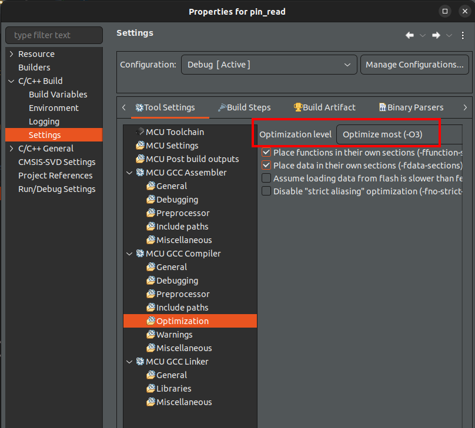

[Home](../../) | [Projects](../../projects) | [Notes](../) > <a href="./">ARM Cortex-M3/M4 Processor</a> > CubeIDE Tips

# CubeIDE Tips

## Initial Setup

* To resolve FPU warning ("FPU is not initialized, but the project is compiling for an FPU. Please initialize the FPU before use."):

  Project $\to$ Properties $\to$ C/C++ Build $\to$ Settings $\to$ MCU Settings $\to$ Tool Settings

  Set `Floating-point unit` to `None`

  Set `Floating-point ABI` to `Software implementation (-mfloat-abi=soft)`

## Debugging Tips

* To see the snapshot of CPU registers (RCC registers, GPIO peripheral registers, etc.):

  Window $\to$ Show View $\to$ SFRs

## Optimization

* To change the optimization level:

  Project $\to$ Properties $\to$ C/C++ Build $\to$ Settings $\to$ MCU GCC Compiler $\to$ Optimization

* Whenever you change the optimization level, do **clean** followed by **build**.
* When you start optimizing your code, your code becomes more difficult to debug with disassembly since they do not exactly match 1-to-1 any more.
* Also, to protect your code from failing by optimization, be sure to use `volatile` keyword for the variable whose value is expected to change over the course of execution. See [`volatile` Type Qualifier](../c-programming-embedded/volatile-type-qualifier).

## References

Nayak, K. (2022). *Microcontroller Embedded C Programming: Absolute Beginners* [Video file]. Retrieved from  https://www.udemy.com/course/microcontroller-embedded-c-programming/

Nayak, K. (2022). *Embedded Systems Programming on ARM Cortex-M3/M4 Processor* [Video file]. Retrieved from  https://www.udemy.com/course/embedded-system-programming-on-arm-cortex-m3m4/
