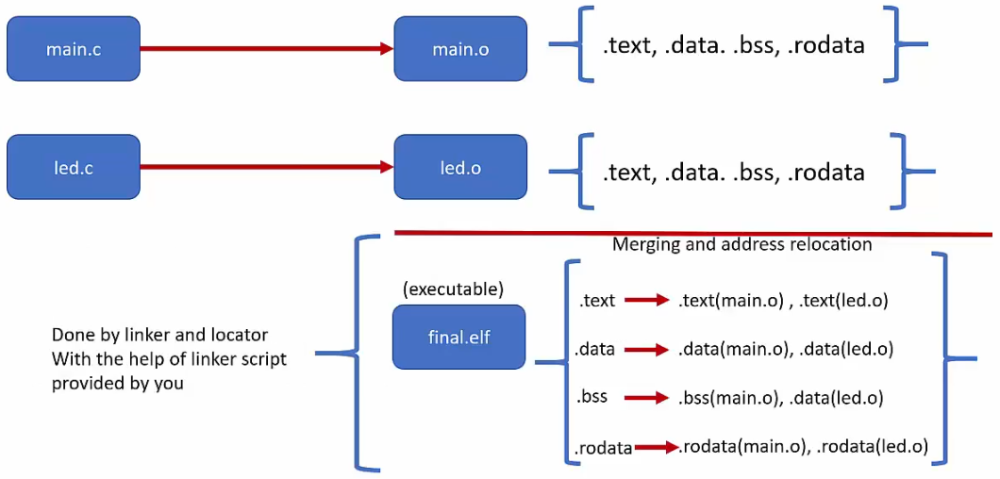
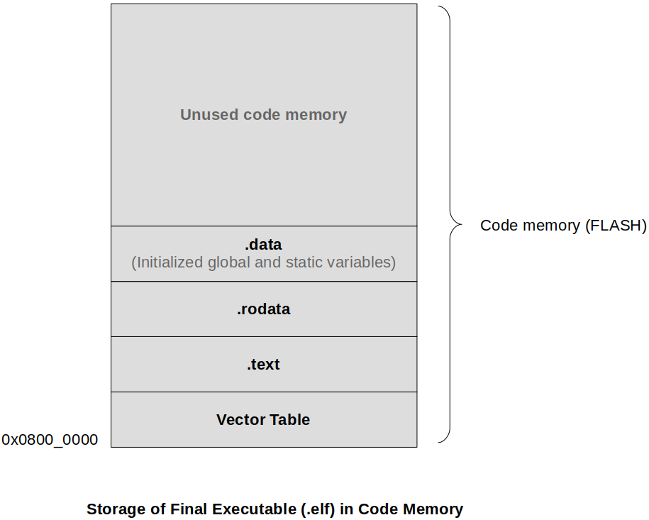

[Home](../../) | [Projects](../../projects) | [Notes](../) > <a href="./">ARM Cortex-M3/M4 Processor</a> > Different Sections of a Program

# Different Sections of a Program


## Code & Data of a Program

* A program is composed of **code** and **data**. Code operates on data.

  * **Code (instructions)** - stored in FLASH memory of the microcontroller

    Instructions do not change during the run-time so, it makes sense to store them in read-only memory (FLASH).

  * **Data (variables)** - stored in main memory (RAM)

    Data may change during the run-time so, it makes sens to store them in read-write memory (RAM).

    Data that will never change (i.e., constants) during the run-time may be stored in read-onlly memory (FLASH).

  

## Different Sections of a Program Specified in an ELF Format

* main.o (Object file in ELF format)

  * **.text**

    Contains code (instructions)

    When ELF file is loaded onto microcontroller, this section is placed in ROM.

  * **.data**

    Contains initialized data

    When ELF file is loaded onto microcontroller, this section is placed in RAM.

  * **.bss**

    Contains uninitialized data

    When ELF file is loaded onto microcontroller, this section is placed in RAM.

  * **.rodata**

    Contains read-only data

    When ELF file is loaded onto microcontroller, this section is placed in ROM.

  * **User-defined section**s

    Contains data/code which programmer demands to put in user-defined sections

    When ELF file is loaded onto microcontroller, these sections are placed in ROM or RAM depending on user-definition.

  * **Other special sections**

    Contains some special data (Special sections added by the compiler)

    When ELF file is loaded onto microcontroller, these sections are placed in FLASH.

  [!] Note: STM32F407 board uses FLASH for ROM.

* Relocation of each section will be based on the **linker script**.


## Linker & Locator

* Use the **linker** to merge similar sections of different object files and to resolve all undefined symbols of different object files.
* With the help of a linker script, **locator** (part of linker) merges different sections and assigns mentioned addresses to different sections.





## Storage of Final Executable in Code Memory

* The first section of code memory (FLASH) is occupied by the vector table. When creating a project on a bare-metal microcontroller board, you need to write your own vector table in the **startup** code of your project and make sure that the initial address of the code memory is the start of the vector table.
* Which section comes immediately after `.text` section is not important. Can be `.data` or `.rodata`.





* But, shouldn't `.data` section be placed in read-write memory (RAM)?

  $\to$ Yes! Above diagram shows the snapshot of the code memory (FLASH) when your program first gets flashed onto the microcontroller board. After that, the startup code will copy `.data` section from the code memory to the data memory (RAM; i.e., SRAM). Section boundaries such as `_edata`, `_sdata`, `etext` will be used in the process of data copying.

  Why can't the `.data` section be placed directly in the RAM then?

  $\to$ Because the `.efl` binary file as a whole is first loaded (flashed) onto FLASH. 

  Then why does `.bss` not show up in the code memory snapshot below? Isn't it part of `.efl` file?   

  $\to$ Because the uninitialized global and static variables contains no useful data anyways. Why bother loading onto FLASH and then transfer to the RAM? What needs to be done is that when the `data` section gets copied into the RAM, setup `.bss` section immediately after the `.data` section and simply initialize the whole section to 0. That's it!


* After the `.data` section has been successfully copied into the data memory (RAM), `.bss` section will be initialized followed by the stack initialization.


## Different Data of a Program and Related Sections

* Data can be categorized as follows:

  * `global_un_data` - Uninitialized global variables

    Uninitialized global variables does not carry any useful data to "remember". Why would you have them flashed onto FLASH in the beginning and waste the code memory? So, the compiler doesn't include them as a part of `.data` section. They will be stored in the `.bss` section.

  * `global_i_data` - Initialized global data

    Initizlied global data contains useful data so, they should be place in the `.data` section.

  * `global_un_s_data` - Global uninitialized static data

    These are global data of file-scope (i.e., private to the file). These does not contain any useful data initially so, should be placed in the `.bss` section.

  * `global_i_s_data` - Global initialized static data

    Placed in the `.data` section. 

  * `local_un_data` - Local uninitialized data

    These will be created/destroyed in stack since they are transient (i.e., lifetime is not the duration of the program execution) in nature. They get created and destroyed during the run-time depending on their scopes. 

  * `local_i_data` - Local initialized data

    Same as `local_un_data`.

  * `local_un_s_data` - Local uninitialized static data

    Their lifetime is the duration of the program execution so, they can be viewed as "global variables private to a specific scope (i.e., block or function)". Uninitialized global vairables go to `.bss` section.

  * `local_i_s_data`

    Their lifetime is the duration of the program execution so, they can be viewed as "global variables private to a specific scope (i.e., block or function)". Initialized global vairables go to `.data` section.

* Summary

  | Variable (Data)             | LOAD Time (LMA) | RUN Time (VMA) | Section | Remarks                                                      |
  | --------------------------- | --------------- | -------------- | ------- | ------------------------------------------------------------ |
  | Global initialized          | Flash           | RAM            | .data   | Copied from Flash to RAM by startup code                     |
  | Global uninitialized        | -               | RAM            | .bss    | Startup code reserves space for this data in RAM and initializes to 0 |
  | Global static initialized   | Flash           | RAM            | .data   | Copied from Flash to RAM by startup code                     |
  | Global static uninitialized | -               | RAM            | .bss    | Startup code reserves space for this data in RAM and initializes to 0 |
  | Local initialized           | -               | RAM (Stack)    | -       | Allocated at run-time                                        |
  | Local uninitialized         | -               | RAM (Stack)    | -       | Allocated at run-time                                        |
  | Local static initialized    | Flash           | RAM            | .data   | Copied from Flash to RAM by startup code                     |
  | Local static uninitialized  | -               | RAM            | .bss    | Startup code reserves space for this data in RAM and initializes to 0 |
  | All global const            | Flash           | -              | .rodata | Stays in Flash only                                          |
  | All local const             | -               | RAM (Stack)    | -       | Allocated at run-time (Treated as locals)                    |
  
  > `.data` section is associated with two different addresses; LMA (Load Memory Address), VMA (Virtual Memory Address). LMA is the address when the `.data` section is still on the FLASH, and VMA is the address when it is copied to the RAM (a.k.a. run-time address).
  >
  > In microcontroller, nothing is virtual. Everything is physical. So, do not regard VMA as the "Virtual memory" generated by the Memory Management Unit (MMU).
  >
  > **Global const** data do not need to consume RAM since they won't get updated during the run-time. So, no VMA or run-time address.
  >
  > Lifetime of **local static** variables is the duration of the program. Hence, they do not utilize stack!


## `.bss` (Block Started by Symbol) vs. `.data` Section

This is very important background knowledge you need to have when writing a bare-metal embedded application for a target.

* All the uninitialized global variables and uninitialied static variables are stored in the `.bss` section.
* Since those variables do not have any initial values, they are not required to be stored in the `.data` section since the `.data` section consumes FLASH space. Imagine what would happen if there is a large global uninitialized array in the program, and if that is kept in the `.data` section. It would unnecessarily consume FLASH space while carrying no useful information at all.
* `.bss` section doesn't consume any FLASH space unlike `.data` section. ($\therefore$ No LMA)
* You must reserve RAM space for the `.bss` section by knowing its size and initialize the section to 0. This is typically done in the startup code.
* Linker helps you to determine the final size of the `.bss` section. So, obtain the size information from a linker script symbols.

### Example

* Identify the sections in the program for each variables:

  ```c
  #include <stdint.h>
  
  uint32_t d_count = 300000; // .data
  
  int g_un_data1; // .bss
  int g_un_data2 = 0; // .bss (SPECIAL case! Be careful! Initilized to 0 -> goes to .bss)
  int g_i_data = 0x55; // .data
  static int g_un_s_data; // .bss
  static int g_i_s_data = 0x44; // .data
  
  int main(void)
  {
      printf("data = %d, %d, %d, %d, %d\n", 
             g_un_data1, g_un_data2, g_i_data, g_un_s_data, g_i_s_data); // 
      
      int l_un_data; // stack
      int l_i_data = 0x98; // stack (SPECIAL case!), gets the value from the FLASH
      static int l_un_s_data; // .bss
      static int l_i_s_data = 0x24; // .data
      
      printf("sum = %d\n", l_un_data + l_i_data + l_un_s_data + l_i_s_data);
  }
  ```

  > L6: Global variable initialized to 0 will go to `.bss` section!
  >
  > L17: Local const data (`l_i_data` will get created on the stack when `main()` is called, but the initialization value will be read from the FLASH)


## References

Nayak, K. (2022). *Embedded Systems Programming on ARM Cortex-M3/M4 Processor* [Video file]. Retrieved from  https://www.udemy.com/course/embedded-system-programming-on-arm-cortex-m3m4/

