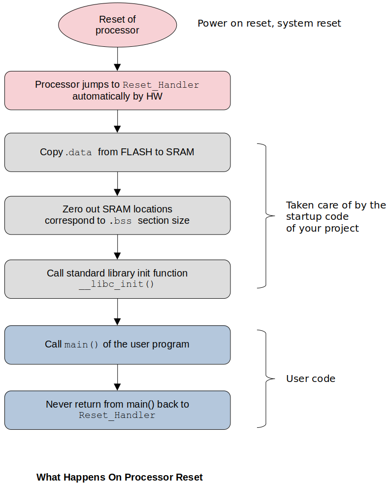

[Home](../../) | [Projects](../../projects) | [Notes](../) >  <a href="./">ARM Cortex-M3/M4 Processor</a> > Embedded Systems Basics

# Embedded Systems Basics


## Analyzing Embedded C Program Requires

* Anatomy of the microcontroller
* Identifying code and data parts of the program
* Code memory and data memory of the MCU
* Disassembly feature of the IDE
* Analyzing the executable (.elf) using GNU tools (e.g., objdump and size)


## Processor (CPU) vs. Core

* Processor (CPU) = Core + Processor specific peripherals
  - **Core**
    - Basic computational engine of the processor
    - Consists of ALU where data computation takes place and result will be generated
    - Consists of Address Generation Unit (ADU)
    - Consists of hardware multiplication and division engine
    - Has the logic to decode and execute an instruction
    - Has multiple registers to store and manipulate data
    - Has pipeline engine to boost the instruction execution
    - A processor may contain multiple cores depending on the design
  - **Processor specific peripherals** (e.g., NVIC, FPB, MPU, DWT, etc.)
    - Types of peripherals may vary depending on the design


## Microcontroller

* Microcontroller (MCU, $\micro$C) is a small computer system on a single chip. Its resources and capabilities such as memory, speed, external interfaces are very limited compared to those of a desktop computer because MCUs are targetted for embedded systems.
* A typical microcontroller includes on a single chip:
  * Processor(s)
  * Volatile/non-volatile memory(s)
    * SRAM, FLASH, ROM, EEPROM, etc.

  * Input/output pins
  * Peripherals
    * ADC, DAC, TIMERS, UART, USB, etc.
  * Clock
  * Bus interfaces
  * etc.
* In the case of STM32F40xxx microcontroller, the ARM Cortex-M4 processor acts as the **master**. It communicates with various **slaves** (i.e., peripherals) via bus interfaces.


## Anatomy of a Typical Microcontroller


* **CPU** - Executes instructions

* **Program (code) memory (non-volatile)** - Stores instructions and constant data of your program.

  * ROM (Read-Only Memory)

    * MPROM (Mask Programmable Read-Only Memory)

      Once written, cannot be rewritten

    * EPROM (Ultraviolet Erasable Programmable ROM)

      Can be rewritten, but the process is very cumbersome. Take the chip out of the circuit, put it under the ultraviolet machine to erase the memory, and then program it again! Therefore, EPROMs are not used for memories inside MUCs anymore.

    * EEPROM (Electrically Erasable Programmable ROM)

      Easier of the three to rewrite. Erased by a certain electric voltage. Still used in some of the MCUs that are produced today.

  * OTP (One Time Programmable)

  * Flash (Electrically Erasable Programmable ROM)

    Popular in MCUs. Fabrication process is easier that that of EEPROM's. Flash memories are faster and cheaper than EEPROMs.

  * FRAM (Ferroelectric Random Access Memory)

    Much faster than Flash memories but also more expensive. Some of the TI MCU uses FRAM as a code memory in stead of Flash memory.

* **Data memory (volatile)** - Stores the data used in the program. Mainly consumed during the run-time and can be used as a scratch pad to temporarily store the data or so. (e.g., SRAM)

* **Bus interfaces** - A group of wires through which information (i.e., data, addresses) is transferred (e.g., address but, data bus, control but, etc.)

* **I/O interfaces** - Allows the MCU to communicate with the outside world (e.g., serial I/O, parallel I/O, etc.)


## ELF File

* To analyze `.elf` files a GNU tool `arm-none-eabi-objdump` is needed. Install the tool first using the following command:

  ```plain
  $ sudo apt install binutils-arm-none-eabi
  ```

* Then go to the project directory $\to$ Debug/ where the `.elf` file is located $\to$ run the following command to view the headers:

  ```plain
  $ arm-none-eabi-objdump -h <project_name>.elf
  ```

* ELF file has many sections:

  * `.text` section contains the **code** or all the **instructions** of your program.
  * `.rodata` section contains all the **read-only data** of your program.
  * `.data` section contains all the **data** of your program.

* Field names `VMA` and `LMA`:

  * `LMA`: Load Memory Address (Source in FLASH) - Shows where the section is currently loaded. 
  * `VMA`: Virtual Memory Address (Destination in SRAM) - Shows where (RAM address) the section should finally be copied to. This copying is done by the **startup code** of your project.

* When the IDE loads the `.elf` file into FLASH memory, `.data` and `.rodata` sections as well as `.text` section also get stored in the FLASH memory. Then the startup code of your project copies `.data` section from FLASH to SRAM. The address information can be found in the `.elf` file!
* The following diagram shows what happens on the processor reset. The first destination of the processor (by hardware) is `Reset_Handler` of the startup code.





* **Summary:**

  You can identify the data and code section of your program. Here, code actually means the opcodes, the machine codes. The code will get stored in the Flash memory (i.e., program memory). The data of your program will be copied from the Flash memory to the SRAM (i.e., data memory) by the startup code upon the processor reset.

  Startup code is a part of your project and is added automatically by the IDE when you create a project.


## Disassembly

* We can use **objdump** tool to disassemble the machine code generated.

  `.elf` file $\to$ objdump tool $\to$ assembly instructions

* Disassembly is very helpful when you need to do the instruction level debugging. And if you want to understand how exactly the control is passed from on part of the program to another, and if you want to check whether there is any room for optimization at all.

* IDE supporting disassembly feature is essentially running the *objdump* tool on the `.elf` file behind the scenes.

* In our case, the processor and architecture information is as follows:

  * Processor: ARM Cortex M4
  * Processor architecture: ARMv7E-M
  * Instruction Set Architecture (ISA): Thumb-2 instruction set (16/32 bits instruction encoding)

* Example:

  To see the disassembly using the objdump tool:

  ```plain
  $ arm-none-eabi-objdump -d <project_name>.elf
  ```

  ```assembly
  ...
  08000290 <main>:
   8000290:	b580      	push	{r7, lr}
   8000292:	af00      	add	r7, sp, #0
   8000294:	4b06      	ldr	r3, [pc, #24]	; (80002b0 <main+0x20>)
   8000296:	681a      	ldr	r2, [r3, #0]
   8000298:	4b06      	ldr	r3, [pc, #24]	; (80002b4 <main+0x24>)
   800029a:	681b      	ldr	r3, [r3, #0]
   800029c:	4413      	add	r3, r2
   800029e:	4a06      	ldr	r2, [pc, #24]	; (80002b8 <main+0x28>)
   80002a0:	6013      	str	r3, [r2, #0]
   80002a2:	4b05      	ldr	r3, [pc, #20]	; (80002b8 <main+0x28>)
   80002a4:	681b      	ldr	r3, [r3, #0]
   80002a6:	4619      	mov	r1, r3									
   80002a8:	4804      	ldr	r0, [pc, #16]	; (80002bc <main+0x2c>)
   80002aa:	f000 f905 	bl	80004b8 <iprintf>		@ 32-bit instruction
   80002ae:	e7fe      	b.n	80002ae <main+0x1e>		@ 16-bit thumb instruction
   80002b0:	20000000 	.word	0x20000000
   80002b4:	20000004 	.word	0x20000004
   80002b8:	20000088 	.word	0x20000088
   80002bc:	080013dc 	.word	0x080013dc
  ...
  ```

  To see the disassembly using the CubeIDE, Window $\to$ Show View $\to$ Disassembly:

  ```assembly
  Address	  Opcode		Assembly level instruction
  --------- ------		-----------------------------------------------
  ...
                        main:
  08000291: b5 00         push    {r7, lr}
  08000293: af 06         add     r7, sp, #0
  33                    	result = g_data1 + g_data2;
  08000294: 06 4b         ldr     r3, [pc, #24]   ; (0x80002b0 <main+32>)
  08000296: 1a 68         ldr     r2, [r3, #0]
  08000298: 06 4b         ldr     r3, [pc, #24]   ; (0x80002b4 <main+36>)
  0800029a: 1b 68         ldr     r3, [r3, #0]
  0800029c: 13 44         add     r3, r2
  0800029e: 06 4a         ldr     r2, [pc, #24]   ; (0x80002b8 <main+40>)
  080002a0: 13 60         str     r3, [r2, #0]
  34                    	printf("Result = %d\n", result);
  080002a2: 05 4b         ldr     r3, [pc, #20]   ; (0x80002b8 <main+40>)
  080002a4: 1b 68         ldr     r3, [r3, #0]
  080002a6: 19 46         mov     r1, r3
  080002a8: 04 48         ldr     r0, [pc, #16]   ; (0x80002bc <main+44>)
  080002aa: 00 f0 05 f9   bl      0x80004b8 <printf>
  37                    	for(;;);
  080002ae: fe e7         b.n     0x80002ae <main+30>
  080002b0: 00 00         movs    r0, r0
  ...
  ```

* In the CubeIDE, **Instruction Stepping Mode** helps going through the instruction by instruction.


## References

Nayak, K. (2022). *Embedded Systems Programming on ARM Cortex-M3/M4 Processor* [Video file]. Retrieved from  https://www.udemy.com/course/embedded-system-programming-on-arm-cortex-m3m4/
