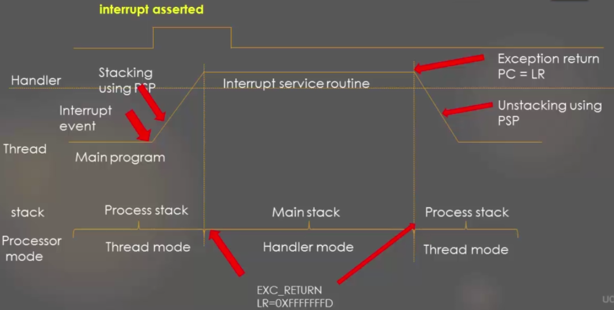

[Home](../../) | [Projects](../../projects) | [Notes](../) > <a href="./">ARM Cortex-M3/M4 Processor</a> > Exception Entry/Exit Sequence

# Exception Entry/Exit Sequence

## Exception Entry Sequence

1. Pending bit set
2. Stacking and vector fetch
   - Stacking - pushing the necessary registers onto stack
   - Vector fetch - fetching the address of the exception handler from the vector table
3. Entry into the handler, and Interrupt Active Bit set
4. Pending status clear (processor does it automatically)
5. Processor mode changes to hander mode
6. Handler execution
7. MSP will be used for any stack operations inside the handler

## Exception Exit Sequence

* In ARM Cortex M3/M4 processors the exception return mechanism is triggered using a special return address called **EXC_RETURN**. EXC_RETURN is generated during exception entry and is stored in the LR. When EXC_RETURN is written to PC it triggers the exception return.

* When is EXC_RETURN genereted?

  During an exception handler entry, the value of the return address (PC) is not stored in the LR as it is done during calling of a regular C function. Instead, the exception mechanism stores the special value called EXC_RETURN in LR.

* Important information in EXC_RETURN:

  * Bit 3 - Return mode
    * 1 = return to thread mode
    * 0 = return to handler mode
  * Bit 2 - Return stack
    * 1 = return with PSP (CONTROL register bit[1] =1)
    * 0 = return with MSP (CONTROL register bit[1] = 0)

  Processor decodes the EXC_RETURN value upon return and decides with which stack pointer it has to do unstacking and to which mode it needs to return.

* Most widely used EXC_RETURN values

  | EXC_RETURN       | Description                                                  |
  | ---------------- | ------------------------------------------------------------ |
  | 0xFFFFFFF1       | Return to Handler mode. Exception return gets state from the main stack. Execution uses MSP after return. |
  | 0xFFFFFFF9       | Return to Thread mode. Exception return gets state from the main stack. Execution uses MSP after return. |
  | 0xFFFFFFFD       | Return to Thread mode. Exception return gets state from the process stack. Execution uses PSP after return. |
  | All other values | Reserved                                                     |

## Exception Entry/Exit Sequence

## References

Nayak, K. (2022). *Embedded Systems Programming on ARM Cortex-M3/M4 Processor* [Video file]. Retrieved from  https://www.udemy.com/course/embedded-system-programming-on-arm-cortex-m3m4/
