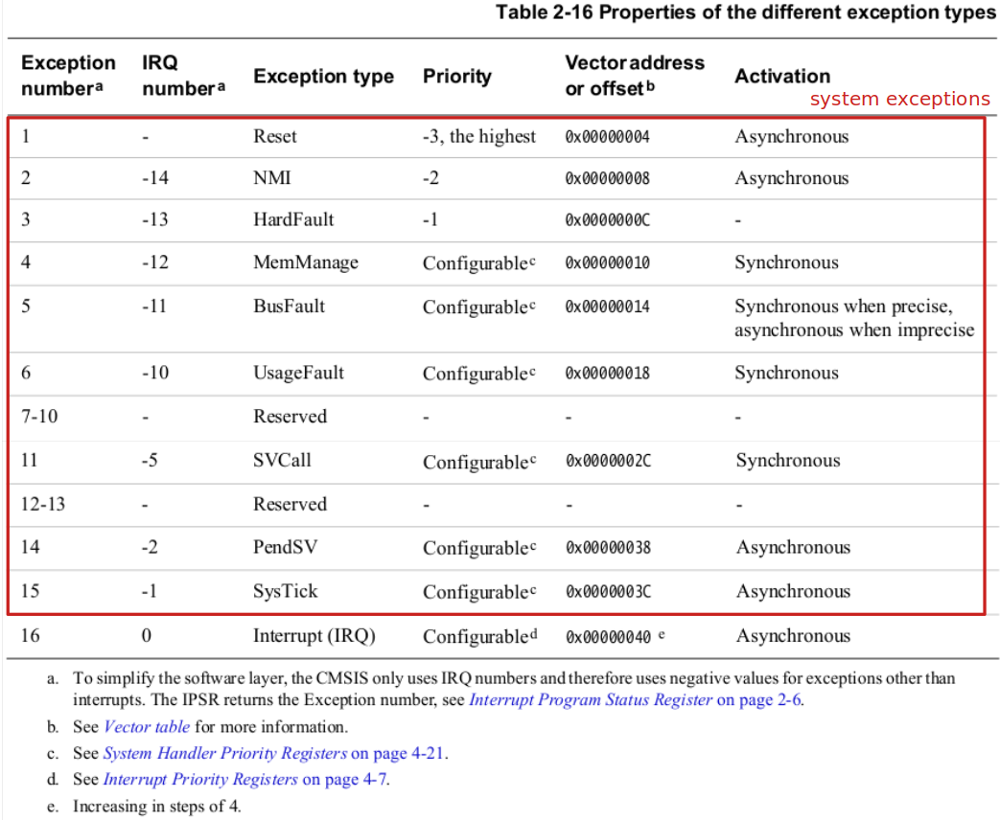
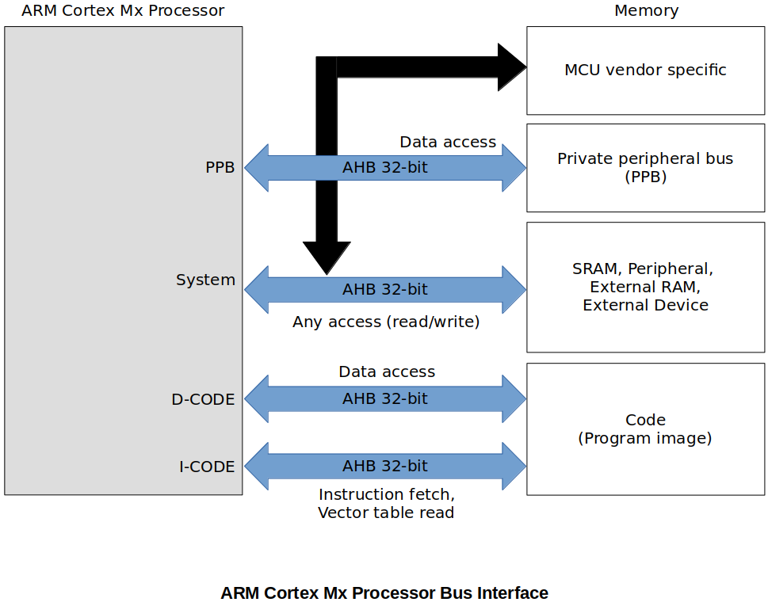

[Home](../../) | [Projects](../../projects) | [Notes](../) > <a href="./">ARM Cortex-M3/M4 Processor</a> > Exception Model (System Exceptions, Interrupts)

# Exception Model (System Exceptions, Interrupts)

This section applies to ARM Cortex M0/M1/M3/M4/M7 processors.


## ARM Cortex Mx Processor Exception Model

* What is exception?

  Anything that disturbs the normal operation of the program by changing the operation mode of the processor

* Two major types of exception:

  1. **System exceptions**  (Generated **by the processor**; total 15)
  2. **Interrupts**  (Generated from **outside the processor**; total 240)

  $\therefore$ ARM Cortex Mx processors support total 255 exceptions.

* Whenever the processor core encounters an exception, it changes the operation mode to "Handler mode".


## System Exceptions





* There is a room for 15 system exceptions and only 9 system exceptions are implemented. (6 are reserved for future implementation). Some of them are:

  * **Exception no. 1 is the "Reset".**

  * **Exception no. 6 is the "UsageFault".** 

    This exception will be triggered by the processor when there's any attempt to execute an undefined instruction.

  * **Exception no. 11 is the "SVCall".** 

    A *supervisor call* (SVC) is an exception that is triggered by the `SVC` instruction. In an OS environment, applications can use `SVC` instructions to access the restricted resources such as OS kernel functions, peripherals, memory or device drivers.

    All `SVC` instructions will be executed with a service number. The service number will be recognized by the kernel, and the kernel will provide the corresponding service to the application. So, this exception is to implement that system call interface layer.

  * **Exception no. 13 is the "HardFault".** 

    This exception will be triggered by default when an exception occurs whose handler is not enabled. (Higher priority (-1) than any exception with configurable priority.)

  * **Exception no. 14 is the "PendSV".**

    An interrupt-driven request for system-level service. It is used to implement context switching when no other exception is active in the OS like FreeRTOS or Open RTOS.

  * **Exception no. 15 is the "SysTick".**

    Exception generated by the system timer when it reaches zero.

    SysTick timer is one of the processor specific peripherals of the ARM Cortex M processor. It is internal to the processor. A SysTick timer is used to generate exceptions for a fixed time interval. It can be used just like any other timer of the microcontroller.

    In an RTOS or an embedded OS environment, you can use the SysTick feature of the ARM Cortex M processor in order to implement the kernel ticking.


* Exception no. 16 onwards are "Interrupt"s (IRQ1, IRQ2, ...)

* See *Cortex-M4 Devices Generic User Guide* for more information about each exception.

### System Exception Control Registers

* The processor itself contains many processor-specific peripherals such as NVIC, MPU, DWT, FPB, TIM, etc.


* These peripherals come with their own register set to control them. All these register sets which control the functionality of a processor and processor-specific peripherals are part of Private Peripheral Bus Region (PPB), which is accessed by the dedicated bus called "PPB".





* The address map of the Private Peripheral Bus Region (PPB)

  *Cortex-M4 Devices Generic User Guide*

  

  * **System Control Block (SCB)**
    * Provides system implementation information and system control. This includes configuration, control, and reporting of the system exceptions. If you want to configure any system exceptions, this is the first place you need to look at.
    * By using SCB registers you can:
      * Enable fault handlers
      * Get pending status of the fault exceptions
      * Trap processor for divide-by-zero and unaligned data access attempts
      * Control sleep and sleep/wakeup settings
      * Configure the priority of system exceptions
      * Control SysTick timer and status
    * Some Important registers:
      * System Handler Priority Registers - used to configure system exception priorities (Remember, we are not able to configure the priorities for "Interrupts" here. Interrupts will be taken care of by NVIC)
      * System Handler Control and State Register - used to enable various system exceptions
      * Fault Status Registers - used to capture the status of the faults occurred

### Default System Exception Status

| System Exception | Default State                                                |
| ---------------- | ------------------------------------------------------------ |
| NMI              | Always enabled by default, cannot be masked.                 |
| HardFault        | Always enabled by default, can be masked.                    |
| MemManage        | Disabled by default                                          |
| BusFault         | Disabled by default                                          |
| UsageFault       | Disabled by default                                          |
| SVCall           | Triggered only when the `svc` instruction is executed        |
| PendSV           | Disabled by default                                          |
| SysTick          | Disabled by default and triggered whenever SysTick timer is enabled and expires |
| DebugMonitor     | Disabled by default                                          |


## Interrupts

### Nested Vectored Interrupt Controller (NVIC)

* NVIC is one of the peripheral of the Cortex M processor core. It is the hardware engine connected to the Cortex M processor core in order to control the interrupt traffic that comes into the processor. (What "System Control Block (SCB)" is to system exceptions, "NVIC" is to interrupts.)

* NVIC is used to configure the 240 possible interrupts that are generated from outside the processor. Since these interrupts are triggered by various on-chip peripherals of the microcontroller such as SPI, GPIOs, CAN, TIMERs, DMAs and so on, you need to consult the *Reference Manual* of the microcontroller (not the processor) to find more information about them. They are specific to microcontroller manufacturers.

  According to the reference manual, total 82 interrupts (0-81) are defined for STM32F405xx/07xx and STM32F415xx/17xx microcontrollers.

* Through the NVIC registers you can enable/disable/pend various interrupts and read the status of the active and pending interrupts.
* You can configure the **priority** and **priority grouping** of various interrupts.
* It's called "Nested" because it supports preempting a lower priority interrupt handler when higher priority interrupt arrives.
* When analyzing interrupts, it is important to identify which IRQ has been triggered, through which pin of the NVIC the interrupt has been delivered, and what peripheral is connected to that pin.

### NVIC Registers

What "System Control Block (SCB) Registers" are to system exceptions, "NVIC Registerse" are to interrupts.


* Interrupt Set-enable Registers - "enable" interrupts (cannot disable interrupts using these registers)

* Interrupt Clear-enable Registers - "disable" interrupts (cannot enable interrupts using these registers)
* Interrupt Set-pending Registers - force interrupts into the pending state, and show which interrupts are pending
* Interrupt Clear-pending Registers - remove the pending state from interrupts, and show which interrupts are pending
* Interrupt Active Bit Registers - indicate which interrupts are active (i.e., which interrupt handlers are being executed by the processor) 


## Exercise

* This exercise is to enable and pend the USART3 peripheral interrupt. As mentioned earlier, USART3 is a microcontroller vendor specific peripheral. If that peripheral is to trigger any interrupts, it has to be connected to the NVIC of the processor.

  According to the *Reference Manual* of the microcontroller, USART3 peripheral is connected to the IRQ line 39 of the NVIC (i.e., IRQ32).

* **Steps to program an MCU peripheral interrupt:**

  * Identify the IRQ number of the peripheral by referring to the MCU vector table. IRQ numbers are vendor-specific.

  * Program the processor register to enable that IRQ (only when you enable the IRQ, the processor will accept the interrupt over that line). 

    If you are using priority, first set the priority and then enable the IRQ.

  * Configure the peripheral (USART3) using its peripheral configuration register. For example, in the case of USART3, whenever a packet is received, it will automatically issue an interrupt on the IRQ line 39.

  * When the interrupt is issued on the IRQ line, it will first get pended in the pending register of the processor.

  * NVIC will allow the IRQ handler associated with the IRQ number to run ONLY IF the priority of the new interrupt is highter than the currently executing interrupt handler. Otherwise newly arrived interrupt will stay in pending state.

  * Please note that if peripheral issues an interrupt when the IRQ number is disabled (i.e., not activated from the processor side), then still interrupt will get pended in the pending register of the NVIC. As soon as IRQ is enabled, it will trigger the execution of the ISR if the priority is higher than the currently active ISR.


* A program to demonstrate MCU peripheral interrupts

  Consult the *Cortex-M4 Devices Generic User Guide*. 

  Also, it will be helpful to monitor **NVIC_ISPR1**, **NVIC_ISER1** registers in the SFR Window of the CubeIDE.

  ```c
  /* 
   * pending bit is supposed to be set by the processor, but here we are setting it for the 
   * demonstration purpose
   */
   
  #include <stdint.h>
  #include <stdio.h>
  
  #if !defined(__SOFT_FP__) && defined(__ARM_FP)
    #warning "FPU is not initialized, but the project is compiling for an FPU. Please initialize the FPU before use."
  #endif
  
  #define ADDR_NVIC_ISER1 ((uint32_t *)0xE000E104)
  #define ADDR_NVIC_ISPR1 ((uint32_t *)0xE000E204)
  #define USART3_IRQNO 39
  
  int main(void)
  {
  	// 1. Manually set the pending bit for the USART3 IRQ number in NVIC.
  	//    This is to simulate IRQ39 is pending in the pending register.
  	uint32_t *pISPR1 = ADDR_NVIC_ISPR1;
  
  	*pISPR1 |= (1 << (USART3_IRQNO % 32));
  
  	// 2. Enable the USART3 IRQ number in NVIC so that the processor (CPU)
  	//    can invoke the corresponding ISR.
  	uint32_t *pISER1 = ADDR_NVIC_ISER1;
  
  	*pISER1 |= (1 << (USART3_IRQNO % 32));
  		// As soon as IRQ39 is enabled, the pending IRQ39 will get handled
  		// and its pending bit will be cleared automatically by the hardware.
  		// However, IRQ39 enable bit will not be cleared. You need to manage
  		// it according to your needs.
  
  	// Once the ISR returns, the program will be back to the THREAD MODE.
  	
      /* Loop forever */
  	for(;;);
  }
  
  // USART3 ISR (name can be found in the startup file searching by "USART3")
  void USART3_IRQHandler(void)
  {
  	printf("USART3_IRQHandler called\n");
  }
  ```

  


## References

Nayak, K. (2022). *Embedded Systems Programming on ARM Cortex-M3/M4 Processor* [Video file]. Retrieved from  https://www.udemy.com/course/embedded-system-programming-on-arm-cortex-m3m4/
