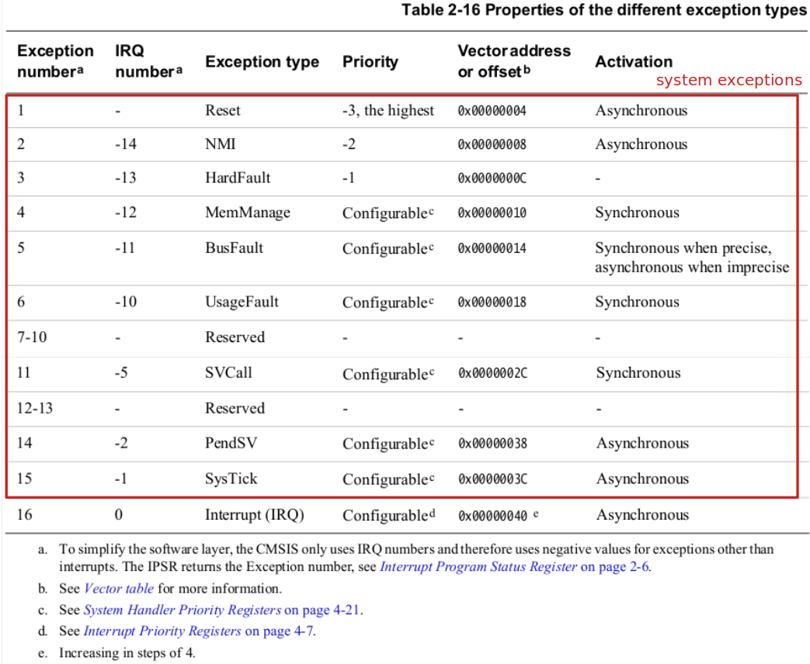
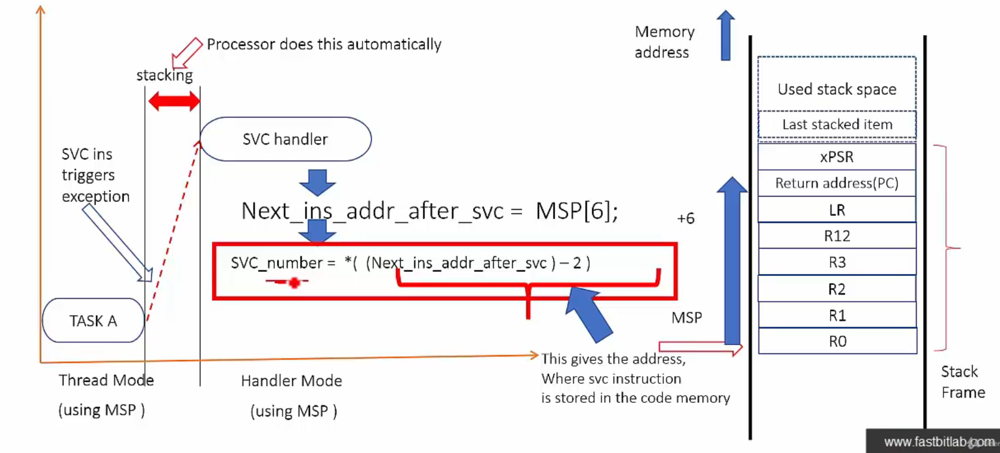
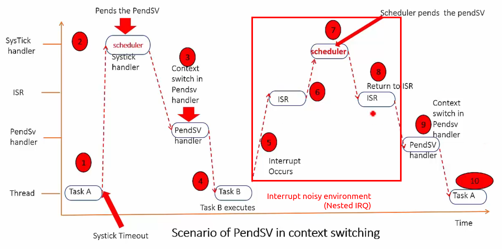
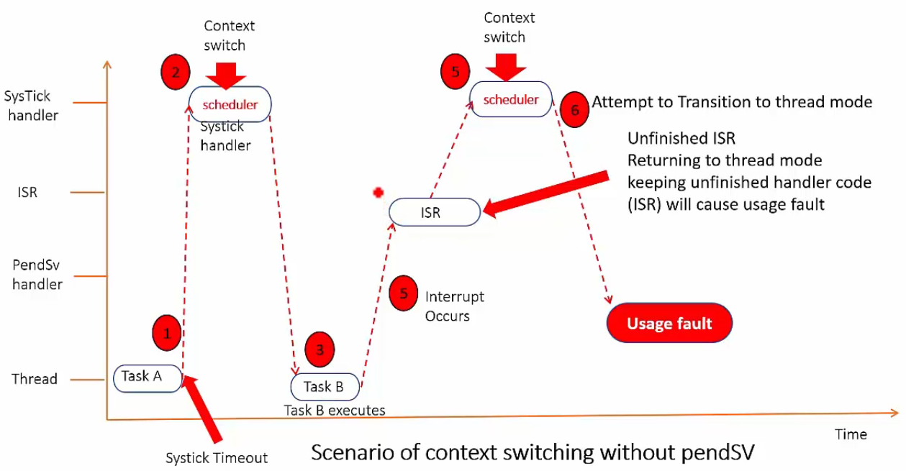
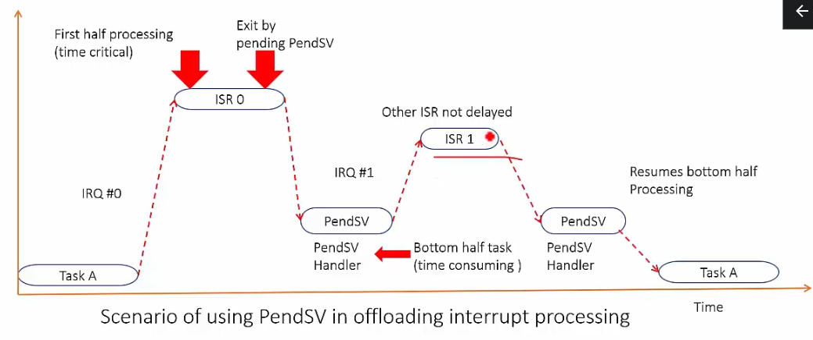

[Home](../../) | [Projects](../../projects) | [Notes](../) > <a href="./">ARM Cortex-M3/M4 Processor</a> > Exceptions for System-Level Services

# Exceptions for System-Level Services


## Introduction

* ARM Cortex Mx processors support 2 important system-level service exceptions.
  * SVC (Supervisor Call)
  * PendSV(Pendable Service)
* Supervisory calls are typically used to request privileged operations or access to system resources from an operating system.
* SVC exception is mainly used in an OS environment. For example, a less privileged user task can trigger SVC exception to get system-level services (e.g., accessing device drivers, peripherals) from the kernel of the Os.
* PendSV is mainly used in an OS environment to carry out context switching between two or more tasks when no other exceptions are active in the system.
* Summary of ARM Cortex Mx system exceptions:





## Supervisor Call (SVC) Instruction

* `svc` is a thumb ISA instruction which causes SVC exception.
* In an RTOS scenario, user tasks can execute SVC instruction with an associated argument to make supervisory calls to seek privileged resources from the kernel code.
* Unprivileged user tasks use the `svc` instruction to change the processor mode to privileged mode to access privileged resources such as peripherals, etc.
* `svc` instruction is always used along with a number (i.e., SVC number or argument), which an be used to identify the request type by the kernel code.
* The SVC handler executes right after the `svc` instruction (i.e., no delay unless a higher priority exception arrives at the same time).

* Example:

  ```c
  // user-level code
  // access level: unprivileged
  // processor mode: thread
  ...
  __asm volatile("svc #0x01");	// SVC call
  ...
  ```

  ```c
  // kernel-level code
  // access level: privileged
  // processor mode: handler
  ...
  __SVC_Request_Handler(int svc_number)
  {
  case 1:
  	__write();	
      // __write() will be invoked to perform the write operation to an MPU protected register
      // which will allow privileged access only (user task cannot directly access such 
      // resources)
  case 2:
  	__read();
  case 3:
      __timer_start();
      ...
  }
  ```

  > A user task attempting to directly access an MPU protected memory address (resource) will cause MemManage fault exception and the kernel will kill that user task.

* Two methods to trigger SVC exception:

  1. Direct execution of SVC instruction with an immediate value.  

     e.g., `svc #0x04` in assembly (using `svc` instruction is very efficient in terms of latency because it will execute as soon as it is called.)

  2. Setting the exception pending bit in **System Handler Control and State Register** of the processor. (Uncommon method)

### How to Extract the SVC Number

* The `svc` instruction has a number embedded within it, often referred to as the SVC number.
* In the SVC handler, you should fetch the opcode of the `svc` instruction and then extract the SVC number.
* To fetch the opcode of `svc` instruction from program memory, we need the value of PC (return address) where the user code had interrupted while triggering the SVC exception.
* The value of the PC (return address) where the user code had interrupted is stored in the stack as a part of exception entry sequence by the processor.

* The key is to get the MSP value from the SVC handler, MSP+6 to get PC, and then from that return address get the SVC number.





## PendSV Exception

* It is an exception type 14 and has a programmable priority level.

* This exception is triggered by setting its pending status by writing to the **Interrupt control and State Register** of processor. (There is no instruction to trigger PendSV exception.)

* Triggering a pendSV system exception is a way of invoking the preemptive kernel to carry out the context switch in an OS environment. 

* In an OS environment, PendSV handler is set to the lowest priority level, and the PendSV handler carries out the **context switch** operation.

* Typically, this exception is triggered inside a higher priority exception handler, and it gets executed when the higher priority handler finishes.

* Using this characteristic, we can schedule the PendSV exception handler to be executed after all the other interrupt processing tasks are done. (Generally, PendSV's priority is configured to lowest possible value.)

* This way, using PendSV in context switching will be more efficient in an interrupt noisy environment.

* In an interrupt noisy environment, we need to delay the context switching until all active IRQs are executed.

* Scheduler is nothing but a SysTick handler that is called every time the SysTick timer expires. What the scheduler (which is generally part of the kernel of an OS) does is that it will simply set the pending status of PendSV every time slot. It is NOT the scheduler that actually performs the context switching. When there is no IRQ active, the PendSV will be called and it will carry out the context switching.

  Context switching means storing on the stack the context of the currently executing task and restoring the context of the next task to be executed from the stack.

* What would happen when the scheduler is called (i.e., SysTick timer expired) while a user task was being interrupted handled (ISR)?

  No matter what, scheduler will do its job (i.e., pends the PendSV), preempting the currently running ISR. When the scheduler returns, ISR will pick up and continue to do what it was doing. PendSV will wait till there is no more active IRQs. So, only after the ISR is finished, the PendSV will start doing its job (i.e., context switching).
  
  This model helps context switch to take place after all the previously triggered ISRs are executed.





* If we didn't have PendSV and scheduler performed the context switching:

  (ARM Coretex M4 processor does not allow to transition back to Thread mode with any unfinished ISR.)





### Other Use Cases of PendSV

* **Offloading interrupt processing** 

  If a higher priority handler is doing time-consuming work, then the other lower priority interrupts will suffer, and systems responsiveness may reduce. This can be solved using a combination of ISR and PendSV handler.

  Interrupts may be serviced in two havles:

  1. The first half is the time critical part that needs to be executed as a part of ISR.
  2. The second half (also called as **bottom half**), is basically "delayed execution" where rest of the time-consuming work will be done. 

  So, PendSV can be used in these cases, to handle the second half execution by triggering it in the first half.

  In the following diagram, not time critical portion of the ISR0 is stretched out using PendSV.





## SVC Exercises

### Exercise 1

* Write a program to execute an SVC instruction from thread mode, implement the SVC handler to print the SVC number used. Also, increment the SVC number by 4 and return it to the thread mode code and print it.

  Instructions:

  1. Write a main() function where you should execute the SVC instruction with an argument. e.g.,  `svc #0x05`
  2. Implement the SVC handler
  3. In the SVC handler extract the SVC number and print it using `printf()`.
  4. Increment the SVC number by 4 and return it to the thread mode.

* Program

  ```c
  #include <stdint.h>
  #include <stdio.h>
  
  #if !defined(__SOFT_FP__) && defined(__ARM_FP)
    #warning "FPU is not initialized, but the project is compiling for an FPU. Please initialize the FPU before use."
  #endif
  
  int main(void)
  {
  	// SVC call
  	__asm("svc #8");
  
      // Not recommended!
  	//register uint32_t data __asm("r0");	// Instead of storing data on stack use register
  											// inside the processor 
      
      // Recommended!
      // This is how you get the value from the handler.
      // The way return value of the SVC handler was passed to the thread mode code was via using 
      // stack!
      uint32_t data;
      __asm volatile("mov %0, r0": "=r"(data)::);
  	printf(" data = %ld\n", data);		// data = 0x8 + 0x4 = 0x0C
  
      /* Loop forever */
  	for(;;);
  }
  
  // This naked function is to help secure MSP (stack pointer) immediately after the svc call.
  __attribute__((naked)) void SVC_Handler(void)
  {
  	// 1. get the value of the MSP
  	__asm("mrs r0, msp");
  	__asm("b SVC_Handler_c");
  }
  
  void SVC_Handler_c(uint32_t * pBaseStackFrame)
  {
  	// __asm("mrs r0, msp"); // writing this code inside the regular C function will not get us
  						     // the correct value of the MSP we want because of the prologue
  							 // asm code the compiler generates
  
  	printf("SVC Handler Called!\n");
  	uint8_t *pReturnAddr = (uint8_t *)pBaseStackFrame[6];
  
  	// 2. decrement the return address by 2 to point to opcode of the SVC instruction
  	//    in the program memory
  	pReturnAddr -= 2;
  
      // 3. extract the SVC number (LSB of the opcode)
  	uint8_t svc_number = *pReturnAddr;
  	printf("svc_number = %d\n", svc_number);
  
  	// 4. Increment the SVC number by 4 and return it to the thread mode.
  	svc_number += 4;
  
  	pBaseStackFrame[0] = svc_number; // since according to AAPCS, return value is store in r0
  									 // we'll just use r0 to store the value we want to pass
  									 // to the caller
  }
  ```

  > L14: This method is not recommended since you cannot guarantee that the register you want to use will be used for some other reason during the process. Safer way is to use GCC inline assembly syntax of mixing processor register and C variable using input/output arguments discussed earlier.

  ```plain
  /* variable window */
  pBaseStackFrame	uint32_t *	0x2001ffd8	
  pReturnAddr		uint8_t *	0x80001ee <main+6> "þçïó\b\200"
  ```

  ```assembly
  /* disassembly window */
  					main:
  080001e8: 80 b4         push    {r7}
  080001ea: 00 af         add     r7, sp, #0
  080001ec: 08 df         svc     8
  32                    	for(;;);
  080001ee: fe e7         b.n     0x80001ee <main+6>
  38                    	__asm("mrs r0, msp"); // writing this code inside the regular C function will not get us
                        SVC_Handler:
  080001f0: ef f3 08 80   mrs     r0, MSP
  40                    	__asm("b SVC_Handler_c");
  080001f4: 00 f0 02 b8   b.w     0x80001fc <SVC_Handler_c>
  42                    }
  080001f8: 00 bf         nop     
  080001fa: 00 00         movs    r0, r0
  45                    {
  ```

  > Notice that the return address we obtained is `0x80001ee` and this subtracted by 2 is `0x080001ec` which is the address of the instruction `svc 8`. 

### Exercise 2

* Write a program to add subtract, multiply, and divide 2 operands using SVC handler and return the result to the thread mode code and print the result. Thread mode code should pass 2 operands via stack frame. Use the following SVC number to decide the operation.

  36 - Addition

  37 - Subtraction

  38 - Multiplication

  39 - Division

* Program

  ```c
  #include <stdint.h>
  #include <stdio.h>
  
  #if !defined(__SOFT_FP__) && defined(__ARM_FP)
    #warning "FPU is not initialized, but the project is compiling for an FPU. Please initialize the FPU before use."
  #endif
  
  void SVC_Handler_c(uint32_t *pBaseStackFrame);
  
  int32_t add(int32_t x, int32_t y)
  {
  	int32_t res;
  	__asm volatile("SVC #36");
      __asm volatile("mov %0, r0": "=r"(res)::);
      return res;
  }
  
  int32_t sub(int32_t x, int32_t y)
  {
  	int32_t res;
  	__asm volatile("SVC #37");
      __asm volatile("mov %0, r0": "=r"(res)::); // store handler return value to res
      return res;
  }
  
  int32_t mul(int32_t x, int32_t y)
  {
  	int32_t res;
  	__asm volatile("SVC #38");
      __asm volatile("mov %0, r0": "=r"(res)::);
      return res;
  }
  
  int32_t div(int32_t x, int32_t y)
  {
  	int32_t res;
  	__asm volatile("SVC #39");
      __asm volatile("mov %0, r0": "=r"(res)::);
      return res;
  }
  
  int main(void)
  {
  	int32_t res;
  
  	res = add(40, -90);
  	printf("Add result = %ld\n", res);
  
  	res = sub(40, -90);
  	printf("Sub result = %ld\n", res);
  
  	res = mul(40, -90);
  	printf("Mul result = %ld\n", res);
  
  	res = div(40, -90);
  	printf("Div result = %ld\n", res);
  
      /* Loop forever */
  	for(;;);
  }
  
  __attribute__((naked)) void SVC_Handler(void)
  {
  	__asm("mrs r0, msp");
  	__asm("b SVC_Handler_c");
  }
  
  void SVC_Handler_c(uint32_t *pBaseStackFrame)
  {
  	printf("SVC Handler\n");
  
  	int32_t arg0, arg1, res;
  
  	// typecast to (uint8_t *) is so that we can decrement pReturnAddr by 2
  	uint8_t *pReturnAddr = (uint8_t *)pBaseStackFrame[6];
  
  	// 2. Decrement the return address by 2 to point to opcode of the SVC instruction
  	//    in the program memory
  	pReturnAddr -= 2;
  
  	// 3. Extract the SVC number (LSByte of the opcode)
  	uint8_t svc_number = *pReturnAddr;
  
  	arg0 = pBaseStackFrame[0];
  	arg1 = pBaseStackFrame[1];
  
  	switch(svc_number)
  	{
  	case 36:
  		res = arg0 + arg1;
  		break;
  	case 37:
  		res = arg0 - arg1;
  		break;
  	case 38:
  		res = arg0 * arg1;
  		break;
  	case 39:
  		res = arg0 / arg1;
  		break;
  	default:
  		printf("Invalid SVC number\n");
  	}
  
  	pBaseStackFrame[0] = res;
  }
  ```

* Following is the program written by myself. Analyze why this is not working!

  After L64, the code jumps to the default handler(?) which is basically an infinite loop. The description says this handler is called when the processor has received an unexpected interrupt.

  ```c
  #include <stdint.h>
  #include <stdio.h>
  
  #if !defined(__SOFT_FP__) && defined(__ARM_FP)
    #warning "FPU is not initialized, but the project is compiling for an FPU. Please initialize the FPU before use."
  #endif
  
  int main(void)
  {
      uint32_t data;
  
  	// SVC 36: addition
  	// SVC 37: subtraction
  	// SVC 38: multiplication
  	// SVC 39: division
  
  	__asm volatile("mov r0, #5"); // 1st operand
  	__asm volatile("mov r1, #3"); // 2nd operand
  	__asm("svc 36");
      __asm volatile("mov %0, r0": "=r"(data)::);
  	printf("5 + 3 = %ld\n", data);
  
  	__asm volatile("mov r0, #5"); // 1st operand
  	__asm volatile("mov r1, #3"); // 2nd operand
  	__asm("svc 37");
      __asm volatile("mov %0, r0": "=r"(data)::);
  	printf("5 - 3 = %ld\n", data);
  
  	__asm volatile("mov r0, #5"); // 1st operand
  	__asm volatile("mov r1, #3"); // 2nd operand
  	__asm("svc 38");
      __asm volatile("mov %0, r0": "=r"(data)::);
  	printf("5 * 3 = %ld\n", data);
  
  	__asm volatile("mov r0, #5"); // 1st operand
  	__asm volatile("mov r1, #3"); // 2nd operand
  	__asm("svc 39");
      __asm volatile("mov %0, r0": "=r"(data)::);
  	printf("5 / 3 = %ld\n", data);
  
      /* Loop forever */
  	for(;;);
  }
  
  // r0 and r1 contents will be passed to n1 and n2, respectively
  __attribute__((naked)) void SVC_Handler(uint32_t n1, uint32_t n2)
  {
  	// following commented out code will cause assembler errors. naked function does not
  	// work with regular C variables or expressions
  	/*
  	__asm volatile("mov r1, , %0": : "r"(n1)); // store n1 into r1
  	__asm volatile("mov r2, , %0": : "r"(n2)); // store n2 into r2
  	*/
  	__asm volatile("mrs r3, msp"); // secure msp (stack frame base address)
  	__asm("b SVC_Handler_c");
  }
  
  void SVC_Handler_c(uint32_t n1, uint32_t n2, uint32_t * pBaseStackFrame)
  {
  	uint8_t *pReturnAddr = (uint8_t *)pBaseStackFrame[6]; // pReturnAddr-2 points to svc instruction
  	pReturnAddr -= 2;
  
  	// extract SVC number
  	uint8_t svc_number = *pReturnAddr;
  
  	switch(svc_number)
  	{
  	case 36:
  		pBaseStackFrame[0] = n1 + n2;
  		break;
  	case 37:
  		pBaseStackFrame[0] = n1 - n2;
  		break;
  	case 38:
  		pBaseStackFrame[0] = n1 * n2;
  		break;
  	case 39:
  		pBaseStackFrame[0] = n1 / n2;
  		break;
  	default:
  		printf("Invalid SVC number!\n");
  		break;
  	}
  
  	// at this point pBaseStackFrame[0], which is basically r0, will contain
  	// the calculation result to be passed to the caller (i.e., Thread mode code)
  }
  ```

  


## References

Nayak, K. (2022). *Embedded Systems Programming on ARM Cortex-M3/M4 Processor* [Video file]. Retrieved from  https://www.udemy.com/course/embedded-system-programming-on-arm-cortex-m3m4/
