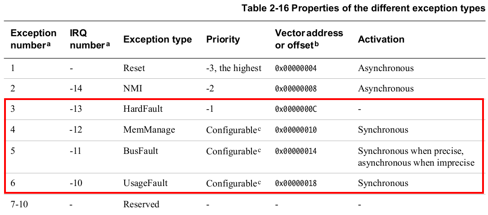
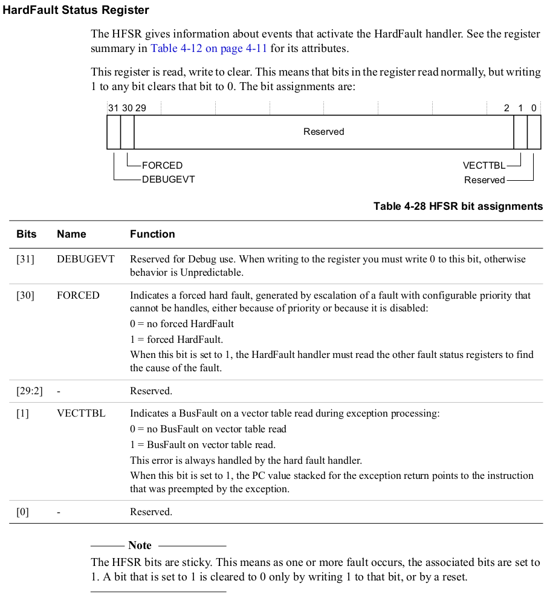
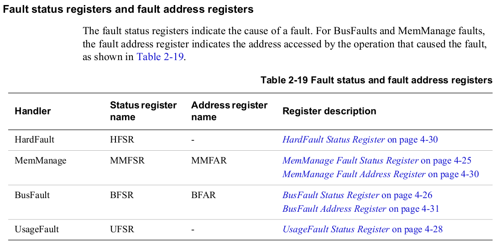

[Home](../../) | [Projects](../../projects) | [Notes](../) > <a href="./">ARM Cortex-M3/M4 Processor</a> > Fault Handling

# Fault Handling

## Fault

* A fault is an exception generated by the processor to indicate an error. Faults are nothing but **system exceptions**.

* Faults happen because of programmers handling processor by violating the design rules or may be due to interfaces with which the processor deals

* Whenever a fault happens, internal processor registers will be updated to record the type of fault, the address of instruction at which the fault happened, and if an associated exception is enabled, the exception handler will be called by the processor

* In the exception handler programmers may implement the code to report, resolve, or recover them from the fault.

  e.g., if your code tries to divide a number by zero, then divide by 0 fault will be raised from the hardware, which will invoke UsageFault exception handler (if enabled). In the exception handler, you may make certain decisions to get rid of the problem, like closing the task, etc.

* Most of the time, fault happens by programmer's code not adhering to the processor programming guidelines.

* The followings are the system exceptions that are responsible for reporting faults.

  * HardFault exception - enabled by default, non-configurable priority (-1)
  * UsageFault exception - disabled by default, configurable priority (0 by default)
  * MemManage fault exception - disabled by default, configurable priority (0 by default)
  * BusFault exception - disabled by default, configurable priority (0 by default)

* **Causes of Faults:**
* Divide by zero (if enabled)
  
* Execution of an undefined instruction
  
* Attempt to execute code from memory region which is marked as eXecute Never (XN) to prevent code injection
  
* MPU guarded memory region access violation by the code
  
* Unaligned data access (if enabled)
  
* Returning to thread mode keeping active interrupt alive (When an interrupt is active, it must be finished before the code can come back to the thread mode code.)
  
* Bus error (e.g., no response from memory device (e.g., SDRAM) due to the device not being configured correctly, etc.)
  
* Executing SVC instruction inside SVC handler or calling a function in SVC handler which eventually execute hidden SVC instruction
  
* Debug monitor settings and related exceptions

## HardFault Exception

* A HardFault is an exception that occurs because of an error during exception processing, or because an exception cannot be managed by any other exception mechanism. It has 3^rd^ highest fixed priority (-1) after Reset and NMI meaning it has higher priority than any exception with configurable priority.
* Causes:
  * Escalation of a fault with configurable priority (MemManage, BusFault, UsageFault) that cannot be handled
  * Bus error returned during a vector fetch from the vector table
  * Execution of break point instruction when both halt mode and debug mode is disabled
  * Executing SVC instruction inside SVC handler

* HardFault Status Register (*Generic User Guide*)

## MemManage Exception

* MemManage is a configurable fault exception. (Disabled by default). 
* MemManage can be enabled by configuring the processor register **System Handler Control and State Register (SHCSR)** - bit[16]. This register is part of System Control Block (SCB).
* When MemManage fault happens MemManage fault exception handler will be executed by the processor.
* Priority of this fault exception is configurable.

* Causes:
  * As its name indicates this fault exception is triggered when memory access violation is detected during read/write operations (access permission by the processor or MPU)
  * Unprivileged thread mode code (such as user application or RTOS task) tries to access a memory region which is marked as "privileged access only" by the MPU
  * Writing to memory region which are marked as read-only by the MPU
  * This fault can also be triggered when trying to execute program code from "peripheral" memory regions. Peripheral memory regions are marked as eXecute Never (XN) regions by the processor design to avoid code injection attacks through peripherals.

## BusFault Exception

* BusFault is a configurable fault exception. (Disabled by default). 

* BusFault can be enabled by configuring the processor register **System Handler Control and State Register (SHCSR)** - bit[17].

* When BusFault happens, the processor executes BusFault exception handler

* The priority of this fault exception is configurable

* Causes:

  * Due to error response returned by the processor bus interfaces during access to memory devices

    * During instruction fetch
    * During data read/write to memory devices

  * If bus error happens during vector fetch, it will be escalated to a HardFault even if BusFault is enabled

  * Memory device sends error response when the processor bus interface tries to access invalid or restricted memory locations which could generate a BusFault

  * When the device is not ready to accept memory transfer

  * You may encounter such issues when you play with external memories such as SDRAM connected via DRAM controllers

  * Unprivileged access to the private peripheral bus (registers)

    e.g., A Thread mode code running with Unprivileged access level trying to configure an NVIC register $\to$ BusFault will be triggered.

## UsageFault Exception

* UsageFault is a configurable fault exception. (Disabled by default). 
* UsageFault can be enabled by configuring the processor register **System Handler Control and State Register (SHCSR)** - bit[18].
* When UsageFault happens, the processor executes UsageFault exception handler
* The priority of this fault exception is configurable
* Causes:
  * Execution of undefined instruction (e.g., Cortex M4 supports only Thumb ISA, so executing any instruction outside this ISA (e.g.,  ARM ISA) would result in a fault)
  * Executing floating-point instruction keeping floating-point unit disabled
  * Trying to switch to ARM state to execute ARM ISA instructions. The T bit of the processor decides ARM state or Thumb state. For Cortex M it should be maintained to 1. Making T bit 0 (may happen during function call using function pointers whose 0^th^ bit is not maintained as 1) would result in a fault
  * Trying to return to thread mode when an exception/interrupt is still active
  * Unaligned memory access with multiple load or multiple store instructions
  * Attempt to divide by zero (if enabled, divide by zero results in zero by default)
  * For all unaligned data access from memory (only if enabled, otherwise Cortex M supports unaligned data access)

## Fault Status and Address Information

* When a fault happens, inside the fault handler, you can check a couple of fault status and address information registers to get more details about the fault and the instruction address at which the fault happened. This will be helpful during debugging.

## Error Reporting when Fault Happens

* Implement the handler which takes some remedial actions

* Implement a user callback to report errors

* Reset the microcontroller/processor

* For an OS environment, the task that triggered the fault can be terminated and restarted

* Report the fault status register and fault address register values

* Report additional information of stack frame through debug interface such as `printf()`

  See [Stack Frame Analysis Using `__attribute__((naked))` Function](./stack-frame-analysis-using-naked-function) for more information.

## Exercise

* Write a program to enable all configurable fault exceptions, implement the fault exception handlers and cause the fault by the following method:
  1. Execute an undefined instruction
  2. Divide by zero
  3. Try executing instruction from peripheral region
  4. Executing SVC inside the SVC handler
  5. Executing SVC instruction inside the interrupt handler whose priority is same or lesser than SVC handler

## References

Nayak, K. (2022). *Embedded Systems Programming on ARM Cortex-M3/M4 Processor* [Video file]. Retrieved from  https://www.udemy.com/course/embedded-system-programming-on-arm-cortex-m3m4/
