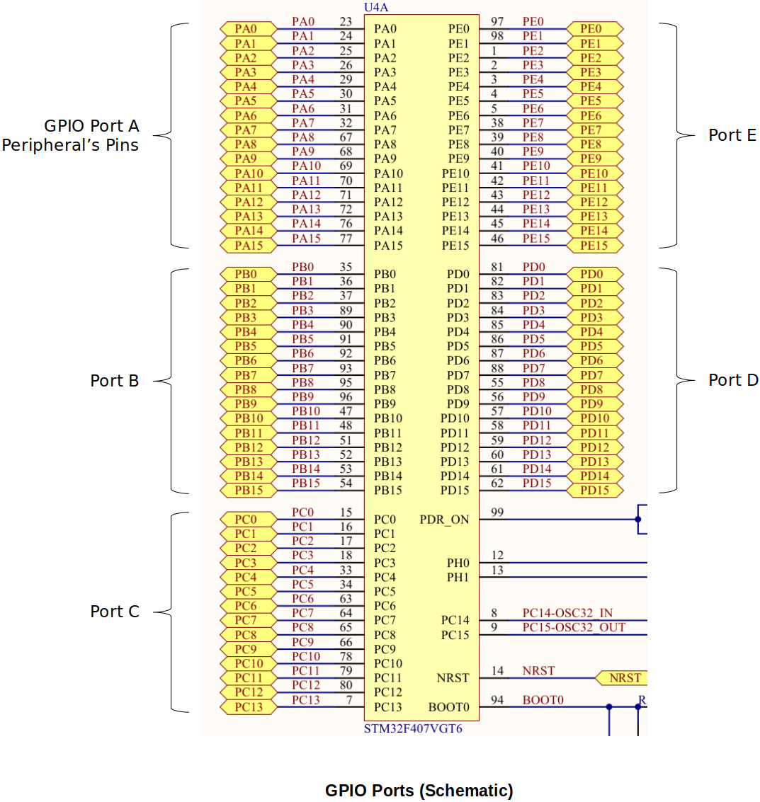
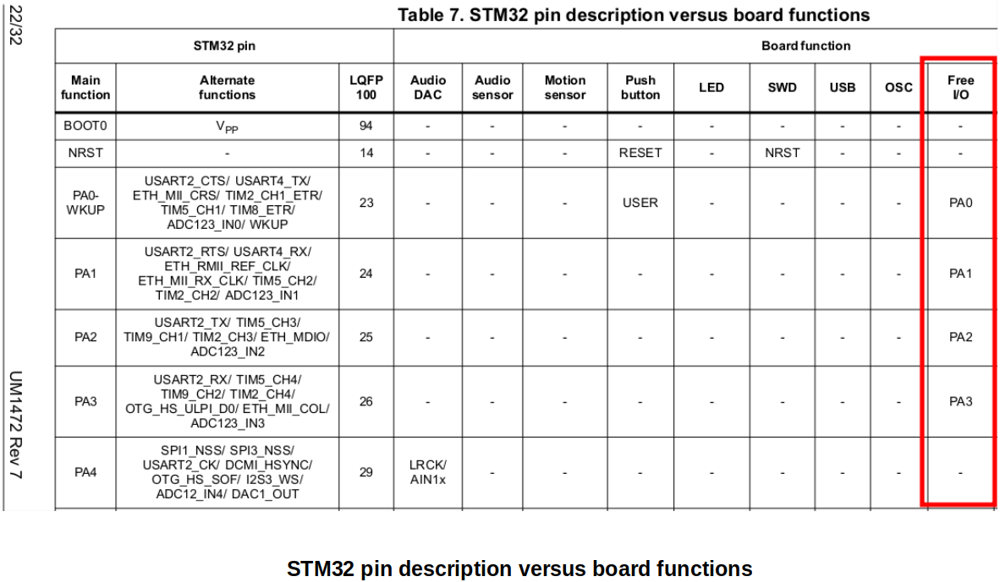
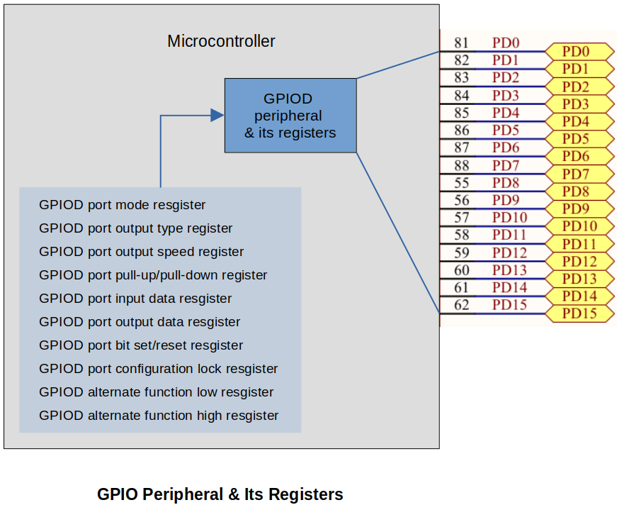

[Home](../../) | [Projects](../../projects) | [Notes](../) > <a href="./">ARM Cortex-M3/M4 Processor</a> > General Purpose Input/Output (GPIO)

# General Purpose Input/Output (GPIO)

## GPIO

* Stands for **General Purpose Input/Output**
* In STM32Fx based MCUs, each port has 16 pins where you can connect external peripherals (LED, display, button, bluetooth transceiver, external memory (e.g., EEPROM), joy stick, keypad, etc.)

* Before choosing a pin (e.g., PA0) to use for your own purpose, consult the board user manual and make sure that it is available on your board. (Is it free? or used for some other functionality of the board circuit.)

## GPIO Peripheral Registers

* All peripheral registers in STM32 microcontroller are of 32-bit wide.

* Different peripherals have different number of peripheral registers. 

  You should never make an assumption about the address of the peripheral registers. Always consult the dvice reference manual.

* Example: GPIOD (Peripheral) Registers:

  1. GPIOD port mode resgister
  2. GPIOD port output type register
  3. GPIOD port output speed register
  4. GPIOD port pull-up/pull-down register
  5. GPIOD port input data resgister
  6. GPIOD port output data resgister
  7. GPIOD port bit set/reset resgister
  8. GPIOD port configuration lock resgister
  9. GPIOD alternate function low resgister
  10. GPIOD alternate function high resgister

  The reference manual defines these in more generic terms, e.g., "GPIO registers" instead of "GPIO**D** registers", "GPIO port mode register (GPIOx_MODER) (x = A..I/J/K)" instead of "GPIO**D** port mode register".

## Procedure to Turn On an LED

In the process of turning on an LED, you will need to consult the **schematic**, **user manual (UMx)**, **reference manual (RMx)** of the board, be able to read the memory map, register layouts, do the address calculation, and directly access the registers to set/unset the bits within them.

Let's say we want to you want to control the LED4. Your goal is to control the I/O pin PD12's state either HIGH or LOW through software to make LED turn ON or OFF. (PD12 refers to 12^th^ pin of the GPIO PORT D peripheral.)

1. **Identify the GPIO port (a peripheral) used to connect the LED**
   - e.g., GPIOD (to turn on LED4 - PD12; Port D Pin 12)
   - GIPO peripheral has a set of registers which are used to control pin's mode, state and other functionalities. You can access the registers of this peripheral using memory addresses. Each register has its own address (peripheral registers are "memory-mapped").
   
     Peripherals (e.g., GPIOA, I2C, Timers, ADC, etc.) are controlled by their own set of registers, and a register is addressed by its unique address (i.e., processor addressable address).
   - Consult the schematic of the board
   
2. **Identify the GPIO pin where the LED is connected**
   - e.g., 12
   - Consult the schematic of the board
   
3. **Activate the GPIO peripheral (i.e., enable the clock)**
   
   - Until you enable the clock for a peripheral, the peripheral is dead and it neither functions nor takes any configuration values set by you.
   
     A peripheral clock can be enabled through the appropriate **Reset Clock Control (RCC)** registers which control the internal clocks to each peripheral on MCU.
   
     e.g., RCC AHB1 peripheral clock register (RCC_AHB1ENR) - This register controls clocks of all the peripherals connected to AHB1 bus.
   
   - Once you activate the clock for a peripheral, the peripheral is ready to take your configuration and control-related commands or arguments (configuration values).
   
   - For some microcontrollers the peripheral may be ON by default, and you need not do any activation. (You should consult the data sheet or reference manual for the device.)
   
   - Consult the memory map in the MCU reference manual
   
4. **Configure the GPIO pin mode as output**
   - Since you are driving an LED (to ON/OFF), the operation mode of the GPIO pin has to be configured as output.
   - e.g., GPIO port mode register (GPIOx_MODER) (x = A..I/J/K) - 2 bits assigned for each pin to provide 4 modes
   
5. **Write to the GPIO pin**
   - 1 (HIGH) to make the GPIO pin state HIGH (3.3V)
   - 0 (LOW) to make the GPIO pin state LOW (0V)
   - e.g., GPIO port output data register (GPIOx_ODR) (x = A..I/J/K) - Controls the output data for each pin of the port

## References

Nayak, K. (2022). *Embedded Systems Programming on ARM Cortex-M3/M4 Processor* [Video file]. Retrieved from  https://www.udemy.com/course/embedded-system-programming-on-arm-cortex-m3m4/
