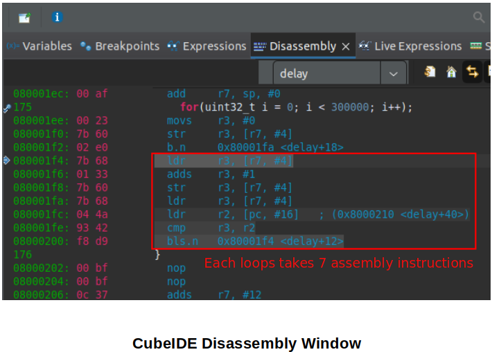

[Home](../../) | [Projects](../../projects) | [Notes](../) > <a href="./">ARM Cortex-M3/M4 Processor</a> > Implementing `delay()`

# Implementing `delay()`


## Implementing `delay()` without Using Library

* To implement the `delay()` function yourself without using the library, follow the following steps:

  1. Write a simple `for` loop and see how many assembly instructions each loop takes. In the following example, it is observed that the 7 instructions in the red box are repeated each loop.

     ```c
     void delay(void)
     {
     	for(uint32_t i = 0; i < 300000; i++);	// at this point the upper limit can be
         										// chosen any value
     }
     ```

     

     

     

  2. Check the frequency of the processor.

     e.g., STM32F407 Discovery board running with 16Mhz of internal RC oscillator

  3. Assume 1 instruction takes 1 clock cycle. 

     1 instruction $\approx$ 0.0625 micro seconds.

     Then, 7 instructions $\approx$ 0.5 micro seconds.

     0.5 micro seconds $\to$ 1 iteration of the `for` loop.

     1000 micro seconds (1 ms) $\to$ 2000 iterations.

     150 ms $\to$ 150 x 2000 = 300000 iterations.

  $\therefore$ 300000 iterations of the simple `for` loop introduces about 150 ms of delay.

*  This can be used to introduce the debouncing time when implementing the button press detection logic.


## References

Nayak, K. (2022). *Embedded Systems Programming on ARM Cortex-M3/M4 Processor* [Video file]. Retrieved from  https://www.udemy.com/course/embedded-system-programming-on-arm-cortex-m3m4/
