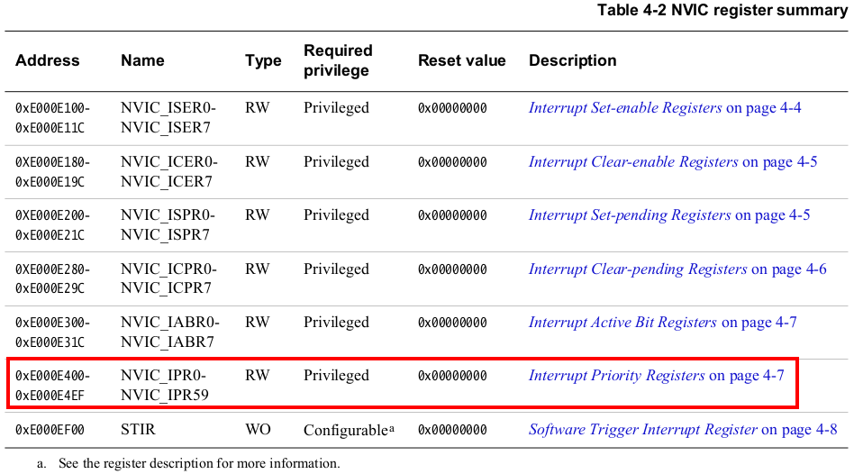
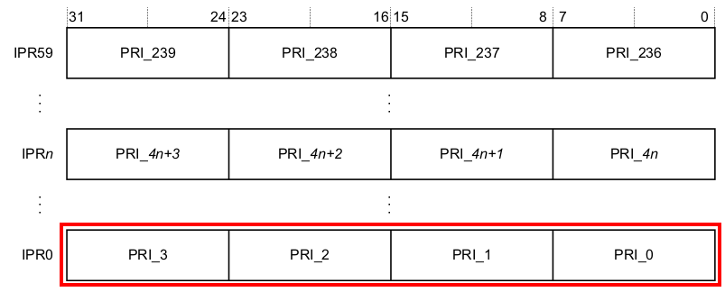
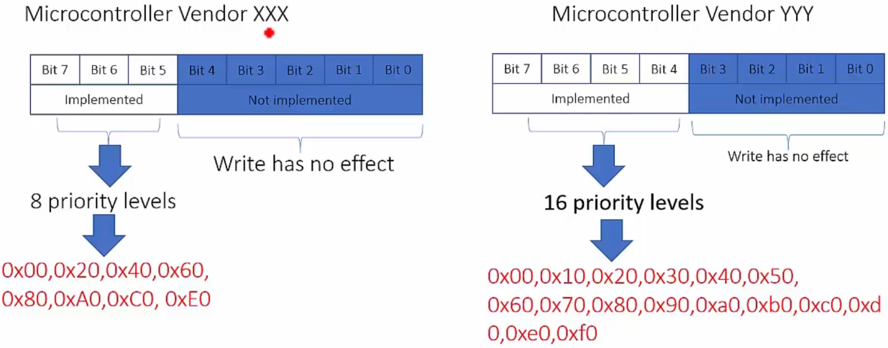
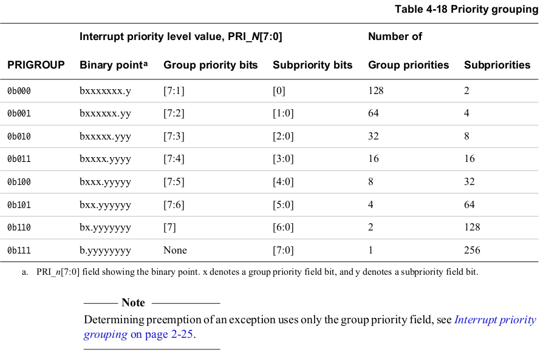
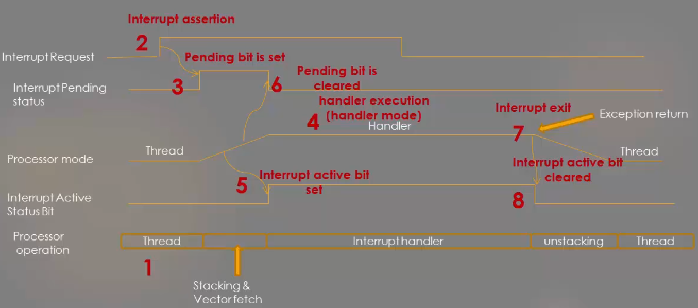
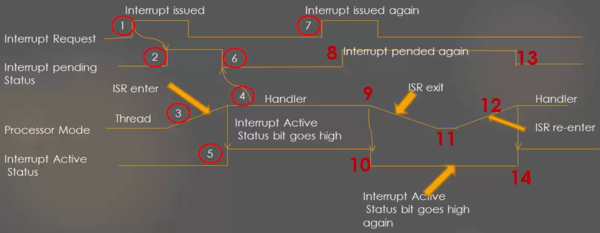

[Home](../../) | [Projects](../../projects) | [Notes](../) > <a href="./">ARM Cortex-M3/M4 Processor</a> > Interrupt Priority & Priority Configuration

# Interrupt Priority & Priority Configuration


## Interrupt Priority

* **Priority** means "urgency"

* **Priority number** is a measure of urgency. It represents how urgent it is compared to others.

* For ARM Cortex Mx processors, lesser the priority value, higher the priority

  e.g., PV-1 has higher priority than PV-100

* Sometimes, the term "priority" is used interchangeably with "priority value".

  e.g., "The priority value of IRQ0 is 4" $\leftrightarrow$ "The priority of IRQ0 is 4"


## Different Priority Levels

* Priority values are also called as priority levels.

* How many different priority levels are there in ARM Cortex Mx processor?

  $\to$ It depends on the **Interrupt Priority Register** implementation by the MCU vendors.

  e.g., STM32F4x MCU has 16 different priority levels

  e.g., TI TM4C123Gx has 8 different priority levels

* ARM Cortex Mx processors have total 60 Interrupt Priority Registers. They are part of NVIC register set. 

  By using these registers you can configure priority levels for interrupts (IRQs) only. (You cannot use these registers to configure the priorities of system exceptions. Use **System Handler Priority Register**s.





* Each 32-bit Interrupt Priority Register can control 4 IRQs. (60 registers $\times$ 4 IRQs each = 240 IRQs)





* 8 bits are assigned for each IRQ priority setting, but in general not all 8 bits are used:
  * If the MCU vendor decides to implement only 3 bits $\to$ 8 priority levels
  * If the MCU vendor decides to implement only 4 bits $\to$ 16 priority levels (STM32Fx)





## Priority Grouping (Preempt Priority & Sub Priority)

* **Priority Grouping**

  * **Preempt priority**

    When the processor running interrupt handler, and another interrupt appears, then the preempt priority values will be compared, and interrupt with higher preempt priority (smaller value) will be allowed to run.

  * **Sub priority**

    This value is used only when two interrupts with the same preempt priority values occur at the same time. In this case, the exception with higher sub-priority (smaller value) will be handled first.

  In the following table, the priority group is 0 by default. In this case, the 7 most significant bits are used for "Preempt priority" and the rest 1 bit is used for "Sub priority".

  The priority group can be set by using the **Application Interrupt And Reset Control Register** which is part of the System Control Block (SBC).





* Interrupt priority conflict resolution:

  If two interrupts of the same preempt priority hit the processor at the same time $\to$ The smaller sub priority value wins!

  If the sub priority also happens to be the same $\to$ The smaller IRQ number wins!

### Priority Grouping Case Study 

Assumption: Only 3 most significant bits are implemented in each Priority Level Register

* **Case 1: Priority group = 0**

  Preempt priority width = 7 bits (128 programmable priority levels)

  But, only 3 bits are implemented. So, 8 programmable priority levels.

  Sub priority width = 1 (2 programmable sub priority levels)

  But, bit 0 is not implemented. So, no sub priority levels.

* **Case 2: Priority group = 5**

  Preempt priority width = 2 bits (4 programmable priority levels)

  Only 3 bits are implemented. So, still 4 programmable priority levels.

  Sub priority width = 6 (64 programmable sub priority levels)

  But, only one bit (bit 5) out of those 6 bits is implemented. So, 2 sub priority levels.


## Pending Interrupt Behavior

* **Case 1: Single Pended Interrupt**





* **Case 2: Double Pended Interrupt**





## Exercise

* Generate the below peripheral interrupts using NVIC interrupt pending register and observe the execution of ISRs when priorities are same and different. (Consult the interrupt vector table in *Reference Manual* of the microcontroller.)

  TIM2 global interrupt

  I2C1 event interrupt

  ```c
  #include <stdint.h>
  #include <stdio.h>
  
  #if !defined(__SOFT_FP__) && defined(__ARM_FP)
    #warning "FPU is not initialized, but the project is compiling for an FPU. Please initialize the FPU before use."
  #endif
  
  #define IRQNO_TIMER2	28
  #define IRQNO_I2C1		31
  #define ADDR_NVIC_IPR_BASE	((uint32_t *)0xE000E400)
  #define ADDR_NVIC_ISER_BASE	((uint32_t *)0xE000E100)
  #define ADDR_NVIC_ISPR_BASE	((uint32_t *)0XE000E200)
  
  uint32_t *pNVIC_IPRBase = ADDR_NVIC_IPR_BASE;	// Interrupt Priority Register base addr
  uint32_t *pNVIC_ISERBase = ADDR_NVIC_ISER_BASE;	// Interrupt Set-Enable Register base addr
  uint32_t *pNVIC_ISPRBase = ADDR_NVIC_ISPR_BASE;	// Interrupt Set-Pending Register base addr
  
  void configure_priority_for_irqs(uint8_t irq_no, uint8_t priority_value)
  {
  	// First, find out IPR to use ( / )
  	uint8_t iprx = irq_no / 4;
  	uint32_t *ipr = pNVIC_IPRBase + iprx;
  
  	// Second, find out the bit position to set( % -> x8)
  	uint8_t pos = irq_no % 4 * 8;
  
  	// configure the priority
  	*ipr &= ~(0xFF << pos);	// clear
  	*ipr |= (priority_value << pos);
  }
  
  int main(void)
  {
  	// 1. Configure the priority for the peripherals. (This always has to be done prior to
  	//    (enableing the interrupt.)
  	configure_priority_for_irqs(IRQNO_TIMER2, 0x80);
  	configure_priority_for_irqs(IRQNO_I2C1, 0x80);
  	// 2. Manually set the interrupt pending bit in the NVIC Priority Register.
  	*pNVIC_ISPRBase |= (1 << IRQNO_TIMER2);
  
  	// 3. Enable the IRQs in NVIC ISER
  	*pNVIC_ISERBase |= (1 << IRQNO_I2C1);
  	*pNVIC_ISERBase |= (1 << IRQNO_TIMER2);
  
      /* Loop forever */
  	for(;;);
  }
  
  // ISR for TIMER2
  void TIM2_IRQHandler(void)
  {
  	printf("TIM2_IRQHandler\n");
  	*pNVIC_ISPRBase |= (1 << IRQNO_I2C1);	// introduce IRQ31
  	while (1);
  }
  
  // ISR for I2C1
  void I2C1_EV_IRQHandler(void)
  {
  	printf("I2C1_EV_IRQHandler\n");
  }
  ```

  > L36, L37: When we configure both interrupts' preempt priority to the same value, the previously invoked `TIM2_IRQHandler()` will not be preempted by the incoming "I2C1 event interrupt" because "TIM2 global interrupt" has the smaller IRQ number. `I2C1_EV_IRQHandler()` will never be invoked.
  >
  > L37: When we configure "I2C1 event interrupt"s preemt priority to the smaller value than that of "TIM2 global interrupt"s, e.g., 0x70, then we can see that "I2C1 event interrupt" preempts the previously invoked `TIM2_IRQHandler()` and executes `I2C1_EV_IRQHandler()`. When `I2C1_EV_IRQHandler()` returns, `TIM2_IRQHandler()` will execute again and tries to finish whatever task it has left.
  >
  > This situation is referred to as the "nested interrupts".


## References

Nayak, K. (2022). *Embedded Systems Programming on ARM Cortex-M3/M4 Processor* [Video file]. Retrieved from  https://www.udemy.com/course/embedded-system-programming-on-arm-cortex-m3m4/
