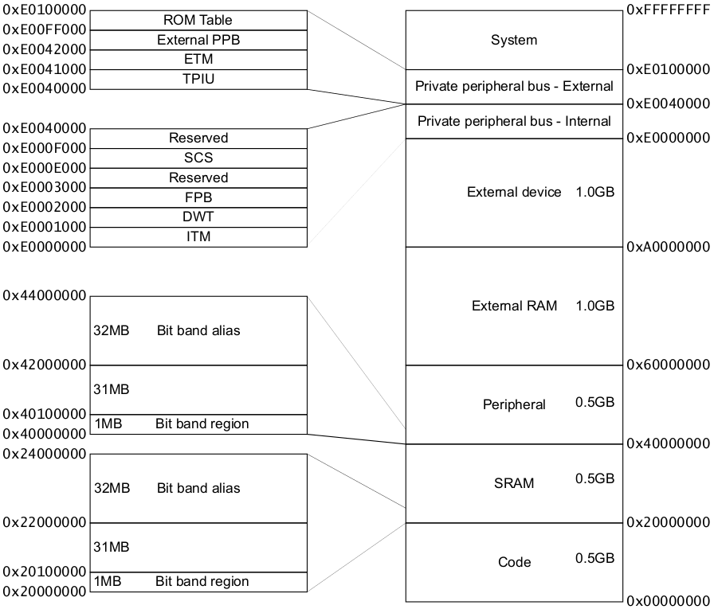
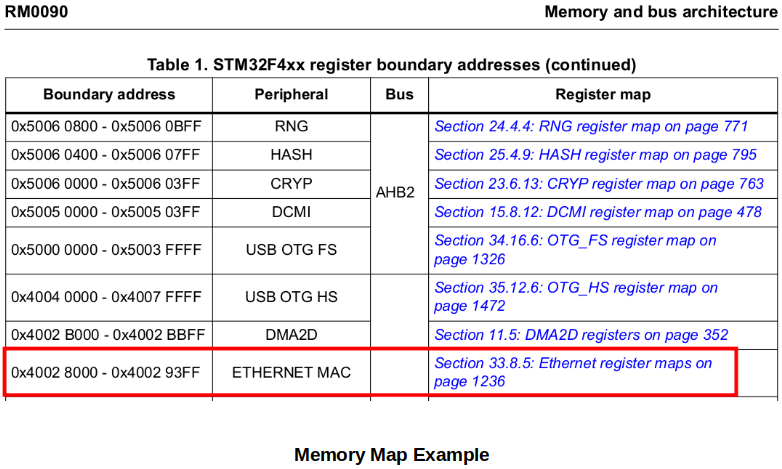

[Home](../../) | [Projects](../../projects) | [Notes](../) > <a href="./">ARM Cortex-M3/M4 Processor</a> > Memory Map

# Memory Map

## Terms

* **Memory Mapped I/O**

  I/O pins are controlled using peripheral registers which are mapped on to processor addressable memory locations.

* **Processor Addressable Memory Locations**

  For a system with 32-bit wide address bus - 0x0000_00000 - 0xFFFF_FFFF (4G different addresses)

  For a system with 64-bit wide address bus - 0x0000_00000_0000_0000 - 0xFFFF_FFFF_FFFF_FFFF

  When an instruction is decoded, the Address Generation Unit (AGU) inside the processor will get activated.

* **Address Generation Unit (AGU)**

  An execution unit inside central processing units (CPUs) that calculates addresses used by the CPU to access main memory.

## Memory Map of ARM Cortex Mx Processor

* The following is the generic memory map which must be followed by all MCUs which use ARM Cortex Mx processor. Program memory, data memory, registers of various peripherals are organized within the same linear 4GB of address space.

  The memory map is determined in the processor design time.

* Description of each section in the memory map:

  - **Code (0x00000000 - 0x1FFFFFFF; 512 MB)**

    This is the region where the MCU vendors should connect the code memory. (e.g., Embedded Flash, ROM, OTP, EEPROM, etc.)

    Processor, by default, fetches vector table information from this region right after the reset. But, this behavior can be changed by using the boot pins of the microcontroller.

  - **SRAM (0x20000000 - 0x3FFFFFFF; 512 MB)**

    This region is used primarily for connecting SRAM, mostly on-chip SRAM. SRAM is a data memory where temporary data and so on are kept.

    The first 1 MB of the SRAM region is bit-addressable.

    Program code can also execute from this region. (Instructions can be stored in this region and can be executed.)

  - **Peripheral (0x40000000 - 0x5FFFFFFF; 512 MB)**

    This region is used mostly for on-chip peripherals of the microcontroller or vendor specific peripherals such as RTC, ADC, TIMERS, etc. (Be careful! Peripherals of the processor such as NVIC will not fall under this region.)

    Like the SRAM region, the first 1 MB of the peripheral region is bit-addressable if the optional bit-band feature is included.

    This is an **eXecute Never (XN)** region. Trying to execute code from this region will trigger the fault exception. This is to prevent the code injection attacks.

  - **External RAM (0x60000000 - 0x9FFFFFFF; 1 GB)**

    This region is intended for either on-chip or off-chip memory. (External RAM connection)

    Registers of an external RAM will fall under this region.

    Code can be executed in this region.

    e.g., Connecting external SDRAM

  - **External device (0xA0000000 - 0xDFFFFFFF; 1 GB)**

    This region is intended for external devices and/or share memory.

    This is an **eXecute Never (XN)** region. 

  - **Private peripheral bus**

    This region is where you see the processor peripheral registers such as NVIC registers, SYSTICK TIMER registers, and various other control related registers of the procesor.

    This is an **eXecute Never (XN)** region. 

* For example, the registers used to control and configure the Ethernet MAC peripheral and registers used to read/write data from/to Ethernet MAC peripheral are mapped in the address range of 0x4002_8000 to 0x4002_93FF.

  

  

  

* Different types of MCUs have different memory maps but the fundamentals are the same. Consult the MCU reference manual for the MCU specific information.

## References

Nayak, K. (2022). *Embedded Systems Programming on ARM Cortex-M3/M4 Processor* [Video file]. Retrieved from  https://www.udemy.com/course/embedded-system-programming-on-arm-cortex-m3m4/
