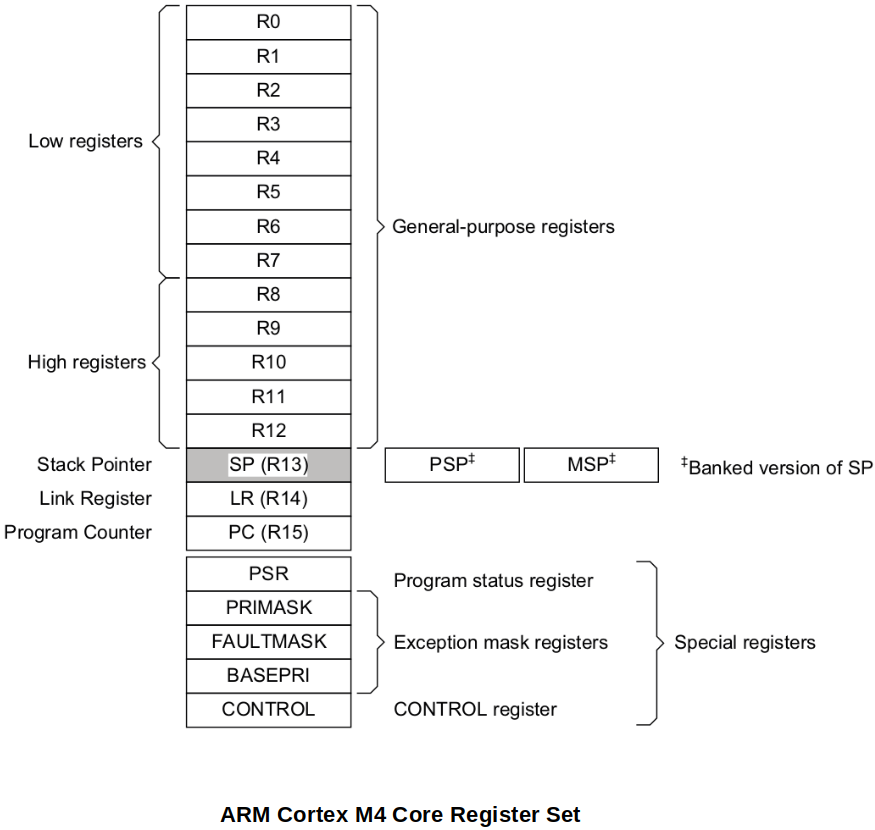

[Home](../../) | [Projects](../../projects) | [Notes](../) > <a href="./">ARM Cortex-M3/M4 Processor</a> > Memory Mapped vs Non-Memory Mapped Registers

# Memory Mapped vs Non-Memory Mapped Registers

## Non-Memory Mapped Registers

* These registers are internal to the processor core. They do not have unique address to access them. Hence they are not part of the processor memory map. 
* You cannot access these registers in a C program using address dereferencing.
* To access these registers, you have to use assembly instructions such as `mov`, `ldr`, etc.
* Registers belong to ARM Cortex M4 core register set are non-memory mapped registers.

## Memory Mapped Registers

* These registers are external to the  processor core. They have been given unique addresses by the microcontroller designer. Hence they are part of the processor memory map. (Every register has its address in the processor memory map.)

* You can access these registers in a C program using address dereferencing.

* Two groups of memory mapped registers:

  - Registers of the processor-specific peripherals (e.g., NVIC, MPU, SCB, DEBUG, etc.)

  - Registers of the microcontrollerspecific peripherals (e.g., RTC, I2C, TIMER, CAN, USB etc.)

    Vendor specific registers

* These are processor specific registers which are implemented by the processor design.

## References

Nayak, K. (2022). *Embedded Systems Programming on ARM Cortex-M3/M4 Processor* [Video file]. Retrieved from  https://www.udemy.com/course/embedded-system-programming-on-arm-cortex-m3m4/
