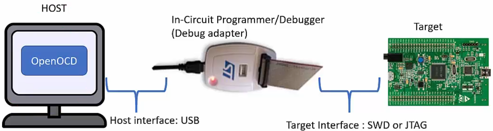
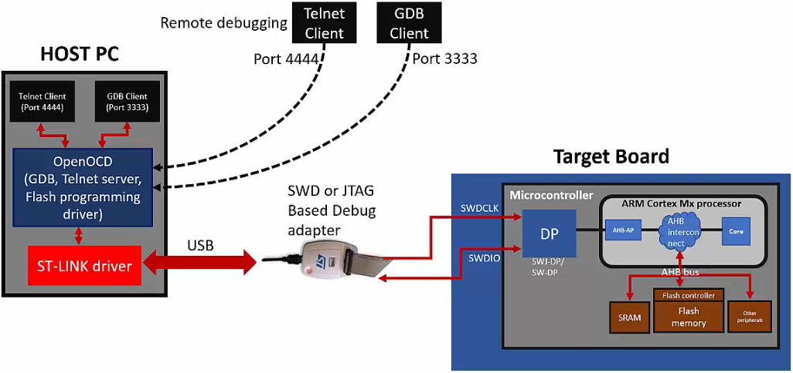
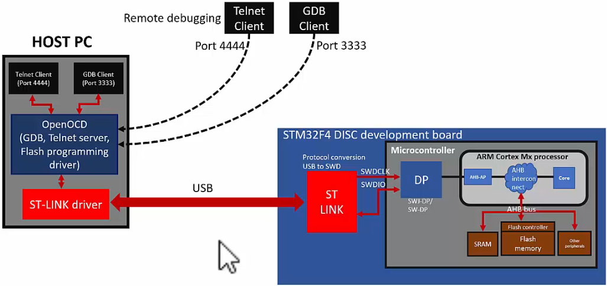

[Home](../../) | [Projects](../../projects) | [Notes](../) > <a href="./">ARM Cortex-M3/M4 Processor</a> > Open On-Chip Debugger (OpenOCD)

# Open On-Chip Debugger (OpenOCD)


## Downloading Executable to Target





* Debug adapter sits between the host machine and the target board and mediates different interfaces that host and target understand.
* On the host you need a special application that helps send the commands to the target, debug the board, etc. One such application is the **OpenOCD**. 


## OpenOCD

* The Open On-Chip Debugger (OpenOCD) aims to provide debugging, in-system programming, and boundary-scan testing for embedded target devices.

* It is free and open source host application that allows you to program, debug, and analyze your applications using GDB.

* It supports various target boards based on different processor architecture.

* OpenOCD currently supports many types of debug adapters such as USB-based, parallel port-based, and other standalone boxes that run OpenOCD internally.

* You can use GDB to debug on various processor architectures:

  Allows ARM7 (ARM7TDMI and ARM720t), ARM9 (ARM920T, ARM922T, ARM926EJ-S, ARM966E-S), XScale (PXA25x, IXP42x), Cortex-M3 (Stellaris LM3, ST STM32, and Engergy MicroEFM32) and Intel Quark (x10xx) based cores to be debugged via the GDB protocol.

* OpenOCD allows FLASH writing (programming the FLASH internal to the microcontroller) for various microcontrollers:

  Flash writing is supported for external CFI-compatible NOR flashes (Intel and AMD/Spansion command set) and several internal flashes (LPC1700, LPC1800, LPC2000, LPC4300, AT91SAM7, AT91SAM3U, STR7x, STR9x, LM3, STM32, and EFM32). Preliminary support for various NAND flash controllers (LPC3180, Orion, S3C24xx, more) is included.

* Our two important goals of using OpenOCD:

  * Download our program to the FLASH of the microcontroller
  * Debug the code using GDB


## Programming Adapters

* Programming adapters are used to get access to the debug interface of the target with native protocol signaling such as SWD or JTAG since host doesn't support such interfaces.

* It does protocol conversion. For example, commands and messages coming from the host application in the form of USB packets will be converted to equivalent debug interface signaling (SWD or JTAG) and vice versa.

* Mainly debug adapter helps you to download and debug the code.

* Some advanced debug adapters will also help you to capture trace events such as on-the-fly instruction trace and profiling information.

* Some popular debug adapters:

  * SEGGER J-Link EDU - JTAG/SWD Debugger (Supports 8051, PIC32, RX, ARM7/9/11, Cortex-M/R/A, RISC-V)

  * KEIL ULINK Pro

  * STMicroelectronics ST-LINK (Supports only STM8 and STM32 microcontroller families)

  * STM32F4-DISCOVERY board has embedded ST-LINK-V2A in-circuit programmer and debugger so, no external programmer adapter is necessary! Great!

    But, this only supports SWD interface (debug protocol) which is not supported by the host machines.


## Program Downloading Process

### When Using External Programming Adapter





* Host application (OpenOCD) connects to the debug adapter via driver.

* OpenOCD sends the USB packets

* Any of the two target debug interfaces (SWD pins or JTAG pins) can be used.

  * If you are using SWD, you would need only two pins (SWDCLK, SWDIO) which are provided by the MCU so that they can connect to the debug adapter.

    * SWDCLK is controlled by the debug adapter (i.e., SWD master)
    * SWDIO is a bidirectional communication line (commands/responses between host application and target)

    SWD is popular since it uses less pin than JTAG (4 pins).

* On the MCU is a Debug Access Port (DP). This block knows how to talk to the processor. At the end of the day, your goal is to talk to the processor, that is, to catch/hold the processor bus system and DP gives you that ability.

  By using DP, you can access various bus interfaces of the processor such as AHB bus interfaces, APB bus interfaces, etc. That happens through the many access points in the processor. 

  In our case, we want to talk to the memory, especially to the FLASH memory. To talk to the FLASH memory we first need to access the AHB access point which helps you to get access to the AHB interconnect where AHB peripherals (e.g., SRAM, FLASH) are connected. 

  You can also control the core (e.g., reset, put breakpoints, watch points, etc.) through the AHB access point.

* In summary, if your host machine wants to program the FLASH of the MCU, it would sent the USB packets and that will be converted to SWD packets by the debug adapter. And, those packets will eventually reach the FLASH memory through the process mentioned above. These SWD packets carry the address and data to reach the destination. This is how the FLASH memory gets programmed.

* In our case, we'll be using the on-board debug interface so, no external debug adapter is necessary.





## Steps to Download the Code Using OpenOCD

Consult the *OpenOCD User's Guide* for more information (e.g., commands).

1. Download and install OpenOCD

2. Install Telnet client (for windows you can use PuTTY software)

   If you cannot use Telnet application you can also use "GDB Client"

3. Run OpenOCD with the board configuration file

   ```plain
   openocd -f /board/stm32f4discovery.cfg
   ```

   > Full path to the board configuration file: `/usr/share/openocd/scripts/board/stm32f4discovery.cfg`
   >
   > Leave this terminal busy, and launch another terminal. Go to project directory and do Step 4.

4. Connect to the OpenOCD via GDB Client or Telnet Client 

   **Using GDB Client:**

   ```plain
   gdb-multiarch
   (gdb) target remote localhost:3333
   (gdb) monitor reset init
   ```

   > Keyword `monitor` allows you to issue OpenOCD command on GDB client. (This keyword is not necessary if you are issuing OpenOCD command on Telnet.)

   **Using Telnet**

   ```plain
   telnet localhost 4444
   ```

   > You are not bypassing GDB Client, so `monitor` keyword is not necessary. Just directly type in commands.
   >
   > c.f. To terminate Telnet session, `Ctrl+]` $\to$ `close`.

5. Issue commands over GDB Client or Telnet to OpenOCD to download and debug the code.

   ```plain
   (gdb) monitor flash write_image erase final.elf
   ```

   > Using GDB Client

   ```plain
   flash write_image erase final.elf
   ```

   > Using Telnet Client

### Some Other Useful OpenOCD Commands

* Reset and halt:

  ```plain
  (gdb) monitor reset halt
  ```

* Run the program:

  ```plain
  (gdb) monitor resume
  ```

* Halt the program:

  ```plain
  (gdb) monitor halt
  ```

* Reset:

  ```plain
  (gdb) monitor reset
  ```

* Read the target memory address 

  ```plain
  (gdb) monitor mdw 0x20000008 4
  ```

  > Study more on these commands.

* Set a breatpoint

  ```plain
  (gdb) monitor bp 0x00000000080001ba 2 hw
  ```

  > 0x00000000080001ba is the address of `task1_handler` searched from the map file.
  >
  > Study the arguments
  >
  > After setting a breakpoint, run `monitor reset`.

* Remove breakpoint

  ```plain
  (gdb) monitor rbp 0x00000000080001ba
  ```

* Display breakpoints

  ```plain
  (gdb) monitor bp
  ```

* Shutdown OpenOCD (Disconnect from the debug adapter or from the target)

  ```plain
  shutdown
  ```

  


## References

Nayak, K. (2022). *Embedded Systems Programming on ARM Cortex-M3/M4 Processor* [Video file]. Retrieved from  https://www.udemy.com/course/embedded-system-programming-on-arm-cortex-m3m4/
