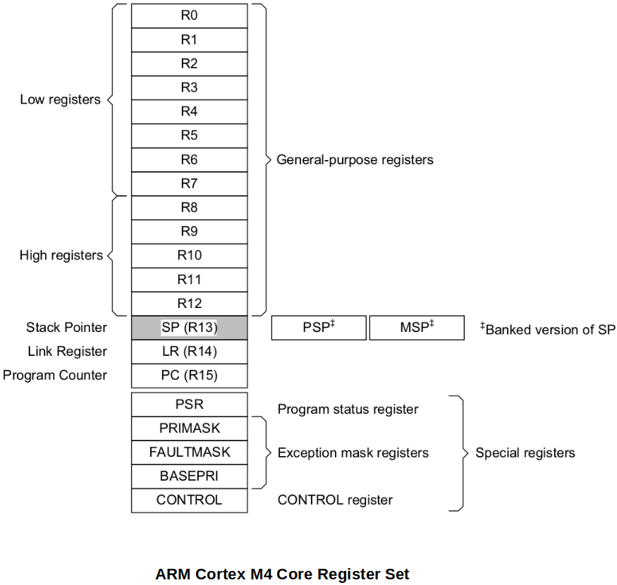
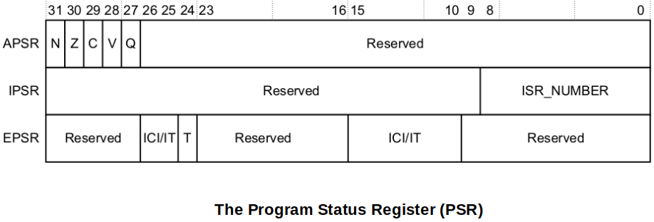

[Home](../../) | [Projects](../../projects) | [Notes](../) > <a href="./">ARM Cortex-M3/M4 Processor</a> > Processor Core Register Set

# Processor Core Register Set

## Processor Core Register Set

The processor has 32 registers that includes 13 general-purpose registers and several special-purpose registers.

* **13 general-purpose registers, R0 - R12**

  The general-purpose registers R0-R12 have no special architecturally-defined uses. They can be used for data operations.

  * **Low registers**

    Registers R0-R7 are accessible by all instructions that specify a general-purpose register.

  * **High registers**

    Registers R8-R12 are accessible by all 32-bit instructions that specify a general-purpose register.

    Registers R8-R12 are not accessible by most 16-bit instructions.

* **Stack Pointer (SP), R13**

  In Thread mode, bit[1] of the CONTROL register indicates the stack pointer to use:

  - 0 = Main Stack Pointer (MSP) - This is the reset value.

  - 1 = Process Stack Pointer (PSP)

  On reset, the processor loads the MSP with the value from address 0x00000000.

  Handler mode always uses SP_main, but you can configure Thread mode to use either SP_main
  or SP_process.

* **Link Register (LR), R14**

  It stores the return information for subroutines, function calls, and exceptions. At all other times, you can treat R14 as a general-purpose register. On reset, the processor sets the LR value to 0xFFFFFFFF.

  When `bl` (branch and link) instruction is used, the LR gets updated to the current PC so that it knowns where to return. (`bx lr` at the end of the subroutine to return to the caller)

* **Program Counter (PC), R15**

  It contains the current program address (i.e., the address of the next instruction to be executed). On reset, the processor loads the PC with the value of the reset vector, which is at address 0x00000004. Bit[0] of the value is loaded into the EPSR T-bit at reset and must be 1. (Has to do with the "Tumb mode".)

  Bit [0] of PC is always 0, so instructions are always aligned to word or halfword boundaries.

* **Special-purpose Program Status Registers, (xPSR)**

  It holds the state of the program that is currently running.

  The Program Status Register (PSR) combines:

  - **Application Program Status Register (APSR)**

    Contains the current state of the condition flags from previous instruction executions

  - **Interrupt Program Status Register (IPSR)**

    Contains the exception type number of the current Interrupt Service Routine (ISR)

  - **Execution Program Status Register (EPSR)**

    If 'T' bit of the EPSR is set(1), processor thinks that the next instruction to be executed is from Thumb ISA.

    If 'T' bit of the EPSR is reset(0), processor thinks that the next instruction which is about to execute is from ARM ISA.

    Since ARM Cortex Mx processors only support Thumb Mode, the 'T' bit must always be maintained set(1). Execution of an instruction when 'T' bit is reset(0) will result in processor fault.

  These registers are mutually exclusive bit-fields in the 32-bit PRS. The bit assignments are:

See the *Arm®v7-M Architecture Reference Manual* for more information.

## References

Nayak, K. (2022). *Embedded Systems Programming on ARM Cortex-M3/M4 Processor* [Video file]. Retrieved from  https://www.udemy.com/course/embedded-system-programming-on-arm-cortex-m3m4/
