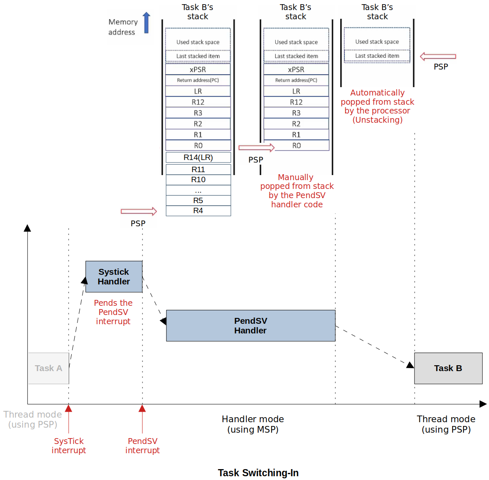

[Home](../../) | [Projects](../../projects) | [Notes](../) > <a href="./">ARM Cortex-M3/M4 Processor</a> > Scheduling & Context Switching

# Scheduling & Context Switching

## Scheduling

* An algorithm which makes the decision of preempting a running task from the CPU and makes the decision about which task to dispatch (i.e., allocate CPU) next

* The decision could be based on many factors such as system load, the priority of tasks, share resource access, or a simple Round-Robin method.

## Context switching

* The procedure of switching out the currently running task from the CPU after saving the task's execution context or state and switching in the next task's to run on the CPU by retrieving the past execution context or state of the task.

## State of a task

* Inside a **microcontroller** (e.g., STM32x) is a **processor** (e.g., ARM Cortex-M4) which contains NVIC, MPU, SCP, FPU, Debug Unit, etc.

* Inside a processor is a **processor core** which contains ALU, Core registers (General purpose, special purpose, special registers, etc.), etc. 

* When a task is running, there will be various resources associated with it that contains the information about the task. In general, the **state of a process = "General purpose registers "+ "Some special purpose registers" + "Status register"**. These are what need to be stored and retrieved during the context switching.

  * General purpose registers

  * PC - Will be holding the next instruction the preempted task needs to execute when it is dispatched again.

  * LR - Return address

  * PSP - Stack pointer for the user tasks (contains information about how each task is using the stack)

    In RTOS environment MSP is used to keep track of kernel's stack usage.

  * PSR - Snapshot of the status flags (N, V, Z, C, etc.)

  * Other special registers such as PRIMASK, FAULTMASK, BASEPRI, CONTROL registers are privileged registers and they will NOT be stored! (Most of the time user tasks will be running with unprivileged access level so storing these registers wouldn't make any sense. Kernel should touch these registers not the user tasks.)

* As an exception entry sequence, the following registers will get pushed onto stack automatically by the processor:

  * R0, R1, R2, R3, R12, LR, PC, xPSR (we'll call it Stack Frame 1 or SF1)

  So, our job in implementing scheduler is to make sure that the rest of the task state will get pushed onto stack as well.

  * R4 - R11 (we'll call it Stack Frame 2 or SF2)
  * Note that R14(LR) needs to be pushed onto stack. Check out [Context Switching](../real-time-operating-systems/context-switching) to see why!
  
  The following "Task Switching In/Out" diagram is taken from FreeRTOS notes.

* Task's stack area initialization and storing of dummy stack frame
  * Each task can consume a maximum of 1 KB of memory as a private stack.
  * This stack is used to hold tasks' local variables and context (SF1 + SF2)
  * When a task is getting scheduled for the very first time, it doesn't have any context. So, it is the programmer's responsibility to store dummy SF1 and SF2 in the task's stack area as a part of "Task initialization" sequence before launching the scheduler.
    * Set all the general purpose registers to 0 (R0 - R12)
    * PSR - 0x01000000
    * Only the T bit is important (bit[24]) and it must be set (1) for ARM Cortex-M4
    * PC - Address of the `task2_handler()` make sure that lsb of the address is 1; for T bit.
    * LR - A special value EXC_RETURN which controls the exception exit.
    * 0xFFFFFFFD is appropriate for our design. (Return to Thread mode, exception return uses non-floating-point state from the PSP and execution uses PSP after return.)

## Case Study

* Case study of context switching: T1 switching out, T2 switching in
  1. Running T1
  2. Scheduler (Context Switching)
     1. Context saving
        * `push` the context of T1 onto T1's private stack
        * Save the PSP value of T1 using a global variable
     2. Context retrieving
        * Retrieve the PSP value of T2 from the corresponding global variable
        * `pop` the context of T2 from T2's private stack
     3. Run T2

## References

Nayak, K. (2022). *Embedded Systems Programming on ARM Cortex-M3/M4 Processor* [Video file]. Retrieved from  https://www.udemy.com/course/embedded-system-programming-on-arm-cortex-m3m4/
