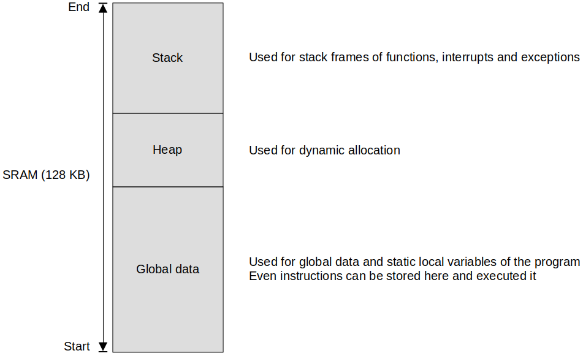
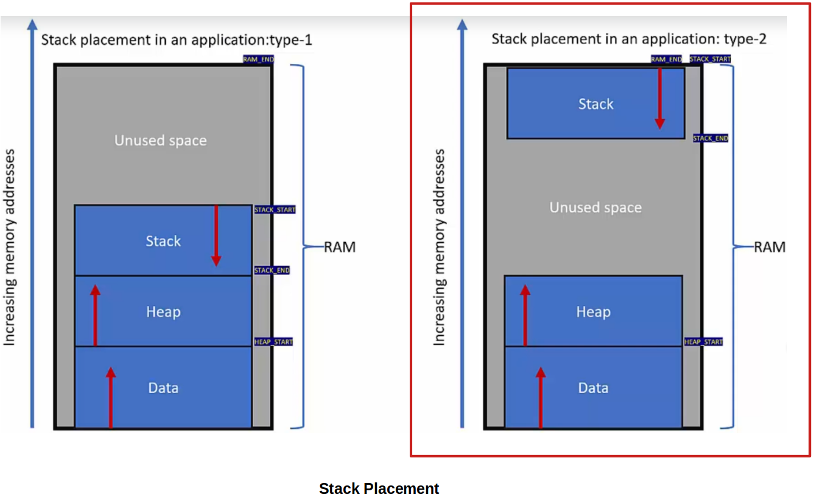
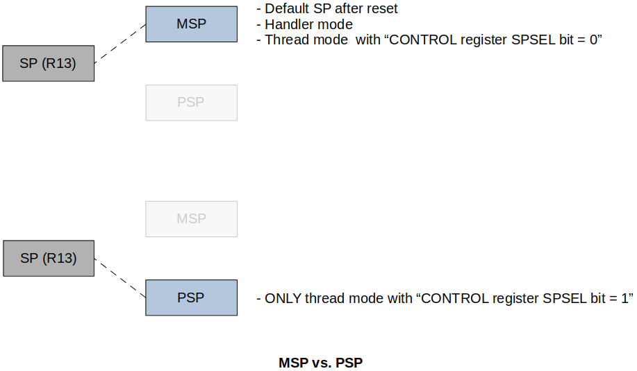
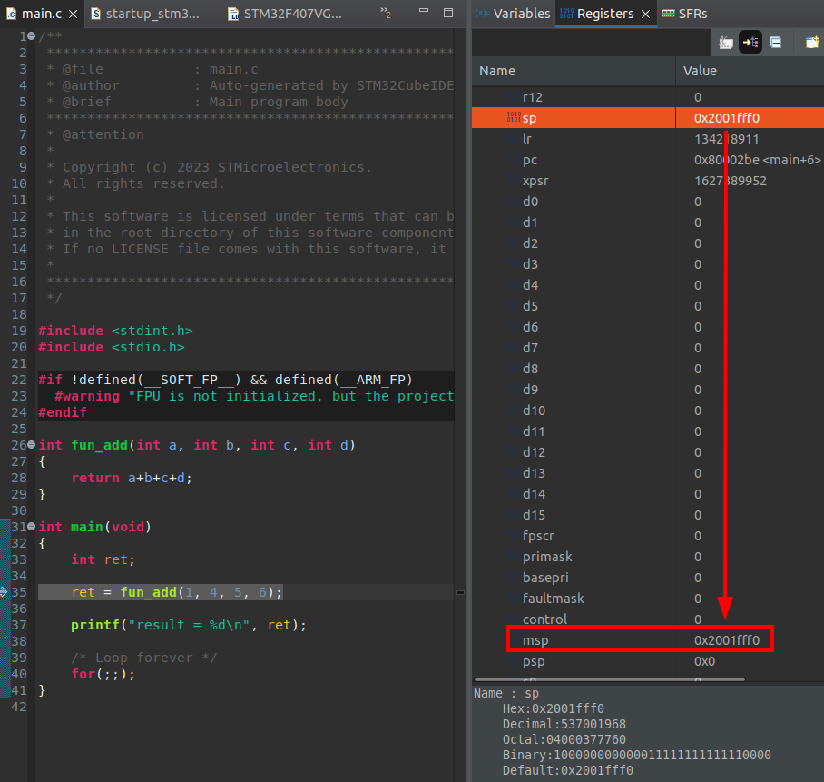
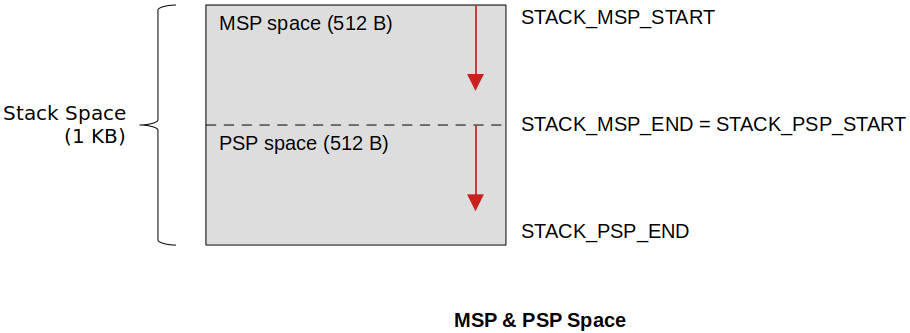

[Home](../../) | [Projects](../../projects) | [Notes](../) > <a href="./">ARM Cortex-M3/M4 Processor</a> > Stack Memory

# Stack Memory


## Stack Memory

* Stack memory is part of the main memory (internal RAM or external RAM) reserved for the temporary storage of data (transient data)
* Mainly used during function, interrupt/exception handling
* Stack memory is accessed in Last-In-First-Out (LIFO) fashion
* Stack can be accessed using `push` and `pop` instructions or using any memory manipulation instructions (`ld`, `str`)
* Stack is traced using stack pointer (`sp` or`r13`) register. `push` and `pop` instructions affect (decrement or increment) the stack pointer register.
* Stack can expand and shrink dynamically within its boundary during the run-time. (Crossing the boundary will cause errors referred to as "Stack overflow", or "Stack underflow" and your software must have a way to prevent/handle these errors.)


## Stack Memory Usage

1. The temporary storage of processor register values
2. The temporary storage of local variables of the function
3. During system exception or interrupt, stack memory will be used to save the context (status of general-purpose registers, processor status register, return address, etc.) of the currently executing code





* STM32F407 microcontroller has 2 SRAMs (SRAM1 + SRAM2). They are collectively called as SRAM and its size is 128 KB.
* Boundaries of each section can be set by programmers using tool chains or linker scripts according to the project's requirement.


## Stack Operation Models

Stack operation model is determined at the processor design time. This is not configurable by the programmer.

* Full Ascending (FA)
* **Full Descending (FD) - ARM Cortex Mx processors**
  * Stack pointer is initialized to the higher memory address
  * `push` decrements, and `pop` increments the stack pointer
  * Stack pointer points to the last pushed item (or next item to be popped)
* Empty Ascending (FA)
* Empty Descending (E)


## Stack Placement

* In which portion of RAM would you place the stack? $\to$ Various ways you can do this!

  In our applications, the second model will be used. (Stack pointer is initialized to the highest address of RAM.)

* This is generally set by the linker script of the program, or the configuration files of the tool chain.





## Banked Stack Pointers

* ARM Cortex Mx processors have 3 for stack pointers:
  * **SP(R13)** - Current Stack Pointer
  * **MSP** - Main Stack Pointer
  * **PSP** - Process Stack Pointer (Generally used for application tasks in embedded systems and embedded OS's)





* After processor reset, by default, MSP will be selected as current stack pointer. This means that the SP will copy the contents of MSP. (Upon power-up, the processor automatically initializes the MSP by reading the first location of the vector table.)
* **Thread mode** can change the current stack pointer (which is, by default, MSP) to PSP by configuring the CONTROL register's SPSEL bit.
  * When SPSEL = 0 (default), [SP] $\leftarrow$ [MSP]
  * When SPSEL = 1, [SP] $\leftarrow$ [PSP]
* **Handler mode** code execution will **ALWAYS use MSP** as the current stack pointer. Changing the value of SPSEL bit while in the handler mode doesn't make any sense. The write will be ignored.
* MSP will be initialized automatically by the processor after reset by reading the content of the address 0x00000000
* If you want to use the PSP as your current stack pointer then make sure that you initialize the PSP to valid stack address in your code first, and then change the SPSEL bit of the CONTROL register to 1.
* As shown in the snapshot below, MSP will be used as the current stack pointer by default.





* One way we can design our system is that 

  * When the program runs in thread mode, it will use the PSP space as its stack space
  * When the program runs in handler mode, it will use the MSP space as its stack space

  This technique is widely used in the real-time OS design. For example, MSP will be used for kernel tasks, PSP will be used for user tasks. (OS for consumer-level products will not have to manage stack pointer this way.)





## Stack Initialization

* **Before reaching `main()`**

  Generally done by the processor reset sequence reading the first location of the vector table. It must be ensured that the first location of the vector table holds a valid value for the stack pointer. This is normally taken care of by the startup code.

* **After reaching `main()`**

  For example, you may want to shift the stack to some other memory location (e.g., SRAM3, or external RAM connected to the microcontroller) after reaching `main()`. This can't be done before reaching `main()`.

### Stack Initialization Tips

1. Evaluate your targeted application. Decide the amount of stack that would be needed for the worst-case scenario of your application run-time.
2. Know your processor's stack consumption model (FD, FA, ED, EA)
3. Decide stack placement in the RAM (middle, end, external memory). This can be adjusted using the linker script.
4. In many applications, there may be second stage stack init. For example, if you want to allocate stack in an external SDRAM then 
   - First, start with the the internal RAM. 
   - Second, initialize (configure) the SDRAM in the main or startup code and then change the stack pointer to point to that SDRAM.
5. If you are using the ARM cortex Mx processor, make sure that the first location of the vector table contains the initial stack address (MSP). The startup code of the project usually does this.
6. You may also use the linker script to decide the stack, heap and other RAM area boundaries. Startup code usually fetches boundary information from linker scripts.
7. In an RTOS scenario, the kernel code may use MSP to trace its own stack and configure PSP for user task's stack.


## Exercise 

* To view where the stack pointer gets initialized, check the startup code and linker script of your project.

  ```assembly
  /* startup_stm32f407vgtx.s */
  ...
  /******************************************************************************
  *
  * The STM32F407VGTx vector table.  Note that the proper constructs
  * must be placed on this to ensure that it ends up at physical address
  * 0x0000.0000.
  *
  ******************************************************************************/
    .section .isr_vector,"a",%progbits
    .type g_pfnVectors, %object
    .size g_pfnVectors, .-g_pfnVectors
  
  g_pfnVectors:
    .word _estack		@ a linker symbol which denotes the end of RAM as beginning of stack
    .word Reset_Handler
    .word NMI_Handler
    .word HardFault_Handler
    .word	MemManage_Handler
   ...
  ```

  ```linker script
  /* LinkerScript.ld */
  
  /* Entry Point */
  ENTRY(Reset_Handler)
  
  /* Highest address of the user mode stack */
  _estack = ORIGIN(RAM) + LENGTH(RAM); /* end of "RAM" Ram type memory */
  
  _Min_Heap_Size = 0x200; /* required amount of heap */
  _Min_Stack_Size = 0x400; /* required amount of stack */
  ...
  ```

  > Initialized SP points to 0x20020000 (0x20000000 + (128 * 1024)). 
  >
  > This value is calculated according to the linker script, and then used in the vector table defined in the startup code. This is how SP gets initialized.

* **Changing SP between MSP and PSP:**

  To access MSP and PSP in assembly code, you can use the `msr` and `mrs` instructions.

  In a C program, you can write a naked function (C like assembly function which doesn't have epilogue and prologue sequences) to change the currently selected stack pointer.

  ```c
  #include <stdint.h>
  #include <stdio.h>
  
  #if !defined(__SOFT_FP__) && defined(__ARM_FP)
    #warning "FPU is not initialized, but the project is compiling for an FPU. Please initialize the FPU before use."
  #endif
  
  int fun_add(int a, int b, int c, int d)
  {
  	return a+b+c+d;
  }
  
  __attribute__((naked)) void change_sp_to_psp(void)
  {
  	// set up CONSTANTS in assembly (C-style macro is not compatible with assembly code)
  	__asm volatile(".equ SRAM_END, (0x20000000 + (128 * 1024))");
  	__asm volatile(".equ PSP_START, (SRAM_END - 512)");
  
  	// initialize PSP (MUST DO THIS before using it)
  	__asm volatile("ldr r0, =PSP_START");
  	__asm volatile("msr psp, r0");
  
  	// SP: MSP -> PSP
  	// set bit 1 of the CONTROL register (SPSEL = 1)
  	__asm volatile("mov r0, #0x02");
  	__asm volatile("msr CONTROL, r0"); // after this code PSP value will be copied into SP
  	
  	__asm volatile("bx lr"); // return to where this routine was called
  							 // [pc] <- [lr]
  }
  
  void generate_exception()
  {
  	__asm volatile("SVC #0x2");	// call SVC_Handler
  	// 'SVC' instruction can be invoked by the code running in thread mode
  	// in order to get some services from the kernel level code
  }
  
  int main(void)
  {
  	change_sp_to_psp();
  
  	int ret;
  	ret = fun_add(1, 4, 5, 6);
  
  	printf("result = %d\n", ret);
  
  	generate_exception();
  
      /* Loop forever */
  	for(;;);
  }
  
  // Handler name can be found in the vector table of the startup code.
  // As soon as the program jumps to this handler, 
  // - MSP will be copied into SP
  // - CONTROL register bit 1 will be set (1)
  void SVC_Handler(void)
  {
  	printf("SVC_Handler called\n");
  }
  // As soon as this handler returns and branches back to the main function,
  // - PSP will be copied into SP
  // - CONTROL register bit 1 will be reset (0)
  ```

  


## References

Nayak, K. (2022). *Embedded Systems Programming on ARM Cortex-M3/M4 Processor* [Video file]. Retrieved from  https://www.udemy.com/course/embedded-system-programming-on-arm-cortex-m3m4/
