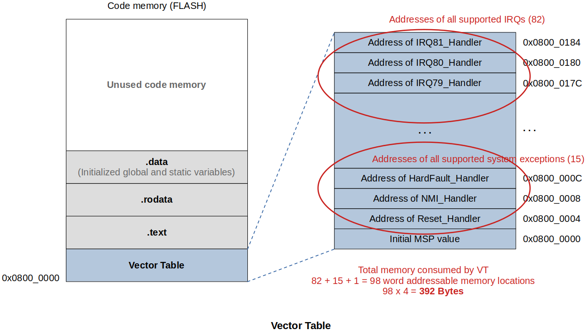
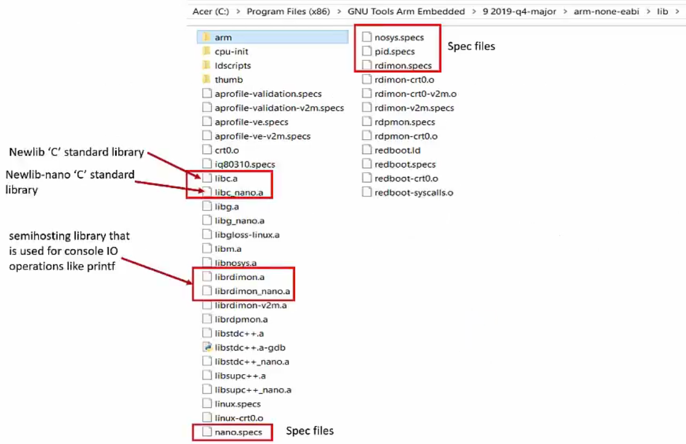
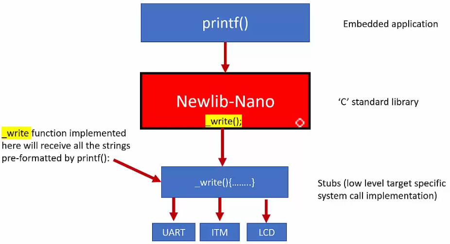
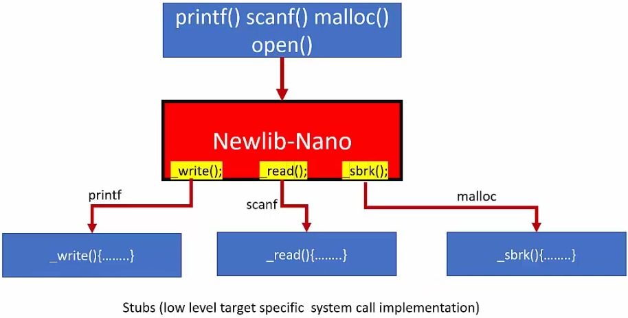

[Home](../../) | [Projects](../../projects) | [Notes](../) > <a href="./">ARM Cortex-M3/M4 Processor</a> > Startup File

# Startup File


## Importance of Startup File

* A **startup file** is responsible for setting up the proper environment for the main user code to run.
* Code written in startup file runs before `main()` and `main()` gets called by the startup code.
* Some part of the startup file is target (i.e., processor) dependent. (e.g., Vector table, initializing the stack, turning on/off the processor-specific peripherals such as FPU, etc.)
* Startup code takes care of the vector table placement in code memory as required by the ARM Cortex-M processor.
* Startup code may also take care stack reinitialization. (You can alter the stack placement.)
* Startup code is responsible for `.data` and `.bss` sections initialization in main memory. It needs to properly copy the `.data` section from FLASH to SRAM, and properly initialize the `.bss` section to SRAM.
* Only after the initial environment is properly setup, the startup code can call the `main()`.


## Write the Startup File

### Instruction

1. Create a vector table for your microcontroller. Vector tables are MCU-specific.
2. Write a startup code which initializes `.data` and `.bss` section in SRAM. (`Reset_Handler()`)
3. Call `main()`

Startup file can be a C file (.c) or an assembly file (.s).

[!] Note: Vector table information can be found in the *MCU Reference Manual*. Different exceptions for different microcontrollers. Check the documentation!





#### 1. Create a Vector table

* A vector table is essentially an array of addresses. Create an array to hold MSP and the addresses of handlers for system exceptions and IRQs.

  ```c
  uint32_t vectors[] = {
      MSP address, 
      System exception handler addresses, 
      IRQ handler addresses
  };
  ```

* This array is an "Initialized data" from the program's point of view so, by default, the compiler will try to placed it in the `.data` section. We don't want that! Vector table must be located in the starting address of the code memory! 

  $\to$ Instruct the linker to place this array in a user defined section (NOT the `.data` section!)

  $\to$ GCC documentation $\to$ Common Variable Attributes $\to$ section ("*section-name*")

  > Normally, the compiler places the objects it generates in sections like `data` and `bss`.  Sometimes, however, you need additional sections, or you need certain particular variables to appear in special sections, for example to map to special hardware.  The `section` attribute specifies that a variable (or function) lives in a particular section. 
  >
  > Syntax:
  >
  > ```c
  > struct duart a __attribute__ ((section ("DUART_A"))) = { 0 };
  > 	// place object 'a' in 'DUART_A' section
  > struct duart b __attribute__ ((section ("DUART_B"))) = { 0 };
  > char stack[10000] __attribute__ ((section ("STACK"))) = { 0 };
  > int init_data __attribute__ ((section ("INITDATA")));
  > void func(void) __attribute__ ((section (".random section")));
  > 
  > main()
  > {
  >   /* Initialize stack pointer */
  >   init_sp (stack + sizeof (stack));
  > 
  >   /* Initialize initialized data */
  >   memcpy (&init_data, &data, &edata - &data);
  > 
  >   /* Turn on the serial ports */
  >   init_duart (&a);
  >   init_duart (&b);
  > }
  > ```
  >
  > You can test these by inspecting the object file using the **objdump** tool.

* Updated vector table with the section to be placed specified:

  ```c
  uint32_t vectors[] __attribute__((section(".isr_vector")))= {	// leading '.' not mandatory
      MSP address, 
      System exception handler addresses, 
      IRQ handler addresses
  };
  ```

  Or,

  ```c
  uint32_t vectors[] = {	// leading '.' not mandatory
      MSP address, 
      System exception handler addresses, 
      IRQ handler addresses
  }; __attribute__((section(".isr_vector")))
  ```

  Then you can check with the following command that `.isr_vector` section has been created:

  ```plain
  $ arm-none-eabi-objdump -h stm32_startup.o
  
  stm32_startup.o:     file format elf32-littlearm
  
  Sections:
  Idx Name          Size      VMA       LMA       File off  Algn
    0 .text         00000000  00000000  00000000  00000034  2**1
                    CONTENTS, ALLOC, LOAD, READONLY, CODE
    1 .data         00000008  00000000  00000000  00000034  2**2
                    CONTENTS, ALLOC, LOAD, RELOC, DATA
    2 .bss          00000000  00000000  00000000  0000003c  2**0
                    ALLOC
    3 .isr_vector   0000000c  00000000  00000000  0000003c  2**1
                    CONTENTS, ALLOC, LOAD, READONLY, CODE
    4 .comment      00000034  00000000  00000000  00000048  2**0
                    CONTENTS, READONLY
    5 .ARM.attributes 0000002e  00000000  00000000  0000007c  2**0
                    CONTENTS, READONLY
  ```

* Now, we've got 97 exceptions (15 system exceptions + 82 interrupts). Do we need to write the handlers for all these at this point?

  Not required! You can create a single default handler for all the exceptions and allow the programmer to implement the required handlers as per the application requirements. (Not all applications require all 97 exceptions to be implemented.)

  We'll create a `Default_Handler()` for this reason!

* GCC attributes for functions: `weak` and `alias`

  * `weak`

    Lets programmer to override already defined weak function (dummy) with the same function name

  * `alias`

    Lets programmer to give alias for a function

  Check GCC documentation for more info!

  ```c
  void NMI_Handler(void)          __attribute__((weak, alias("Default_Handler")));
  void HardFault_Handler(void)    __attribute__((weak, alias("Default_Handler")));
  ```

  > Here, `Default_Handler()` is an alias for `NMI_Handler()`. 
  >
  > In the vector table array, address of `Default_Handler()` function will be stored in place of the address of an unimplemented handler. So, when NMI exception (which is not yet defined at this point) triggers, `Default_Handler()` will be executed. (Redirected!)
  >
  > Thanks to the `weak` attribute, a programmer can simply override the handler function (with the same function name without `__attribute__...` attached when necessary. Then the control will not be directed to the `Default_Handler()` but to the overridden function.

* Except for the first entry, which must contain a valid SP value, every **Reserved** entry must be set to 0!

#### 2. Write the `Reset_Handler()`

* Initializing `.data` and `.bss` section in SRAM is taken care of by the `Reset_Handler()`.
* Copying `.data` section from FLASH to SRAM requires some boundary addresses; `_edata`, `_sdata`, `etext`, etc. These information are to be exported from the linker script. So, these are declared with `extern` keyword in the startup file.

#### 3. Call `main()`


## C Standard Library Integration

### Newlib

* Newlib is a C standard library implementation intended for use on embedded systems, and it is introduced by Cygnus Solutions (now Reg Hat).
* Newlib is written as a Glibc(CNU  libc) replacement for embedded systems. It can be used with no OS ("bare-metal") or with a lightweight RTOS.
* Newlib ships with GNU ARM toolchain installation as the default C standard library.
* GNU libc (glibc) includes ISO C, POSIX, System V, and XPG interfaces. $\micro$Clibc provides ISO C, POSIX and System V, while Newlib provides only ISO C.

### Newlib Nano

* Due to the increased feature set in Newlib, it has become too bloated to use on the systems where the amount of memory is very much limited.
* To provide a C library with a minimal memory footprint, suited for use with microcontrollers, ARM introduced Newlib-Nano based on Newlib. (e.g., Newlib Nano does not support `float` data type, by default. To use `float` compiler argument must be set.)

* Locating Newlib and Newlib-Nano library files on Windows:





### Library Integration

* Linker flag to specify the specs file for your project: `--specs=nano.specs`

  This flag should not be used with `-nostdlib` so, if you have it in your LDFLAGS variable in your makefile, remove it.

* When standard library is linked to your project, you will be able to see (by **objdump**ing final ELF file) that a lot of sections are newly added. If there are any duplicate sections, you can merge them into one section by introducing a simple teak to your linker script.

  ```plain
  /* linker script */
  
  SECTIONS
  {
      .text :
      {   
  		...
          *(.text) /* merge .text sections from all(*) input files */
          *(.text.*) /* merge if anything like '.text.<function_name>' gets generated */
          *(.rodata)
          *(.rodata.*)
  		...
      }> FLASH 
  	...
  }
  ```

  > Check out L9 and L11. To this for all the sections.

* Although not mandatory, to merge standard library specific sections (`.init`, `.fini`) to `.text` section:

  ```plain
  /* objdump of final ELF */
  
  final.elf:     file format elf32-littlearm
  
  Sections:
  Idx Name          Size      VMA       LMA       File off  Algn
    0 .text         00002744  08000000  08000000  00010000  2**2
                    CONTENTS, ALLOC, LOAD, READONLY, CODE
    1 .init         00000018  08002744  08002744  00012744  2**2
                    CONTENTS, ALLOC, LOAD, READONLY, CODE
    2 .fini         00000018  0800275c  0800275c  0001275c  2**2
                    CONTENTS, ALLOC, LOAD, READONLY, CODE
    3 .eh_frame     00000004  08002774  08002774  00012774  2**2
                    CONTENTS, ALLOC, LOAD, READONLY, DATA
    4 .ARM.exidx    00000008  08002778  08002778  00012778  2**2
                    CONTENTS, ALLOC, LOAD, READONLY, DATA
    5 .data         00000074  20000000  08002780  00020000  2**2
                    CONTENTS, ALLOC, LOAD, DATA
  ```

  Do as following in your linker script:

  ```
  /* linker script */
  
  SECTIONS
  {
      .text :
      {   
  		...
          *(.text) 
          *(.text.*) 
          *(.init) /* merge c standard library specific section into .text */
  		*(fini) /* merge c standard library specific section into .text */
          *(.rodata)
          *(.rodata.*)
  		...
      }> FLASH 
  	...
  }

* Recap the flow of the `Reset_Handler()`: Initialize `.data` section $\to$ Initialize `.bss` section $\to$ Initialize C standard library $\to$ call `main()`.

  Now, to initialize the C standard library, we need to call `__libc_init_array()`.


## Low-Level System Calls

* The idea of Newlib is to implement the hardware-independent parts of the standard C library and rely on a few low-level system calls that must be implemented with the target hardware in mind.

  Newlib does not provide low-level system calls which are going to operate on some of the hardware components of a microcontroller. You, as a programmer, have to provide those low-level system calls.

* When you are using Newlib, you must implement the system calls appropriately to support devices, file-systems, and memory management.

* Example of a low-level system call:

  Inside the system call `_write()` you need to write a code depending on which hardware component of the microcontroller you want to associate the `printf()` functionality with.

  




* Likewise, you have to provide the implementation for many different low-level system calls such as `_read()`, `_sbrk()`, etc.





* Write a `syscalls.c` file which includes hardware-specific function definitions of the system calls, and place it in your project folder.

* Sometimes, during the build process, you may encounter some errors like the following:

  ```plain
  $ make
  
  arm-none-eabi-gcc -c -mcpu=cortex-m4 -mthumb -std=gnu11 -O0 -o main.o main.c	# recipie: command to generate the target
  # arm-none-eabi-gcc -c -mcpu=cortex-m4 -mthumb -std=gnu11 -O0 main.c -o main.o
  # arm-none-eabi-gcc -c -mcpu=cortex-m4 -mthumb -std=gnu11 -O0 main.c -o main.o
  # 'main.c' represents dependency, 'main.o' represents target (@ does look like a target :))
  arm-none-eabi-gcc -c -mcpu=cortex-m4 -mthumb -std=gnu11 -O0 -o led.o led.c 
  arm-none-eabi-gcc -c -mcpu=cortex-m4 -mthumb -std=gnu11 -O0 -o stm32_startup.o stm32_startup.c 
  arm-none-eabi-gcc -c -mcpu=cortex-m4 -mthumb -std=gnu11 -O0 -o syscalls.o syscalls.c 
  arm-none-eabi-gcc --specs=nano.specs -T stm32_ls.ld -Wl,-Map=final.map -o final.elf main.o led.o stm32_startup.o syscalls.o 
  /usr/lib/gcc/arm-none-eabi/10.3.1/../../../arm-none-eabi/bin/ld: /usr/lib/gcc/arm-none-eabi/10.3.1/../../../arm-none-eabi/lib/crt0.o: in function `_mainCRTStartup':
  /build/newlib-pB30de/newlib-3.3.0/build/arm-none-eabi/libgloss/arm/semihv2m/../../../../../libgloss/arm/crt0.S:547: undefined reference to `__bss_start__'
  /usr/lib/gcc/arm-none-eabi/10.3.1/../../../arm-none-eabi/bin/ld: /build/newlib-pB30de/newlib-3.3.0/build/arm-none-eabi/libgloss/arm/semihv2m/../../../../../libgloss/arm/crt0.S:547: undefined reference to `__bss_end__'
  /usr/lib/gcc/arm-none-eabi/10.3.1/../../../arm-none-eabi/bin/ld: syscalls.o: in function `_sbrk':
  syscalls.c:(.text+0x258): undefined reference to `end'
  collect2: error: ld returned 1 exit status
  make: *** [makefile:28: final.elf] Error 1
  
  ```

  > This simply means that the system call `_mainCRTStartup()` wants symbols `__bss_start__`, `__bss_end__` and the system call `_sbrk()` wants a symbol `end` but, the linker cannot find (locate) them.
  >
  > These type of error can be resolved by simply defining these symbols in your linker script so that the linker can resolve all the references without problem.

* WARNING!

  When there is any section change introduced over the course, make sure if the symbols that are used in the `.data` section transfer code in the `Reset_Handler()` since the boundary may have been changed due to the newly introduced section around `.data` section in FLASH.


## Floating-Point ABI

* If your application requires floating-point arithmetic, there are a couple of decisions you need to make. You can use,

  * The hardware Floating-Point Unit (FPU) if supported by the processor

    e.g., STM32**F**x (ARM Coretex-M4) supports FPU

    Attempting to use FPU without initializing it will cause the HardFault exception! Make sure to enable it.

  * The library functions if FPU not supported by the processor (or even if supported by the processor)

  Checkout `mfloat-abi=` flag to see how you make the choice!


## Example of a Startup File

* Startup file written on bare-metal board from scratch.

  ```c
  /* stm32_startup.c */
  
  #include <stdint.h>
  
  #define SRAM_START 0x20000000U
  #define SRAM_SIZE (128 * 1024) // 128 KB (SRAM1 + SRAM2)
  #define SRAM_END ((SRAM_START) + (SRAM_SIZE))
  
  #define STACK_START SRAM_END
  
  /* linker symbols */
  extern uint32_t _etext;
  extern uint32_t _sdata;
  extern uint32_t _edata;
  extern uint32_t _la_data;
  extern uint32_t _sbss;
  extern uint32_t _ebss;
  
  int main(void);
  void __libc_init_array(void);
  
  
  /* function prototypes of STM32F407x systems exception and IRQ handlers */
  /* vector table entries */
  
  void Reset_Handler(void);
  
  void NMI_Handler 					(void) __attribute__ ((weak, alias("Default_Handler")));
  void HardFault_Handler 				(void) __attribute__ ((weak, alias("Default_Handler")));
  void MemManage_Handler 				(void) __attribute__ ((weak, alias("Default_Handler")));
  void BusFault_Handler 				(void) __attribute__ ((weak, alias("Default_Handler")));
  void UsageFault_Handler 			(void) __attribute__ ((weak, alias("Default_Handler")));
  void SVC_Handler 					(void) __attribute__ ((weak, alias("Default_Handler")));
  void DebugMon_Handler 				(void) __attribute__ ((weak, alias("Default_Handler")));
  void PendSV_Handler   				(void) __attribute__ ((weak, alias("Default_Handler")));
  void SysTick_Handler  				(void) __attribute__ ((weak, alias("Default_Handler")));
  void WWDG_IRQHandler 				(void) __attribute__ ((weak, alias("Default_Handler")));
  void PVD_IRQHandler 				(void) __attribute__ ((weak, alias("Default_Handler")));
  void TAMP_STAMP_IRQHandler 			(void) __attribute__ ((weak, alias("Default_Handler")));
  void RTC_WKUP_IRQHandler 			(void) __attribute__ ((weak, alias("Default_Handler")));
  void RCC_IRQHandler 				(void) __attribute__ ((weak, alias("Default_Handler")));
  void EXTI0_IRQHandler 				(void) __attribute__ ((weak, alias("Default_Handler")));
  void EXTI1_IRQHandler 				(void) __attribute__ ((weak, alias("Default_Handler")));
  void EXTI2_IRQHandler 				(void) __attribute__ ((weak, alias("Default_Handler")));
  void EXTI3_IRQHandler 				(void) __attribute__ ((weak, alias("Default_Handler")));
  void EXTI4_IRQHandler 				(void) __attribute__ ((weak, alias("Default_Handler")));
  void DMA1_Stream0_IRQHandler 		(void) __attribute__ ((weak, alias("Default_Handler")));
  void DMA1_Stream1_IRQHandler 		(void) __attribute__ ((weak, alias("Default_Handler")));
  void DMA1_Stream2_IRQHandler 		(void) __attribute__ ((weak, alias("Default_Handler")));
  void DMA1_Stream3_IRQHandler 		(void) __attribute__ ((weak, alias("Default_Handler")));
  void DMA1_Stream4_IRQHandler 		(void) __attribute__ ((weak, alias("Default_Handler")));
  void DMA1_Stream5_IRQHandler 		(void) __attribute__ ((weak, alias("Default_Handler")));
  void DMA1_Stream6_IRQHandler 		(void) __attribute__ ((weak, alias("Default_Handler")));
  void ADC_IRQHandler 				(void) __attribute__ ((weak, alias("Default_Handler")));
  void CAN1_TX_IRQHandler 			(void) __attribute__ ((weak, alias("Default_Handler")));
  void CAN1_RX0_IRQHandler 			(void) __attribute__ ((weak, alias("Default_Handler")));
  void CAN1_RX1_IRQHandler 			(void) __attribute__ ((weak, alias("Default_Handler")));
  void CAN1_SCE_IRQHandler 			(void) __attribute__ ((weak, alias("Default_Handler")));
  void EXTI9_5_IRQHandler 			(void) __attribute__ ((weak, alias("Default_Handler")));
  void TIM1_BRK_TIM9_IRQHandler 		(void) __attribute__ ((weak, alias("Default_Handler")));
  void TIM1_UP_TIM10_IRQHandler 		(void) __attribute__ ((weak, alias("Default_Handler")));
  void TIM1_TRG_COM_TIM11_IRQHandler 	(void) __attribute__ ((weak, alias("Default_Handler")));
  void TIM1_CC_IRQHandler 			(void) __attribute__ ((weak, alias("Default_Handler")));
  void TIM2_IRQHandler 				(void) __attribute__ ((weak, alias("Default_Handler")));
  void TIM3_IRQHandler 				(void) __attribute__ ((weak, alias("Default_Handler")));
  void TIM4_IRQHandler 				(void) __attribute__ ((weak, alias("Default_Handler")));
  void I2C1_EV_IRQHandler 			(void) __attribute__ ((weak, alias("Default_Handler")));
  void I2C1_ER_IRQHandler 			(void) __attribute__ ((weak, alias("Default_Handler")));
  void I2C2_EV_IRQHandler 			(void) __attribute__ ((weak, alias("Default_Handler")));
  void I2C2_ER_IRQHandler 			(void) __attribute__ ((weak, alias("Default_Handler")));
  void SPI1_IRQHandler  				(void) __attribute__ ((weak, alias("Default_Handler")));
  void SPI2_IRQHandler 				(void) __attribute__ ((weak, alias("Default_Handler")));
  void USART1_IRQHandler  			(void) __attribute__ ((weak, alias("Default_Handler")));
  void USART2_IRQHandler  			(void) __attribute__ ((weak, alias("Default_Handler")));
  void USART3_IRQHandler   			(void) __attribute__ ((weak, alias("Default_Handler")));
  void EXTI15_10_IRQHandler   		(void) __attribute__ ((weak, alias("Default_Handler")));
  void RTC_Alarm_IRQHandler    		(void) __attribute__ ((weak, alias("Default_Handler")));
  void OTG_FS_WKUP_IRQHandler     	(void) __attribute__ ((weak, alias("Default_Handler")));
  void TIM8_BRK_TIM12_IRQHandler   	(void) __attribute__ ((weak, alias("Default_Handler")));
  void TIM8_UP_TIM13_IRQHandler    	(void) __attribute__ ((weak, alias("Default_Handler")));
  void TIM8_TRG_COM_TIM14_IRQHandler 	(void) __attribute__ ((weak, alias("Default_Handler")));
  void TIM8_CC_IRQHandler          	(void) __attribute__ ((weak, alias("Default_Handler")));
  void DMA1_Stream7_IRQHandler     	(void) __attribute__ ((weak, alias("Default_Handler")));
  void FSMC_IRQHandler             	(void) __attribute__ ((weak, alias("Default_Handler")));
  void SDIO_IRQHandler             	(void) __attribute__ ((weak, alias("Default_Handler")));
  void TIM5_IRQHandler             	(void) __attribute__ ((weak, alias("Default_Handler")));
  void SPI3_IRQHandler             	(void) __attribute__ ((weak, alias("Default_Handler")));
  void UART4_IRQHandler            	(void) __attribute__ ((weak, alias("Default_Handler")));
  void UART5_IRQHandler            	(void) __attribute__ ((weak, alias("Default_Handler")));
  void TIM6_DAC_IRQHandler         	(void) __attribute__ ((weak, alias("Default_Handler")));
  void TIM7_IRQHandler             	(void) __attribute__ ((weak, alias("Default_Handler")));
  void DMA2_Stream0_IRQHandler     	(void) __attribute__ ((weak, alias("Default_Handler")));
  void DMA2_Stream1_IRQHandler     	(void) __attribute__ ((weak, alias("Default_Handler")));
  void DMA2_Stream2_IRQHandler     	(void) __attribute__ ((weak, alias("Default_Handler")));
  void DMA2_Stream3_IRQHandler     	(void) __attribute__ ((weak, alias("Default_Handler")));
  void DMA2_Stream4_IRQHandler     	(void) __attribute__ ((weak, alias("Default_Handler")));
  void ETH_IRQHandler              	(void) __attribute__ ((weak, alias("Default_Handler")));
  void ETH_WKUP_IRQHandler         	(void) __attribute__ ((weak, alias("Default_Handler")));
  void CAN2_TX_IRQHandler          	(void) __attribute__ ((weak, alias("Default_Handler")));
  void CAN2_RX0_IRQHandler         	(void) __attribute__ ((weak, alias("Default_Handler")));
  void CAN2_RX1_IRQHandler         	(void) __attribute__ ((weak, alias("Default_Handler")));
  void CAN2_SCE_IRQHandler         	(void) __attribute__ ((weak, alias("Default_Handler")));
  void OTG_FS_IRQHandler           	(void) __attribute__ ((weak, alias("Default_Handler")));
  void DMA2_Stream5_IRQHandler     	(void) __attribute__ ((weak, alias("Default_Handler")));
  void DMA2_Stream6_IRQHandler     	(void) __attribute__ ((weak, alias("Default_Handler")));
  void DMA2_Stream7_IRQHandler     	(void) __attribute__ ((weak, alias("Default_Handler")));
  void USART6_IRQHandler           	(void) __attribute__ ((weak, alias("Default_Handler")));
  void I2C3_EV_IRQHandler          	(void) __attribute__ ((weak, alias("Default_Handler")));
  void I2C3_ER_IRQHandler          	(void) __attribute__ ((weak, alias("Default_Handler")));
  void OTG_HS_EP1_OUT_IRQHandler   	(void) __attribute__ ((weak, alias("Default_Handler")));
  void OTG_HS_EP1_IN_IRQHandler    	(void) __attribute__ ((weak, alias("Default_Handler")));
  void OTG_HS_WKUP_IRQHandler      	(void) __attribute__ ((weak, alias("Default_Handler")));
  void OTG_HS_IRQHandler           	(void) __attribute__ ((weak, alias("Default_Handler")));
  void DCMI_IRQHandler             	(void) __attribute__ ((weak, alias("Default_Handler")));
  void CRYP_IRQHandler             	(void) __attribute__ ((weak, alias("Default_Handler")));
  void HASH_RNG_IRQHandler         	(void) __attribute__ ((weak, alias("Default_Handler")));
  void FPU_IRQHandler              	(void) __attribute__ ((weak, alias("Default_Handler")));
  
  /* vector table */
  uint32_t vectors[] __attribute__((section(".isr_vector"))) = {
  	STACK_START,	// first entry of VT is a valid stack pointer
  	(uint32_t)&Reset_Handler,
  	(uint32_t)&NMI_Handler,
  	(uint32_t)HardFault_Handler,
  	(uint32_t)MemManage_Handler,
  	(uint32_t)BusFault_Handler,
  	(uint32_t)UsageFault_Handler,
  	0,
  	0,
  	0,
  	0,
  	(uint32_t)SVC_Handler,
  	(uint32_t)DebugMon_Handler,
  	0,
  	(uint32_t)PendSV_Handler,
  	(uint32_t)SysTick_Handler,
  	(uint32_t)WWDG_IRQHandler,
  	(uint32_t)PVD_IRQHandler,         
  	(uint32_t)TAMP_STAMP_IRQHandler,  
  	(uint32_t)RTC_WKUP_IRQHandler,    
  	0,                      
  	(uint32_t)RCC_IRQHandler,         
  	(uint32_t)EXTI0_IRQHandler,       
  	(uint32_t)EXTI1_IRQHandler,       
  	(uint32_t)EXTI2_IRQHandler,       
  	(uint32_t)EXTI3_IRQHandler,       
  	(uint32_t)EXTI4_IRQHandler,       
  	(uint32_t)DMA1_Stream0_IRQHandler,
  	(uint32_t)DMA1_Stream1_IRQHandler,
  	(uint32_t)DMA1_Stream2_IRQHandler,
  	(uint32_t)DMA1_Stream3_IRQHandler,
  	(uint32_t)DMA1_Stream4_IRQHandler,
  	(uint32_t)DMA1_Stream5_IRQHandler,
  	(uint32_t)DMA1_Stream6_IRQHandler,
  	(uint32_t)ADC_IRQHandler,         
  	(uint32_t)CAN1_TX_IRQHandler,     
  	(uint32_t)CAN1_RX0_IRQHandler,    
  	(uint32_t)CAN1_RX1_IRQHandler,    
  	(uint32_t)CAN1_SCE_IRQHandler,    
  	(uint32_t)EXTI9_5_IRQHandler,     
  	(uint32_t)TIM1_BRK_TIM9_IRQHandler,
  	(uint32_t)TIM1_UP_TIM10_IRQHandler,
  	(uint32_t)TIM1_TRG_COM_TIM11_IRQHandler,
  	(uint32_t)TIM1_CC_IRQHandler,     
  	(uint32_t)TIM2_IRQHandler,        
  	(uint32_t)TIM3_IRQHandler,        
  	(uint32_t)TIM4_IRQHandler,        
  	(uint32_t)I2C1_EV_IRQHandler,     
  	(uint32_t)I2C1_ER_IRQHandler,     
  	(uint32_t)I2C2_EV_IRQHandler,     
  	(uint32_t)I2C2_ER_IRQHandler,     
  	(uint32_t)SPI1_IRQHandler,        
  	(uint32_t)SPI2_IRQHandler,        
  	(uint32_t)USART1_IRQHandler,      
  	(uint32_t)USART2_IRQHandler,      
  	(uint32_t)USART3_IRQHandler,      
  	(uint32_t)EXTI15_10_IRQHandler,   
  	(uint32_t)RTC_Alarm_IRQHandler,   
  	(uint32_t)OTG_FS_WKUP_IRQHandler, 
  	(uint32_t)TIM8_BRK_TIM12_IRQHandler,
  	(uint32_t)TIM8_UP_TIM13_IRQHandler,
  	(uint32_t)TIM8_TRG_COM_TIM14_IRQHandler,
  	(uint32_t)TIM8_CC_IRQHandler,     
  	(uint32_t)DMA1_Stream7_IRQHandler,
  	(uint32_t)FSMC_IRQHandler,        
  	(uint32_t)SDIO_IRQHandler,        
  	(uint32_t)TIM5_IRQHandler,        
  	(uint32_t)SPI3_IRQHandler,        
  	(uint32_t)UART4_IRQHandler,       
  	(uint32_t)UART5_IRQHandler,       
  	(uint32_t)TIM6_DAC_IRQHandler,    
  	(uint32_t)TIM7_IRQHandler,        
  	(uint32_t)DMA2_Stream0_IRQHandler,
  	(uint32_t)DMA2_Stream1_IRQHandler,
  	(uint32_t)DMA2_Stream2_IRQHandler,
  	(uint32_t)DMA2_Stream3_IRQHandler,
  	(uint32_t)DMA2_Stream4_IRQHandler,
  	(uint32_t)ETH_IRQHandler,         
  	(uint32_t)ETH_WKUP_IRQHandler,    
  	(uint32_t)CAN2_TX_IRQHandler,     
  	(uint32_t)CAN2_RX0_IRQHandler,    
  	(uint32_t)CAN2_RX1_IRQHandler,    
  	(uint32_t)CAN2_SCE_IRQHandler,    
  	(uint32_t)OTG_FS_IRQHandler,      
  	(uint32_t)DMA2_Stream5_IRQHandler,
  	(uint32_t)DMA2_Stream6_IRQHandler,
  	(uint32_t)DMA2_Stream7_IRQHandler,
  	(uint32_t)USART6_IRQHandler,      
  	(uint32_t)I2C3_EV_IRQHandler,     
  	(uint32_t)I2C3_ER_IRQHandler,     
  	(uint32_t)OTG_HS_EP1_OUT_IRQHandler,
  	(uint32_t)OTG_HS_EP1_IN_IRQHandler,
  	(uint32_t)OTG_HS_WKUP_IRQHandler, 
  	(uint32_t)OTG_HS_IRQHandler,      
  	(uint32_t)DCMI_IRQHandler,        
  	(uint32_t)CRYP_IRQHandler,        
  	(uint32_t)HASH_RNG_IRQHandler,    
  	(uint32_t)FPU_IRQHandler,         
  };
  
  /* dummy function (unimplemented handlers will be directed to this function) */
  void Default_Handler(void)
  {
  	while (1);
  }
  
  void Reset_Handler(void)
  {
  	/* copy .data section from FLASH to SRAM */
  	uint32_t size = (uint32_t)&_edata - (uint32_t)&_sdata;
  	
  	uint8_t *pDst = (uint8_t*)&_sdata; //sram
  	//uint8_t *pSrc = (uint8_t*)&_etext; //flash
  	uint8_t *pSrc = (uint8_t*)&_la_data; //flash
  	
  	for(uint32_t i =0 ; i < size ; i++)
  	{
  		*pDst++ = *pSrc++;
  	}
  	
  	/* initialize the .bss section to zero in SRAM */
  	size = (uint32_t)&_ebss - (uint32_t)&_sbss;
  	pDst = (uint8_t*)&_sbss;
  
  	for(uint32_t i =0 ; i < size ; i++)
  	{
  		*pDst++ = 0;
  	}
  
  	/* call init function for standard library (this is required only if your main()
  	   program contains any standard library functions e.g., printf(), scanf(), etc.) */
  	__libc_init_array();
  	
  	main();
  }
  ```

  


## References

Nayak, K. (2022). *Embedded Systems Programming on ARM Cortex-M3/M4 Processor* [Video file]. Retrieved from  https://www.udemy.com/course/embedded-system-programming-on-arm-cortex-m3m4/
