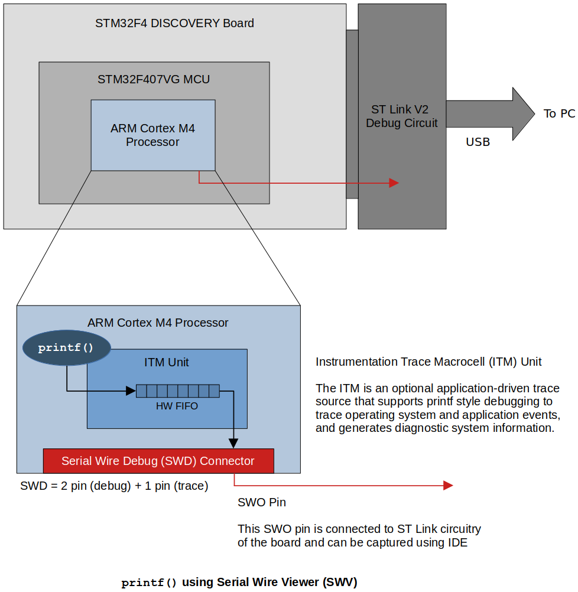
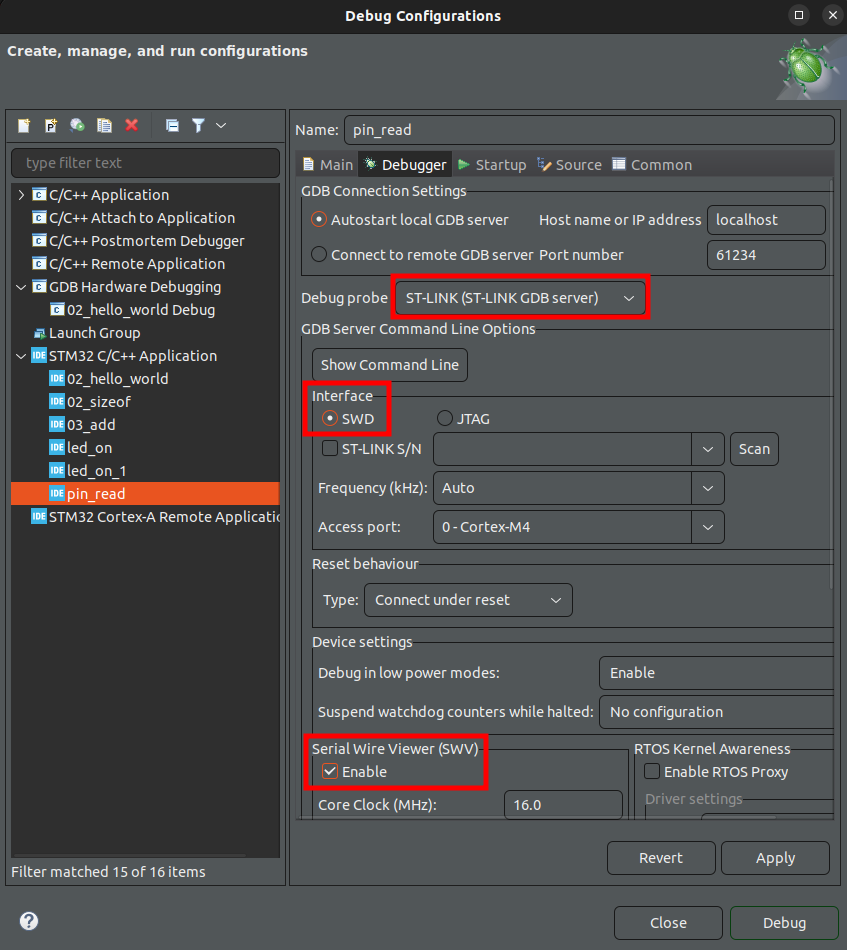
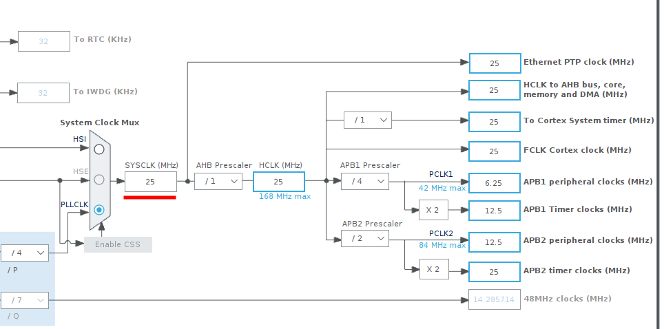

[Home](../../) | [Projects](../../projects) | [Notes](../) > <a href="./">ARM Cortex-M3/M4 Processor</a> > Using `printf()` with Serial Wire Viewer (SWV)

# Using `printf()` with Serial Wire Viewer (SWV)


## Introduction

* **Serial Wire Viewer (SWV)** is a data trace feature found on many ARM Cortex-M3, M4, M7, M23, and M33 processors. Coretx-M0 and Cortex-M0+ do not have SWV. The SWV frames can be sent out either the one pin SWO (Serial Wire Output) pin or the 4 bit Trace Port.

* This notes explains using `printf()` over **Serial Wire Output (SWO)** pin of **Serial Wire Debug (SWD)** interface.


## Serial Wire Debug (SWD)

* Two-wire protocol for accessing the ARM debug interface

* Part of the ARM Debug Interface Specification v5 and is an alternative to JTAG

* The physical layer of SWD consists of two lines:

  * SWDIO - A bidirectional data line that carries debug-related data (e.g., break point)
  * SWCLK - A clock driven by the host (i.e., ST Link circuitry)

  Both of these are managed by the ST Link circuitry on the board.

* By using SWD interface you should be able to program MCUs internal flash, you can access memory regions, and break points, stop/run CPU.

  Also, you can use the serial wire viewer for your `printf()` statements for debugging.

  




* Not all IDEs support capturing SWO pin. **CubeIDE** and **TrueSTUDIO** does!


## Test

* Copy and past the following code (implementation of `ITM_SendChar()`) into the `syscall.c` file of your project. (It goes right after the `#include`s.)

  ```c
  /* syscalls.c */
  
  // Implementation of printf like feature using ARM Cortex M3/M4/ ITM functionality.
  // This function will not work for ARM Cortex M0/M0+.
  // If you are using Cortex M0, then you can use semihosting feature of openOCD.
  
  //Debug Exception and Monitor Control Register base address
  #define DEMCR        			*((volatile uint32_t*) 0xE000EDFCU )
  
  /* ITM register addresses */
  #define ITM_STIMULUS_PORT0   	*((volatile uint32_t*) 0xE0000000 )
  #define ITM_TRACE_EN          	*((volatile uint32_t*) 0xE0000E00 )
  
  // Sends the message to the ITM registers
  void ITM_SendChar(uint8_t ch)
  {
  	//Enable TRCENA
  	DEMCR |= ( 1 << 24);
  
  	//enable stimulus port 0
  	ITM_TRACE_EN |= ( 1 << 0);
  
  	// read FIFO status in bit [0]:
  	while(!(ITM_STIMULUS_PORT0 & 1));
  
  	//Write to ITM stimulus port0
  	ITM_STIMULUS_PORT0 = ch;
  }
  ```

* Also, in the `_write()` system call, do the following modification:

  ```c
  /* syscalls.c */
  
  __attribute__((weak)) int _write(int file, char *ptr, int len)
  {
  	int DataIdx;
  
  	for (DataIdx = 0; DataIdx < len; DataIdx++)
  	{
  		// __io_putchar(*ptr++); // commented out by Klee to implement printf like feature
  		ITM_SendChar(*ptr++); // added this instead to use ITM feature
  	}
  	return len;
  }
  ```

  > Don't forget to make this modification. I've spent hours to figure out why I couldn't see the `printf()` messages from the SWV ITM Data Consol.

* Include `<stdio.h>` in your source file in which `printf()` will be used.

* The way `printf()` works is as follows:

  ```c
  /* your project */
  printf();
  ```

  ```c
  /* printf implementation in the standard library */
  printf()
  {
      __write();
  }
  ```

  ```c
  /* your project (in syscall.c) */
  __write()
  {
      ITM_SendChar();
      LCD_SendChar();		/* if using LCD */
      UART_SendChar();	/* if using UART */
      ...
  }
  ```

* To use `printf()` on the program for target board, set the Debug Configurations as follows:

  

  


* When configuring the debugger settings to use `printf()` over SWO pin, you also need to set the system clock speed.

  Go to "Device Configuration Tool" $\to$ Clock Configuration, and check the following: (In the following example, system's clock runs at 25 MHz)

  

  

  

  Then also set the system clock speed to 25 MHz in the Debug Configuration window!

* Debug as target application

  Window $\to$ SWV $\to$ SWV ITM Data Console

  Click "Configure trace" and select the port 0

  Now, click on the "Start trace" button and run the code.


## SWD vs. JTAG

* JTAG was the traditional mechanism for debug connections for ARM 7/9 family, but with the Cortex-M family, ARM introduced the Serial Wire Debug (SWD) interface.
* SWD is designed to reduce the pin countr required for debug from 4 used by JTAG (excluding GND) down to 2. 
* In addition, SWD interface provides one more pin called Serial Wire Output (SWO) which is used for Single Wire Viewing (SWV), which is a loc cost tracing technology.


## References

Nayak, K. (2022). *Embedded Systems Programming on ARM Cortex-M3/M4 Processor* [Video file]. Retrieved from  https://www.udemy.com/course/embedded-system-programming-on-arm-cortex-m3m4/
