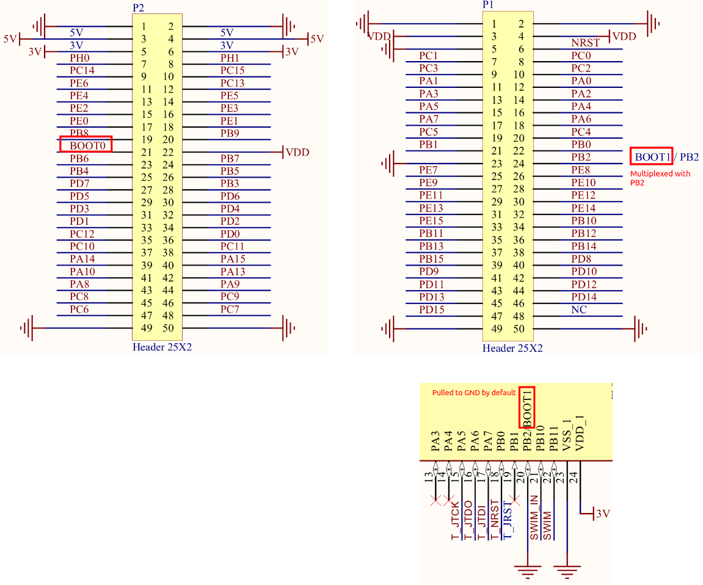

[Home](../../) | [Projects](../../projects) | [Notes](../) > <a href="./">Bootloader</a> > Boot Configuration

# Boot Configuration

## Boot Configuration of STM32F407xx MCU

* Depending on the configuration of the "boot mode selection pins," the memory region from which the boot will take place, which is to be mapped to the memory address 0x0000 0000, will be chosen differently.
* For example, when the BOOT1 pin is pulled to GND and the BOOT0 pin is pulled to high (3V), then the boot will take place from the "system memory". (i.e., The memory address 0x0000 0000 will be aliased to the start address of the system memory.)

## Boot Pins of STM32F407xx MCU

* Although it appears that the BOOT1/PB2 pin is pulled to GND by default,  it was not the case when I tested it with the STM32F407-Discovery board. If you want to boot from the system memory, make sure to connect the  BOOT1/PB2 pin to GND, in addition to connecting the BOOT0 pin to Vcc  (3V).

