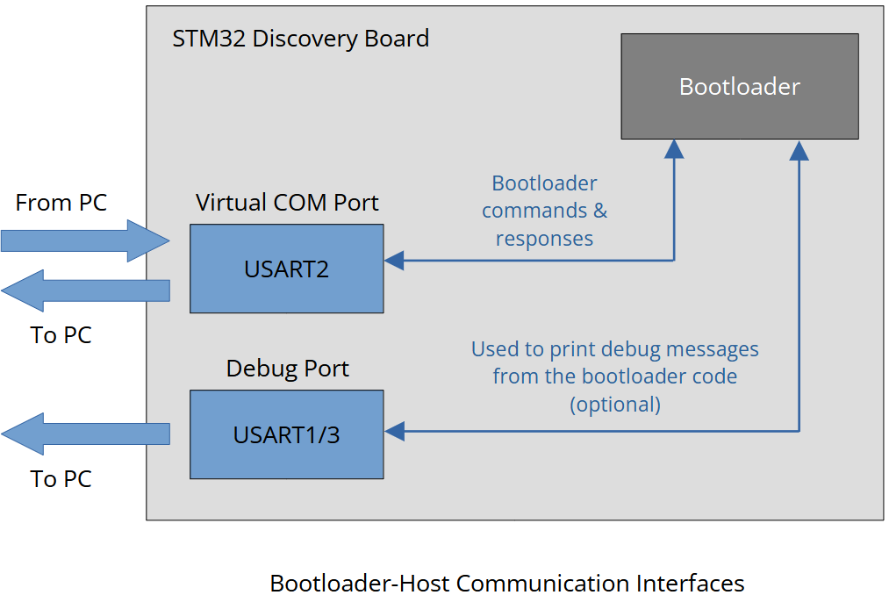
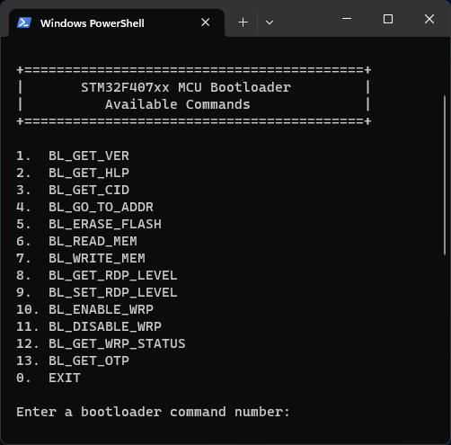
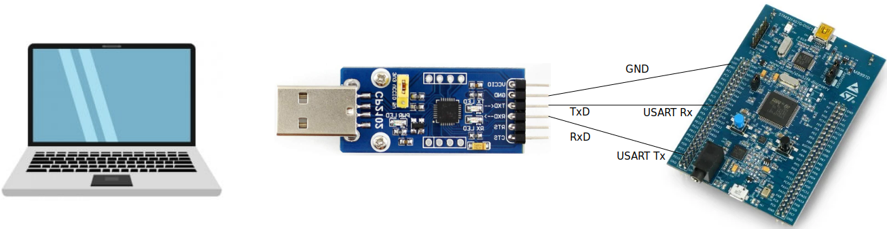
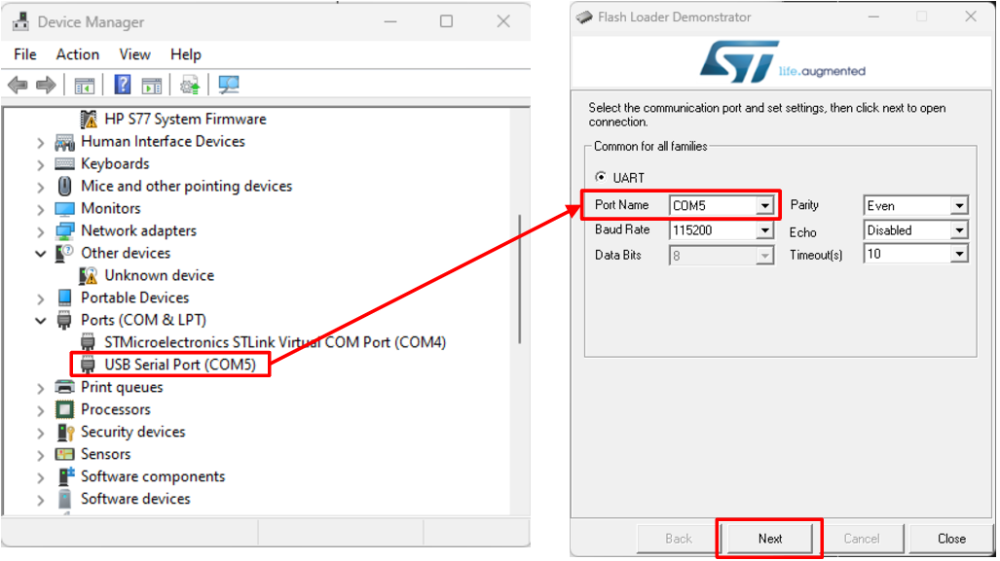

[Home](../../) | [Projects](../../projects) | [Notes](../) > <a href="./">Bootloader</a> > Bootloader-Host Communication

# Bootloader-Host Communication

## Introduction

* According to the Application Note (AN2606), the bootloader of the STM32F40xxx MCU can communicate with the host over various peripheral interfaces such as USART, CAN, etc.

* USART2 peripheral is used for the **Virtual COM Port** support.

## Bootloader-Host Communication over USART Peripheral Interface

### Overview

### Host Application

* The host application runs on a host machine and provides the user with an interactive menu of the available bootloader commands.

### Using the Virtual COM Port

* For STM32F407-Discovery board, the USB-to-UART converter will be necessary. (See [Virtual COM Port (VCP) Support](./virtual-com-port-support))
* For STM32F446-Nucleo board,  the USB-to-UART converter will not be necessary since the USART2 peripheral can communicate with the host directly over the USB interface.

### Using the Debug Port (Optional)

* Select one USART peripheral (i.e., USART1 or USART3)
  * Note that the USART2 peripheral is not available for the system memory boot mode since it is used for the Virtual COM Port support.

* Connect the board to the host PC using the **USB-to-UART adapter** as shown in the image below.

* Download the **STM32 Flash Loader Demonstrator** (UM0462) (replaced by STM32CubeProgrammer)

* To boot from the system memory, configure the boot pins as follows:

  * BOOT0 - HIGH (Vcc = 3V)
  * BOOT1 - LOW (GND)

  Although it appears that the BOOT1/PB2 pin is pulled to GND by default,  it was not the case when I tested it with the STM32F407-Discovery board. If you want to boot from the system memory, make sure to connect the  BOOT1/PB2 pin to GND, in addition to connecting the BOOT0 pin to Vcc  (3V).

* Run the **STM32 Flash Loader Demonstrator**, select the correct port for the USB-to-UART communication and press next. You should be brought to the next page if everything has been successful.

