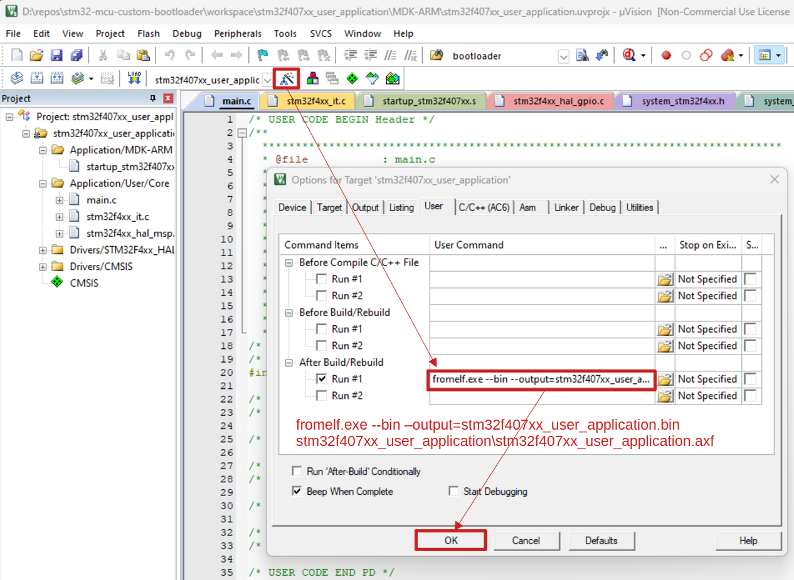

[Home](../../) | [Projects](../../projects) | [Notes](../) > <a href="./">Bootloader</a> > Generating Binary File using Keil MDK

# Generating Binary File using Keil MDK

## Generating Binary File using Keil MDK

* Go to "Options for Target" $\to$ "User" and define the user command as shown in the snapshot below.

  e.g. `fromelf.exe --bin –output=<file>.bin <propject>\<project>.axf`

* This is necessary when testing the `BL_WRITE_MEM` command. (e.g., Writing binary file to the Flash memory)

