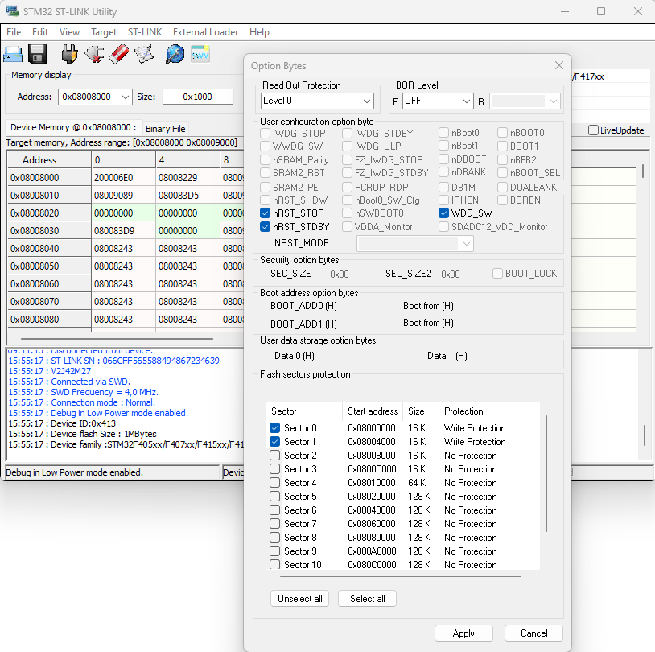
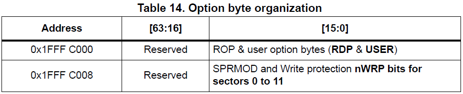
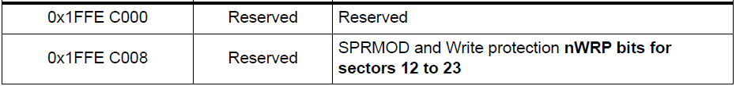
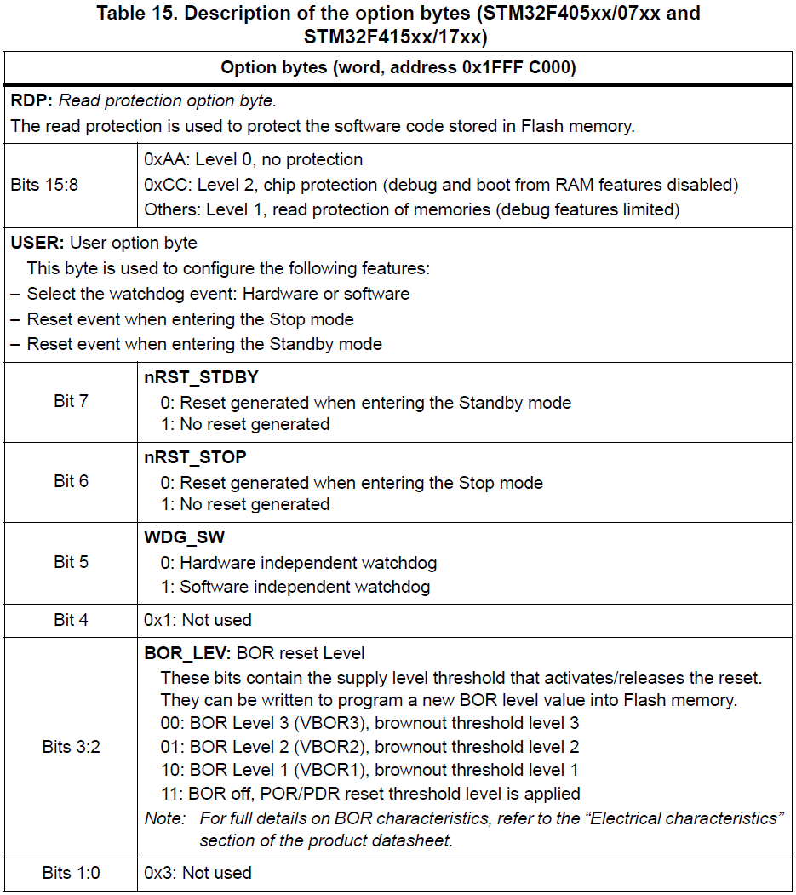
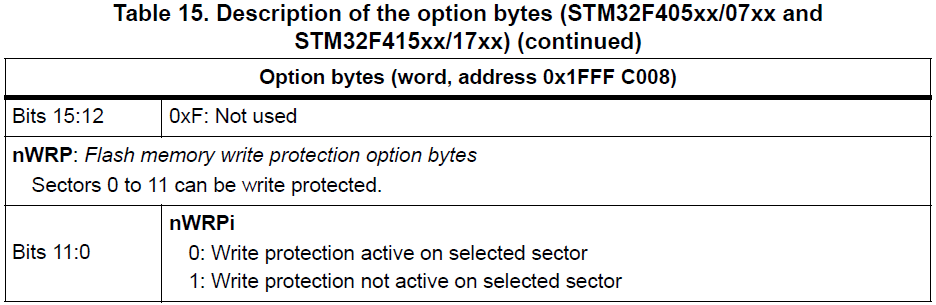
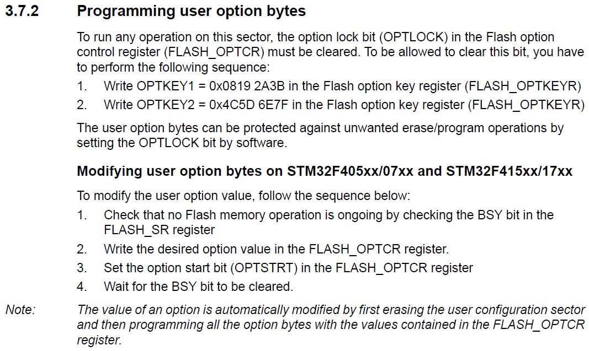

[Home](../../) | [Projects](../../projects) | [Notes](../) > <a href="./">Bootloader</a> > Read Protection Levels

# Read Protection Levels

## Introduction

* By default, all the sectors (0 - 11) of the Flash memory are **writable**, **readable**, and **erasable**. (i.e., **Not protected**)
* You can make each sector **protected** by configuring the relevant registers and the "Option bytes".

* Managing the option-bytes using the **STM32-ST-Link Utility Tool**

  In this tool, you can manually manage the protection levels as follows. However, our goal is to let the host do it via the host application.

  Writing the custom bootloader program into the sectors 0 and 1 after setting them "write protection" will fail. 

* Note that changing the protection level of a sector from other levels to 0 will entail the mass-erase of all sectors.

## Option Bytes

* "Option bytes" are used to manage the security levels of the Flash memory sectors. (Applicable to individual sectors)
* The option bytes are configured by the end user depending on the application requirements. Table 14 shows the organization of these bytes inside the user configuration sector.

## Read Protection (RDP)

* The user area in the Flash memory can be protected against read operations by an
  entrusted code. Three read protection levels are defined:
  * Level 0: no read protection
  * Level 1: read protection enabled
  * Level 2: debug/chip read protection disabled
    * When Level 2 is activated, the Level of protection cannot be degraded to Level 1 or Level 0. This is an irreversible operation.
    * Switching to Level 2 should only be done during the production phase to impose some restrictions before handing the product to the customer so that they cannot access or modify the production code.
    * During the development phase, DO NOT change the RDP status to Level 2!
* RDP Level is stored in the address 0x1FFF_C000 bits[15:8].
* See the *MCU Reference Manual* for more information!
