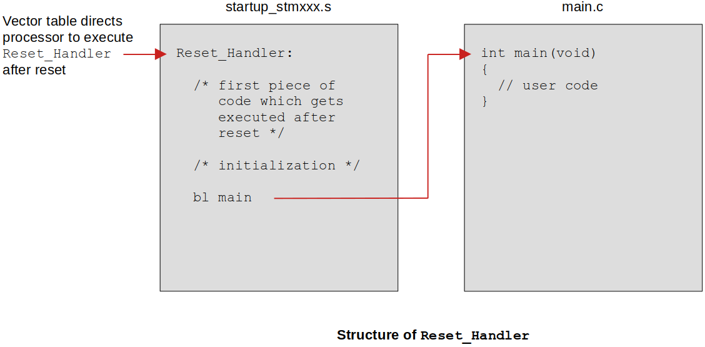

[Home](../../) | [Projects](../../projects) | [Notes](../) > <a href="./">Bootloader</a> > Reset Sequence

# Reset Sequence


## Reset Sequence of the ARM Cortex-M Based MCU's

1. When you reset the processor (e.g., press the reset button on the boad), the PC is loaded with the value 0x0000_0000. (Memory location 0x0000_0000 belongs to a Flash memory, or ROM memory, or Program memory.)

2. Then the processor reads the value at the memory location 0x0000_0000 into the MSP.

   - MSP = value at 0x0000_0000
   - MSP is the **Main Stack Pointer** register. This means that the processor, upon reset, first initializes the Stack Pointer.

3. Then the processor reads the value at the memory location 0x000_0004 into PC. That value is actually the address of the **reset handler**. (In other words, the address of the reset handler gets stored into PC.)

4. PC jumps to the reset handler.

   A reset handler is just a C or assembly function written by you to carry out any initialization required.

5. From the reset handler, `main()` function of the application gets called.

This is how the control reaches your program's `main()` function after reset.

### Question!

* All ARM Cortex-M based MCUs, upon reset, does

  1. Load the value stored at 0x0000_0000 into MSP
  2. Load the value stored at 0x000_0004 into PC (Value: the address of the reset handler)

  In STM32 microcontroller,

  1. MSP value is stored at 0x0800_0000
  2. Vector table starts from 0x0800_0004
  3. Address of the reset handler found at 0x0800_0004

  **So, there must be something that links 0x0800_0000 to 0x0000_0000?**

* [Answer] Both addresses can be linked with the technique called "**memory aliasing**" and it depends on the MCU.

  The base address of the user Flash (i.e., 0x0800_0000; depends on the MCU) is mapped to 0x0000_0000 via memory aliasing. So, when the processor references the memory location 0x0000_0000, the address is converted into 0x0800_0000 and the processor ends up reading 0x0800_0000.

  This can be verified by comparing the contents of the both of the memory regions using the memory browser on your IDE. They will show the same contents.


## Reset Handler





* Reset handler does the early initialization after which the call to the user program (`main()`) is made:

  Processor reset 

  $\to$ data section initialization 

  $\to$ BSS section initialization 

  $\to$ initialization of a standard C library if it is used (e.g., `__libc_init_array();`)

  $\to$ calls the user program (`main()`)

* Remember! The `main()` function cannot be called without these important early initializations.

  ```assembly
  /* a section of startup file (startup_stm32f407vgtx.s) */
  
  Reset_Handler:
    ldr   r0, =_estack
    mov   sp, r0          /* set stack pointer */
  /* Call the clock system initialization function.*/
    bl  SystemInit
  
  /* Copy the data segment initializers from flash to SRAM */
    ldr r0, =_sdata
    ldr r1, =_edata
    ldr r2, =_sidata
    movs r3, #0
    b LoopCopyDataInit
  
  CopyDataInit:
    ldr r4, [r2, r3]
    str r4, [r0, r3]
    adds r3, r3, #4
  
  LoopCopyDataInit:
    adds r4, r0, r3
    cmp r4, r1
    bcc CopyDataInit
  
  /* Zero fill the bss segment. */
    ldr r2, =_sbss
    ldr r4, =_ebss
    movs r3, #0
    b LoopFillZerobss
  
  FillZerobss:
    str  r3, [r2]
    adds r2, r2, #4
  
  LoopFillZerobss:
    cmp r2, r4
    bcc FillZerobss
  
  /* Call static constructors */
    bl __libc_init_array
  /* Call the application's entry point.*/
    bl main
  ```

  
