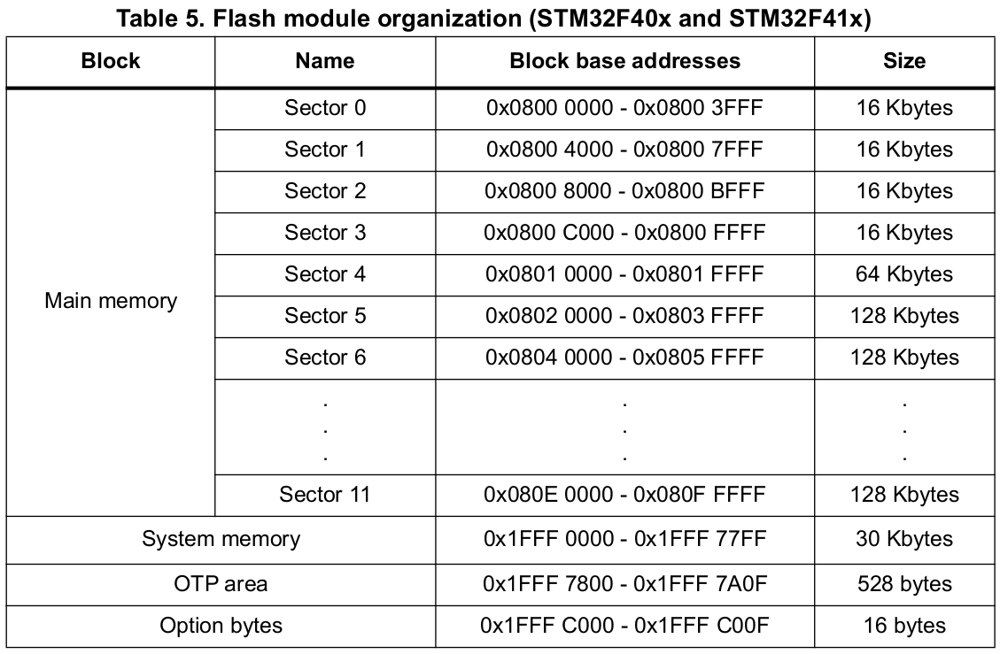
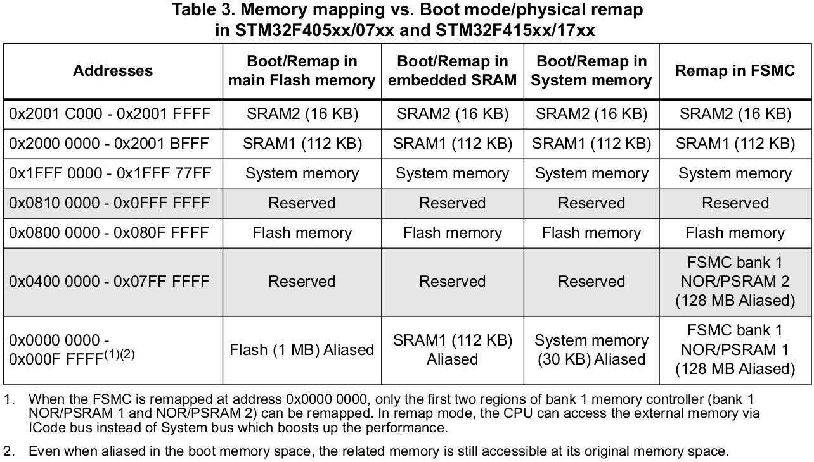

[Home](../../) | [Projects](../../projects) | [Notes](../) > <a href="./">Bootloader</a> > STM32F407xx Memory Organization

# STM32F407xx Memory Organization

## STM32F407xx Memory Organization

* Internal Flash (a.k.a. embedded Flash / on-chip Flash) memory: Up to 1 MB (Divided into multiple sectors)
* Internal SRAM1: 112 KB
* Internal SRAM2: 16 KB
* System memory (ROM): 30 KB
  * Used by ST for storing the ST's native bootloader
* One-time programmable (OTP) memory: 528 Bytes
  * Typically used for storing the product number of the serial number of a product
* Option bytes memory: 16 Bytes
  * Not for general-purpose use
  * These bytes contain some flags, which control the access to the Flash memory.
* Backup SRAM: 4 KB

## Internal Flash Memory (Main Memory)

* Capacity (size): up to 1 MB (Divided into multiple sectors)
* Address range: 0x0800 0000 - 0x080F FFFF
* Used for storing
  * The user **application code** 
  * The **read-only data** of the program
  * The **vector table**
* Non-volatile memory

## Internal SRAM

### SRAM1

* Size: 112 KB
* Address range: 0x2000 0000 - 0x2001 BFFF
* Used for
  * The user application **global variables** and **static variables**
  * The **stack** and **heap**
* Volatile memory
* Code can be executed from this memory

### SRAM2

* Size: 16 KB
* Address range: 0x2001 C000 - 0x2001 FFFF
* Used for
  * The user application **global variables** and **static variables**
  * The **stack** and **heap**
* Volatile memory
* Code can be executed from this memory

## System Memory (ROM)

* Size: 30 KB
* Address range: 0x01FFF 0000 - 0x1FFF 77FF
* All the ST MCUs store the bootloader in this memory
* Read-only memory
* By default, the MCU will not execute any code from this memory, it can be configured to boot or execute the bootloader from this memory.
