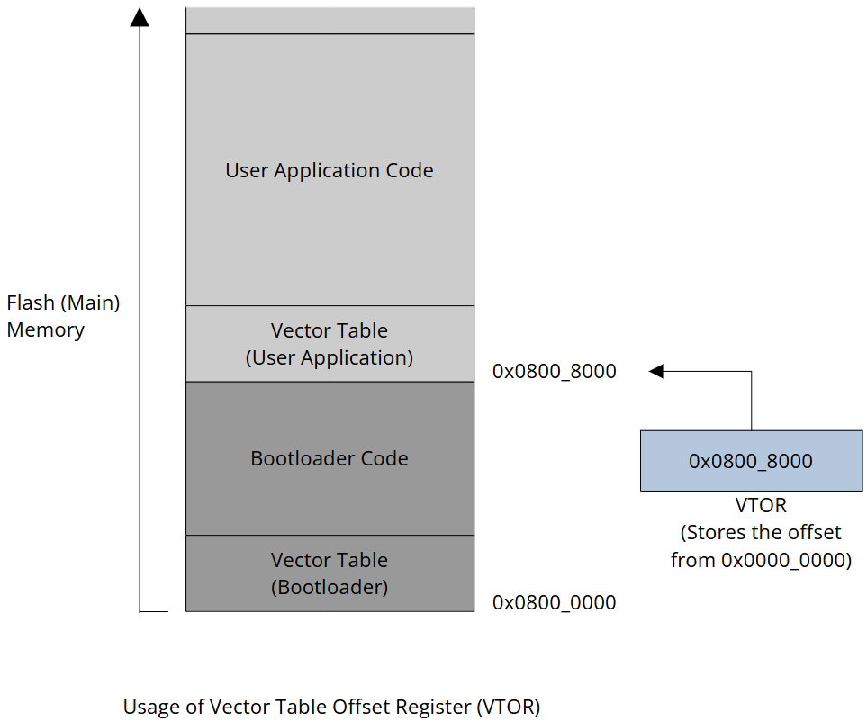

[Home](../../) | [Projects](../../projects) | [Notes](../) > <a href="./">Bootloader</a> > Vector Table Offset Register (VTOR)

# Vector Table Offset Register (VTOR)

## Vector Table Offset Register (VTOR)

* The VTOR (a 32-bit register) in ARM Cortex-M microcontrollers indicates the offset of the vector table base address from memory address 0x0000_0000.

* By default, the ARM Cortex-Mx processors assume that the vector table is located at 0x0000_0000, which is aliased to 0x0800_0000. The VTOR allows you to specify the base address of the vector table, enabling you to relocate the table as needed for customized interrupt handling or memory mapping requirements.

* Example:

  The vector table stored at 0x0800_0000 is the bootloader's vector table, not the user application's. The VTOR is used to inform the processor of the correct address of the user application's vector table. The default  value of the VTOR is 0, which is why the processor references 0x0000_0000 to fetch the vector table. By setting the VTOR value to  0x0800_8000, you can direct the processor to reference 0x0800_8000 to  locate the user application's vector table.

