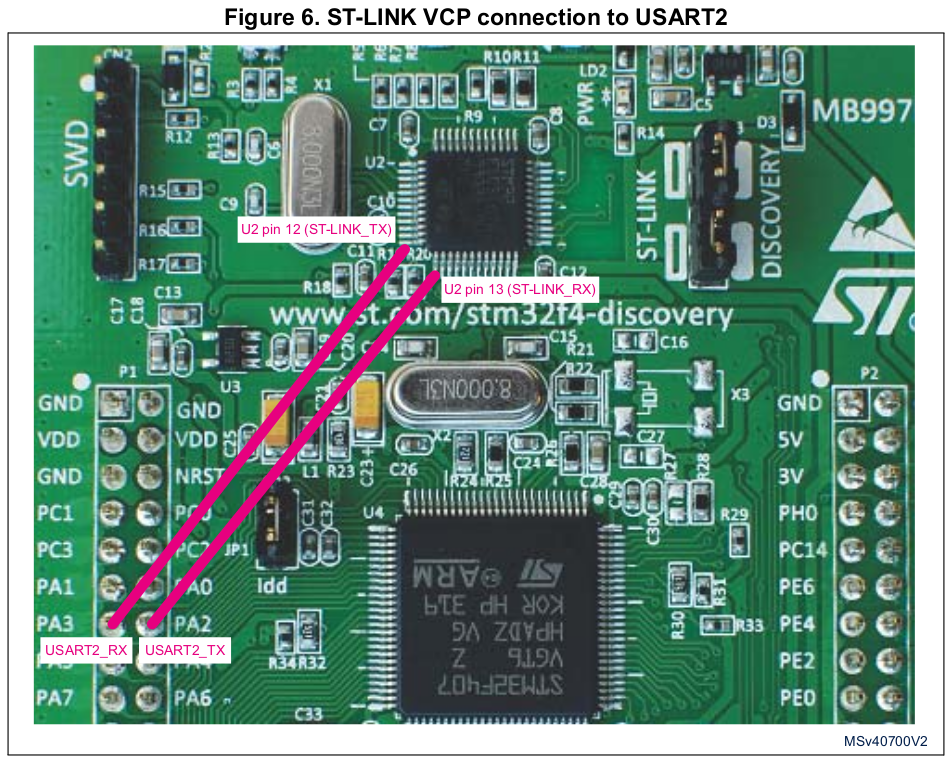

[Home](../../) | [Projects](../../projects) | [Notes](../) > <a href="./">Bootloader</a> > Virtual COM Port (VCP) Support

# Virtual COM Port (VCP) Support

## Virtual COM Port (VCP) Support

* If your board supports the virtual COM port support, you can communicate with the board from your PC over UART by using the USB cable.

* STM32F446RE Nucleo-64 development board supports the VCP.

* STM32F407 Discovery development board provides the pins on which the VCP can be supported, but they are not connected to the USART of the STM32F407 MCU.

  Two possible solutions are introduced in the board *User Manual*.

  * **Using an USART to USB dongle** from the market connected for instance to STM32F407 USART2 available on connector P1 pin 14 (PA2: USART2_TX) and P1 pin 13 (PA3: USART2_RX).

    $\to$ **Recommended!**

  * Using flying wires to connect ST-LINK/V2-A Virtual COM port (ST-LINK VCP on U2 pin 12 and 13) to STM32F407 USART2 (PA2 and PA3: P1 pin 14 and 13) as shown in Figure 6.

