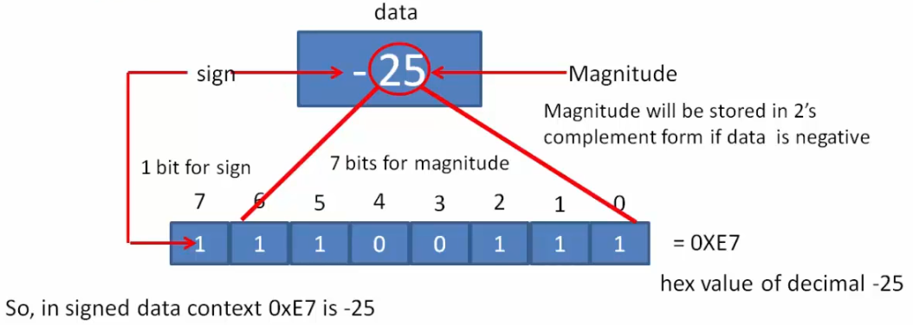

[Home](../../) | [Projects](../../projects) | [Notes](../) > <a href="./">C Programming</a> > Data Types & Variables

# Data Types & Variables


## Data Types

* Data type is used for declaring the type of a variable.
* In C programming language, data types determine the **type** and **size** of data associated with the variables.
* Before a variable can store any value, its type must first be defined.

* Representing real-world data:
  * Data as numbers (e.g., integers, real numbers)
  * Data as characters
  * Data as strings (i.e., collection of characters)


## Some Important C Data Types

### Integer Data types

* Used to represent whole numbers (i.e., integers)

  e.g., 10, 20, 30, etc.

* Integer data types (signed):

  * `char`
  * `short int` - also used as `short` (`int` is implied)
  * `int`
  * `long int` - also used as `long` (`int` is implied)
  * `long long int` - also used as `long long` (`int` is implied)

  Integer data types (unsigned)

  * `unsigned char`
  * `unsigned short int`
  * `unsigned int`
  * `unsigned long int`
  * `unsigned long long int`

### Float Data Types

* Used to represent real numbers

  e.g., 10, 24.5, 60.00001, etc.


## Storage Size of Data Types

* The C standard does NOT decide the storage sizes of data types. It's the **compiler** (or compiler designer) who decides it!

  The compiler (e.g., GCC) will generate the code to allocate certain size of memory for each variable of certain data type.

  Do not assume the size of data types! Make sure to check the documentation when in doubt!

* What the C standard specifies are the minimum and maximum values.

  e.g., The C standard specifies the storage size of a `long` type variable as 32-bit, and the maximum as 64-bit. So, the exact size of the `long` type can be decided by the compiler within this range.

  Some compilers fix 32-bit storage size for `long` type variables, while others may do 64-bit. 

  Some compilers fix 16-bit storage size for `long` type variables, while others may do 16-bit. 

* The following data types will always be of FIXED-SIZE irrespective of compilers.

  * `short` (signed or unsigned) - 2 bytes
  * `char` (signed or unsigned) - 1 byte
  * `long long` (signed or unsigned) - 8 bytes


## Integer Data Type

### `char`, `unsigned char`

* `char`

  * This is an integer data type to store a single character (ASCII code) value or 1 byte of signed integer value (positive or negative).

  * A `char` data type variable consumes 1 byte of memory.

  * `char` happens to be the smallest integer data type of 1 byte.

  * There is no other special meaning for the `char` data type, and it is just one of many integer data types.

  * Range: [-128, 127] 
    * Negative (sign bit = 1) - 2's complement representation
      * Minimum value: 1|0000000 (= -128)
      * Maximum value: 1|1111111 (= -1)
      * Positive (sign bit = 0)
        * Minimum value: 0|0000000 (= 0)
        * Maximum value: 0|1111111 (= 127)


* `unsigned char`

  * The `unsigned char` data type is used to store 1 byte of unsigned data.

  * "Sign bit" is not necessary.

  * Range: [0, 255]


### `short int`, `unsigned short int`

* `short int` (`short`)

  * Stores 2 bytes of **signed** data. (Always, not compiler dependent!)

  * Range: [-32768, 32767]

* `unsigned short int` (`unsigned short`)

  * Stores 2 bytes of **unsigned** data. (Always, not compiler dependent!)

  * "Sign bit" is not necessary.

  * Range: [-0, 65535]

### `int`, `unsigned int`

* `int`, `unsigned int` store signed/unsigned integer data.
* Consumes 2 or 4 bytes of memory depending on the compiler. (Check the compiler manual.)

### `long int`, `unsigned long int`

* `long int` (or `long`), `unsigned long int` or (`unsigned long`) store signed/unsigned integer data.
* Consumes 4 or 8 bytes of memory depending on the compiler. (Check the compiler manual.)


## Variable Definition

* Variable definition always includes **data type** followed by **variable name**.

  ```c
  unsigned char dicyXTemperature;
  ```

* Variable definition must proceed the variable usage.

* Programmers are to select appropriate data types according to the needs of the project.


## Representing Negative Values (2's Complements)

* Represent the data -25 in 1 byte signed data representation

  2's complement = 1's complement (flip all bits) + 1



