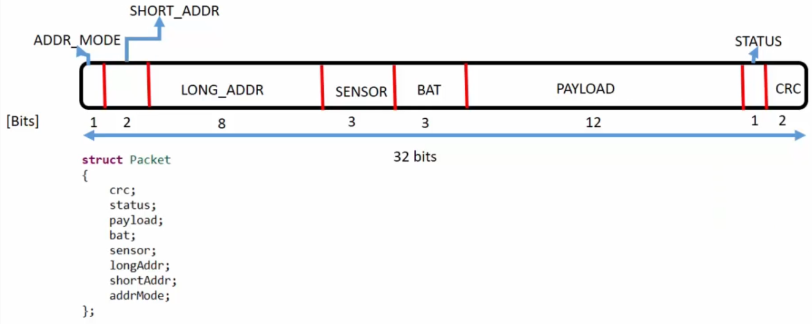
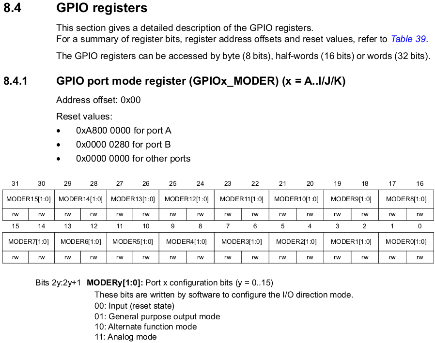

[Home](../../) | [Projects](../../projects) | [Notes](../) > <a href="./">C Programming</a> > Structures

# Structures


## Introduction to Structures

* Structures in C is a data structure used to create user-defined data types.

* Structures allow us to combine data of different types

* Defining a structure:

  ```c
  struct tag_name
  {
      member_element1;
      member_element2;
      member_element3;
      member_element4;
  };	/* don't forget this semi-colon! */
  ```

  > `struct` is a reserved keyword in C.

  Structure definition example:

  ```c
  struct CarModel
  {
      unsigned int	carNumber;
      uint32_t		carPrice;
      uint16_t		carMaxSpeed;
      float			carWeight;
  };
  ```

​		Defining a structure does not incur memory allocation. Its just a description or a record.

* Creating structure variables:

  ```c
  struct CarModel CarBMW, CarFord, CarHonda; /* memory allocation takes place at this point */
  ```

  > `struct CarModel`: User-defined data type
  >
  > `CarBMW`, `CarFord`, `CarHonda`: Structure variables

* Initializing the structure member variables:

  ```c
  /* C89 method (order is important!) */
  struct CarModel CarBMW = {2021, 15000, 220, 1330}; 
  
  /* C99 method using designated initializers (order is NOT important!)) */
  struct CarModel CarBMW = {.carNumber = 2021, 
                            .carWeight = 1330,
                            .carMaxSpeed = 220,
                            .carPrice = 15000};
  ```

* Accessing the structure member variables:

  ```c
  /* use .(dot operator) to access the member variables */
  printf("%d\n", CarBMW.carPrice);	/* 15000 */
  ```


## Exercise

Write a program to create a `carModel` structure and create 2 variables of type `struct carModel`. Initialize the variables with the below given data and then print them.

1. 2021, 15000, 220, 1330
2. 4031, 35000, 160, 1900.96

```c
#include <stdio.h>
#include <stdint.h>

struct carModel
{
    uint32_t carNumber;
    uint32_t carPrice;
    uint16_t carMaxSpeed;
    float carWeight;
}; 	/* don't forget this semi-colon! */

int main(int argc, char *argv[])
{
    struct carModel carBMW = {2021, 15000, 220, 1330};
    struct carModel carFord = {.carNumber = 4031, .carWeight = 1900.96, 
                               .carMaxSpeed = 160, .carPrice = 35000};
    
    printf("Car BMW information:\n");
    printf("carNumber   = %u\n", carBMW.carNumber);
    printf("carPrice    = %u\n", carBMW.carPrice);
    printf("carMaxSpeed = %u\n", carBMW.carMaxSpeed);
    printf("carWeight   = %f\n", carBMW.carWeight);

    puts("");

    printf("Car Ford information:\n");
    printf("carNumber   = %u\n", carFord.carNumber);
    printf("carPrice    = %u\n", carFord.carPrice);
    printf("carMaxSpeed = %u\n", carFord.carMaxSpeed);
    printf("carWeight   = %f\n", carFord.carWeight);

    return 0;
}
```

```plain
Car BMW information:
carNumber   = 2021
carPrice    = 15000
carMaxSpeed = 220
carWeight   = 1330.000000

Car Ford information:
carNumber   = 4031
carPrice    = 35000
carMaxSpeed = 160
carWeight   = 1900.959961
```


## Size of a Structure

* Do not prematurely assume that the size of the structure is going to be all the member variables' sizes put together. See the following example:

  ```c
  #include <stdio.h>
  #include <stdint.h>
  
  struct carModel
  {
      uint32_t carNumber;		/* 4 byte */
      uint32_t carPrice;		/* 4 byte */
      uint16_t carMaxSpeed;	/* 2 byte */
      float carWeight;		/* 4 byte */
  }; 	/* don't forget this semi-colon! */
  
  int main(int argc, char *argv[])
  {
      struct carModel carBMW = {2021, 15000, 220, 1330};
      
      printf("sizeof(struct carModel) = sizeof(carBMW) = %lu\n", sizeof(struct carModel));
      /* is it going to be 4+4+2+4=14 bytes? */
      
      return 0;
  }
  ```

  ```plain
  izeof(struct carModel) = sizeof(carBMW) = 16
  ```

  > `%lu` in line 16 specifies "long unsigned int".
  >
  > Note that the return type of `sizeof()` is `size_t`, which is platform dependent.

* This can be explained by **aligned/unaligned data storage**.


## Aligned/Unaligned Data Storage

* For efficiency, the compiler generates instructions to store variables on their **natural size boundary** addresses in the memory. This is also true for structures. Fields in a structure are located on their natural size boundary.

* Natural size boundary:

  ```plain
  			char 	(1-byte aligned)
  Address:	0403010	0403011	0403012	0403013	0403014	0403015 ...
  				  -   	  -		  -		  -		  -		  -
  			short 	(2-byte aligned)
  Address:	0403010	0403012	0403014	0403016	0403016	0403018 ...
  				  -   	  -		  -		  -		  -		  -
  			int 	(4-byte aligned)
  Address:	0403010	0403014	0403018	040301C	0403020	0403024 ...
  				  -   	  -		  -		  -		  -		  -
  ```

* The following program demonstrates what happens when the compiler stores the variables according to their natural size boundary. Empty memory space between member variables are **padded** with 0.

  ```c
  #include <stdio.h>
  #include <stdint.h>
  
  struct DataSet
  {
      char data1;		/* 1 byte */
      int data2;		/* 4 byte */
      char data3;		/* 1 byte */
      short data4;	/* 2 byte */
  };
  
  int main(int argc, char *argv[])
  {
      struct DataSet data;
      
      data.data1 = 0x11;
      data.data2 = 0xFFFFEEEE;
      data.data3 = 0x22;
      data.data4 = 0xABCD;
      
      uint8_t *ptr = (uint8_t*)&data;
      
      uint32_t totalSize = sizeof(struct DataSet);
      
      for (uint32_t i = 0; i < totalSize; i++)
      {
          printf("%p %X\n", ptr, *ptr);
          ptr++;
      }
      
      printf("Total memory consumed by this struct variable = %lu\n", sizeof(struct DataSet));
      
      return 0;
  }
  ```
  
  ```plain
0x7ffd2ecbcb6c 11	<- start of data1 (also the base address of the structure variable data)
  0x7ffd2ecbcb6d 0	(padding)
  0x7ffd2ecbcb6e 0	(padding)
  0x7ffd2ecbcb6f 0	(padding)
  0x7ffd2ecbcb70 EE	<- start of data2 (can only be assigned to a word-aligned address)
  0x7ffd2ecbcb71 EE
  0x7ffd2ecbcb72 FF
  0x7ffd2ecbcb73 FF
  0x7ffd2ecbcb74 22	<- start of data3
  0x7ffd2ecbcb75 0	(padding)
  0x7ffd2ecbcb76 CD	<- start of data4 (can only be assigned to a half-word-aligned address)
  0x7ffd2ecbcb77 AB
  Total memory consumed by this struct variable = 12
  ```
  
  Due to the aligned data storage, the size of a structure variable is generally bigger than the sum of the size of each member variable.

* Why does the compiler do this?

  When the data is stored in aligned fashion it becomes a lot easier for the processor to do the read/write transactions on the memory. (Processor performance increases)

  Unaligned data storage will generate more instructions during the compilation process to deal with that unalignment which will actually increase the code size. To test this, write a test program to compare packed vs. non-packed structures and inspect the generated assembly code (disassembly).

* The only negative side effect of aligned data storage is that you will lose some memory space due to padding. If you can't afford to lose any memory space, you could go with unaligned data storage. Using the gcc attribute **packed**, the compiler will generate packed structures which results in unaligned data storage.

  ```c
  struct data
  {
      char data1;
      int data2;
      char data3;
      short data4;
  }__attribute__((packed));	/* sizeof(struct data) = 8 bytes
  ```


## `typedef` with Structures

* `typedef` is used to give an alias to primitive and user defined data types.

  ```c
  struct CarModel
  {
      uint32_t carNumber;
      uint32_t carPrice;
      uint16_t carMaxSpeed;
      float carWeight;
  }; 
  
  /* in main() */
  struct CarModel carBMW, carFord;
  ```

  ```c
  typedef struct /* tag name is optional */
  {
      uint32_t carNumber;
      uint32_t carPrice;
      uint16_t carMaxSpeed;
      float carWeight;
  } CarModel_t; /* but give an alias to this structure */
  
  /* in main() */
  CarModel_t carBMW, carFord;
  ```

  > By convention, the suffix `_t` is used for typedef defined data types, `_e` is used for enum defined data types.


## Self-Referential Structures

* A structure type cannot contain itself as a member.

  ```c
  struct CarModel
  {
      uint32_t carNumber;
      uint32_t carPrice;
      uint16_t carMaxSpeed;
      float carWeight;
      //struct CarModel carBMW;	// not allowed
  }; 
  ```

  However, structure types **can contain pointers to their own types**. Such self-referential structures are used in implementing linked lists and binary trees, etc.

  ```c
  struct CarModel
  {
      uint32_t carNumber;
      uint32_t carPrice;
      uint16_t carMaxSpeed;
      float carWeight;
      struct CarModel *pcarBMW;	// allowed
  }; 
  ```


## Nested Structures

* Nest structure means "structure inside a structure".

  ```c
  struct Data
  {
      char data1;
      int data2;
      char data3;
      short data4;
      struct
      {
          char data5;
          int data6;
      } moreData;	/* this is neither a tag name nor a typedef name; it is just a variable name */ 
  }
  ```

  ```c
  struct CarModel
  {
      uint32_t carNumber;
      uint32_t carPrice;
      uint16_t carMaxSpeed;
      float carWeight;
      struct
      {
          float temperature;
          float airPressure;
          int fuel;
      } carParameters;
  }
  ```
  


## Accessing Members of a Structure

* Given the structure variable's **name**, use the `.`(**dot operator**) to access the member variables:

  ```c
  CarBMW.carPrice = 1000;
  ```

* Given the structure variable's **address** (or pointer), use the  `->`(**arrow operator**) to access the member variables:

  ```c
  CarModel *pCarBMW = &CarBMW;
  pCarBMW->carPrice = 1000;	/* equivalent to *(address of the member 'carPrice') = 1000 */
  ```

  The `->` operator is also called as "structure pointer dereference operator", or "class member access operator", etc.


## Exercise

* Write a program to decode a given 32-bit packet information and print the values of different fields. Create a structure with member elements as packet fields as shown below:

  

  

  **Solution:**

  ```c
  #include <stdio.h>
  #include <stdint.h>
  
  struct Packet
  {
      uint8_t crc;
      uint8_t status;
      uint16_t payload;
      uint8_t bat;
      uint8_t sensor;
      uint8_t longAddr;
      uint8_t shortAddr;
      uint8_t addrMode;
  };
  
  int main(int argc, char *argv[])
  {
      struct Packet packet;
      uint32_t packetInfo;
  
      printf("Enter 32-bit packet information (in hex): ");   /* 0xFFFFFFFF or FFFFFFFF */
      scanf("%x", &packetInfo);
  
      packet.crc = (uint8_t)(packetInfo & 0x3);
      packet.status = (uint8_t)((packetInfo >> 2) & 0x1);
      packet.payload = (uint16_t)((packetInfo >> 3) & 0xFFF);
      packet.bat = (uint8_t)((packetInfo >> 15) & 0x7);
      packet.sensor = (uint8_t)((packetInfo >> 18) & 0x7);
      packet.longAddr = (uint8_t)((packetInfo >> 21) & 0xFF);
      packet.shortAddr = (uint8_t)((packetInfo >> 29) & 0x3);
      packet.addrMode = (uint8_t)((packetInfo >> 31) & 0x1);
  
      printf("crc       : %#x\n", packet.crc);
      printf("status    : %#x\n", packet.status);
      printf("payload   : %#x\n", packet.payload);
      printf("bat       : %#x\n", packet.bat);
      printf("sensor    : %#x\n", packet.sensor);
      printf("longAddr  : %#x\n", packet.longAddr);
      printf("shortAddr : %#x\n", packet.shortAddr);
      printf("addrMode  : %#x\n", packet.addrMode);
  
      printf("Size of packet (struct) is %lu bytes.\n", sizeof(struct Packet)); /* %I64u */
  
      return 0;
  }
  ```

  ```plain
  Enter 32-bit packet information (in hex): 0xFFFFFFFF
  crc       : 0x3
  status 	  : 0x1
  payload	  : 0xfff
  bat    	  : 0x7
  sensor 	  : 0x7
  longAddr  : 0xff
  shortAddr : 0x3
  addrMode  : 0x1
  Size of packet (struct) is 10 bytes.
  ```

  Notice that, with this approach, 10 bytes have been consumed to store 4-byte packet information. Is there any way we can do this without wasting memory space? Yes, by using **bit fields**.


## Structures and Bit Fields

* Rewrite the previous exercise using structure bit fields.

  ```c
  #include <stdio.h>
  #include <stdint.h>
  
  struct Packet
  {
      uint32_t crc        :2;
      uint32_t status     :1; 
      uint32_t payload    :12;
      uint32_t bat        :3;
      uint32_t sensor     :3; 
      uint32_t longAddr   :8; 
      uint32_t shortAddr  :2; 
      uint32_t addrMode   :1; 
  };
  
  int main(int argc, char *argv[])
  {
      struct Packet packet;
      uint32_t packetInfo;
  
      printf("Enter 32-bit packet information (in hex): ");   /* 0xFFFFFFFF or FFFFFFFF */
      scanf("%x", &packetInfo);
  
      packet.crc = (uint8_t)(packetInfo & 0x3);
      packet.status = (uint8_t)((packetInfo >> 2) & 0x1);
      packet.payload = (uint16_t)((packetInfo >> 3) & 0xFFF);
      packet.bat = (uint8_t)((packetInfo >> 15) & 0x7);
      packet.sensor = (uint8_t)((packetInfo >> 18) & 0x7);
      packet.longAddr = (uint8_t)((packetInfo >> 21) & 0xFF);
      packet.shortAddr = (uint8_t)((packetInfo >> 29) & 0x3);
      packet.addrMode = (uint8_t)((packetInfo >> 31) & 0x1);
  
      printf("crc       : %#x\n", packet.crc);
      printf("status    : %#x\n", packet.status);
      printf("payload   : %#x\n", packet.payload);
      printf("bat       : %#x\n", packet.bat);
      printf("sensor    : %#x\n", packet.sensor);
      printf("longAddr  : %#x\n", packet.longAddr);
      printf("shortAddr : %#x\n", packet.shortAddr);
      printf("addrMode  : %#x\n", packet.addrMode);
  
      printf("Size of packet (struct) is %lu\n", sizeof(packet)); /* %I64u */
  
      return 0;
  }
  ```

  ```plain
  Enter 32-bit packet information (in hex): 0xFFFFFFFF
  crc       : 0x3
  status 	  : 0x1
  payload	  : 0xfff
  bat    	  : 0x7
  sensor 	  : 0x7
  longAddr  : 0xff
  shortAddr : 0x3
  addrMode  : 0x1
  Size of packet (struct) is 4 bytes.
  ```

  Now the structure `packet` consumes only 4 bytes.

  Bit fields are widely used in network applications where extracting fields out of a Protocol Data Unit (PDU) (e.g., IP packet) is important.
  
  Note that there can't be duplicate names for the bit fields of a structure.


## Exercise - Bit Fields

* Create a structure named `CarDetails` which comprises below information:

  1. Car max speed: Max 400km/h (7 bits)
  2. Car weight in kg: Max 5000kg (13 bits) 
  3. Car color: an ACII code of color (7 bits)
  4. Car price in USD: Max 100,000,000 (28 bits)           

  **Structure without bit fields:**

  ```c
  Struct CarDetails
  {
    	uint16_t speed;
      uint16_t weight;
      char colour;
      uint32_t price;
  }; /* 4 + 4 + 4 = 12 bytes */
  ```

  **Structure using bit fields:**

  ```c
  Struct CarDetails
  {
      /* 4 bytes */
    	uint32_t speed	: 7;
      uint32_t weight	: 13;
      uint32_t colour	: 7;
      /* another 4 bytes */
      uint32_t price;
  }; /* 4 + 4 = 8 bytes */
  ```


## Usage of Bit Fields in an Embedded Program

* Using structures and bit fields, we can provide abstraction of the complicated code.

* `typedef` a structure for the register we want to bit-manipulate:

  

  

  

  ```c
  /* main.h */
  
  typedef struct
  {
  	uint32_t pin_0		:2;
  	uint32_t pin_1		:2;
  	uint32_t pin_2		:2;
  	uint32_t pin_3		:2;
  	uint32_t pin_4		:2;
  	uint32_t pin_5		:2;
  	uint32_t pin_6		:2;
  	uint32_t pin_7		:2;
  	uint32_t pin_8		:2;
  	uint32_t pin_9		:2;
  	uint32_t pin_10		:2;
  	uint32_t pin_11		:2;
  	uint32_t pin_12		:2;
  	uint32_t pin_13		:2;
  	uint32_t pin_14		:2;
  	uint32_t pin_15		:2;
  } GPIOx_MODER_t;
  ```

  ```c
  /* main.c */
  
  GPIOx_MODER_t volatile *const pGpioDMode;
  pGpioDMode = (GPIOx_MODE_t *)0x40020C00;
  
  pGpioDMode->pin_15 = 3; // set MODER15 to 11(2)
  ```

  > The compiler will generate the instructions to program the appropriate bit positions in the peripheral register address. 
  >
  > Encountering L6, the compiler will internally perform `*(0x40020C00) |= (3 << 30);`.
  >
  > L3 - Use `const` for safety. Also, use `volatile` keyword when the memory access is expected. Why? 

* Note that at the end of the day, the compiler will interpret the abstracted code and perform bitwise manipulations internally.


## References

Nayak, K. (2022). *Microcontroller Embedded C Programming: Absolute Beginners* [Video file]. Retrieved from  https://www.udemy.com/course/microcontroller-embedded-c-programming/
