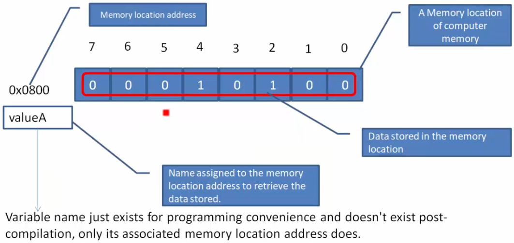

[Home](../../) | [Projects](../../projects) | [Notes](../) > <a href="./">C Programming</a> > Variables

# Variables

## What are Variables?

* Data are usually stored in computer memory.
* Variables are **identifiers** for your data. A variable act as a label to a memory location where the data is stored.
* Variable names are NOT stored inside the computer memory, and the compiler replaces them with memory location addresses during data manipulation.

## Rules for Naming a Variable

* Make sure that the variable name is not longer than 30 characters. Some compilers may issue errors if the name is too long.

* A variable name can only contain:

  * Alphabets (upper/loser case)
  * Digits
  * Underscore

  The first letter of the variable CANNOT begin with a digit. (Only underscore or alphabet is allowed.)

* Cannot use C standard reserved keywords as variable names.

## Defining Variables

* A variable can be used only after it is defined.
* A variable definition instructs the compiler to set a side memory space for the variable.

## Variable Definition vs. Declaration

* A variable is **defined** when the compiler generates instrctuions to **allocate the storage** for the variable.
* A variable is **declared** when the compiler is **informed that a variable exists** along with its type. The compiler does not generate instructions to allocate the storage for the variable at that point.
* A variable definition is also a declaration, but not all variable declarations are definitions.

## References

Nayak, K. (2022). *Microcontroller Embedded C Programming: Absolute Beginners* [Video file]. Retrieved from  https://www.udemy.com/course/microcontroller-embedded-c-programming/
