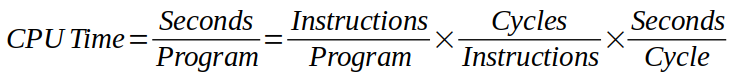
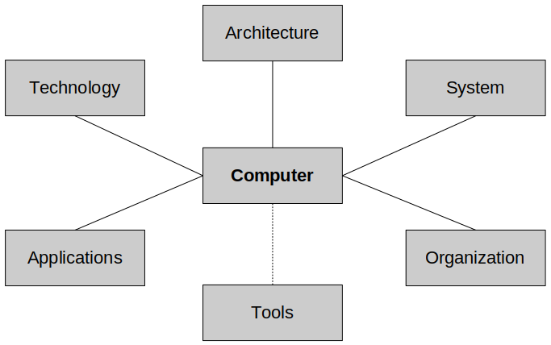
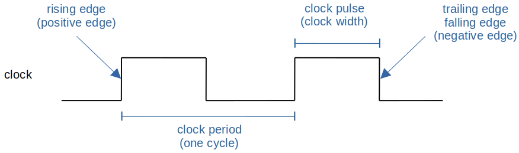
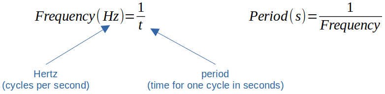

[Home](../../) | [Projects](../../projects) | [Notes](../) > <a href="./">Computer Architecture & Organization</a> > Architecture & Organization

# Architecture & Organization

## Terminology

* Computer Architecture (ISA - Instruction Set Architecture)

  - An **abstract model** of a computer that describes **what** it does.
    - e.g., A programmer can instruct a computer to `add A and B` without knowing how this operation is actually going to be carried out. This abstract view of computer architecture is generally called its ISA.
    - A device that executes instructons described by that ISA, such as a CPU, is called an *implementation* and it describes **how** it does.
  - In general, an ISA defines what programmers can see or use. Including:
    - Supported *instructions (assembly language level)* 
    - *Data types* (the number of bits per word and the interpretation of the bits) 
    - *Registers*
    - Hardware support for managing *main memory*
    - Fundamental features such as the *memory consistency*, *addressing modes* (ways of expressing the location of data in memory), *virtual memory*
    - *I/O* model of a family of implementations of the ISA

* Computer Organization (Microarchitecture)

  - The **implementation** of *computer architecture*. (*Abstract* made *real*)
  - It is **how** operational attributes are linked together and contribute to realizing the architectural specification.
  - Given *architecture* can be implemented with different *organizations*.
    - e.g., An ancient clock in a tower can be renovated by replacing its worn clockwork with an electric motor without the observer noticing that anything has changed.
    - e.g., A microprocessor with 32-bit registers may be organized internally as a 16-bit machine with 16-bit data highways. While the programmer will be requesting an operation on 32-bits but internally the machine will execute the instruction as two 16-bit  operations.
  - Normally the term **Computer Organization** and **Microarchitecture** are used interchangeably, but here they will be used in the following way:
      - *Computer Organization* will be used to describe the hardware used to implement the ISA such as CPU, memory, buses, I/O mechanisms, registers, adders, pipelines, cache, floating point processor, etc.
      - *Microarchitecture* will be used to describe how the hardware is implemented on the chip. Layers, masks, buses, connections between the various hardware elements, etc. 

* Machine Code

  - The code executed by a computer that is expressed as strings of `1`s and `0`s. Each type of computer will run only a specific machine code. 

* Assembly Language Code

  - The human readable version of machine code (e.g., `ADD R0, Time`) 

* High-Level Language

  - Code that will run on entirely different types of computers and bears little relationship to the underlying computer architecture. (e.g., C, C++, JAVA)
  - Have to be compiled into a computer's native machine code before they can be executed.

* CPU Time

  

    - *CPU time* (or processing time) is the amount of time for which a central processing unit (CPU) was used for processing instructions of a computer program or operating system.
    - Do not confuse *CPU time* with *elapsed time*, which includes for example, waiting for I/O operations or entering low-power (idle) mode.

* RISC (Reduced Instruction Set Computer)

  - The main idea behind is to make hardware simpler by using an instruction set composed of a few basic steps for loading, evaluating, and storing operations just like a `LOAD` command will load data, `STORE` command 
    will store data.
  - Cyles per instruction ↓ (Number of instructions per program ↑) 

* CISC (Complex Instruction Set Computer)

  - The main idea is that a single instruction will do all loading, evaluating, and storing operations just like a addition command will do stuff like loading data, evaluating, and storing it, hence it's complex.
  - Number of instructions per program ↓ (Cycles per instruction ↑).  
  - CPU has to be loaded with more hardware elements and circuitries to handle a single instruction do multiple operations, thus becoming more complex and expensive than RISC.
  - Both (*RISC* and *CISC*) approaches try to increase the CPU performance.

* Moore's Law

  - The observation that the number of transistors in a dense integrated circuit (IC) doubles about every two years.
  - It is an observation and projection of a historical trend rather than a law of physics.
  - It is an empirical relationship linked to gains from experience in production.

## Factors Affecting the Computer Designers

* Technology
  - The importance of the processes used to manufacture computer components.
  - e.g., Mask size, layers, bus size, etc. very much affect the speed and capability of the CPU. The device techonology used determines the speed and capacity of the CPU (TTL, MOS, CMOS, etc.). Peripherals (modems,
    keyboards, printers, displays, network cards, etc.). 
* Application
  - The end use of the computer.
  - e.g., Desktop, gaming, graphics, embedded systems in a medical device or on a spacecraft.
* Tools
  - Although it is not part of the computer itself, it affects the design of computers.
  - Computer *tools* cover a range of software products, from packages that perform hardware design at the circuit level, to computer simulators, and to suites of programs.

## Clock (CLK)

* In general, **clock** refers to a microchip that regulates the timing and speed of all computer functions.

    - In the chip is a crystal that vibrrates at a specific frequency when electricity is applied.
    - The shortest time any computer is capable of performing is *one clock*, or *one vibration* of the clock chip.

* **Clock rate** or **clock speed** typically refers to the *frequency* at which the clock generator of a processor can generate pulses, which are used to synchronize the operations of its components, and is used as an indicator of the processor's speed. (It is measured in *clock cycles per second* or its equivalent, the *SI* unit *hertz(Hz)*.

* **Frequency** and **period**:

  

  

  e.g., Period of *2 nanoseconds* gives a frequency of 0.5GHz or 500MHz. (∵ 1/(2 * 10-9) = 5.0E8)

  e.g., Frequency of 800MHz gives a period of 1/800000000 = 1.25 nanoseconds.

* Some history on clock speeds:

  - Intel 6502 Microprocessor *1MHz* to *2MHz*
    - *Apple II*, *Rockwell Aim-65*, *Commodore VIC 20* and *Commodore 64* used this CPU.
    - Late 1970's, early 1980's technology.
  - Most modern personal computers are in the *2GHz* to *8GHz* range which is 1,000 to 8,000 times faster.
      - Higher *Hz* does not necessarily mean the processer runs better for your application. More about that in *CS413*.

## Synchronous & Asynchronous

* There have been CPUs and memory systems which do not have a clock (**asynchronous**). In some cases systems without a clock do run faster but require more complex hardware.
