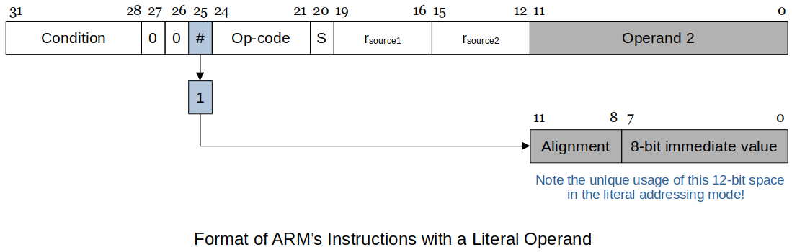

[Home](../../) | [Projects](../../projects) | [Notes](../) > <a href="./">Computer Architecture & Organization</a> > ARM Addressing Modes

# ARM Addressing Modes


## ARM Addressing Modes

* **Addressing mode** is the manner in which operand are specified in the instruction.
* 3 things we want to figure out when discussing addressing modes.
  - What is the effective address?
  - Where is the data (i.e., operand)?
    - Is it somewhere in the CPU or in the memory?
  - Are there any side effects (e.g., register value updates, etc.)?

### ARM Addressing Mode Summary

  ```plain
Addressing Mode   Effective Address     Data Location /     Example
                                        Side Effects
================= ===================== =================== =================
Literal           None                  Instruction         MOV r0, #12
(Immediate)
----------------- --------------------- ------------------- -----------------
Direct            Contained in the      Main memory         LDR r0, address
(Absolute)        instruction 
[!] Note: ARM assembly does not support Direct Addressing mode.
----------------- --------------------- ------------------- -----------------
Indirect          Contained in the      Main memory         LDR r0, [r1]
(Register         referenced register                       (r1 does't change)
Indirect)                 
----------------- --------------------- ------------------- -----------------
Indirect with     Calculated by         Main memory         LDR r0, [r1, #4]
Offset            adding the offset                         LDR r0, [r1, r2]
                  to the value stored                       (r1 doesn't change)
                  in the referenced
                  register
                  The offset can be:
                  - Literal
                  - Contents of 
                    another register
----------------- --------------------- ------------------- -----------------
Auto-indexing     Calculated by         Main memory /       LDR r0, [r1, #8]!
Pre-indexed       adding the offset     Index register is   LDR r0, [r1, r2]!
                  to the value stored   updated BEFORE the  (r1 gets updated)
                  in the referenced     memory access 
                  register              (This has to be
                  The offset can be:     verified! Effective
                  - Literal              addr is calculated
                  - Contents of          before memory access
                    another register     for sure, but the
                                         index register is 
                                         said to be updated
                                         after the memory 
                                         access according 
                                         to the text.)
----------------- --------------------- ------------------- -----------------
Auto-indexing     Contained in the      Main memory /       LDR r0, [r1], #8
Post-indexed      referenced register   Index register is   LDR r0, [r1], r2
                                        updated AFTER the   (r1 gets updated)
                                        memory access
----------------- --------------------- ------------------- -----------------
Program Counter   Calculated by         Main memory         B [PC, #32]
Relative          adding the offset to                      B [PC, r0]
                  the Program Counter
                  The offset can be:
                  - Literal
                  - Contents of 
                    another register
----------------- --------------------- ------------------- -----------------
  ```

### 1. Literal (or Immediate) Addressing 

* There is no effective address. 

* The data is part of the instruction. In ARM it is `#n`.

* This is also called immediate adressing because no additional memory access is necessary to get the data.

* Examples

  ```plain
  MOV r0, #12           @ Default is decimal
  MOV r1, #0xFF           
  MOV r1, #FFH          @ #FFH, #0xFF both indicate the literal is in hex
  CMP r0, #4
  CMP r0, #2_0100       @ Prefix '2_' denotes binary numbers
  ADD r1, r2, #8
    
  @ Use single quote  for character literals: 'A'
  @ Use double quotes for character literals: "Hello world!"
  ```

  > The literal has to be the LAST operand in the instruction.

* ARM's way of treating literal operands

  

  

  

    - A `1` in bit 25 of the instruction identifies the instruction has literal addressing.

    - Literals are 8-bits that can be scaled by a power of 2. (A unique feature of the ARM.)

        - This applies only to the **literal addressing**. (Literal addressing and literal offsets are two different things!)
        - **Literal offsets** will use the whole 12-bit space to represent numbers in two's complement notation. (See the *Literal Offset* section below.)

    - The way the 12-bit Operand 2 is decoded:

      ```plain
      Alginment  8-bit immediate value  Results
      =========  =====================  =======================================
      0000       Range 0 to 255         0 to 255
      ---------  ---------------------  ---------------------------------------
      0001       Range 0 to 255         Shift left the immediate value
                                        two times (Effect is *4)
                                        [!] Note: The number of shift is TWICE 
                                        the alignment value!
      ---------  ---------------------  ---------------------------------------
      1000       Range 0 to 255         Shift left the immediate value
                                        eight times (Effect is *16)
                                        [!] Note: The number of shift is TWICE 
                                        the alignment value!
      ---------  ---------------------  ---------------------------------------
      ```

      > Due to the size limitation of the "immediate value" you can't directly load a literal that does not fit into 8 bits.

      If you want to load `0xFFFF` into a register, do the following:

      ```plain
      MOV r0, #0xFF     @ RTL: [r0] ← 0x000000FF (do this least significant 8 bits first)
      ORR r0, #0xFF00   @ RTL: [r0] ← 0x0000FFFF (and then do the rest)
                        @ ORR does bitwise OR operation
      ```

      The best approach is to specify the value you want and let the assembler figure it out. You can do the following instead.

      ```plain
      MOV r0, #0xFFFF
      ```

      For the ARM, if you get *"Assembler Error: invalid constant (123) after fixup."* by writing,

      ```plain
      MOV r0, #0x123
      ```

      this means the assembler cannot handle this as a literal and you will have to define your own constant in the data section.
      For example: (ARM's unique way of solving this problem)

      ```plain
      LDR r1, =c12345678    @ Get the address for the long constant into r1
      LDR r0, [r1]          @ Load the constant into r0
      
      .data
      
      .balign 4
      c12345678:    .word 12345678
      ```

      Some assemblers, when recognizng a long constants, might set-up a memory location and set it to the value and use PC offset addressing to work around it.

### 2. Direct (or Absolute) Addressing 

* The effective address is contained in the instruction.
* The operand (or data) is in the main memory.
* ARM does NOT directly support this addressing mode.

### 3. Indirect (or Register Indirect) Addressing 

* All computers support some form of register indirect addressing. This is also called:

    - Indexed
    - Pointer-based

* The effective address is contained in the base register which is contained in the instruction.

* Examples

  ```plain
  LDR r1, [r0]      @ Load r1 with the contents of the memory location pointed by r0
                    @ RTL: [r1] ← [[r0]]
  
  STR r1, [r0]      @ Store the contents of r1 in the memory location pointed by r0
                    @ RTL: [[r0]] ← [r1]
                    
  ADD r0, r0, #4    @ Add 4 to the contents of r4
                    @ i.e., increment the pointer by one word
  ```

  Code to determine the length of a string:

  ```plain
    MOV r2, #-1     @ Do not count the terminating null char in string length
    LDR r0, =str1   @ Assembler uses the = to get the address of 'str1'
  
  loop:
    LDR r1, [r0]    @ This is the register indirect addressing
    AND r0, #0xFF   @ Mask off all but LSB (Least Significant Byte)
    ADD r0, r0, #1  @ r0 is the pointer to the string
    ADD r2, r2, #1  @ r2 is the character counter
    CMP r1, #0      @ When reached the terminating null char, end the loop
    BNE loop        
    MOV r0, r2      @ Put length into r0 to print results
  
  .data
  
  .balign 4
  str1:   .asciz "This is a long string that end with the null character."
  ```

### 4. Register Indirect Addressing with Offset

* The effective address is calculated by,  `(The value stored in the referenced register) + (offset)` therefore, also called as **base plus displacement** addressing.

* In this case the literal is **true 12-bit number** not the 8-bit number with a 4-bit offset.

    - The 12-bit contents are in **two's complement**; both positive and negative numbers are allowed.
        - `0 ~ 4096` (unsigned)
        - `-2048 ~ 2047` (signed)

* The value stored in the referenced register is **NOT CHANGED**.

* The address calculation is done **BEFORE** the memory access is performed. 

* Examples

  ```plain
  LDR r0, [r1, #32]     @ Load r0 with the contents of memory location pointed
                        @ by r1+32. (r1 value does not change!)
                        @    -----
                        @    effective address
                        @
                        @ RTL: [r0] ← [[r1] + 32] 
  
  LDR r2, [r0, r1]      @ Load r2 with the contents of memory location pointed
                        @ by r0+r1. (r0 value does not change!)
                        @    -----
                        @    effective address
                        @
                        @ RTL: [r2] ← [[r0] + [r1]]
  ```

  You can specify the offset as a second register so that you can use a dynamic offset that can be modified at runtime. 

  The second register can also be scaled by using the logical shift by a literal offset. (This will be useful when **jumping around the elements in the array of structures** where the size of each element may not be the exact power of two. This allows you scale the offset to your needs.)

  ```plain
  LDR r2, [r0, r1, LSL #2]  @ Load r2 with the contents of memory location
                            @ pointed by r0+(4*r1). (r0, r1 does not change!)
                            @            ---------
                            @            effective address
                            @
                            @ RTL: [r2] ← [[r0] + 4 * [r1]]
                            @                     --------
                            @                     scale r1 by 4
  
  ```

* **Literal offsets** 

  - The following fragment of code demonstrates the use of offsets to implement array access. Because the offset is a constant it cannot be changed at runtime. 

  - The `.equ` assembler directive equates a symbol with a value. Anywhere the symbol occurs, it is replaced by the corresponding value. This makes the code easier to read and maintain. (Similar to defining **enumerators** or **constants** in C)

    ```plain
    @ Define the offsets for the days of week access.
    .equ Sun, 0
    .equ Mon, 4
    .equ Tue, 8
    .equ Wed, 12
    .equ Thu, 16
    .equ Fri, 20
    .equ Sat, 24
    
    LDR r0, =Week         @ r0 points to array 'Week'
    LDR r2, [r0, #Tue]    @ Read the data for Tuesday into r2
    ```

    The following is also allowed on the Raspberry Pi assembler:

    ```plain
    Sun = 0
    Mon = 4
    Tue = 8
    Wed = 12
    Thu = 16
    Fri = 20
    Sat = 24
    ```

    Best practice is to define these at the top of your code, prior to where the main starts.

    This is only for the assembler! No memory locations are setup or used for these symbolic values!

### 5. Auto-indexing Addressing

* Elements in an array or similar data structure are frequently accessed sequentially. For this reason, **auto-indexing** addressing modes in which the pointer is automatically adjusted to point at the next element before or 
  after it is used have been implemented.

  ARM implements two auto-indexing modes by adding the offset to the base (i.e., pointer register).

* **Auto-indexing Pre-indexded Addressing**

  - Indicated by appending the suffix "`!`" to the effective address.

  - The effective address is calculated by, `(The value stored in the referenced register) + (offset)`

  - The effective address is calculated **BEFORE** the memory access.

    [!] Note: The base (referenced) register is updated **AFTER** the memory access. See the following example and don't get confused!

  - The auto-indexing mode does not incur additional execution time, because it is performed in parallel with memory access.

  - Examples:

    ```plain
    LDR r0, [r1, #8]!     @ Load r0 with the contents of the memory location
                          @ pointed by r1+8. 
                          @            ----
                          @            effective address
                          @ Then, r1 is updated to r1+8.
                          @
                          @ RTL: 
                          @   [r0] ← [[r1] + 8] : Access the memory 8 bytes
                          @                       beyond the base register r1
                          @   [r1] ← [r1] + 8   : Update the pointer (base register) 
                          @                       by adding the offset
    ```

    The offset can be a literal, registers and a register with shifts:

    ```plain
    LDR r0, [r1, #16]!
    LDR r0, [r1, r2]!
    LDR r0, [r1, r2, LSL #2]!
    ```

    Raspberry Pi code showing addition of two arrays:

    ```plain
    .equ Len, 8
    
    .global main
    
    main:
      LDR  r0, =A-4       @ Set the starting address to -4 because the
      LDR  r1, =B-4       @ effective address calculation is performed BEFORE
      LDR  r2, =C-4       @ the memory access. 
                          @ If started with A, B and C, the first element
                          @ will be missed.
      MOV  r5, #Len
    
    loop:
      LDR  r3, [r0, #4]!  @ r3 is used as a temporary value holder
      LDR  r4, [r1, #4]!
      ADD  r3, r3, r4     @ If the assembler complains, make it r3, r4, r3
      STR  r3, [r2, #4]!
      SUBS r5, r5, #1
      BNE  loop
    
    exit:                 @ Exit code and return to OS
      MOV  r7, #0x01
      SVC  0
    
    .data
    
    .balign 4
    A:  .word 1, 2, 3, 4, 5, 6, 7, 8
    B:  .word 2, 5, 4, 6, 7, 2, 4, 1
    C:  .word 0, 0, 0, 0, 0, 0, 0, 0
    
    @ end of code
    ```

* **Auto-indexing Post-indexded Addressing**

  - Denoted by placing the offset outside the square bracket.

  - The effective address is contained in the base register which is contained in the instruction.

  - First accesses the operand at the memory location pointed to by the base register, then increments the base register.

    [!] Note: Like the *Auto-indexing Pre-indexed Addressing Mode* the base register (referenced register) is updated **AFTER** the memory access.

  - Examples:

    ```plain
    LDR r0, [r1], #8      @ Load r0 with the contents of memory location
                          @ pointed by r1.
                          @            --
                          @            effective address
                          @ Then, r1 is updated to r1+8.
                          @
                          @ RTL:
                          @   [r0] ← [[r1]]   : Access the memory address
                          @                     stored in base register r1
                          @   [r1] ← [r1] + 8 : Update the pointer (base register)
                          @                     by adding the offset
    ```

    The offset can be a literal, registers and a register with shifts:

    ```plain
    LDR r0, [r1], #16
    LDR r0, [r1], r2
    LDR r0, [r1] r2, LSL #2
    ```

    Raspberry Pi code showing addition of two arrays:

    (Post-indexed version of the code shown in the *Pre-indexed Addressing Mode* section.)

    ```plain
    .equ Len, 8
    
    .global main
    
    main:
      LDR  r0, =A         @ Set the starting address to A, B, C because the
      LDR  r1, =B         @ effective address calculation is performed AFTER
      LDR  r2, =C         @ the memory access. 
    
      MOV  r5, #Len
    
    loop:
      LDR  r3, [r0], #4   @ r3 is used as a temporary value holder
      LDR  r4, [r1], #4
      ADD  r3, r3, r4     @ If the assembler complains, make it r3, r4, r3
      STR  r3, [r2], #4
      SUBS r5, r5, #1
      BNE  loop
    
    exit:                 @ Exit code and return to OS
      MOV  r7, #0x01
      SVC  0
    
    .data
    
    .balign 4
    A:  .word 1, 2, 3, 4, 5, 6, 7, 8
    B:  .word 2, 5, 4, 6, 7, 2, 4, 1
    C:  .word 0, 0, 0, 0, 0, 0, 0, 0
    
    @ end of code
    ```

### 7. Program Counter Relative Addressing

* Using the `r15` (or the PC) as a base (pointer) register to access an operand makes it the **Program Counter Relative** addressing.

* The effective address is calculated by, `(The value stored in the Program Counter) + (offset)`

    - The operand location is with respect to the current code location.

* This is very useful with instruction branching, but be careful! (No reason to use this mode unless you have a specific reason)

    - This can be observed when debugging branch instructions on the ARM.

* This also allows to relocate the code to a different part of memory while there is no change in execution. If absolute addresses were used instead, this wouldn't have been possible. (More to come when we talk about the *virtual memory*)

* Examples:

  ```plain
                                                            effective  address
                                                                       -------
  BNE [r15, #100]           @ Branch to the memory location pointed by r15+100
                            @ if the result of the previous comparison is
                            @ 'not equal`
  
  LDR r0, [r15, #24]        @ Load r0 with the conetents of memory location
                            @ pointed by r15+24. (r15 or PC does not change!)
                                         ------
                                         effective address
                                         (current address + 24)
  ```

  Raspberry Pi code showing addition of two arrays:    

  ```plain
  .equ Len, 8
  
  .global main
  
  main:
    LDR  r0, =A         @ If =A is shown as [PC, #40] in the debugger, then the debugger
                        @                      (offset)
                        @ is using the PC relative addressing mode (this means that the 
    LDR  r1, =B         @ debugger knows what the address label 'A' represents is in terms
    LDR  r2, =C         @ of the offset from the PC)
  
    MOV  r5, #Len
  
  loop:
    LDR  r3, [r0], #4   @ r3 is used as a temporary value holder
    LDR  r4, [r1], #4
    ADD  r3, r3, r4     @ If the assembler complains, make it r3, r4, r3
    STR  r3, [r2], #4
    SUBS r5, r5, #1
    BNE  loop
  
  exit:                 @ Exit code and return to OS
    MOV  r7, #0x01
    SVC  0
  
  .data
  
  .balign 4
  A:  .word 1, 2, 3, 4, 5, 6, 7, 8
  B:  .word 2, 5, 4, 6, 7, 2, 4, 1
  C:  .word 0, 0, 0, 0, 0, 0, 0, 0
  ```


## Memory and Register Addressing

* RISC machines keep a constant and restricted instruction size for all instructions. This makes memory to memory instructions difficult to be accomplished by direct addressing. 

    - e.g., In a 32-bit system, the memory address is expressed in 32 bits.
      This effective address, along with other necessary information, cannot fit into an instruction whose size if limited to 32 bits.

* Three types of instructions in most RISC machines:

  - Memory-to-Register: source is from memory, destination is a register
    - Memory access
  - Register-to-Memory: Source is from a register, destination is memory
    - Memory access
  - Register-to-Register: source and destination are registers
    - ALU operations
    - `operation <Reg destination>, <Reg source1>, <Reg source2>`

  These will vary from CPU to CPU.
