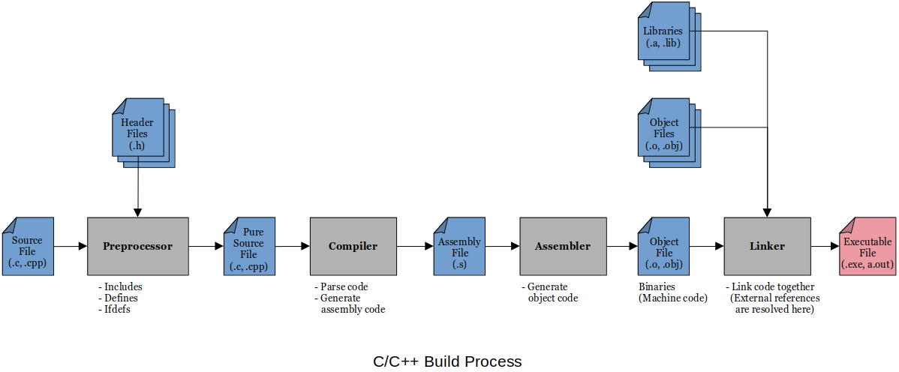

[Home](../../) | [Projects](../../projects) | [Notes](../) > <a href="./">Computer Architecture & Organization</a> > ARM Assembly Language

# ARM Assembly Language


## C/C++ Build Process and Beyond





* At the **linking** phase, external references in the programs (e.g., `.global main`, `.global printf`, `.global scanf` in the assembly program) are resolved because the linker now has access to all those pieces of code.

  The last thing the linker will do is to load the address for the start of your code (main) into the *Program Counter (PC)*. At that time your program takes over the CPU.


## Assembler

* An **assembler** is a program that converts the assembly code into the machine code (binary).

    - The output of the assembler is directly executed by the CPU (mostly).

* **Two-Pass Assembler**

  - First pass
    - A symbol table is built.
    - The *labels* are put in a table and the assembler determines the address assigned to that label.
    - Memory allocations are made for the instructions and data.
    - Any incorrect instructions, syntax and referenced labels that are not defined are flagged as **errors**.    
        - Extra spaces, all comments are ignored by the assembler.
        - Most modern assemblers are NOT case sensitve.
  - Second pass
    - All symbol references in the code are resolved and the final binary code is generated.

* Typical instruction in memory will look something like this:

  ```plain
  Opcode | Addressing Mode | Operands
  ```

  Even with RISC machines there are several instruction formats depending on the instruction, associated addressing mode and other options like shifting of registers, etc. 

  The detailed manual on the ARM assembler provides all this information.

* **Assembler Directives**

  - Assembler directives tell the assembler how to assemble your code. They do NOT get translated into machine code but CAN affect the way the code is created.

    [!] Note: **Assembly instructions** or **executable instructions** are translated into machine code which are executed by the processor. This is your program.

  - Assemblers vary and sometimes quite a lot. In most cases:

    - Ignore extra spaces between operands.
      e.g., `r1,r2,r3` and  `r1,    r2,  r3` are the same.

    - Not case sensitive for instructions.

      e.g., `ADD`, `add`, `Add` are the same.

    - Comments can start one space after the last operand, and can be `/* */` (multi-line) or `@` (single-line) delimited.

    - Ignore extra spaces between operands.

      e.g., `r1,r2,r3` is identical to `r1,    r2,  r3`.

    - Labels are case sensitive.
      e.g., `Loop:` and `loop:` are different labels.

    - Macros 

    - Last line in code file has to be a blank line.

  - Things you can do with assembler directives:

    - Where you want your code to be located in memory, when it is loaded.
    - Allocate storage space to variables
    - Initialize variables
    - Tell the assembler where your assembly code stops and do NOT assemble anything after this point (`END` or `STOP`) 

  - Examples:

    ```plain
    .balign 4         @ Forces a word boundary.
                      @ 4 specifies the number of bytes that must be aligned to.
                      @ (this number must be power of 2).
                      @ It means, the next piece of memory that I declare after this directive
                      @ need to start at a memory location that is divisible by 4. It has to be
                      @ aligned with the memory locations that are divisible by 4.
                      @
                      @ When you declare an array, this is important because you want
                      @ each of those elements to have an individual address that is
                      @ divisible by 4. If it is not divisible by 4 (word size), 1, 2,
                      @ or 3 bytes of an individual element can be partially stored before
                      @ the array, after that particular location.
    
    Q:  .word 9       @ Defines a label 'Q' at current memory location as word-size and
                      @ sets it to a decimal 9.
                      @ .word  allocates 4 byte memory space to hold data.
                      @ .hword allocates 2 byte memory space to hold data.
                      @ .byte  allocates 1 byte memory space to hold data.
    
    Array: .skip 4x10 @ Defines a label 'Array' at current memory location and reserves
                      @ 40 bytes of memory.
                      @ Note that '.skip' does NOT initialize the allocated memory; Thus
                      @ 'Array' will contain whatever garbage values it was previously 
                      @ set to.
    
    str1: .asciz     "This is a sample string.\n"
                      @ .asciz puts a terminating null character at the end of the string.
    
    str2: .ascii     "This is a sample string.\0\n"
                      @ .ascii does NOT put a terminating null character at the end.
                      @ (It must be explicitly added by the programmer.)
                      @
                      @ Note that using the null character \0 as the terminator
                      @ for strings is a C construct, not an assembly's.
    ```

    To use the string defined in the `.data` section:

    ```plain
    LDR r1, =str1     @ Put the address of the start of the str1 in r1.
                      @ The = (equal sign) in front of a label reference will use
                      @ the address of the label NOT the contents of the memory
                      @ reference.
    ```

    Good example of using the literal declaration in conjunction with the arrays:

    ```plain
    .text
    ...
    
    @ Even though the assembler allows you to put these declarations anywhere
    @ in the code, it is a good practice to put them at the top of your code
    @ for the better readability and maintainability.
    
    Monday    = 1         @ .equ Monday,      1
    Tuesday   = 2         @ .equ Tuesday,     2
    Wednesday = 3         @ .equ Wednesday,   3
    Thursday  = 4         @ .equ Thursday,    4
    Friday    = 5         @ .equ Friday,      5
    Saturday  = 6         @ .equ Saturday,    6
    Sunday    = 7         @ .equ Sunday,      7
    
    ...
    
    .data
    
    DaysOfWeek:           @ Now this is an array containing  
    .word Monday          @ 1, 2, 3, 4, 5, 6, 7
    .word Tuesday   
    .word Wednesday 
    .word Thursday  
    .word Friday    
    .word Saturday  
    .word Sunday    
    
    WeekendDays:          @ Now this is an array containing
    .word Saturday        @ 6, 7
    .word Sunday    
    
    WeekDays:             @ Now this is an array containing
    .word Monday          @ 1, 2, 3, 4, 5
    .word Tuesday   
    .word Wednesday 
    .word Thursday  
    .word Friday          
    ...
    ```

* **Location Counter**

  - Location counter is the pointer to the next location in memory that the assembler maintains when a program is being assembled. This pointer is necessary for the assembler to do the proper memory allocation, variable
    initialization, etc.
  - Similar in concept to the program counter except the **location counter** is used during the *assembly process* and the **program counter** is used during the *program execution process*.
