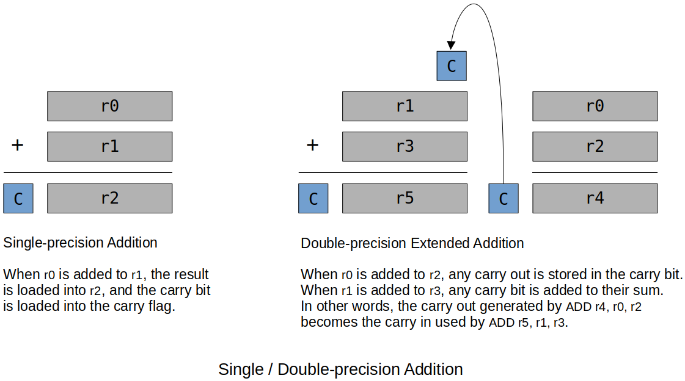
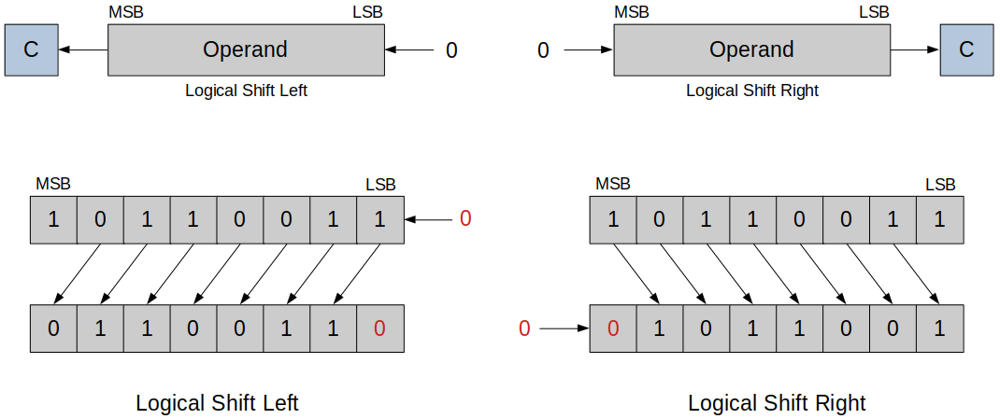
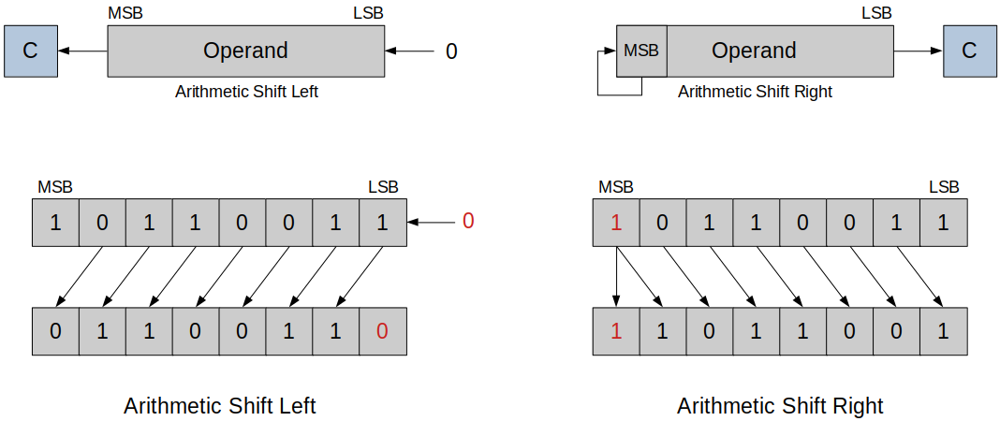
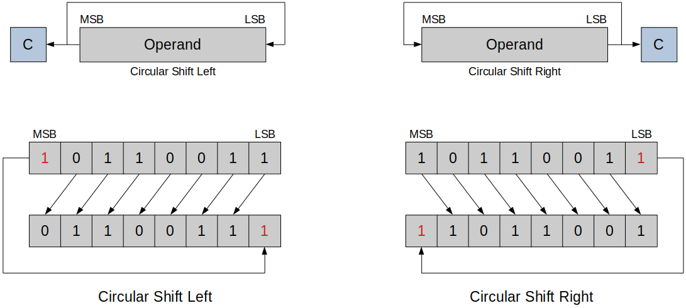
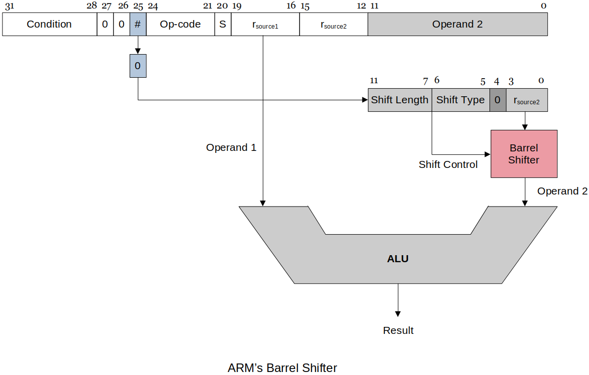

[Home](../../) | [Projects](../../projects) | [Notes](../) > <a href="./">Computer Architecture & Organization</a> > ARM Instruction Set Architecture (ISA) - Data Processing Instructions

# ARM Instruction Set Architecture (ISA) - Data Processing Instructions


## ARM Data-processing Instructions

* Data-processing instructions are the instructions used to manipulate data not just move it from one location to another.


## Arithmetic Instructions

### Addition

* In most cases `ADD` is straightforward, but there are some cases that impact the processor and the instruction set.

    - Adding two binary numbers that fit into 32 bits works **no problem!**

      - On the ARM, the calculation will even set the Carry bit in the CCR if the results of bit 31 sum produces a carry.
      - 32 bits for positive or two's complement provides a good size range. If you do not need all the significant digits techniques can be used for larger (or smaller) numbers to lose accuracy but make for better
        speed.

    - Adding two binary numbers that are too big to fit into 32 bits (e.g., 64-bit double or 128-bit quad word, etc.), can be **problematic!**

        - In this case, the assembly programmer has to handle this with register pairs since ARM can only add 32-bit words at a time.

          ```plain
          ADDS r4, r0, r2   @ Add the LSBs first and make sure the carry bit gets set.
          ADDS r5, r1, r3   @ Add the MSBs and get the carry bit from the LSB add.
             -
             S is so carry bit gets set when necessary
          ```

          Using `ADC`(add with carry flag) in place of `ADDS` also works:

          ```plain
          ADC r4, r0, r2   
          ADC r5, r1, r3  
          ```





### Subtraction

* Normal subtraction 

  ```plain
  SUB r1, r2, r3        @ RTL: [r1] ← [r2] - [r3]
  ```

* Reverse subtraction

  ```plain
  RSB r1, r2, r3        @ RTL: [r1] ← [r3] - [r2]
  ```

  > This is necessary because in the literal addressing mode, the literal has to be the last operand. In this case you can't just switch the position of the operand to perform the reverse subtraction.

* Unlike addition, subtraction is NOT associative and NOT commutative.

  ```plain
  SUB r1, r2, #20       @ RTL: [r1] ← [r2] - 20
  RSB r1, r2, #20       @ RTL: [r1] ← 20 - [r2]
  ```

  > Above two operations do NOT yield the same result.

### Negation

* Negation subtracts a number from zero.

* As ARM does not have a negation instruction, you as a programmer need to do the negation yourself by using reverse subtraction.
  
  ```plain
  RSB r1, r1, #0        @ Negates the contents of r1.
                        @ if r1 originally contained 10, r1 becomes -10.
  ```
  
  In effect, `RSB` produces **2's complement**.
  
  ```plain
  MVN r0, r1            @ Copies bitwise NOT of argument. In other words,
                        @ copies the logical complement of the contents of r1.
                        @            ------------------
                        @            bit reversal!
                        @            it's not sign reversal (arithmetic reversal)
  ```
  
  In effect, `MVN` produces **1's complement**.

### Comparison

* **Implicit** comparison (need to add `S`)
  - CCR bits set based on the ALU operation `SUBS`, `ADDS`, etc.
* **Explicit** comparison (always set the flags)
  - CCR bits set based on `CMP` or `TST` instruction.

### Multiplication

* Since the multiplication of two *n-bit* operands may produce the product of size up to *2n-bits*, this has to be handled with care.

1. If it is guaranteed that two operands and the product will all fit into 32 bits.
   
   ```plain
   MUL rd, rm, rs       @ RLT: [rd] ← [rm] * [rs]
                        @
                        @ Note that rd and rm cannot be the same, because in this 
                        @ multiplication algorithm rd is used to build up the answer so if
                        @ rd and rm are the same, the intermediate calculation gets 
                        @ interfered.
                        @ - MUL r0, r0, r1  @ NOT OK!
                        @ - MUL r0, r1, r0  @ OK
                        @ 
                        @ The Raspberry Pi assembler checks for this and generates an
                        @ error during assembly. 
                        @ - I have personally observed this error caused by using 
                        @ ADD r1, r1, r2. This was easily solved by just modifying the 
                        @ code to ADD r1, r2, r1.
   ```
   
2. If the overflow is expected (or if you are not sure).

   ```plain
   UMULL rL, rU, rA, rB     @ RTL: [rU, rL] ← [rA] * [rB]
                            @
                            @ Multiply rA and rB, place 64-bit unsigned result
                            @ into {rU, rL} 
                            @       --  --
                            @       |   least significant 32 bits
                            @       |
                            @       most significant 32 bits
                            @       ------------------------
                            @       if this part is 0, no overflow
                            @
                            @ UMULL interprets values from rA and rB as 
                            @ unsigned integers.
   
   UMULLS rL, rU, rA, rB    @ If S is specified, 
                            @ - update N and Z flags according to the result.
                            @ - does not affect the C or V flags.
   ```

   > The reason `UMULL` has to be used in this case is because `MULLS` will not set the CCR flags. (Because of how the `MUL` works there is no way to ensure the hardware can set flags correctly so it does NOTHING. The carry bits are tied to specific bits in the ALU. It is possible when a multiplication is performed, those specific bits can show no issues but there turns out to be overflow issues.

* Multiply and Accumulate (`MLA`)

  ```plain
  MLA r0, r1, r2, r3        @ RTL: [r0] ← [r1] * [r2] + [r3]
                            @ Does the multiplication and adds the product to
                            @ the running total.
  ```

### Division

* ARM does not have instruction for division.
* Same type of problem with multiplication occurs in division.
* There is a *quotient*, *remainder* and the *sign* that has to be handled as well.
* You as a programmer have to write the division subroutine yourself.
  - Works best as a loop that does **repeated subraction** until you can no longer subtract the whole number, producing a quotient and a remainder.
  - See [Multiplication & Division](https://jackklee.com/computer-architecture-and-organization/multiplication-and-division) for more details.


## Bitwise Logical Operations

* Bitwise logical operations are apply to the individual bits of a register.
  
* **`AND`**, **`ORR`**, **`EOR`**

  ```plain
      0100              0100              0100
  AND 1111          ORR 1111          EOR 1111
  --------          --------          --------
      0100              1111              1011
  
  Bitwise AND       Bitwise OR        Bitwise exclusive OR (XOR)
  ```

* **`NOT`** is not supported by ARM. But, you can implement it by:

  - Using `EOR` with `#FFFFFFFF` on one register.
  - Using the `MVN` instruction. (See *Negation* section above for more details about `NVM`.)
  
* **`BIC`** (Bit Clear)

  - `AND`'s the first operand with the logical complement of the second.

    ```plain
    BIC r1, r2            @ RTL: [r1] ← [r1] · [r2]
                                             ^
                                            AND
    ```

  - Can be used to clear out the low-order byte of a register.

    ```plain
    BIC r0, r1, #0xFF     @ Copies the 32 bits in r1 to r0 then clears bits 0 to 7 of 
                          @ the data in r0.
    ```

* A **mask** is used with a specific logical operation to get the bit we want to know about and exclude the ones we do not care about.


### Shift Operations

* **Logical shift**
  - Logical Shift Left
    - Each bit is shifted towards left, MSB is discarded and LSB becomes `0`.
  - Logical Shift Right
    - Each bit is shifted towards right, LSB is discarded and MSB becomes `0`.





* **Arithmetic shift**
  - Arithmetic Shift Left
    - Each bit is shifted towards left, MSB is discarded and LSB becomes 0. (Similar to logical shift)
        - In this example, the operation has overflowed. Meaning, the result of the multiplication is larger than the largest possible value.
  - Arithmetic Shift Right
    - Each bit is shifted towards right, LSB is discarded and MSB is preserved.





* **Circular shift** (Rotate)
  - The bit shifted out is copied into the bit vacated at the other end (i.e., no bit is
    lost during a rotate).
  - The bit shifted out is also copied into the carry bit.
  - Following figure shows `ROL` and `ROR`.





* Implementing a Shift Operation on the ARM
  - ARM's implementation of shift operations is unique in that there is no explicit shift operations.
      - Instead, shifting is combined with other data processing operations because the second operand can be shifted before it is used.
  - ARM has a **barrel shifter** that can be applied to the second operand of almost any instruction.
  - A barrel shifter uses combinational logic to perform the shift without shift registers.
      - With `r`<sub>`source2`</sub> and shift control information, the barrel shifter knows exactly what to do.
      - This allows multiple bits to be shifted in one execution cycle instead of each bit being shifted in each execution cycle.





* ARM implements only the following five shifts (the programmer must synthesize the rest).
  
  ```plain
  LSL   logical shift left
  LSR   logical shift right
  ASR   arithmetic shift right
  ROR   rotate right
  RRX   rotate right through the carry (only one bit at a time)
  ```
  
  > Don't be confused! These are **operators** NOT **instructions**. 
  >
  > Since ARM does not have shift instructions, you, as a programmer, need to from instructions by using these operators as arguments to perform shift. For example:
  
  ```plain
  MOV r1, r1, LSL #1    @ shifts r1's bits one bit-place to the left
              ---
              used as an "argument"
  ```
