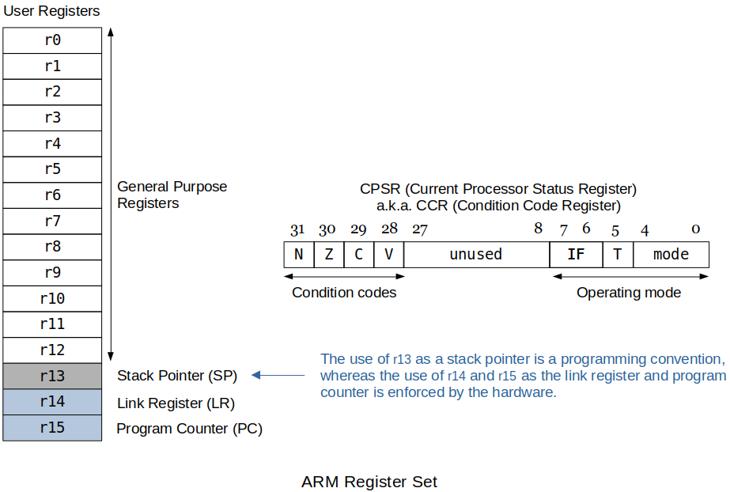

[Home](../../) | [Projects](../../projects) | [Notes](../) > <a href="./">Computer Architecture & Organization</a> > ARM Register Set

# ARM Register Set


## ARM Register Set





* ARM has 16 programmer-visible registers and a Current Program Status Register, CPSR.

  ```plain
  r0 - r12  : General-purpose registers
              (r0 - r11 are completely interchangeable.
               r12, a.k.a. scratch register, is used for Intra-Procedure-call.)
  r13       : Reserved for the programmer to use it as the stack pointer
  r14       : Link register which stores a subroutine return address
              (This is what the BL instruction uses to store the current PC.)
  r15       : Program counter which is accessible by the programmer
  CPSR      : a.k.a. CCR, holds the processor status and control information
  ```

* More on Current Program Status Register (CPSR)
  (For more details on "condition flags setting", see [Introduction to the Stored Program Machine & ARM](https://jackklee.com/computer-architecture-and-organization/introduction-to-the-stored-program-machine-and-arm).)

    - [31-28] Condition Codes 

      ```plain
      N         : Negative or less than flag
      Z         : Zero flag
      C         : Carry or borrow or extended flag
      V         : Overflow flag
      ```

    - [27- 9] Reserved

    - [ 8- 0] System Control Bits

      ```plain
      IF        : Enables or disables IRQ or FIQ interrupts
      T         : Thumb mode
      Mode      :
        M[4:0]  Mode        ARM - Visible State Registers
        ------  ----------  --------------------------------------------
        b10000  User        r0-r14, PC, CPSR
        b10001  FIQ         r0-r7, r8_fiq-r14_fiq, PC CPSR, SPSR_fiq
        b10010  IRQ         r0-r12, r13_irq, r14_irq, PC CPSR, SPSR_irq
        b10011  Supervisor  r0-r12, r13_svc, r14_svc, PC CPSR, SPSR_svc
        b10111  Abort       r0-r12, r13_abt, r14_abt, PC, CPSR, SPSR_abt
        b11011  Undefined   r0-r12, r13_und, r14_und, PC, CPSR, SPSR_und
        b11111  System      r0-r14, PC, CPSR
      ```

      > So far, we have discussed only these 17 registers that are visible to us in the **user mode**. In reality, however, ARM has total 32 registers and the rest become visible as you switch to the different modes.
      >
      > ARM designers decided to maintain another set of registers to make context switching more efficient by reducing the push/pop of all the registers to/from the stack.

* ARM has some **four operand** instructions. This is possible due to only having 16 registers so only 4 bits are needed to specify the register.  (Out of 32 bits, 16 bits are still available for the instruction and addressing modes after using 16 bits to specify four operand registers.)

  ```plain
  ADD r1, r2, r3        @ Three operands
                        @ RTL: [r1] ← [r2] + [r3]
                        @
                        @ At times, one of these three can be left out.
                        @ ADD r1, r2
                        @ RTL: [r1] ← [r2] 
  
  MLA r1, r2, r3, r4    @ Four operands (MLA: Multiply Accumulate)
                        @ RTL: [r1] ← [r2] * [r3] + [r4]
  ```

  > Not all supports four operands. Refer to the *"ARM Instruction Set"* manual.


## Things to Note with the Raspberry Pi and the C Library Routines

* When a call is made to routines like printf, scanf, etc. the values in registers `r0 - r3` and `r12` will be used by the called routine. Whatever values you had stored there will be overwritten. So, save the register values on the stack if this wipe-out is expected.

  ```plain
  push { /* list of registers*/ }   @ Save register values on the stack
    e.g., push {r0, r1, r2, r3}
          push {r0-r15}
          push {r2, r0}
  pop  { /* list of registers*/ }   @ Restore original values into the regs
    e.g., pop {r0, r1, r2, r3}
          pop {r0-r15}
          pop {r2, r0}
  
  [!] Note: The order of the list of registers when pushing does not matter 
            since each register is mapped to the bits in the data transfer 
            instruction.
            However, the order in pop should match that of push's.
            Otherwise, the restored value can be mixed up. 
            (ARM assembler won't report this as an error.)
  
            e.g., CORRECT!
                  push {r2, r3, r4}
                  pop {r2, r3, r4}  @ Move top of the stack into r4 first,
                                    @ then r3, then r2
                  WRONG!
                  push {r2, r3, r4}
                  pop {r3}          @
                  pop {r4}          @ This mixes up the resotred values!
                  pop {r2}          @
  
                          
  [!] Note: The push puts the data on the stack from the lowest number register 
            to the highest number register. The pop pulls them off the stack 
            from the highest number register to the lowest number.
  
  [!] Note: Be careful NOT to,
            "push {r2, r3, r4}" then try and restore by 
            "pop {r3}, pop {r4}, pop {r2}" since this will switch values
            between the registers.
            You should be using "pop {r2, r3, r4}"
  ```

* Depending on the type of call, sometimes other registers may be used as well. Be aware of that!

  Comments on `.global printf` in the following program supports this. Refresh yourself!

  ```plain
  @------------------------------------------------------------------------
  @ File Name     : lab04.s
  @ Description   : ARM assembly program to calculate factorials.
  @ Author        : Kyungjae Lee
  @ UAH Email     : kl0079@uah.edu
  @ Course        : CS309-01 Spring 2022
  @------------------------------------------------------------------------
  
  .text
  
  .global main
  
  main:
  
  @ Prompt the user to enter a number.
  
      ldr r0, =askForNumber
      bl printf
  
  @ Read in the number.
  
      ldr r0, =formatSpecifier
      ldr r1, =intInput
  
      bl scanf
      ldr r1, =intInput
      ldr r1, [r1]
  
  @ If the input value is not 1-12, terminate the program.
  
      cmp r1, #1
      blt myexit
  
      cmp r1, #12
      bgt myexit
  
  @ Confirm the user of the entered number if the number is valid.
  
      ldr r0, =confirmNumber
      bl printf
  
      ldr r1, =intInput   @ r1-r3 value changes when printf is invoked
      ldr r1, [r1]        @ so load the input valu again!
  
  @ Manipulate the registers to calculate factorials and print them.
  
      mov r8, r1      @ r8 will be used to hold copy of the user input.
      mov r4, #1      @ Initialize r4 which will be used as 1st col num.
      mov r5, #1      @ Initialize r5 which will be used as 2nd col num.
      mov r6, #1      @ r6 will be used to hold r5's previous value.
  
  @ Loop to calculate and print the factorials.
  
  loop:
      cmp r4, r8          @ break if r4 gets bigger than the user input.
      bgt myexit          @ terminate the program.
  
      mul r5, r4, r6
  
      mov r1, r4          @ Pass r4 value to printf via r1
      mov r2, r5          @ Pass r5 value to printf via r2
  
      ldr r0, =calcOutput
      bl printf           @ Print the intermediate/final calc result.
  
      mov r6, r5          @ Update r4, r5, r6 for next calculation
      add r4, r4, #1
      add r5, r5, #1
  
      b loop
  
  myexit:
      mov r7, #0x01 @ SVC call to exit
      svc 0         @ Make the system call.
  
  .data
  
  .balign 4
  askForNumber: .asciz "Enter a number (1-12): "
  
  .balign 4
  confirmNumber: .asciz "You entered %d!\n "
  
  .balign 4
  calcOutput: .asciz "%d\t%d\n "
  
  .balign 4
  formatSpecifier: .asciz "%d"
  
  .balign 4
  intInput: .word 0
  
  .global printf
  @ printf("This is printf function, %d %d %d\n", r1, r2 ,r3)
  @         -----------------------------------
  @         Address of this whole string is stored in 'r0'
  @
  @ r0-r3 are used as arguments to printf function. When you invoke printf
  @ function these register values are likely to be changed. It is a good
  @ practice to use other registers than these for the manipulation purposes.
  
  .global scanf
  @ Similar applies to the global scanf function.
  ```

  Output

  ```plain
  Enter a number (1-12): 12
  You entered 12!
   1	1
   2	2
   3	6
   4	24
   5	120
   6	720
   7	5040
   8	40320
   9	362880
   10	3628800
   11	39916800
   12	479001600
  ```
