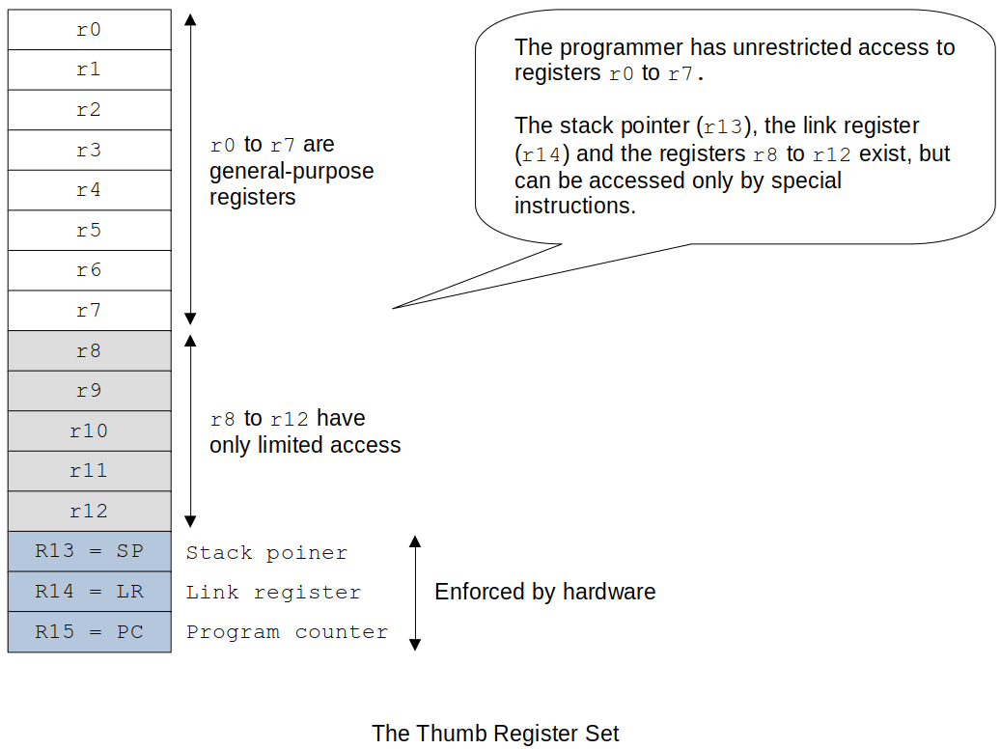
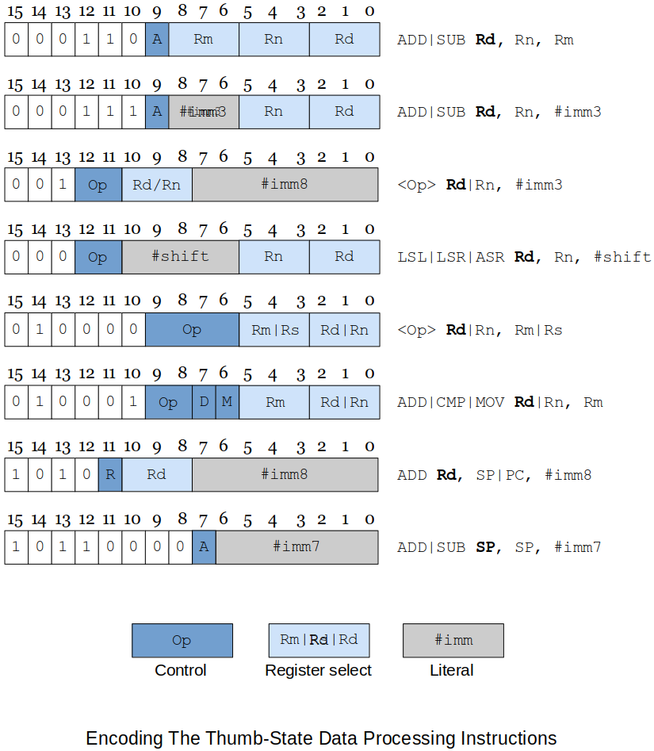
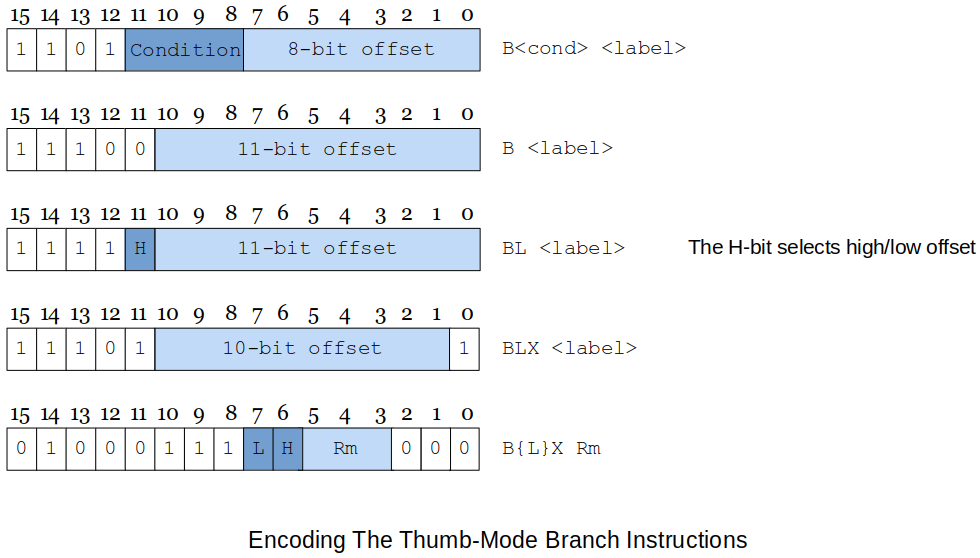
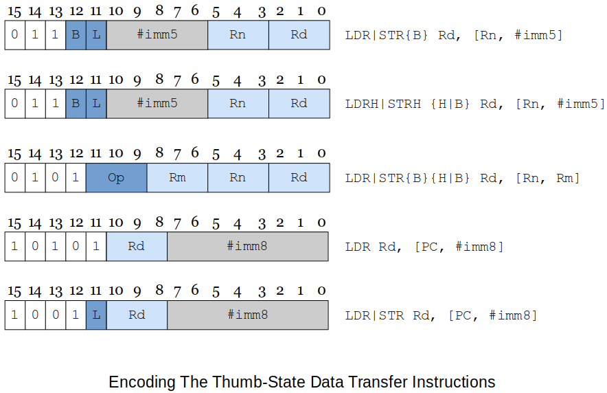
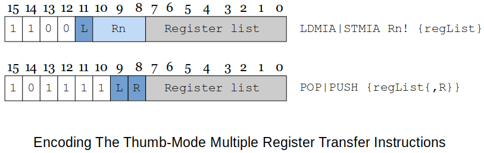

[Home](../../) | [Projects](../../projects) | [Notes](../) > <a href="./">Computer Architecture & Organization</a> > ARM Thumb Instruction Set Architecture (ISA)

# ARM Thumb Instruction Set Architecture (ISA)


## Compressed Code, RISC, Thumb and MIPS-16

* Some modern processors can change from a 32-bit machine to 16-bit machine.
  - Every ARM processor can run **Thumb mode**.
    - 32-bit $$\to$$ 16-bit
    - 64-bit $$\to$$ 32-bit
* When bigger and faster is the king, why go back?
  - Less cost
  - Less power consumption
* There are billions of CPU embedded in devices and the CPU manufacturers wanted to tap into that market.
* The **Thumb** is an ARM which has a shorten bus which makes it cheaper to buy and uses cheaper memory and I/O devices.
* Raspberry Pi ARM can run in this compressed mode - Thumb mode - which can be used for development and debugging.


## ARM Thumb ISA

* ARM(32-bit architecture) Thumb takes ARM's 32-bit structure and carms it into 16-bits.

* The ARM processor's Thumb state gives the designer the best of both 16-bit and 32-bit world.

    - The processor can execute both compressed 16-bit Thumb code and normal 32-bit code.

* This is achieved by putting the required ARM processor code in small 32-bit wide memories and then locating everything else in low-cost 16-bit wide memories.

* When Thumb code is optimized for **performance**

  - $$26\%$$ smaller than regular ARM processor code BUT still achieves $$98\%$$ of the original performance.

  When optimized for **size**

    - $$32\%$$ smaller than regular ARM processor code

* The Thumb register set





* Thumb instructions are 16-bit wide.

* Versions of the ARM processor family supporting the Thumb state provide a `T-bit` in `bit 5` of the `CPSR`.

  When the `T-bit` is set to `1`, the processor interprets the code as 16-bit Thumb instructions; otherwise the code is executed normally.

* Following a reset, the ARM processor enters its default native state.

* Thumb state is entered by executing the `BX` instruction (banch and exchange) that

  - sets the `T-bit` (`bit-5`) in the `CPSR` and
  - executes a jump to the specified location.

  Also, you have to tell the assembler that you are now writing ARM Thumb code.

  The format is

  ```plain
  BX Rm     @ Rm contains the target address of the Thumb code to be executed.
            @ This means that Rm has to be properly loaded with the target address (label)
            @ beforehand.
  .code 16  @ following this will be the Thumb code
  ```

* When `BX` is executed, the least-significant bit of `Rm` is tested. (e.g., `BX r0`)

  - If it is set to a `1`, the processor switches to its Thumb state and begins executing code at the address in `Rm` aligned to a half-word (16-bit) boundary.
  - If it is set to a `0`, a jump is made to the address in `Rm` aligned to a word (32-bit boundary) and the ARM processor continues execution in its normal default state.

* With the proper instructions, you can make your code switch back and forth between these two modes as many times as you want.

### Design Decisions

* How did the ARM designers go about making the Thumb work?
  - Make too many changes $$\to$$ more efforts will be required to keep up with the changes between the Thumb mode and the regular ARM mode.
      - Especially if the changes were made to the number of registers, it would have been very costly. So, we are still dealing with 16 32-bit registers.
  - Make too few changes $$\to$$ not much accomplishment for the goal
* Registers (4 bits in the opcode in the regular ARM mode)
  - To make the instruction format down from 32-bit to 16-bit could reduce the number of bits for the registers. Take the registers from 16 down to 8 (4-bit to 3-bit). BUT, cutting the number of registers in half will fundamentally change the ARM architecture.
* Solution
  - Keep all the registers and just change the way they are accessed. 
  - `r0` to `r7` are directly mapped to the Thumb state.
  - `r14`(`LR`) and `r15`(`PC`) remain the same, except that they can't be explicitly accessed, and new instructions are requird to access them.
  - `r13` can be used as a stack pointer in the ARM Processor architecture (by convention).
      - In the Thumb state, `r13` is defined as a hardware stack pointer and it now has auto-decrementing and incrementing modes.
  - Most instructions cannot access `r8` to `r12`.
  - Instruction now only need 3 bits to reference a register. (`r0` to `r7`)
  - Programmer can still access `r8` to `r12` using specific instructions.

### Other Design Decisions

* No conditional execution (saves 4 bits per instruction).

  - e.g., No `ADDEQ` 

* Many of the data processing instructions use a two-address format (like the CISC processors) to avoid encoding a third operand.

* No shifted second operand $$-$$ a new set of explicit shift instructions was added.

* The greatest savings has been made by drastically reducing the size of immediate operands. (In the **literal addressing mode**)

    - Taken from 12-bit down to 3-bit or 7-bit or 8-bit depending on the instruction.

* `S` suffix dropped. `CCR` bits always set when the ALU is used in a data processing instruction.

    - e.g., No `ADDS`

* Summary

  ```plain
  1. ADD    Rd, Rn, Rm          @ (ADD|SUB)
  2. ADD    Rd, Rn, #imm3       @ (ADD|SUB)
  3. ADD    Rd|Rn, #imm8        @ (ADD|SUB|MOV|CMP)
  4. LSL    Rd|Rn, #imm8        @ (LSL|LSR|ASR)
  5. MVN    Rd|Rn, Rn|Rs        @ (MVN|CMP|CMN|TST|ADC|SBC|NEG|MUL|LSL|LSR|ASR|ROR|AND|
                                   EOE|ORR|BIC)
  6. ADD    Rd|Rn, Rm           @ (ADD|CMP|MOV) high registers          
  7. ADD    Rd, SP|PC, #imm8    @ (ADD)
  8. ADD    SP, SP, #imm7       @ (ADD|SUB)
  ```

  > `Rd` $$-$$ Destination register
  > `Rs` $$-$$ Source register
  > `Rn`, `Rm` $$-$$ Just any registers you can use

  Don't need to memorize all these formats. Just understand that in Thumb mode things have to get shrinked.

### Thumb-state Data Processing Instructions





### Thumb-state Branch Instructions





* Above figure describes the encoding of the Thumb state's branch instructions.
  - A **conditional** branch has an 8-bit offset.
    - Make sure that the target address is reacheable by an 8-bit offset from the current location.
  - An **unconditional** branch has an 11-bit offset.
* This branch encoding allows short-range branching for conditionals within small loops and `if-then-else` constructs.
* The subroutine call instruction, **branch with link (`BL`)** is not going to be very effective with only $$2^{11} = 2,048$$ offset. Actually it is $$2^{12} = 4,096$$ because thumb mode is word aligned to 16-bit.
    - Any substantial piece of code can be expected to require long-distance subroutine calls and therefore a short literal is unlikely to provide the necessary range of target addresses.
    - The solution adopted is to employ a **branch with linker instruction** with an 11-bit offset and then to **repeat** the instruction to get a second 11-bit offset that can be concatenated to create a 22-bit offset.

### Switching to ARM Thumb Mode

* When writing ARM Thumb programs, you have to tell the assembler what state you are using. You indicate the type of code to the assembler by means of the directives `.code 32` (ARM code) and `.code 16` (Thumb code).

  The default directive is `.code 32`

* State Switching Example

  ```plain
    ADD r1, r2, r3      @ dummy instruction to show we are in ARM state
    ADR r0, Thumb + 1   @ load the start address of the Thumb section
                        @ adding 1 to the address forces bit 0 in r0 high (which will
                        @ eventually set the T-bit in CPSR)
    BX r0               @ branch and change to Thumb state
    .code 16            @ assemble Thum instructions
  
  Thumb:                @ arrive here in Thumb state
    ADD r1, r2          @ dummy instruction to show we are in Thumb state
    ADR r0, Normal      @ load the start address of the Normal (ARM) section
                        @ not adding 1 to the address will clear T-bit in CPSR
    BX r0               @ branch and change to Normal (ARM) state
    .code32             @ assemble ARM code
   
  Normal:               @ arrive here executing ARM code
  ```

### Thumb-state Load and Store Instructions

* Thumb's load and store operations (described in the figure below) follow a similar pattern to the corresponding ARM processor instructions except that the displacement specified by the immediate offset is relatively small (either 5 or 8 bits).
* `Byte`, `half-word` and `word` transfers are supported.





### Thumb-state Multiple Move Instructions

* The Thumb instruction set also includes multiple memory move instructions, although the range of variations is not as gresat as in the ARM processor architecture (this is probably a blessing).
* Following figure describes the two basic forms of the block register move instructions.





* The 16-bit instruction format allows you to move only registers `r0` to `r7`; you can't move any of the higher-order registers.

* The `STMIA Rn!, {registerList}` instruction lets you copy the block of registers specified by `registerList` to the memory location pointed at by register `Rn`. 

* The only mode permitted is **increment after** which indicates that a register is stored at the location pointed at by `Rn` and then the register is incremented by 4 after the register has been moved.

* The lowest numbered register is stored first at the lowest memory address (i.e., the initial starting address in the pointer register).

* The `LDMIA Rn!, {registerList}` copies data from memory to registers. The lowest numbered memory address is ifirst loaded into the lowest numbered register, the pointer incremented by 4, and the next load carried out.

* The `STMIA` and `LDMIA` instructions are inverse operations in the sense that an `STMIA Rn!, {registerList}` can be followed immediately by an `LDMIA Rn!, {registerList}` without a change in the state of the system.

* The other block move is the `PUSH` and `POP` pair of instructions that are true inverses of each other in the sense that a `PUSH` followed by a `POP` leaves the state of the system unchanged.

* These instructions do not require a register to be specified nor do they require the "`!`" suffix because, by definition, they access the stack pointed at by `r13`, the stack pointer.

* The syntax for the register list is `registerList{,R}` where `{,R}` field is optional and `R` may be `sp` or `pc`; for example, you can write `PUSH {r0-r4, lr}` and `POP {r0-r4, pc}`.

  > Again, don't need to mess with the stack pointer. Just use `PUSH` and `POP` and they will automatically take care of the stack pointer increment/decrement.


## What Else Does Change in Thumb Mode?

* Fetch
  - Since the instruction size is shrinked to 16 bits, `PC` will be incremented by 2 instead of 4.


## Why Do We Study Thumb Mode?

* It represents an interesting approach to ISA design.
* It has helped elevate ARM Holdings' position in the world of embedded computing to an industry user.
* It demonstrates tradeoffs between code density and performance.


## Mr. Preston's Experiences with Thumb Mode

1. Auto-indexing did NOT work!

   - Use Indirect Addressing instead, and manually update the reference (index) register.

2. `LDR` did NOT work with `r8`|`r9`|`r10`.

   - `MOV` did work fine with the higher-order registers.

3. `MUL` operands:

   ```plain
   MUL r1, r2, r1
       --      --
        |      |
        +------+
        these two had to be the same!
   ```

   And all operand registers had to be lower-order registers; `r0`-`r7`.

4. For `lr`, `PUSH` only!, for `pc`, `POP` only!

   ```plain
   pop {lr}     @ did not work! Looks like assember knows what I need to do.
   puch {lr}    @ OK!
   pop {pc}     @ OK!
   ```

5. `UMULL` did work in Thumb mode even though it is said that it is not supported in 16-bit mode. Had no issues using higher-order registers during compilation. But, at runtime, only lower-order registers `r0`-`r7` were allowed.

    - When higher-order registers were used $$\to$$ segmentation fault!

6. `LDRB`, `STRB` (for `printf` and `scanf` in bytes) did not work. Needs some investigation!
