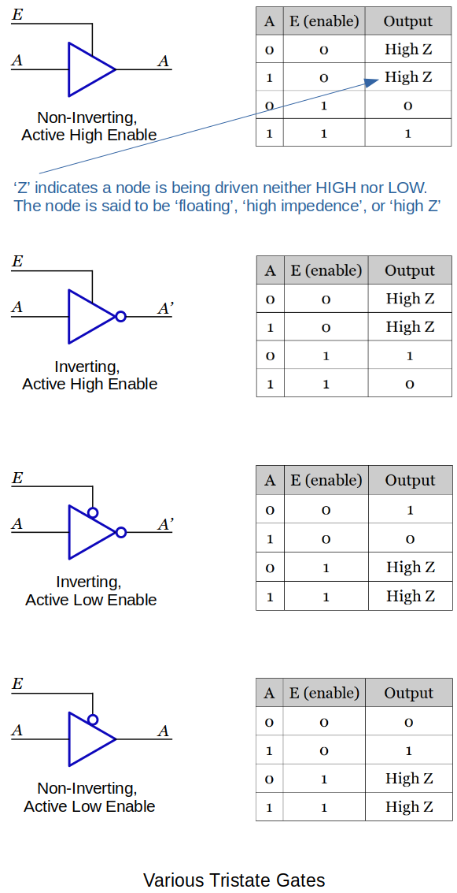
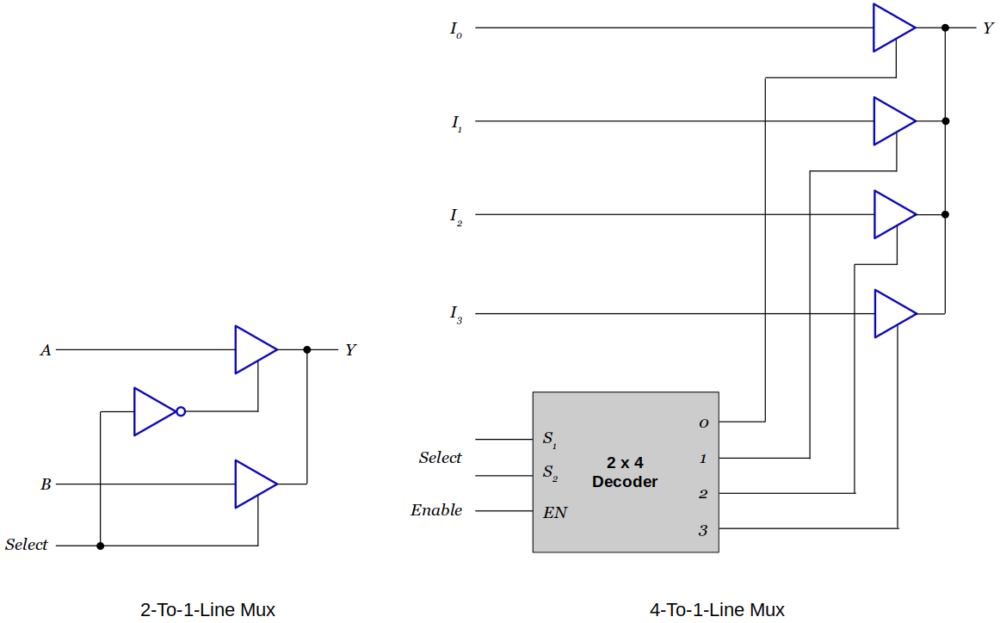
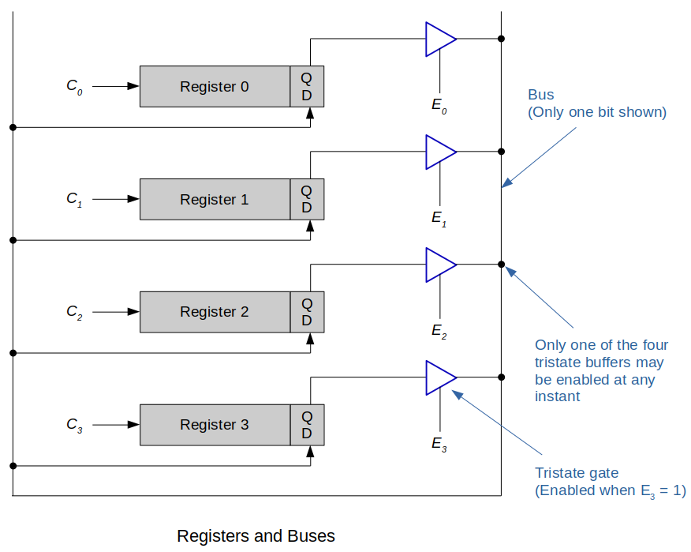
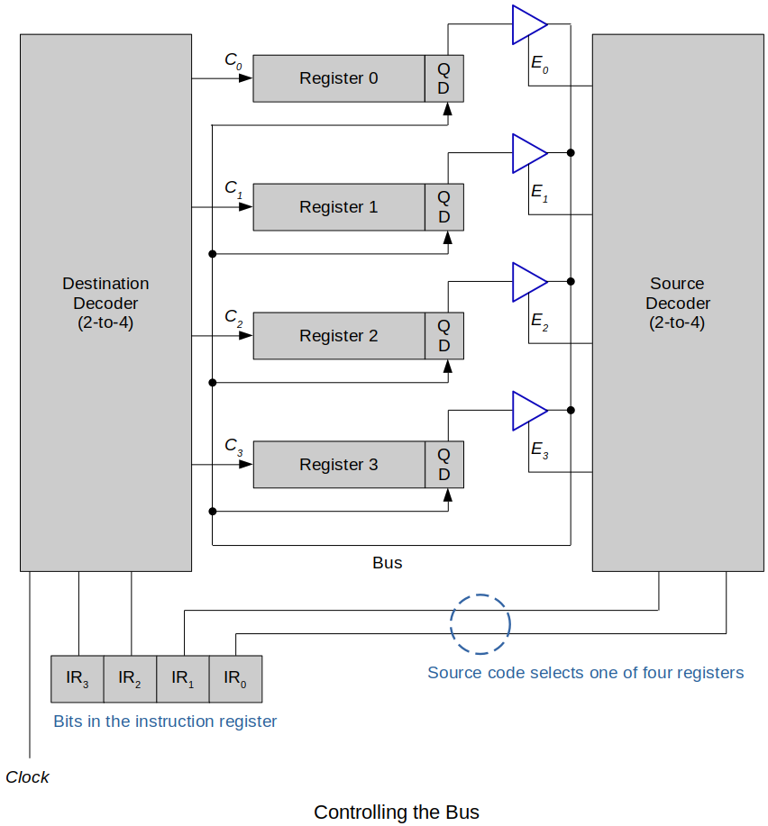
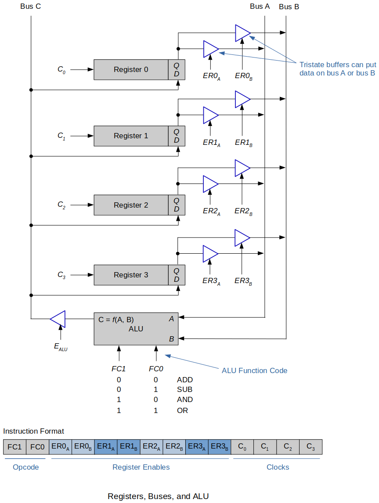

[Home](../../) | [Projects](../../projects) | [Notes](../) > <a href="./">Computer Architecture & Organization</a> > Buses and Tristate Gates

# Buses and Tristate Gates


## Tristate Gates

* A **tristate gate** is a simple circuitry that has lots of important applications.
    - It makes the design or circuits much simpler.
    - It is very useful in digital systems where devices communicate via common wires called **buses**. (Only one device can talk at a time; others are disabled.)





* When this gate is not enabled it does not output a 1 or a 0. It is like it is not even part of the circuit. 
    - This is why the outputs of tristate gates can be connected together.
    - Still have to be careful that one gate is ground and another is at +5VDC. (Short circuit)


## Applications of Tristate Gates

* It is guaranteed that only one of the tristate gates will be enabled at any particular time so the outputs of these tristate gates can be connected together and do not cause short.





## Registers, Buses, and Functional Units

* A `MOV` instruction is one of the simplest computer instructions that copies data from one location to another.

    - In high level language terms it is equivalent to the assignment `Y = X`.

* Following diagram demonstrates how one bit (specifically the LSB) travels around the bus.

    - In reality, there will be as many lines in the bus as the size of the registers.

    - 2-to-4-line decoders are required to select the source and destination registers used by an instruction.

    - This structure can execute a machine level operation such as 

      ```plain
      MOV Ry, Rx    (assembly language)
      [Ry] ← [Rx]   (RTL notation)
      ```





* Following diagram shows how the instruction register uses bits `IR1`, `IR0` to select the data source.
    - The source decoder decodes bits `IR1`, `IR0` into one of four signals: `E0`, `E1`, `E2`, `E3`.
    - The register enabled by the source code puts its data on the bus, which is fed to the D inputs of all registers.
    - The 2-bit destination code `IR3`, `IR2` is fed to the destination decoder to generate one of the clock signals `C0`, `C1`, `C2`, `C3`.
    - All the AND gates in this decoder are enabled by a common clock signal, so that the data transfer does not take place until this line is asserted.





* Follwing example extends the system further to include multiple buses and an ALU (Arithmetic and Logic Unit).
    - An operation is carried out by enabling two source registers and putting their contents on bus A and bus B.
    - These buses are connected to the input terminals of the ALU that produces an output depending on the function the ALU is programmed to perform.
    - It is not showing the hardware detail for the register input signals (`C`<sub>`0`</sub> to `C`<sub>`3`</sub>)
    - There are four clock signal bits in the instruction. This is to support multiple registers reading in the data from the bus C.
        - If only one register is to read in the data at a particular moment, you would have needed only two bits of clock signals in the instruction.





* How does the number of registers on the CPU affect the instruction register?
  - The instruction register has to have enough bits in order to select the register number that is being accessed.
      - 4 registers require 2 bits.
      - 8 registers require 3 bits.
      - 16 registers require 4 bits. (e.g., ARM)
  - More registers take up space in the instruction register and more space on the CPU. There is always a trade-off.
* How does the number of registers on the CPU affect the other parts of the control unit?
    - Decoders are needed to specifically address the right register to or from the bus.
    - The example above used 2-to-4 decoders; one set for the bus A, bus B, and bus C.
