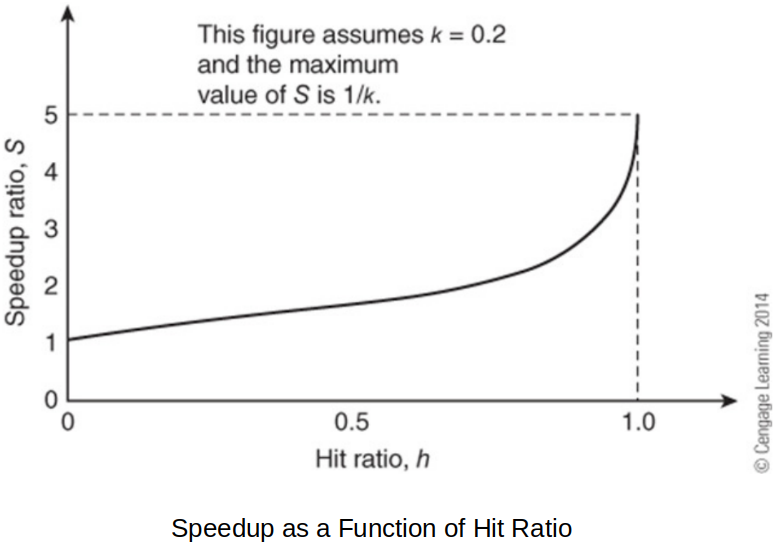
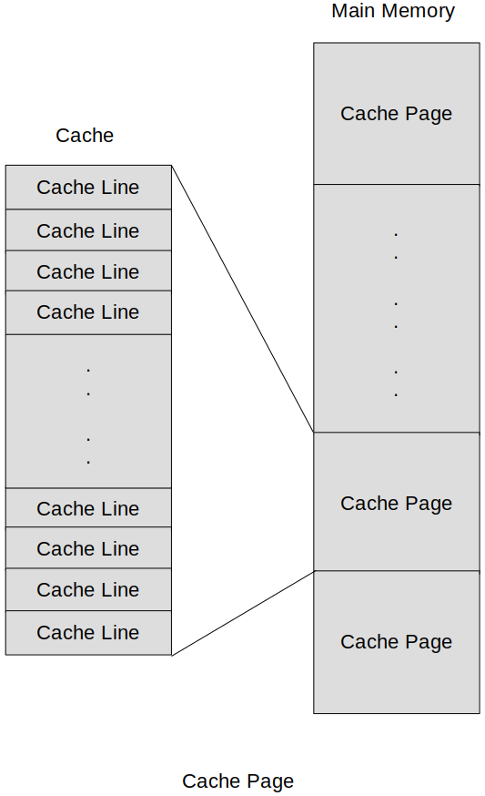
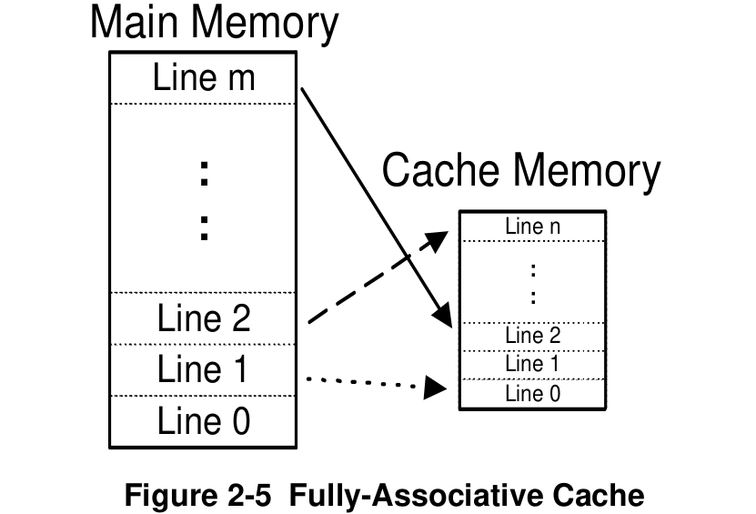
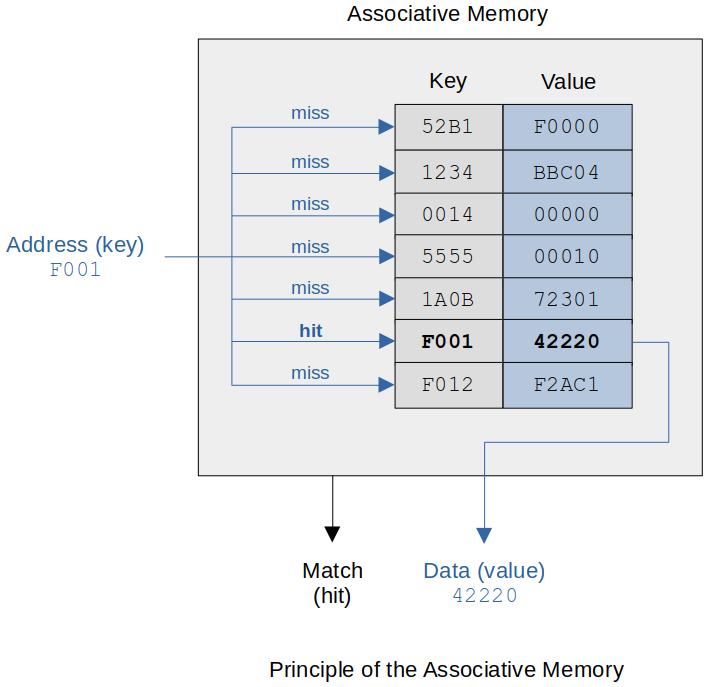
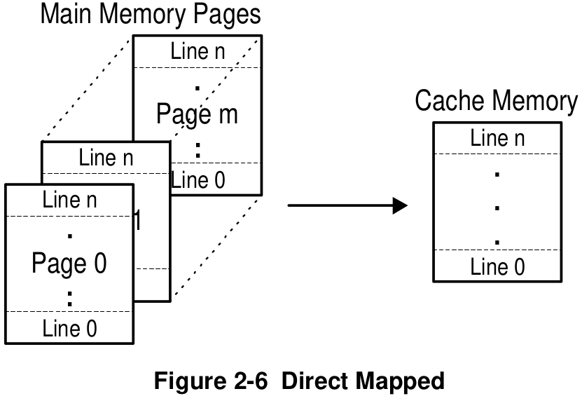
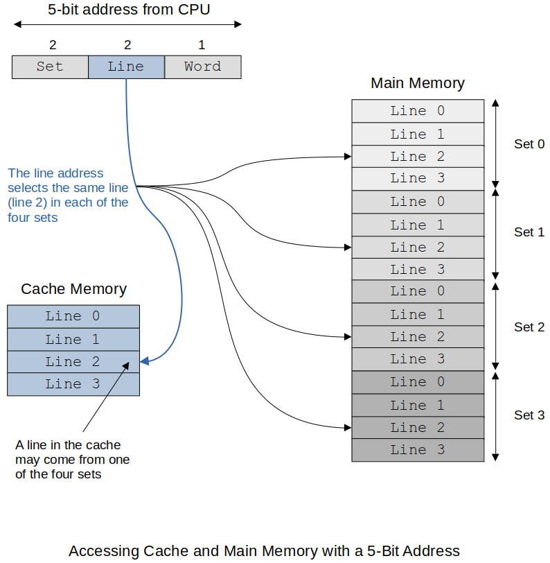
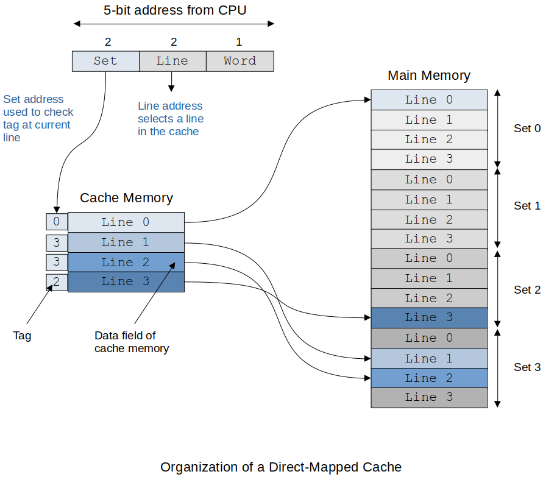
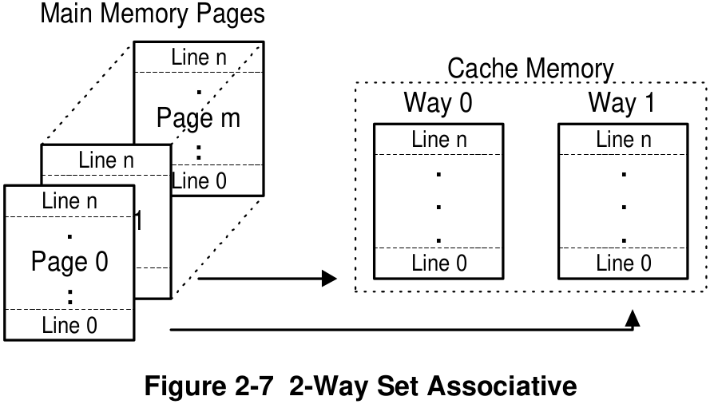
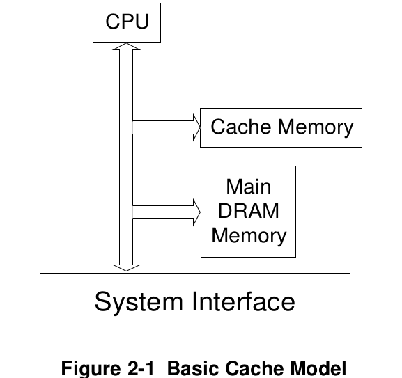
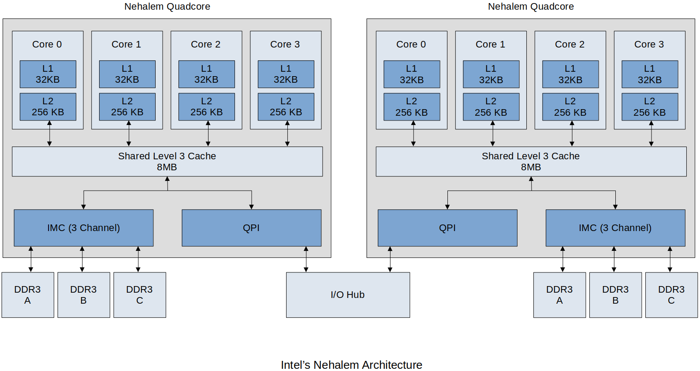

[Home](../../) | [Projects](../../projects) | [Notes](../) > <a href="./">Computer Architecture & Organization</a> > Cache Memory

# Cache Memory

## Memory Hierarchy

* This is the **speed** vs. **cost** vs. **size** of memory storage chart.

* How does the Cache work? (Mr. Preston's analogy; sock example)

  - I leave my socks I'm going to wear the next morning next to my shoes.
  - When I'm ready to put on my socks and they are not there I have to get a pair out of the dresser.
  - If there are no socks in the dresser I have to go to the other end of the house to check the dryer or clean laundry basket.
  - If there are no clean socks then I have to do a load of laundry.

  Points to remember: Closer (to the CPU) is quicker!

## Cache and Virtual Memory

* How this works in the worst case:
  - CPU has a memory reference (logical address). Data or instruction it does not make a difference.
  - Logical address is used to check the Cache. ("Do I have this in cache?")
  - If it's in the Cache (a.k.a. **Cache Hit**), Read opreation is terminated and it is retrived to the destination register in the CPU.
  - If the memory reference is not in the Cache (a.k.a. **Cache Miss**) the MMU translates the Logical address to the physical address and looks for reference in Main Memory.
  - If the memory reference is not in Main Memory (a.k.a. **Page Fault**) the Disk drive is accessed via the I/O to retrieve the data.
  - Data is copied to Main Memory and the Cache and then to the CPU where the reference was made in the first place.
* At any time the memory reference is found the other lower level requests are terminated, the higher level memory elements are updated and the data is provided to the CPU.
* Virtual memory could be implemented with software only, but without the help of MMU (hardware) it will be much slower.

## Introduction to Cache Memory

  > Back in the days Level 3 Cache was outside the CPU, but nowadays they are usually in the same silicon as CPU.

* Cache is all about reducing the problems with the *von Neumann bottleneck*.
* Memory speed/performance has always lagged behind the CPUs. 
* Why buy a faster processor when all it will do for you is **wait faster**?

## Structure of Cache Memory

* More details on cache:

  > Cache is now on the same piece of silicon as the CPU. Close means faster. This is called "**on-chip cache**".

## Principle of Locality of Reference

* How does cache speed up processor speed so much when its size is an order of magnitude smaller than main memory?
* **Locality of reference**, also known as the **principal of locality**, is the tendency of a processor to access the same set of memory locations repetitively over a short period of time.
    - e.g., If the instruction $$X$$ is executed, more than likely the instruction $$X+1$$ will be the next one executed.
    - e.g., If the data $$Y$$ is used, more than likely the data $$Y+1$$ will be the next one to be used. (e.g., array elements)
* Two basic types of reference locality
  - **Temporal locality**
    - Refers to the reuse of specific data, and/or resources, within a relatively small time duration.
    - e.g., Loops
  - **Spatial locality**
    - Refers to  the use of data elements within relatively close storage locations.
    - **Sequential locality**
      - A special case of spatial locality
      - Occurs when data elements are arranged and accessed linearly, such as, traversing the elements in a 1D array.

## Performance of Cache Memory

* Cache memory makes the overall performance of the CPU better.

  - It may be wiser to buy a CPU that is slower but has more L1 cache for overall better performance.

* **Hit ratio** (Ratio of hits)

  
  $$
  h = \frac{\text{memory reference is in cache}}{\text{all memory references}} 
    = \frac{\text{hits}}{\text{hits $+$ misses}}
  $$

  

  Hit ratio $$h$$ can reach up to $$98\%$$ (for some applications). Results may vary.

* **Speedup ratio**

  
  $$
  \begin {align}
  S &= \frac{\text{memory system's access time WITHOUT cache}}{\text{memory system's access
    time with cache}} \\
    &= \frac{N\cdot t_m}{N(h\cdot t_c + (1-h)t_m)} \\
    &= \frac{t_m}{h\cdot t_c + (1-h)t_m}
  \end {align}
  $$

  

  * Access time of main store: $$t_m$$

  * Access time of cache memory: $$t_c$$
  * Hit ratio: $$h$$
  * Miss ratio: $$m = l - h$$
  * Speedup ratio: $$S$$   

  Let the ratio of the speed of cache memory to main memory $$k = \frac{t_c}{t_m}$$, then the speedup ratio can be rewritten as:

  
  $$
  S = \frac{1}{h\cdot k + (1-h)} = \frac{1}{1-h(l-k)}
  $$

  

  The better (higher) the hit ratio, the more the speedup! And noticeable increase happens
  when the hit ratio is very close to $$1$$ (approximately $$0.8$$ or higher).

* **Parallel memory-cache system**. 

  - The cache request and the memory request is made at the same time. If cache hit, the memory request is terminated. This provides some speedup if there is a miss.

* Bottom line!

  There are many ways to calculate performace and all of them miss the mark on trying to measure the overall performance of the CPU and the computer system.

## Cache Organization

* If a cache holds only a tiny fraction of the available memory space, what data goes into it and where do you put it?

* One of the problems with cache is the data can come from anywhere in main memory and we have to be able to store it and retrieve it from anywhere in cache. Not only do we have to get the data stored in main memory we have to know where it came from.

    - There are many ways of solving this mapping problem, although all practical cache systems use a **set associative organization**.

* Main memory is divided into equal pieces called **cache pages**.

  - The size of a page is dependent on the size of the cache and how the cache is organized.

* A cache page is broken into smaller pieces, each called a **cache line**.

  - Cache line is the basic unit when we talk about storage or movement of data to the cache.

  - A cache line in general consists of a sequence of **several consecutive words** that is transferred from main memory to the cache at one time.

      - The size of the cache line is determined by both the processor and the cache design. (@ design time)

      - Why several words?

        $$\to$$ Suppose a cache were organized at the granularity of a word. If an instruction were accessed, and it wasn't currently in the cache, it would have to be fetched from the main store. However, there's no guarantee that the next instruction will be a hit. 

        $$\therefore$$ We need a bigger unit than the word.

      - **Prefetch**

        - Because the cache line consists of *several* words, if you make a reference to an instruction in memory, the following *several* instructions are pulled into the cache line. This makes sense because most of the time the instructions are executed sequentially and thus increasing the cache hit rate.

* **Cache line** will typically be an integer number of words for the system.
* **Cache page** will then be a power of $$2$$ number of cache lines.
* **Main memory** will then be divided into a power of $$2$$ number of cache pages.

## Cache Consistency (Coherency)

* Since cache is a photo or copy of a small piece main memory, it is important that the cache always reflects what is in main memory. Some common terms used to describe the process of maintaining cache **consistency** are:

    - **Snoop**
      - When a **cache is watching the address lines for transaction**, this is called a snoop. This function allows the cache to see if any transactions are accessing memory it contains within itself.
    - **Snarf**
      - When a **cache takes the information from the data lines**, the cache is said to have snarfed the data. This function allows the cache to be updated and maintain consistency. (In other words, if it sees a reference to something that it does not have in cache it does snarf.)

  Monitors the address line (i.e., snoop), and if there's a new address that is not stored in cache, snarf it! 

  Snoop and snarf are the mechanisms the cache uses to maintain consistency.

* Two other terms that are commonly used to describe the **inconsistencies** in the cache data:

    - **Dirty data**
      - When data is modified within cache but NOT modified in main memory, the data in the cache is called "dirty data."
      - 캐시에 갖 더렵혀진 (새로 업데이트 된) 데이터
    - **Stale data**
      - When data is modified within main memory but NOT modified in cache, the data in the cache is called "stale data."
      - 캐시에 오래 묵은 (메인 메모리의 새로 업데이트 된 데이터가 반영되지 않은) 데이터

## Fully Associative Mapped Cache

* We want any main memory location to be able to be placed anywhere in the cache.

  - We want the cache whose cache line can hold data from any line in the main store.

* The problem is how to keep track of what memory references are in the cache. (Have to store both the memory location and the data stored at that location.)

    - The cache implements this feature by using the hardware construct called **associative memory** which stores *key*-*value* pairs.   

        - Key $$-$$ Current address from the processor   
          - The key is a reduced size of the address because a cache line will contain several words of main memory so the least significant bits of the address are not needed to have a unique address.
        - Value $$-$$ Data stored at that memory location

      

      

      > An associative memory is unordered in the sense that data can be stored in any location; that is, there is no concept of address. Each data item is identified by a key and is retrieved by its key. In this example the key is `F001` and that retrieves the data (value) item `42220`.
      >
      > Unlike the conventional memory that contains a block of sequential memory elements $$0, 1, 2, ...,$$, all keys in an associative memory are not ordered or sequential.
      >
      > Also, a big advantage of associative memory is that the key can be matched in parallel at the same time (i.e., simultaneously). If a key is found, the match (or hit) line is asserted.

* Hardware implementation of associative memory

  Following figure shows one bit of associative memory.

  

  

  

  > The J-K Latch shown above represents one bit of the address that's being stored in the associative memory. Data line is the address line and mask line has ability to mask off certain bits of the address line. If the addresss line consists of $$28$$ bits, then there is going to be $$28$$ of these all of which will be checked at the same
  > time in one clock cycle to determin if cache hit or miss.
  >
  > This is, of course, a lot of hardware but it is what makes cache very fast!

* One of the reasons why we want the the cache line to be of multiple-word size is because this way the size of the address can be reduced (some of the least significant bits of the address are no longer needed) which means **less hardware implementation** and **less cost**.

  For example, the ARM is byte addressable and the word size is $$32$$-bit ($$4$$-byte) so, there is no need to keep the least significant $$2$$ bits for the address assuming we always stay on the word boundaries. (Now, consecutive $$4$$-byte memory space is considered one unit, and no need to specify the address of each byte in this new unit.)

  Likewise, if we extend the cache line to $$4$$-words ($$16$$-byte) then we do not need to store additional $$2$$ of the lower bits in the cache. So, only $$28$$ bits ($$32-2-2$$ bits) are needed for the address of the $$4$$-word-sized cache line.

  $$\therefore$$ The longer the cache line, the less bits are needed for the cache or line address.

* **Example**:

  Consider a system with $$16$$ MB (i.e., $$2^{24}$$ bytes) of main store and 64 KB of associated mapped cache. If the size of a line is four $$32$$-bit words (i.e., $$16$$ bytes) we do not need to store the last $$4$$ LSBs of the address in the cache assuming we keep up with the byte addresssable memory.

  Main memory has $$24$$ address bits.

  Main memory size: $$2^{24} = 16,777,216 = 16$$ MB $$= 16$$ M words

  Each cache line has $$16$$ bytes so, we only need $$24-4 = 20$$ bits to specify the cache line address. (This will be $$20$$ most significant bits of the main memory address. And the rest $$4$$ bits will contribute to selecting the reference byte.)

  If there is a cache hit then the entire cache line is returned. Associative memory is used for these $$20$$ address bits then a $$8$$-line $$16$$-to-$$1$$ mux is used to select the reference byte, OR $$4$$-to-$$1$$ mux to select the word.

* What happens when the cache is full? We now start this whole line-replacement strategy.

  1. **Least Recently Used (LRU)**

       - Have not used it in a while and should not expect it to be referenced (Not the best guess)

       - Difficult to implement (Associative memory + timer)

       - Need more hardware and takes time to update

  2. **First-In-First-Out (FIFO)**
       - Easy to implement but just because it has been in the cache the longest does not
         ensure it will not referenced again (Can be implemented using the pointer to the
         oldest cache line and updating it accordingly)

  3. **Random**
       - Actually not too bad when it comes to implementation and efficiency.

* Two tpes of **cache miss** for Fully Associative Cache:

  1. **Compulsory Miss**

       - First time reference will always make for a cache miss.

       - Preloading is the only way to overcome this type of miss.

  2. **Capacity Miss**
       - The cache is full.

### Fully Associative Cache Summary

* Any line of memory can be an any location in cache.
* Memory is only divided into cache line. No cache pages.
* Best performance
* Complex and expensive

## Direct-Mapped Cache

* The main memory is divided into units called set or cache pages.

* There is only one set (or page) in the cache.

* The size of the set (or page) is the same as the cache.

* In Direct-Mapped Cache, main memory is organized by pages and each page is organized by
  lines.

    - In Fully Associative Mapped Cache, main memory is organized by cache lines.

* **Example**:

  Consider a system with $$16$$ MB (i.e., $$2^{24}$$ bytes) of main store and 64 KB of direct-mapped cache. If the size of a line is four $$32$$-bit words (i.e., $$16$$ bytes) we do not need to store the last $$4$$ LSBs of the address in the cache assuming
  we keep up with the byte addresssable memory.

  $$16$$ MB main memory / $$64$$ KB cache $$= 256$$ sets or cache pages

  Each page consists of $$\frac{64 \text{ KB}}{16 \text{ Bytes per line}}$$ or $$2^{16} / 16 = 4,096$$ lines

* Also called a **1-Way Set Associative Cache**

* The direct-mapped cache may only store a specific line of memory within the same line of cache.

    - A lot smaller hardware than the fully associative mapped cache, but now we loose some flexibility; if the `line 0` of the `page 0` has to be written to the cache and the cache already has the `line 0` from the different page, there is no choice but to remove that previous `line 0` from the cache and write the new `line 0` of the `page 0` in that place.

* If the memory reference is from another page/set it has to replace the line in the cache.

* Good thing is that instead of having to keep track of all the cache lines, now we only need to keep track of the page numbers.

* Cheaper, slower than the fully associative cache

* Too many drawbacks so not used in reality

* **Example**:

  Main memory access address is divided up into Set/Line/Word.

  

  

  

  The following shows how the tag is used to determine if the line we are looking for is contained in the cache. The tag length is a lot smaller than with the Fully Associated Mapped Cache so implementation is cheaper.

  

  

  

  If there is a cache miss then the current line has to be replaced with the line that is referenced.

  Don't forget if the cache line was updated, then it has to be copied back to memory before it is written over. No decision on where to put the replacement. It has to go into a specific location.

### Direct-Mapped Cache (or 1-Way Set Associative Cache) Summary

* Main memory is divided into cache pages equal to the size of the cache.
* May only store specific line of memory within the same cache line
* Least complex $$-$$ Only needs to track the cache set or page
* Least expensive
* Least flexible
* Lower performance $$-$$ Not all of the cache may be used depending on the memory
  references. There may be swapping with open cache lines. (There is a free space in the
  cache but the line we need already has a different line stored there.)

## Set Associative (or X-Way Set Associative) Cache

* Divides cache into multiple cache ways
* Cache page $$=$$ cache way size
* Allows same line number from different pages to be in cache at the same time
* Less complex than Fully Associative Mapped Cache
* Less expensive than Fully Associative Mapped Cache

* This 2-Way Set Associative Cache allows for the same line number from two different pages to be stored in the cache.

* Just need to keep track of which cache page or set is stored in the cache.

  - Of course, more ways in the cache, faster it is, but more hardware necessary and the price will go up.

* Cache miss types for Set Associative cache:

  1. **Compulsory**

       - The miss cannot be avoided.

       - First reference to main memory (this miss is mandatory, inevitable)

       - Can try to make this better by using pre-fetching by guessing what the next
         reference will be.

  2. **Capacity**

       - Ran out of room in the cache.

       - The cache gets full and then we get a reference to memory which is not in the cache.

  3. **Conflict**

       - The cache is not yet full but the line needs to be replaced.

       - There is free space in the cache but the line we need already has a different line
         stored there.

## Physical vs. Logical Cache

* The memory Management Unit (MMU) is hardware that translates the CPU referenced address to a physical address in main memory. This is used in virtual memory systems because pages can be located anywhere in main memory and this unit keeps track of this and where those pages are located.
* Physical Cache has a longer access time since all memory references in the CPU have to be translated by the MMU.
* In a multitasking system which allows for multiple tasks (processes) to be executed by a single CPU, when there is a context switching and a new process starts execution the addresses used by the new process has to be brought into the MMU.
    - The data in the Logical Cache is no longer correct.
    - The data in the Physical Cache is still OK.

## Cache Electronics

* A processor which runs at $$1$$ GHz needs data every $$1$$ nanoseconds (i.e., $$10^{-9}$$).
* **Static Random Access Memory (SRAM)**
  - $$4$$ to $$6$$ transistors to make up a single bit (flip-flop)
  - As long as power is applied the value of the memory location is retained.
  - Very fast but takes up hardware space and expensive
  - $$1$$ ~ $$2$$ nanoseconds ($$10^{-9}$$)
* **Dynamic Random Access Memory (DRAM)**
  - Transistor-capacitor pair
  - Even with power applied it must be refreshed about every $$2$$ miliseconds.
  - Slower but takes up less hardware space and less expensive
    - Complex refresh circuitry reduces its speed
    - Samller in size
  - $$1$$ milliseconds ($$10^{-3}$$)
  - Destructive read
* DRAM is just too slow to be used for cache. So, it has to be SRAM!

## Cache Coherency (Consistency)

* Every time the CPU performs a read or write, the cache may intercept the bus transaction, allow the cache to decrease the response time of the system by terminating the request to main memory and supplying that data on its own level.

* **Cache Consistency**

  - Since cache is a photo or copy of a small piece of main memory, it is important that the cache always reflects what is in main memory. Some common terms used to describe the process of maintaining cache consistency are:

      - **Snoop**
        - When a cache is watching the address lines for transaction, this is called a snoop.
        - This function allows the cache to see if any transactions are accessing memory it contains within itself.
      - **Snarf**
        - When a cache takes the information from the data lines, the cache is said to have snarfed the data.
        - This function allows the cache to be updated and maintain consistency.

    > Snoop and snarf are the mechanisms the cache uses to maintain consistency.

* Two other terms that are commonly used to describe the **inconsistencies** in the cache data:

    - **Dirty data**
      - When data is modified within cache but NOT modified in main memory, the data in the cache is called "dirty data."
    - **Stale data**
      - When data is modified within main memory but NOT modified in cache, the data in the cache is called "stale data."

## Cache Line Size

* The **line** is the basic unit of storage in a cache memory.

* How big should a line be for optimum performance?

  $$\to$$ Lots of studies have been done and **it depends** on the nature of the application being executed.

* Small line sizes can cause CISC processors to have instructions split between lines.

  - Unlike ARM (RISC) where all instructions are fixed size, CISC has variable length instructions; from $$1$$ byte to even longer than $$32$$ bytes.
  - Increasing line size can prevent this as much.

* Average miss ratio for a data cache as a function of line size (each trace corresponds to a given cache size)

  

  

  

  As the line size is increased, a cache's efficiency rises, because a data object (e.g., instruction, vector or list) is composed of a group of consecutive bytes and the principle of spatial locality is better exploited.

  However, as the line size continues to increase, the hit ratio eventually falls, because reducing the number of lines reduces the probability that a given object will be cached. Moreover, a large line size relies very heavily on the locality of reference. When a miss occurs and a line is loaded in the cache, it may not contain frequently accessed data, yet it may displace a line that is often accessed.

  What can happen if the line gets too big is the miss rate goes up!

  **What does the graph above tell about the cache line size?**

  $$\to$$ Larger cache always improves the performance.

  $$\to$$ As the cache line size increases, the poerformance improves to a certain point. (Less diversity in the cache since the cache line is contiguous memory locations)

  $$\to$$ By adjusting the cache line size to an optimal length for a given cache size, we can find the sweet spot!

## Fetch Policy

* **Demand Fetch**
  - Only fetch a line from memory when there is a reference from the CPU that is not present in cache.
* **Prefetch Strategy**
  - No specific request has been made by the CPU.
  - Bring lines from main memory into cache based on some educated guess.
  - Prefetch too early
    - The data may get swapped out before it is used by the CPU.
  - Prefetch too late
    - The data is not in the cache yet so the CPU still has to wait.
* Some CPUs has a **prefetched instruction**.
  - This does nothing but force the cache miss and pull the data from main memory into cache.
  - When real data is needed it is already in the cache.

## Multi-Level Cache Memory

* In the $$1990$$'s the CPU speeds went over $$500$$MHz and something needed to be done to overcome the *von Neumann Bottlneck*.

* This is an example of the CPU waiting faster.

* Progression (Attempts to achieve performance increase)

  1. CPU, Main Memory
     - Faster CPU has to wait on slower Main Memory
  2. CPU, Off-Chip Cache, Main Memory
     - Off-Chip Cache helps increae speed, but still need to wait on slow Main Memory
  3. CPU, On-Chip Cache (L$$1$$), Off-Chip Cache (L$$2$$), Main Memory
     - Faster overall

  This has kept on going up to L$$3$$ Cache and all are on the CPU. This improved performance!

## Instruction and Data Caches

* Data and instructions occupy the same memory in *von Neumann Architecture*.

* It is cache designers' choice to choose what type of cache to create:

  - **Unified cache** that holds both instructions and data
  - **Split cache** that implements separate caches for data and instructions

* It makes more sense to cache data and instructions separately because they have different properties

    - The instruction cache is never modified by the CPU; Read only. This makes the instruction cache easier to implement.
    - The instructions and the referenced data can be read at the same time from main memory.

* Summary of the advantages of both split and unified caches:

  - I-cache can be optimized to feed the instruction stream.
  - D-cache can be optimized for read and write operations.
  - D-caches can be optimized (tuned) separately.
  - I-caches do not readily support self-modifying code.
  - U-cache supports self-modifying code.
  - D-caches increase bandwidth by operating concurrently.
  - U-caches require faster memory.
  - U-caches are more flexible (an I-cache may be full when the D-cache is half empty).

  > Self-modifying code is not allowed by most Operating Systems. This was a method used to break into computers. Code section of memory is read-only. This is one of the things that can cause the **segmentation fault**.

### Examples

* **AMD's Barcelona Architecture**

  - Four cores on one chip
  - Each core has a $$64$$ KB cache and $$512$$ KB cache to themselves
  - All four cores share a $$2$$ MB cache

  

* **Intel's Nehalem Architecture**

## Writing to Cache

* When there is a write to cache:
  - Cache has to be updated
  - Memory has to be updated
    - Memory does not have to be updated at the same time that the cache is updated, but it does have to happen eventually.
* **Write Policy**
  - **Write-Back**
    - Cache acts like a buffer. The cache gets the updated data and the write to main memory does not happen. When the system bus is available then the memory location is updated.
        - Cache is going to keep the dirty data until main memory gets less busy.
    - Improved performance
    - More complex (Have to keep track of which memory locations need to be updated)
  - **Write-Through**
    - The cache gets updated and the main memory update continues to happen.
    - Slower because we have to wait on the update, but it guarantees the synchronization between the cache and the main memory at any time.
    - Less complex
* Inconsistencies with the data:
  - **Dirty data**
    - When the cache is updated but main memory is not
  - **Stale data**
    - When the main memory is updated but the cache is not
* The average access time equation does change when you have to take in account for the Write Policy.
* Decision tree for accesses to a cache with a write-back strategy

## Virtual Memory and Memory Management

* **Logical Address**
  - Address calculated by the CPU
  - Comes from your program
  - Takes in account the addressing modes and any applicable offsets
* **Physical Address**
  - Actual location of the data in main memory
* Your program and data can be located anywhere in main memory. It can even move while it is running.
* Once the **logical address** is calculated, the memory management unit (hardware) is used to translate the logical address to the **physical address**.
* **Virtual Memory**
  - Virtual memory space (a.k.a. logical address space) describes the address space that can be accessed by a computer.
  - Allows our main memory to appear to be larger than its physical size.
    - e.g., A computer with $$64$$-bit address and pointer registers has a $$2^{64}$$-byte virtual (logical) address space even though it may be in a system with only $$2$$ GB ($$2^{31}$$) of physical main store memory.
    - This method is called **virtual addressing**.

### Memory Management

* A piece of hardware called the **Memory Management Unit (MMU)** takes care of the memory
  management.
    - It takes the most significant bits of the **logical address** and runs it into MMU
      to get the most significant bits of the **physical address**.

* Main memory is divided into **frames**.
  - Think of it as a picture frame.
  - It is a place to put code and data like a picture frame which is a place to insert a picture.
* Your program and data may consist of several pages each of which can be located anywhere in main memory.
* As your program runs as long as the referenced logical address are in the MMU and thus main memory life is good. Your programs run with no issues. This is called **page hit**.
* If your referenced logical address is not in the MMU this is called a **page fault**.
  - At this point the operating system has to kick-in to get the correct page into main memory and update the MMU with the frame location of this newly loaded page.

### Virtual Memory

* Virtual memory systems serve four purposes:
  - Support systems with larger logical memory spaces than physical address spaces
  - Map logical addresses onto physical addresses
  - Allocate physical memory to tasks running in logical address space
  - Make it easier to construct multitasking systems

## Security Issues

### Speculative Execution Vulnerability on ARM

* It is possible that the wrong data is currently in the cache or a process is allowed to access part of the cache it should not have access to.

* Sensitive memory locations are protected by the OS and hardware with the use of the Memory Management Unit (MMU).

  Sensitive data can easily be in the cache. On a cache hit the read to main memory is halted and the MMU and OS protections do not come into play. It is possible to access parts of the cache data and expose it by writing the data out to areas which are not
  secure.

* As a security measure there are two instructions; MSR(clear) and SYS(invalidate).

  - Using these instructions you can clear or invalidate all or part of the cache. However, these are privileged instructions and invalid from user space. Generally, these two instructions are only used in the operating system kernel.
