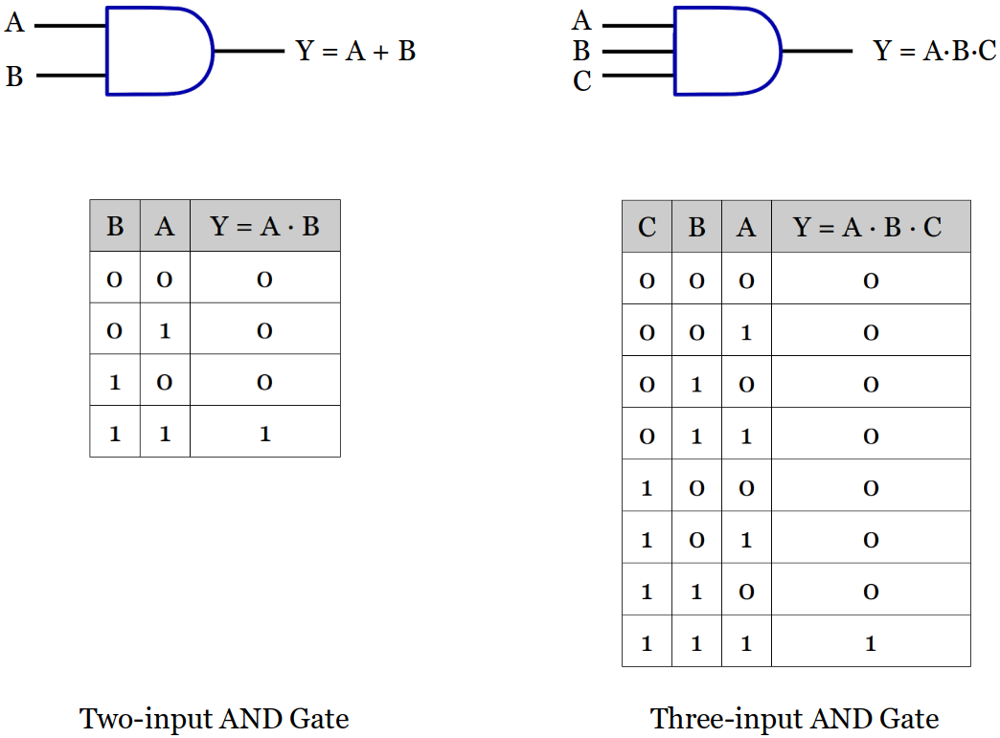
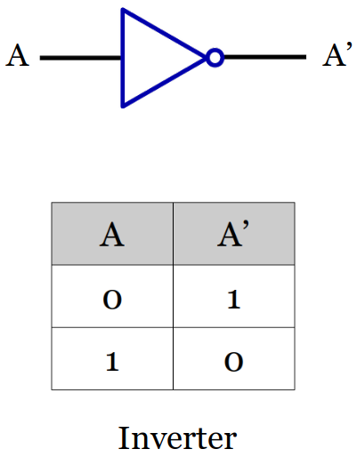
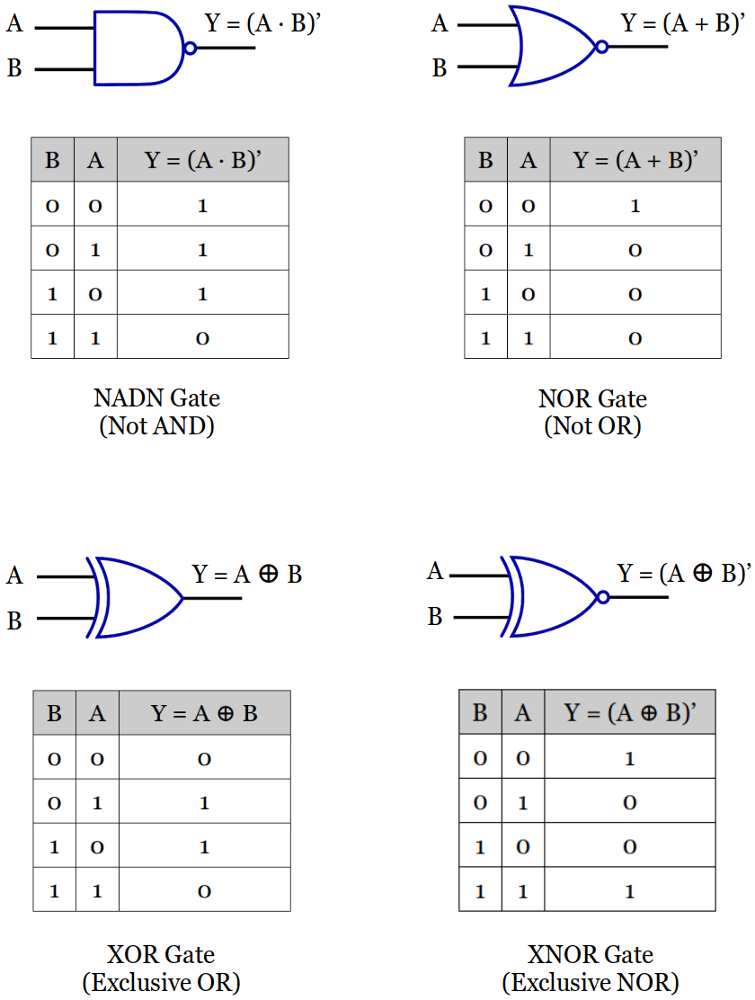
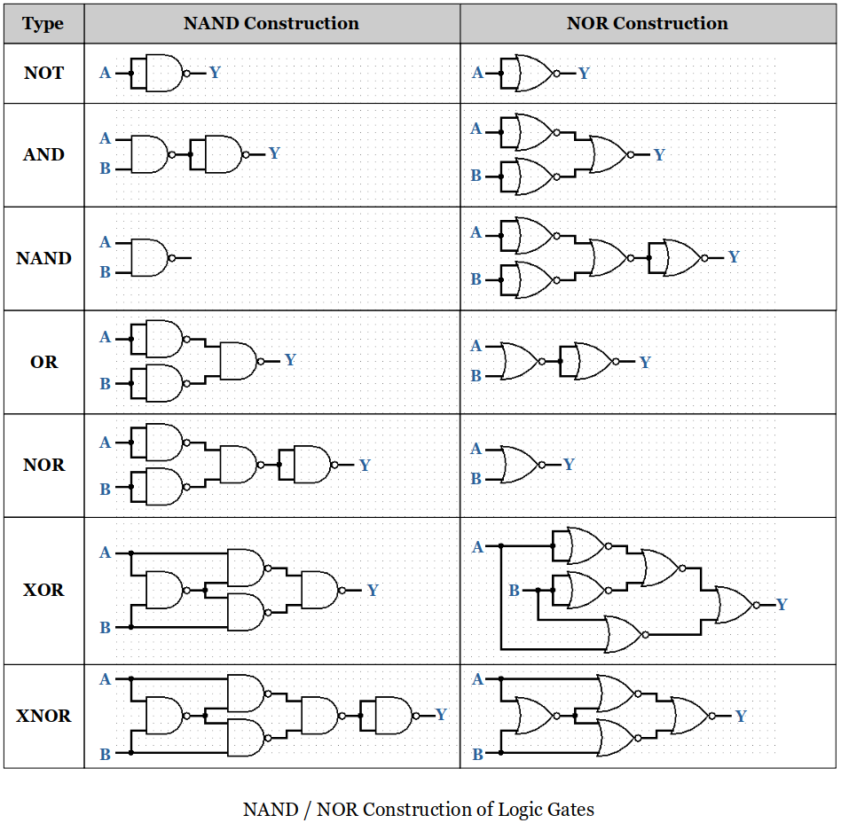
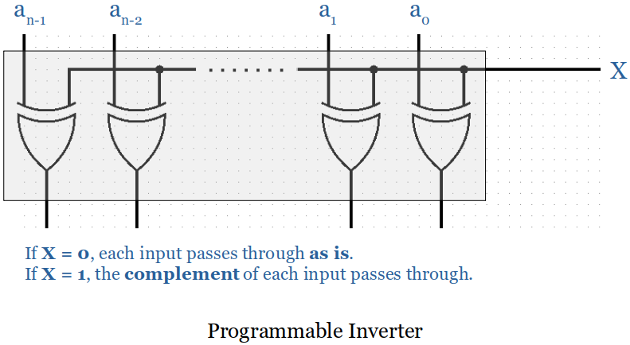
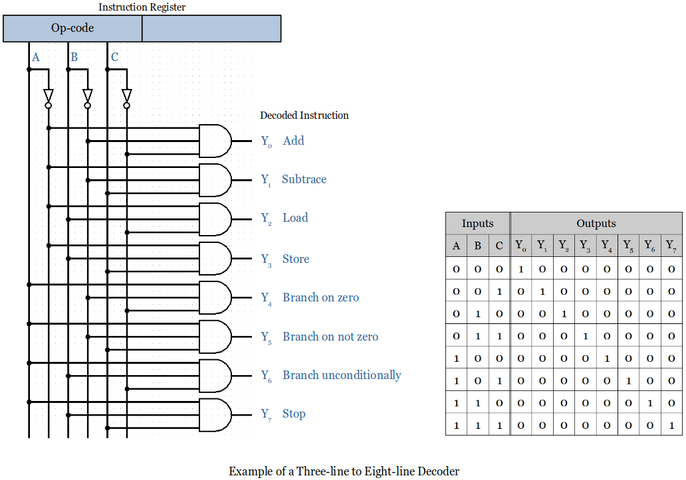

[Home](../../) | [Projects](../../projects) | [Notes](../) > <a href="./">Computer Architecture & Organization</a> > Computer Logic

# Computer Logic

## Background Information

* Two *stable states* with enough separation are required in order to distinguish the logic 1 from the logic 0.

  

  

  

* An input/output signal with **'** or **bar** means it is an **active low** signal.
    - e.g., Enable (active high; active when input is 1) vs. Enable**'** (active low; active when input is 0)

## Introduction to Computer Logic

* **Gates** and **flip-flops** are two basic circuit elements that construct computers.

    - Gates (*combinational logic element*)
      - A circuit whose output depends only on its current inputs.
      - At the lowest level of a computer are the primitive **AND**, **OR**, and **NOT** gates.
    - Flip-flops (*sequential logic element*)
      - A circuit whose output depends on its past history as well as its current input.
      - Can *remember* its previous inputs; So also a memory element.
      - Can be built from simple combinational logic elements.

* Levels of Hardware

  

  

## Digital Systems and Gates

* Digital computers are *binary* systems that use the two symbols 0 and 1 (also called as `false` and `true`, or `low` and `high`, or `off` and `on` respectively).

### Fundamental Gates 

* **AND**, **OR**, **NOT (Inverter)** Gates are the three basic building blocks of all modern digital computers). Any digital logic circuits can be built just with these three types of gates.

* **AND Gate** Symbol and Truth Table

  - More than two inputs available.
  - An AND Gate is *disabled* with a constant `0`. (No matter what the other inputs are, the output is always going to be a constant `0`.) This helps simplify the circuit analysis process.

  

  

  

* **OR Gate** Symbol and Truth Table

  - More than two inputs available.
  - An OR Gate is *disabled* with a constant `1`. (No matter what the other inputs are, the output is always going to be a constant `1`.)

  

  

  

* **Inverter** Symbol and Truth Table

  - Only one input available.

  

  

### Derived Gates

* Symbol and Truth Table for Some **Derived Gates**

  

  

  

* Like an AND Gate, a **NADN Gate** is also *disabled* with a constant `0`, but the output is the opposite; a constant `1`.
    - More than two inputs available.
* Like an OR Gate, a **NOR Gate** is also *disabled* with a constant `1`, but the output is the opposite; a constant `0`.
    - More than two inputs available.
* An **XOR Gate** cannot be disabled by a certain input; the other input must be evaluated together to determine the output.
    - Exactly two inputs available.
    - When an input is a constant `0`, the output will be whatever the other input is going to be.
    - When an input is a constant `1`, the output will be the *invert* of whatever the other input is going to be.
    - [!] Note: The output of XOR Gate is the complement of that of XNOR Gate's.
* An **XNOR Gate** cannot be disabled by a certain input; the other input must be evaluated together to determine the output.
    - Exactly two inputs available.
    - When an input is a constant `0`, the output will be the *invert* of whatever the other input is going to be.
    - When an input is a constant `1`, the output will be whatever the other input is going to be.
    - [!] Note: The output of XNOR Gate is the complement of that of NOR Gate's.

### Sum of Products (SOP)

* F(A,B,C,D) = C'D' + A'BC + ABCD + A'B'

  

  

  

### Product of Sums (POS)

* F(A,B,C,D) = (C'+D')(A'+B+C)(A+B+C+D)(A'+B')

  

  

## Basic Circuits

* Several interconnected gates make up a **circuit**.
  - Remember!  An output of a gate can be connected to one or more inputs of other gates, but you **MUST NOT** connect the outputs of the gates to each other. (e.g., If one goes to +5 VDC and another goes to 0 VDC or 
    ground, this makes a short circuit!)

### Circuit Analysis

* Circuit analysis steps:

  1. Label the gates (e.g., `U1`, `U2`, `U3`, ..., `Un`)
  2. Starting with the gates closest to the inputs express each gate's
     output. (Use a *truth table* if small number of inputs. If too many 
     inputs, a Boolean function may be necessary.)
  3. Continue moving from the inputs to all the other gates until all outputs
     are expressed.

  

  

## Universal Gates

* A **universal gate** is a gate which can implement any Boolean function without need to use any other gate type. There are two universal gates; the **NAND** and **NOR** gates.

    - NAND gates alone (or alternatively NOR gates alone) can be used to reproduce the functions of all the other logic gates.

  

  

## Half Adder & Full Adder

* **Half adder** adds two single binary digits `A` and `B`, outputs the `sum` and `carry`.

    - Since it does not have a dedicated input line for `carry`, it cannot be used to add two binary numbers that are of multiple bits.

* **Full adder** adds binary numbers and accounts for values carried in as well as out.

    - A one-bit full adder adds three one-bit numbers, often written as `A`, `B`, and `C`in; `A` and `B` are operands, and `C`in is a bit carried in from the previous less-significant stage.

  

  

### $n$-bit Binary Adder

* **n-bit Binary Adder** is also called a **Ripple Carry Adder (RCA)** or a **Parallel Binary Adder (PBA)**.

    - Inputs: Two *n-bit words*
    - Output: One *n-bit word* (i.e., the sum of the inputs) and provide a carry output

    [!] From this point on, for the efficiency purpose, will use the standard block diagram instead of drawing the circuit to the gate level.

* Following example uses four *full adders* and the LSB (Least Significant Bit) carry input is set to `0` or `ground`.

  

  

  

* The **major problem** with the Ripple Carry Adder (RCA) or PBA is the final sum is not obtained until the carry has rippled through the *full adders*. Therefore, it gets very slow as the operand bit size gets bigger.
    - A typical gate *delay* is around `10` nanoseconds. This gate delay varies based on the technology used in the implementation (ECL, MOS, MOS-FET, CMOS, TTL)
    - The **Carry-Lookahead Adder** changes the design so that there is no propagation delay; it is a constant per bit. (Modern computer systems use this type of adders.)
    - For small number of bits the RCA is still faster an always cheaper (based on the cost per gate).

## Adder/Subtractor

* **Programmable Inverter**

  - XOR gates wired together.

  

  

  

* **Adder/Subtractor**

  - A *programmable inverter* and a *n-bit binary adder* put together creates a *n-bit binary adder/subtractor*. 
  - When the *control input* is set to `1`, the programmable inverter negates the bits of `A` and adds `1` to the carry-in of the first stage. (This process of inverting all bits and adding `1` forms the **two's complement** of a number.)

  

  

## Decoder

* **Decoder** is a combinational circuit that has $n$ input lines and maximum
  of $2^n$ output lines.

    - It converts a *n-bit op-code* into at most $2^n$ *actions*.

  

  

## Multiplexer

* **Multiplexer** is a combinational circuit that has maximum of $2^n$ data inputs, $n$ selection lines and single output line.

    - It is an electronic switch that selects input `A` or input `B`, depending on the state of the selection line `S` (a.k.a. control input). 

  

  

