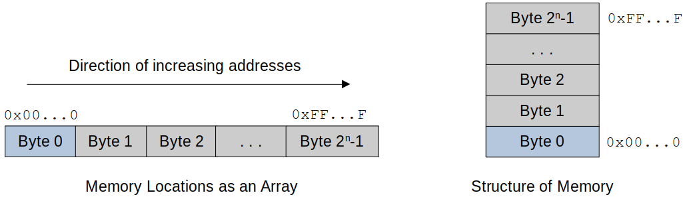
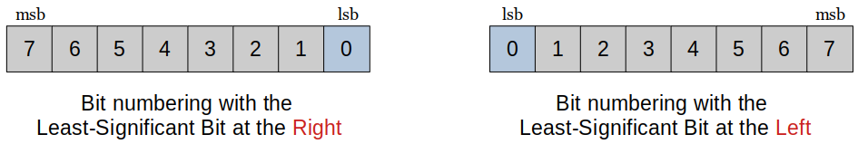
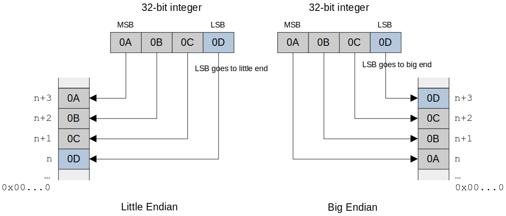

[Home](../../) | [Projects](../../projects) | [Notes](../) > <a href="./">Computer Architecture & Organization</a> > Data Size & Arrangements

# Data Size & Arrangements

## Data Organization and Endianism

* **Numbering the bytes of a memory array**
  - Bytes in memory are numbered from `0`(first word) to `2n - 1`(last word).

* **Bit numbering** can vary between processors.
  - Microprocessors (ARM, Intel) number the bits of a word from the least-significant bit (lsb) which is bit `0`, to the most-significant bit (msb) which is bit `m - 1`, in the same way.
  - Some microprocessors (PowerPC) reverse this scheme.

* **Byte numbering**
  - Little endian - The least significant byte (LSB) is stored at the lowest (little-end) address.
  - Big endian - The least significant byte (LSB) is stored at the highest (big-end) address.

