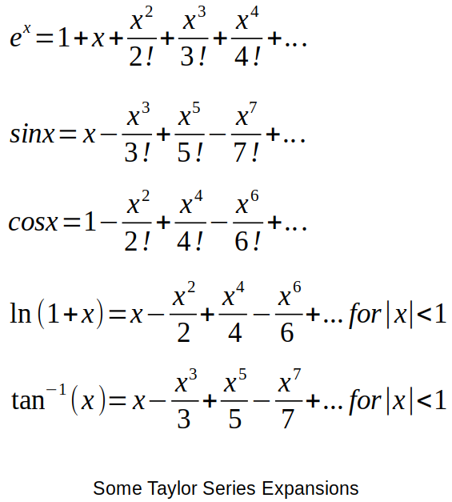

[Home](../../) | [Projects](../../projects) | [Notes](../) > <a href="./">Computer Architecture & Organization</a> > Floating-Point Arithmetic and the Programmer

# Floating-Point Arithmetic and the Programmer


## Limitations of Floating-Point Arithmetic

* Floating-point number in the computer is an **approximation** not the true representation of the number.

* Floating-point number addition is **not associative**. (The order the numbers are added mkae a difference!)   

  ```plain
  (-1.5 x 10^38 + 1.5 x 10^38) + 1.0 = 1
  -1.5 x 10^38 + (1.5 x 10^38 + 1.0) = 0
                  -----------------
                  Floating-point number format cannot express '1.0' portion
                  of the addition result, so it gets truncated!
  ```

* If you are doing floating-point number calculations, check your input numbers and your answers.

    - Especially if you are using a parallel machine that dynamically assigns calculations to processors.

* Similar issues can happen when you try to assign a number with more precision to another with less precision. (This happens regardless of the data type.)


## Error Propagation in Floating-Point Arithmetic

* The calculation used for error propagation with computer calculations are the same formula as for errors in other scientific fields.

  ```plain
  X, Y  : Real values
  X', Y': Computer representations of the real values
  Rx, Ry: Difference between the real value and the represented values
          (errors)
  
  X' = X + Rx
  Y' = Y + Ry
  ```

  Relative errors can be calculated by:

  ```plain
  Rx/X * 100 (%)
  Ry/Y * 100 (%)
  ```

  If we do this calculation `X * Y`, in reality what is calculated is:

  ```plain
  X' * Y' (where X' = X + Rx and Y' = Y + Ry)
  = (X + Rx)(Y + Ry)
  = X*Y + X*RY + Y*Rx + Rx*Ry
  = X*Y + X*RY + Y*Rx           (Rx*Ry is small enough to ignore) 
          -----------
             Error 
  ```

  Relative error can be calculated by:

  ```plain
  (X*RY + Y*Rx) / (X*Y) * 100 (%)
  ```

* The addition error propagations are much smaller than the multiplication error propagations.

* To calculate the error propagation for a polynomial we can take the first derivative of the function and put in the value to be calculated and multiply by the estimated error. 

  Example:

  ```plain
  f(x) = 2x^3 + 4x^2 + 3x + 2  
  ```

  To determine the estimated error for when x = 2:

  ```plain
  f'(x) = 6x^2 + 8x + 3  
  f'(2) = 6*4 + 8*2 + 3  
        = 43*Rx
          -----
          Error
  ```

  > We can do this because `Rx^2` or greater does not contribute much to the overall error calculation. 
  >
  > The math behind it is the **Taylor series expansion**.


## Generating Mathematical Functions

* **Taylor series expansion** is used to calculate functions such as `sqrt(x)` and `sin(x)`.
    - As you expand more and more, you should be getting the more accurate value but remember that there will also be more propagations of errors from the calculation of each term.
    - Also, more calculations means more time!





* Another way to make this calculation faster and less prone to errors, **look-up tables** stored in ROM can be used.

    - Instead of doing a calculation, all there is required is a memory access. Memory access time turned out to be faster than doing all these calculations.

    - **Linear interpolation** can then be used to better approximate values in between the stored values.

      Example:

      ```plain
      cos(30) = 0.866025403784439
      cos(35) = 0.819152044288992
      ```

      If we need to calculate `cos(32)`:

      (Note that `cos()` is not a linear function (not a straight line) but we use a straight line to get an estimation of the actual value.)

      ```plain
      (0.8660 - 0.8192) / 5 = 0.0094 
                              ------
                              Value for every degree over this range 30-35
      
      0.8660 - 0.0094*2 = 0.8472
                          ------
                          Linear interpolated value of cos(32)
      ```

      The actual value is `cos(32) = 0.848048096156426`. It is not bad if all you really need is two significant digits and speed is more important the accuracy.

* **Chebyshev series**

  - Better behave than Taylor series.
  - Errors are distributed more evenly.
  - Fewer terms are required to converge the series.


## What Can You Do to Keep From Using Floating Point?

* **US currency**
  - Change the units from dollars to cents.
    - It will be defined as an integer instead of a floating point.
    - Just remember to change the format before it is displayed so that it meets the convention.
* **Distance**
  - Change the units so that integer calculations can be used.
    - e.g., Tenths of miles - 35.4 miles, store 354.
    - e.g., Thousands of miles - Assuming the least 3 significant digits are not important and would still fit in 32-bit unsigned number. So, 45698734 would become 45698.
    - e.g., Little easier with the metric system since everything is already on power of 10. So, instead of keeping the units in kilometers you can do it in meters.
* If there are still not enough digits, then you can build your own $Quad^2$ or $Quad^4$ integers as a class and create your own overloaded operators for those new classes/data-types.
* If calculation speed and accurate representation are needed, then this type of approach works well. The drawback is keeping track of the units, especially if there are calculations that take place. Make sure you are using compatible units.
    - e.g., You have keeping a distance in tenths of feet but to use $32 feet/second^2$ to calculate the acceleration due to gravity, the calculations will be off by a factor of 10.
