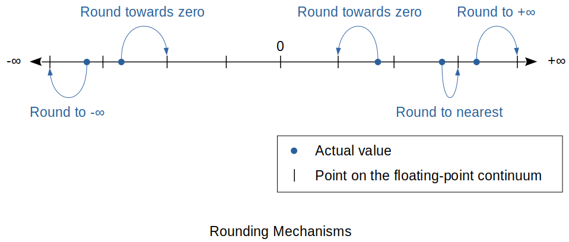

[Home](../../) | [Projects](../../projects) | [Notes](../) > <a href="./">Computer Architecture & Organization</a> > Floating-Point Arithmetic

# Floating-Point Arithmetic


## Floating-Point Arithmetic

### Multiplication

* Consider an example using a 8-bit significand and an unbiased exponent with   

  ```plain
  A = 1.0101001 x 2^4   
  B = 1.1001100 x 2^3     
  ```

  To multiply these number you multiply the significands and the exponents.  

  ```plain
  A x B = (1.0101001 x 2^4) x (1.1001100 x 2^3)    
        = (1.0101001 x 1.1001100) x 2^(4+3)
        = 10.00011010101100 x 2^7
        = 1.000011010101100 x 2^8
  ```

### Addition

* Consider an example using a 8-bit significand and an unbiased exponent with   

  ```plain
  A = 1.0101001 x 2^4   
  B = 1.1001100 x 2^3     
  ```

  If these two floating-point numbrs were to be added by hand, we would
  automatically align the binary points of `A` and `B` as follows.    

  ```plain
     10101.001
  +)  1100.1100
  -------------
    100001.1110
  ```

  However, as these numbers are held in a normalized floating-point format, the
  computer has the following problem of adding

  ```plain
     1.0101001 x 2^4   
  +) 1.1001100 x 2^3     
  ------------------
  ```

  The Computer has to carry out the following steps to equalize exponents.

  ```plain
  Step 1.   Identify the number with the smaller exponent.
  Step 2.   Make the smaller exponent equal to the larger exponent by dividing 
            the significand of the smaller number by the same factor by which 
            its exponent was increased.
  Step 3.   Add (or subtract) the significands.
  Step 4.   If necessary, normalize the result (post normalization).
  ```

  We can now add `A` to the denormalized `B`.

  ```plain
     1.0101001 x 2^4   
  +) 0.1100110 x 2^4     
  ------------------
    10.0001111 x 2^4
  
  Normalized sum: 1.00001111 x 2^5
  ```


## Rounding and Truncation Errors

* Because floating-point arithmetic can lead to an increase in the number of bits in the significand, you need a means of keeping the number of bits in the significand constant.





* **Truncation** 
  - Simplest technique.
  - a.k.a. *Rounding towards zero* since it makes a negative number larger and a positive number smaller.
* **Rounding to nearest**
  - The closest floating-point representation to the actual number is used.
  - Preferred method of all because it is more accurate and gives an unbiased error. (Result can be smaller or larger so they even out.)
* **Rounding to positive/negative infinity**
  - The nearest valid floating-point number in the direction of positive infinity or negative infinity respectively is chosen. 
* When the number to be rounded is midway between two points on the floating-point continuum, IEEE rounding specifies the point whose least-significant digit is zero (i.e., round to even).
